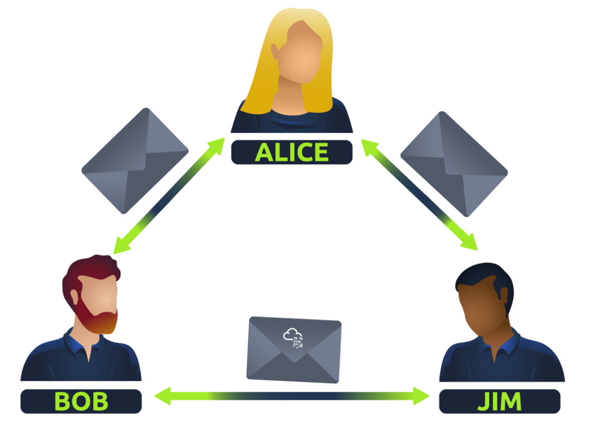
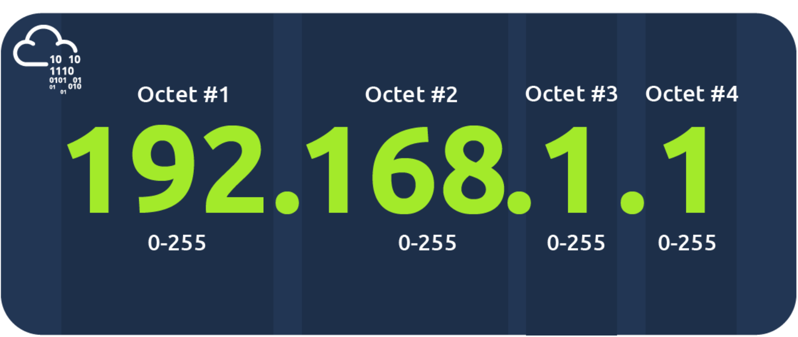
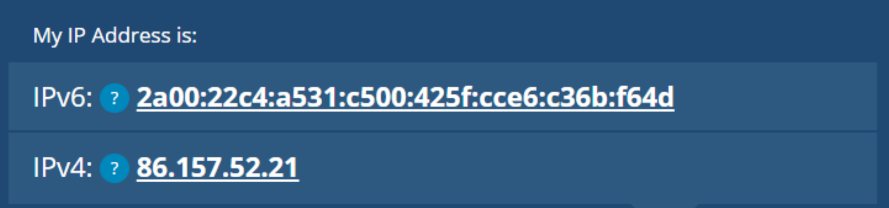
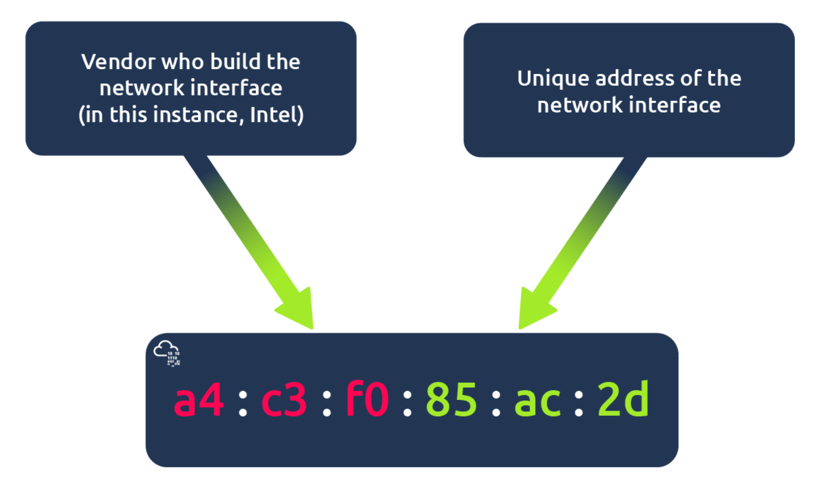
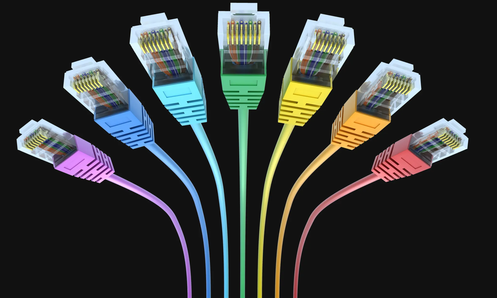

# Network

Learn the core concepts of how computers communicate with each other and types of network weaknesses.

## introduction

> key term for devices that are connected together

> Networks are simply things connected. For example, your friendship circle: you are all connected because of similar interests, hobbies, skills and sorts.

<div align=left></div>

### Identifying Devices on a Network

- An IP Address
- A Media Access Control (MAC) Address -- think of this as being similar to a serial number.

### IP Addresses(Internet Protocol)

 > used as a way of identifying a host on a network for a period of time, where that IP address can then be associated with another device without the IP address changing.

 > An IP address is a set of numbers that are divided into four octets. The value of each octet will summarise to be the IP address of the device on the network. This number is calculated through a technique known as IP addressing & subnetting. What's important to understand here is that IP addresses can change from device to device but cannot be active simultaneously more than once within the same network.

 <div align=left></div>

#### **1. 公共IP（Public IP）**

- **定义**：全球唯一的IP地址，由互联网管理机构（如ICANN）统一分配，可直接访问互联网。
- **特点**：
  - 全球唯一性，不会重复。
  - 可被互联网上的其他设备直接访问（如访问网站、远程连接）。
  - 通常由互联网服务提供商（ISP）分配给用户或企业。
- **用途**：
  - 服务器、网站托管、云服务等需要对外提供服务的场景。
  - 家庭或企业网络的出口（如路由器的WAN口地址）。
- **示例**：`203.0.113.45`（IPv4）、`2001:0db8:85a3::8a2e:0370:7334`（IPv6）。

#### **2. 私有IP（Private IP）**

- **定义**：在本地网络内部使用的IP地址，不可直接访问互联网，需通过NAT（网络地址转换）转换为公共IP。
- **特点**：
  - 非全球唯一，同一地址可在不同局域网中重复使用。
  - 仅在局域网内可见，无法被互联网直接访问。
  - 节省公共IP资源，提高网络安全性。
- **用途**：
  - 家庭、企业内部设备（如电脑、手机、打印机等）。
  - 减少对公共IP的需求，降低网络配置复杂度。
- **IPv4私有地址范围**：
  - `10.0.0.0/8`（10.0.0.0到10.255.255.255）
  - `172.16.0.0/12`（172.16.0.0到172.31.255.255）
  - `192.168.0.0/16`（192.168.0.0到192.168.255.255）
- **IPv6私有地址**：ULA（Unique Local Address），如`fc00::/7`。

#### **3. 核心区别**

| **对比项**       | **公共IP**                | **私有IP**                |
|------------------|---------------------------|---------------------------|
| **唯一性**       | 全球唯一                  | 局域网内唯一              |
| **可访问性**     | 直接访问互联网            | 需通过NAT转换            |
| **分配方式**     | ISP或ICANN分配            | 本地路由器自动分配（如DHCP）|
| **用途**         | 对外服务、互联网连接      | 内部设备通信              |
| **安全性**       | 直接暴露于互联网          | 隐藏在NAT后，相对安全     |

### **4. 如何查看IP地址？**

- **公共IP**：访问网站（如`whatismyip.com`）或路由器管理界面。
- **私有IP**：在设备的网络设置中查看（如Windows的“IP配置”、手机的“Wi-Fi详情”）。

**总结**

公共IP是互联网的“门牌号码”，用于全球通信；私有IP是家庭/企业内部的“房间号”，通过NAT技术共享一个公共IP上网。两者协同工作，既保证了互联网的正常运行，又解决了IP地址短缺和网络安全问题。

#### **5. IPv6**

> IPv6 is a new iteration of the Internet Protocol addressing scheme to help tackle this issue. Although it is seemingly more daunting, it boasts a few benefits:

- Supports up to 2^128 of IP addresses (340 trillion-plus), resolving the issues faced with IPv4
- More efficient due to new methodologies

<div align=left></div>

#### **6. MAC Address**

> Devices on a network will all have a physical network interface, which is a microchip board found on the device's motherboard. This network interface is assigned a unique address at the factory it was built at, called a MAC (Media Access Control ) address. The MAC address is a twelve-character hexadecimal number (a base sixteen numbering system used in computing to represent numbers) split into two's and separated by a colon. These colons are considered separators. For example, a4:c3:f0:85:ac:2d. The first six characters represent the company that made the network interface, and the last six is a unique number.

<div align=left></div>

### Ping(ICMP)

> Ping is one of the most fundamental network tools available to us. Ping uses ICMP (Internet Control Message Protocol) packets to determine the performance of a connection between devices, for example, if the connection exists or is reliable.

ICMP（Internet Control Message Protocol）是互联网控制消息协议，属于TCP/IP协议栈的核心协议之一，主要用于在IP网络中传递控制和错误消息。以下是关于ICMP的关键信息：

#### **主要功能**

1. **错误报告**  
   - 当IP数据包无法到达目标时，发送错误消息（如目标不可达、超时等）。
2. **诊断功能**  
   - **Ping**：通过ICMP回显请求（类型8）和应答（类型0）测试网络连通性。
   - **Traceroute**：利用ICMP超时消息（类型11）跟踪数据包路径。
3. **网络信息查询**  
   - 提供主机或路由器的状态信息（如地址掩码请求、时间戳请求）。

#### **常见ICMP消息类型**

| 类型代码 | 消息类型           | 用途描述                     |
|----------|--------------------|------------------------------|
| 0        | 回显应答（Echo Reply） | 响应Ping请求                 |
| 8        | 回显请求（Echo Request） | 发起Ping测试                 |
| 3        | 目标不可达（Destination Unreachable） | 数据包无法到达目标           |
| 11       | 超时（Time Exceeded） | 数据包生存时间（TTL）耗尽    |

#### **典型应用场景**

1. **网络诊断**  
   - 使用`ping`命令验证主机是否可达。
   - 使用`traceroute`或`tracert`追踪网络路径。
2. **故障排查**  
   - 通过目标不可达消息（类型3）定位路由或防火墙问题。
3. **监控网络状态**  
   - 检测网络延迟、丢包率等指标。

#### **如何测试ICMP？**

1. **Ping命令**  

   ```bash
   ping example.com  # 发送ICMP回显请求
   ```

2. **Traceroute命令**  

   ```bash
   traceroute example.com  # 在Linux/macOS中使用
   tracert example.com    # 在Windows中使用
   ```

#### **注意事项**

- **可靠性**：ICMP不保证消息的可靠传输，可能因网络拥塞或防火墙规则被丢弃。
- **安全性**：某些网络环境会禁用ICMP（如限制Ping），导致诊断工具失效。
- **替代方案**：若ICMP被屏蔽，可尝试使用TCP/UDP端口探测（如`telnet`或`nmap`）。

如果需要更具体的操作示例或问题分析，可以进一步说明场景哦！ (^_^)

## LAN

### introduction

LAN（Local Area Network，局域网）是一种覆盖范围较小的计算机网络，通常局限于家庭、办公室、学校或园区内。以下是关于LAN的关键信息：

**核心特点**

1. **覆盖范围**  
   - 通常在几公里以内（如家庭、一栋楼或一个园区）。
2. **高传输速率**  
   - 支持10Mbps至10Gbps甚至更高的传输速度（如光纤网络）。
3. **低延迟**  
   - 数据传输延迟较低，适合实时应用（如视频会议、在线游戏）。
4. **私有性**  
   - 多为私有网络，通过路由器或防火墙与外部网络（如互联网）隔离。

**优势**

1. **成本效益**
   - 使用共享资源（如打印机、存储设备）降低成本。
2. **易于管理**
   - 集中化管理设备和用户权限。
3. **高安全性**
   - 通过防火墙和访问控制列表（ACL）保护内部网络。

**LAN的组成**

1. **硬件设备**  
   - **交换机/集线器**：连接多台设备，实现数据交换。
   - **路由器**：连接LAN与外部网络（如互联网），分配IP地址。
   - **网线/无线接入点（AP）**：提供有线或无线连接。
   - **终端设备**：计算机、手机、打印机、智能家居设备等。
2. **协议与技术**  
   - **以太网**：主流有线LAN技术（如IEEE 802.3）。
   - **Wi-Fi**：无线LAN技术（如IEEE 802.11a/b/g/n/ac/ax）。
   - **TCP/IP**：基础通信协议，负责IP地址分配和数据传输。

**常见LAN类型**

1. **家庭LAN**  
   - 由无线路由器、电脑、手机、智能家电等组成，通过DHCP自动分配IP地址。
2. **企业LAN**  
   - 采用分层架构（核心层、汇聚层、接入层），支持VLAN划分、QoS（服务质量）管理。
3. **无线LAN（WLAN）**  
   - 通过无线AP覆盖区域，适合移动办公或临时网络搭建。

**典型应用场景**

1. **资源共享**  
   - 文件共享、打印机共享、存储设备共享。
2. **内部通信**  
   - 局域网内的即时通讯、视频会议。
3. **监控与控制**  
   - 智能家居设备控制、企业安防监控系统。
4. **高带宽应用**  
   - 流媒体传输、在线协作、云计算服务。

**LAN配置示例**

1. **家庭LAN设置**  
   - 连接路由器，通过管理界面（如`192.168.1.1`）配置Wi-Fi名称和密码。
   - 启用DHCP功能，自动分配IP地址（如`192.168.1.x`）。
2. **企业LAN配置**  
   - 使用交换机划分VLAN隔离不同部门（如财务、研发）。
   - 部署防火墙或VPN设备保障网络安全。

**常见问题与解决**

1. **IP地址冲突**  
   - 手动分配静态IP或重启DHCP服务器。
2. **无线信号弱**  
   - 调整AP位置、更换高增益天线或添加信号放大器。
3. **网络延迟高**  
   - 检查带宽占用、优化路由策略或升级网络设备。

**限制**

1. 覆盖范围有限
   - 仅适用于小范围区域，扩展到广域网（WAN）需要额外设备。
2. 依赖性高
   - 中心设备（如路由器或交换机）故障可能导致整个网络中断。

**相关工具与命令**

1. **Windows**  
   - `ipconfig`：查看IP地址和网络配置。
   - `ping`：测试设备连通性（如`ping 192.168.1.1`）。
   - `arp -a`：查看局域网内的MAC地址与IP映射。
2. **Linux/macOS**  
   - `ifconfig`或`ip addr`：查看网络接口信息。
   - `traceroute`：追踪数据包路径。
   - `nmap`：扫描局域网内的活动设备（如`nmap -sn 192.168.1.0/24`）。

### LAN Topology

   Ring Topology
   Bus Topology
   Star Topology

#### Switch and Router

**Switch**

> Switches are dedicated devices within a network that are designed to aggregate multiple other devices such as computers, printers, or any other networking-capable device using ethernet. These various devices plug into a switch's port. Switches are usually found in larger networks such as businesses, schools, or similar-sized networks, where there are many devices to connect to the network. Switches can connect a large number of devices by having ports of 4, 8, 16, 24, 32, and 64 for devices to plug into.

> Switches are much more efficient than their lesser counterpart (hubs/repeaters). Switches keep track of what device is connected to which port. This way, when they receive a packet, instead of repeating that packet to every port like a hub would do, it just sends it to the intended target, thus reducing network traffic.

**Router**

> It's a router's job to connect networks and pass data between them. It does this by using routing (hence the name router!).

> Routing is the label given to the process of data travelling across networks. Routing involves creating a path between networks so that this data can be successfully delivered.


**Switch 和 Router 区别**

路由器和交换机是网络中常见的设备，但功能和用途有明显区别，以下是它们的主要区别：

##### **1. 功能不同**

- **路由器**  
  - 连接不同网络（如将家庭局域网连接到互联网）。  
  - 分配IP地址（通过DHCP），实现多设备共享上网。  
  - 支持NAT（网络地址转换），隐藏内部网络结构。  
  - 具备防火墙、VPN、QoS（流量控制）等高级功能。

- **交换机**  
  - 连接同一局域网内的多台设备（如电脑、打印机）。  
  - 快速转发数据帧，实现设备间直接通信。  
  - 扩展网络端口数量，提升局域网内数据传输效率。

##### **2. 工作层次不同**

- **路由器**：工作在网络层（OSI第三层），基于IP地址转发数据。  
- **交换机**：工作在数据链路层（OSI第二层），基于MAC地址转发数据。

##### **3. 应用场景**

- **路由器**  
  - 家庭/企业网络接入互联网。  
  - 跨网络通信（如不同楼层或分支之间）。  
  - 需要网络安全或高级管理功能时。

- **交换机**  
  - 扩展局域网内设备连接（如办公室、网吧）。  
  - 需要高速内网传输（如视频监控、文件共享）。  
  - 无需连接外网的场景。

##### **4. 连接方式**

- **路由器**：通常连接广域网（如光纤、ADSL）和局域网。  
- **交换机**：直接连接同一局域网内的设备，或级联到路由器扩展端口。

##### **5. 安全性**

- **路由器**：可设置防火墙、访问控制列表（ACL），保护内网安全。  
- **交换机**：默认无安全功能，需配合路由器或单独配置。

##### **总结选择建议**

- **家庭用户**：通常只需路由器（带交换功能）即可满足上网和设备连接需求。  
- **企业/大型网络**：路由器负责连接外网和核心管理，交换机负责扩展内网端口和高速传输。  
- **特殊需求**：如高速内网传输、视频监控等，可额外添加交换机。

[OSI model](#osi) <a id="back2router"></a>

### Subnetting 

> As we've previously discussed throughout the module so far, Networks can be found in all shapes and sizes - ranging from small to large. Subnetting is the term given to splitting up a network into smaller, miniature networks within itself. Think of it as slicing up a cake for your friends. There's only a certain amount of cake to go around, but everybody wants a piece. Subnetting is you deciding who gets what slice & reserving such a slice of this metaphorical cake.

> Subnetting is achieved by splitting up the number of hosts that can fit within the network, represented by a number called a subnet mask.
As we can recall, an IP address is made up of four sections called octets. The same goes for a subnet mask which is also represented as a number of four bytes (32 bits), ranging from 0 to 255 (0-255).


Subnets use IP addresses in three different ways
- Identify the network addressIdentify the network address
- Identify the host address
- Identify the default gateway
Let's split these three up to understa

| **Type**        | **Purpose**                                                  | **Explanation**                                              | **Example**   |
| --------------- | ------------------------------------------------------------ | ------------------------------------------------------------ | ------------- |
| Network Address | This address identifies the start of the actual network and is used to identify a network's existence. | For example, a device with the IP address of 192.168.1.100 will be on the network identified by 192.168.1.0 | 192.168.1.0   |
| Host Address    | An IP address here is used to identify a device on the subnet | For example, a device will have the network address of 192.168.1.1 | 192.168.1.100 |
| Default Gateway | The default gateway address is a special address assigned to a device on the network that is capable of sending information to another network | Any data that needs to go to a device that isn't on the same network (i.e. isn't on 192.168.1.0) will be sent to this device. These devices can use any host address but usually use either the first or last host address in a network (.1 or .254) | 192.168.1.254 |


### ARP

**Address Resolution Protocol (ARP)** is responsible for finding the MAC (hardware) address related to a specific IP address. It works by broadcasting an ARP query, "Who has this IP address? Tell me." And the response is of the form, "The IP address is at this MAC address."

Recalling from our previous tasks that devices can have two identifiers: A MAC address and an IP address, the **Address Resolution Protocol** or ARP for short, is the technology that is responsible for allowing devices to identify themselves on a network.

Simply, ARP allows a device to associate its MAC address with an IP address on the network. Each device on a network will keep a log of the MAC addresses associated with other devices.

Each device within a network has a ledger to store information on, which is called a cache. In the context of ARP, this cache stores the identifiers of other devices on the network.

In order to map these two identifiers together (IP address and MAC address), ARP sends two types of messages:

- ARP Request
- ARP Reply

When an ARP request is sent, a message is broadcasted on the network to other devices asking, "What is the mac address that owns this IP address?" When the other devices receive that message, they will only respond if they own that IP address and will send an ARP reply with its MAC address. The requesting device can now remember this mapping and store it in its ARP cache for future use.

This process is illustrated in the diagram below:


### DHCP

> IP addresses can be assigned either manually, by entering them physically into a device, or automatically and most commonly by using a DHCP (Dynamic Host Configuration Protocol) server. When a device connects to a network, if it has not already been manually assigned an IP address, it sends out a request (DHCP Discover) to see if any DHCP servers are on the network. The DHCP server then replies back with an IP address the device could use (DHCP Offer). The device then sends a reply confirming it wants the offered IP Address (DHCP Request), and then lastly, the DHCP server sends a reply acknowledging this has been completed, and the device can start using the IP Address (DHCP ACK).


## OSI 

[router](#back2router)


> The OSI model (or **Open Systems Interconnection Model**) is an essential model used in networking.  This critical model provides a framework dictating how all networked devices will send, receive and interpret data.

> One of the main benefits of the OSI model is that devices can have different functions and designs on a network while communicating with other devices. Data sent across a network that follows the uniformity of the OSI model can be understood by other devices.

> At every individual layer that data travels through, specific processes take place, and pieces of information are added to this data, which is what we'll come to discuss in the upcoming tasks within this room. However, for now, we only need to understand that this process is called encapsulation and what the OSI model looks like in the diagram below:


OSI（Open System Interconnect 开放式系统互联）模型是一个分层的网络架构模型，用于描述计算机网络通信的各个阶段。它分为七个层级，每一层都有特定的功能，从而使网络设备和系统之间能够标准化通信。这七层从上到下是：

1. **物理层**（Physical Layer）：涉及网络硬件设备之间的物理连接，如电缆、信号和接口等。
2. **数据链路层**（Data Link Layer）：处理物理地址（如MAC地址）并确保数据帧在物理介质上传输的正确性。
3. **网络层**（Network Layer）：负责数据的路由和逻辑地址（如IP地址）的管理。
4. **传输层**（Transport Layer）：确保数据的可靠传输，控制流量和纠错，常用协议有TCP和UDP。
5. **会话层**（Session Layer）：管理和维护通信会话，包括建立、维护和终止连接。
6. **表示层**（Presentation Layer）：负责数据的翻译、加密和压缩等操作。
7. **应用层**（Application Layer）：提供直接为用户应用程序服务的接口，例如网页浏览器、电子邮件等。

这个模型的意义在于提供了一个通用框架，使各种设备和网络可以互相兼容。

### 1.physical

> The physical layer, also referred to as layer 1, deals with the physical connection between devices; this includes the medium, such as a wire, and the definition of the binary digits 0 and 1. Data transmission can be via an electrical, optical, or wireless signal. Consequently, we need data cables or antennas, depending on our physical medium.

> In addition to Ethernet cable, shown in the illustration below, and optical fibre cable, examples of the physical layer medium include the WiFi radio bands, the 2.4 GHz band, the 5 GHz band, and the 6 GHz band.

<div align=left></div>


### 2.Data link

The physical layer defines a medium to transmit our signal. The data link layer, i.e., layer 2, represents the protocol that enables data transfer between nodes on the same network segment. Let’s put it in simpler terms. The data link layer describes an agreement between the different systems on the same network segment on how to communicate. A network segment refers to a group of networked devices using a shared medium or channel for information transfer. For example, consider a company office with ten computers connected to a network switch; that’s a network segment.

Examples of layer 2 include Ethernet, i.e., 802.3, and WiFi, i.e., 802.11. Ethernet and WiFi addresses are six bytes. Their address is called a MAC address, where MAC stands for Media Access Control. They are usually expressed in hexadecimal format with a colon separating each two bytes. The three leftmost bytes identify the vendor.


We expect to see two MAC addresses in each frame in real network communication over Ethernet or WiFi. The packet in the screenshot below shows:

- The destination data-link address (MAC address) highlighted in yellow
- The source data link address (MAC address) is highlighted in blue
- The remaining bits show the data being sent


> The data link layer focuses on the physical addressing of the transmission. It receives a packet from the network layer (including the IP address for the remote computer) and adds in the physical MAC (Media Access Control) address of the receiving endpoint. Inside every network-enabled computer is a Network Interface Card (NIC) which comes with a unique MAC address to identify it.

> MAC addresses are set by the manufacturer and literally burnt into the card; they can’t be changed – although they can be spoofed. When information is sent across a network, it’s actually the physical address that is used to identify where exactly to send the information.

> Additionally, it’s also the job of the data link layer to present the data in a format suitable for transmission.

### 3.network

The data link layer focuses on sending data between two nodes on the same network segment. The network layer, i.e., layer 3, is concerned with sending data between different networks. In more technical terms, the network layer handles logical addressing and routing, i.e., finding a path to transfer the network packets between the diverse networks.

Examples of the network layer include Internet Protocol (IP), Internet Control Message Protocol (ICMP), and Virtual Private Network (VPN) protocols such as IPSec and SSL/TLS VPN.

> The third layer of the OSI model (network layer) is where the magic of routing & re-assembly of data takes place (from these small chunks to the larger chunk). Firstly, routing simply determines the most optimal path in which these chunks of data should be sent.

> Whilst some protocols at this layer determine exactly what is the "optimal" path that data should take to reach a device, we should only know about their existence at this stage of the networking module. Briefly, these protocols include OSPF (Open Shortest Path First) and RIP (Routing Information Protocol). The factors that decide what route is taken is decided by the following:
 > - What path is the shortest? I.e. has the least amount of devices that the packet needs to travel across.

> - What path is the most reliable? I.e. have packets been lost on that path before?

> - Which path has the faster physical connection? I.e. is one path using a copper connection (slower) or a fibre (considerably faster)?

> At this layer, everything is dealt with via IP addresses such as 192.168.1.100. Devices such as routers capable of delivering packets using IP addresses are known as Layer 3 devices — because they are capable of working at the third layer of the OSI model.


### 4.Transport

Layer 4, the transport layer, enables end-to-end communication between running applications on different hosts. Your web browser is connected to the web server over the transport layer, which can support various functions like flow control, segmentation, and error correction.

> Layer 4 of the OSI model plays a vital part in transmitting data across a network and can be a little bit difficult to grasp. When data is sent between devices, it follows one of two different protocols that are decided based upon several factors:
> - TCP
> 
> Transmission Control Protocol (TCP) is a connection-oriented protocol requiring a TCP three-way-handshake to establish a connection. TCP provides reliable data transfer, flow control and congestion control. Higher-level protocols such as HTTP, POP3, IMAP and SMTP use TCP
> - UDP 
>
> User Datagram Protocol (UDP) is a connectionless protocol; UDP does not require a connection to be established. UDP is suitable for protocols that rely on fast queries, such as DNS, and for protocols that prioritise real-time communications, such as audio/video conferencing and broadcast.


> Let's begin with TCP. The Transmission Control Protocol (TCP). Potentially hinted by the name, this protocol is designed with reliability and guarantee in mind. This protocol reserves a constant connection between the two devices for the amount of time it takes for the data to be sent and received.

> Not only this, but TCP incorporates error checking into its design. Error checking is how TCP can guarantee that data sent from the small chunks in the session layer (layer 5) has then been received and reassembled in the same order.

> Let's summarise the advantages and disadvantages of TCP in the table below:

|                    **Advantages of TCP**                     |                   **Disadvantages of TCP**                   |
| :----------------------------------------------------------: | :----------------------------------------------------------: |
|               Guarantees the accuracy of data.               | Requires a reliable connection between the two devices. If one small chunk of data is not received, then the entire chunk of data cannot be used. |
| Capable of synchronising two devices to prevent each other from being flooded with data. | A slow connection can bottleneck another device as the connection will be reserved on the receiving computer the whole time. |
|        Performs a lot more processes for reliability.        | TCP is significantly slower than UDP because more work has to be done by the devices using this protocol. |

> TCP is used for situations such as file sharing, internet browsing or sending an email. This usage is because these services require the data to be accurate and complete (no good having half a file!).

> In the diagram below, we can see how a picture of a cat is broken down into small pieces of data (known as packets) from the "webserver", where the "computer" re-constructs the picture of the cat into the correct order.


> Now let's move onto the User Datagram Protocol (or UDP for short). This protocol is not nearly as advanced as its brother - the TCP protocol. It doesn't boast the many features offered by TCP, such as error checking and reliability. In fact, any data that gets sent via UDP is sent to the computer whether it gets there or not. There is no synchronisation between the two devices or guarantee; just hope for the best, and fingers crossed.

> Whilst this sounds disadvantageous, it does have its merits, which we'll layout in the table below:

|                    **Advantages of UDP**                     |                   **Disadvantages of UDP**                   |
| :----------------------------------------------------------: | :----------------------------------------------------------: |
|                 UDP is much faster than TCP.                 |          UDP doesn't care if the data is received.           |
| UDP leaves the application layer (user software) to decide if there is any control over how quickly packets are sent. |  It is quite flexible to software developers in this sense.  |
| UDP does not reserve a continuous connection on a device as TCP does. | This means that unstable connections result in a terrible experience for the user. |

Using the same example as before, we can now see that only Packets #1 and #3 have been received by the "Computer", meaning that half of the image is missing.


> UDP is useful in situations where there are small pieces of data being sent. For example, protocols used for discovering devices (ARP and DHCP that we discussed in Intro to LAN) or larger files such as video streaming (where it is okay if some part of the video is pixelated. Pixels are just lost pieces of data!)

### 5.Session

The session layer is responsible for establishing, maintaining, and synchronising communication between applications running on different hosts. Establishing a session means initiating communication between applications and negotiating the necessary parameters for the session. Data synchronisation ensures that data is transmitted in the correct order and provides mechanisms for recovery in case of transmission failures.

Examples of the session layer are Network File System (NFS) and Remote Procedure Call (RPC).

> Once data has been correctly translated or formatted from the presentation layer (layer 6), the session layer (layer 5) will begin to create and maintain the connection to other computer for which the data is destined. When a connection is established, a session is created. Whilst this connection is active, so is the session.

> The session layer is also responsible for closing the connection if it hasn't been used in a while or if it is lost. Additionally, a session can contain "checkpoints," where if the data is lost, only the newest pieces of data are required to be sent, saving bandwidth. 

> What is worthy of noting is that sessions are unique — meaning that data cannot travel over different sessions, but in fact, only across each session instead.

### 6.Presentation

The presentation layer ensures the data is delivered in a form the application layer can understand. Layer 6 handles data encoding, compression, and encryption. An example of encoding is character encoding, such as ASCII or Unicode.

Various standards are used at the presentation layer. Consider the scenario where we want to send an image via email. First, we use JPEG, GIF, and PNG to save our images; furthermore, although hidden from the user by the email client, we use MIME (Multipurpose Internet Mail Extensions) to attach the file to our email. MIME encodes a binary file using 7-bit ASCII characters.

> Layer 6 of the OSI model is the layer in which standardisation starts to take place. Because software developers can develop any software such as an email client differently, the data still needs to be handled in the same way — no matter how the software works.

> This layer acts as a translator for data to and from the application layer (layer 7). The receiving computer will also understand data sent to a computer in one format destined for in another format. For example, when you send an email, the other user may have another email client to you, but the contents of the email will still need to display the same.

> Security features such as data encryption (like HTTPS when visiting a secure site) occur at this layer.

### 7.Application

The application layer provides network services directly to end-user applications. Your web browser would use the HTTP protocol to request a file, submit a form, or upload a file.

The application layer is the top layer, and you might have encountered many of its protocols as you use different applications. Examples of Layer 7 protocols are HTTP, FTP, DNS, POP3, SMTP, and IMAP. Don’t worry if you are not familiar with all of them.

> The application layer of the OSI model is the layer that you will be most familiar with. This familiarity is because the application layer is the layer in which protocols and rules are in place to determine how the user should interact with data sent or received.

> Everyday applications such as email clients, browsers, or file server browsing software such as FileZilla provide a friendly, Graphical User Interface (GUI) for users to interact with data sent or received. Other protocols include DNS (Domain Name System), which is how website addresses are translated into IP addresses.


## Packets & Frames

### introduction

> Packets and frames are small pieces of data that, when forming together, make a larger piece of information or message. However, they are two different things in the OSI model. A frame is at layer 2 - the data link layer, meaning there is no such information as IP addresses. Think of this as putting an envelope within an envelope and sending it away. The first envelope will be the packet that you mail, but once it is opened, the envelope within still exists and contains data (this is a frame).

> This process is called encapsulation which we discussed in the [OSI model](#osi) . At this stage, it's safe to assume that when we are talking about anything IP addresses, we are talking about packets. When the encapsulating information is stripped away, we're talking about the frame itself.

> Packets are an efficient way of communicating data across networked devices such as those explained in Task 1. Because this data is exchanged in small pieces, there is less chance of bottlenecking occurring across a network than large messages being sent at once.

> For example, when loading an image from a website, this image is not sent to your computer as a whole, but rather small pieces where it is reconstructed on your computer. Take the image below as an illustration of this process. The cat's picture is divided into three packets, where it is reconstructed when it reaches the computer to form the final image.


> Packets have different structures that are dependant upon the type of packet that is being sent. As we'll come on to discuss, networking is full of standards and protocols that act as a set of rules for how the packet is handled on a device. With billions of devices connected on the internet, things can quickly break down if there is no standardisation.

> Let's continue with our example of the Internet Protocol. A packet using this protocol will have a set of headers that contain additional pieces of information to the data that is being sent across a network.

> Some notable headers include:


|     **Header**      |                       **Description**                        |
| :-----------------: | :----------------------------------------------------------: |
|    Time to Live     | This field sets an expiry timer for the packet to not clog up your network if it never manages to reach a host or escape! |
|      Checksum       | This field provides integrity checking for protocols such as TCP/IP. If any data is changed, this value will be different from what was expected and therefore corrupt. |
|   Source Address    | The IP address of the device that the packet is being sent **from** so that data knows where to **return to**. |
| Destination Address | The device's IP address the packet is being sent to so that data knows where to travel next. |

### TCP

 <span style="font-size: 23px;">**TCP/IP(The Three-Way Handshake)**</span>

> TCP (or Transmission Control Protocol for short) is another one of these rules used in networking.

- 传输控制协议 （TCP） 是一种面向连接的协议，需要 TCP 三次握手来建立连接。TCP 提供可靠的数据传输、流量控制和拥塞控制。HTTP、POP3、IMAP 和 SMTP 等更高级别的协议使用 TCP

> This protocol is very similar to the OSI model. The TCP/IP protocol consists of four layers and is arguably just a summarised version of the OSI model. These layers are:
> - Application
> - Transport
> - Internet
> - Network Interface

> very similar to how the OSI model works, information is added to each layer of the TCP model as the piece of data (or packet) traverses it. As you may recall, this process is known as encapsulation - where the reverse of this process is decapsulation. 

> One defining feature of TCP is that it is **connection-based**, which means that TCP must establish a connection between both a client and a device acting as a server **before** data is sent.

> Because of this, TCP guarantees that any data sent will be received on the other end. This process is named the Three-way handshake, which is something we'll come on to discuss shortly. A table comparing the advantages and disadvantages of TCP is located below:

|                    **Advantages of TCP**                     |                   **Disadvantages of TCP**                   |
| :----------------------------------------------------------: | :----------------------------------------------------------: |
|               Guarantees the accuracy of data.               | Requires a reliable connection between the two devices. If one small chunk of data is not received, then the entire chunk of data cannot be used. |
| Capable of synchronising two devices to prevent each other from being flooded with data. | A slow connection can bottleneck another device as the connection will be reserved on the receiving computer the whole time. |
|        Performs a lot more processes for reliability.        | TCP is significantly slower than UDP because more work has to be done by the devices using this protocol. |

TCP packets contain various sections of information known as headers that are added from encapsulation. Let's explain some of the crucial headers in the table below:

| Header             | Description                                                                                                                                                                                  |
| :----------------: | :------------------------------------------------------------------------------------------------------------------------------------------------------------------------------------------: |
| Source Port        | This value is the port opened by the sender to send the TCP packet from. This value is chosen randomly (out of the ports from 0-65535 that aren't already in use at the time).              |
| Destination Port   | This value is the port number that an application or service is running on the remote host (the one receiving data); for example, a webserver running on port 80. Unlike the source port, this value is not chosen at random. |
| Source IP          | This is the IP address of the device that is sending the packet.                                                                                                                              |
| Destination IP     | This is the IP address of the device that the packet is destined for.                                                                                                                        |
| Sequence Number    | When a connection occurs, the first piece of data transmitted is given a random number. We'll explain this more in-depth further on.                                                        |
| Acknowledgement Number | After a piece of data has been given a sequence number, the number for the next piece of data will have the sequence number + 1. We'll also explain this more in-depth further on.         |
| Checksum           | This value is what gives TCP integrity. A mathematical calculation is made where the output is remembered. When the receiving device performs the mathematical calculation, the data must be corrupt if the output is different from what was sent. |
| Data               | This header is where the data, i.e. bytes of a file that is being transmitted, is stored.                                                                                                     |
| Flag               | This header determines how the packet should be handled by either device during the handshake process. Specific flags will determine specific behaviours, which is what we'll come on to explain below. |

Next, we'll come on to discuss the *Three-way handshake -* the term given for the process used to establish a connection between two devices. The Three-way handshake communicates using a few special messages - the table below highlights the main ones: 

| Step | Message | Description |
| :---: | :---: | --- |
| 1 | SYN | A SYN message is the initial packet sent by a client during the handshake. This packet is used to initiate a connection and synchronise the two devices together (we'll explain this further later on). |
| 2 | SYN/ACK | This packet is sent by the receiving device (server) to acknowledge the synchronisation attempt from the client. |
| 3 | ACK | The acknowledgement packet can be used by either the client or server to acknowledge that a series of messages/packets have been successfully received. |
| 4 | DATA | Once a connection has been established, data (such as bytes of a file) is sent via the "DATA" message. |
| 5 | FIN | This packet is used to *cleanly (properly)* close the connection after it has been complete. |
| # | RST | This packet abruptly ends all communication. This is the last resort and indicates there was some problem during the process. For example, if the service or application is not working correctly, or the system has faults such as low resources. | 

The diagram below shows a normal Three-way handshake process between Alice and Bob. In real life, this would be between two devices.


Any sent data is given a random number sequence and is reconstructed using this number sequence and incrementing by 1. Both computers must agree on the same number sequence for data to be sent in the correct order. This order is agreed upon during three steps:

1. SYN - Client: Here's my Initial Sequence Number(ISN) to SYNchronise with (0)
2. SYN/ACK - Server: Here's my Initial Sequence Number (ISN) to SYNchronise with (5,000), and I ACKnowledge your initial number sequence (0)
3. ACK - Client: I ACKnowledge your Initial Sequence Number (ISN) of (5,000), here is some data that is my ISN+1 (0 + 1)

| Device           | Initial Number Sequence (ISN) | Final Number Sequence |
| :--------------: | :---------------------------: | :-------------------: |
| Client (Sender)  |               0               |       0 + 1 = 1       |
| Client (Sender)  |               1               |       1 + 1 = 2       |
| Client (Sender)  |               2               |       2 + 1 = 3       | 

**TCP Closing a Connection:**

Let's quickly explain the process behind TCP closing a connection. First, TCP will close a connection once a device has determined that the other device has successfully received all of the data.

Because TCP reserves system resources on a device, it is best practice to close TCP connections as soon as possible.

To initiate the closure of a TCP connection, the device will send a "FIN" packet to the other device. Of course, with TCP, the other device will also have to acknowledge this packet.

Let's show this process using Alice and Bob as we have previously.


In the illustration, we can see that Alice has sent Bob a **"FIN"** packet. Because Bob received this, he will let Alice know that he received it and that he also wants to close the connection (using FIN). Alice has heard Bob loud and clear and will let Bob know that she acknowledges this.

### UDP

The **User Datagram Protocol** (UDP) is another protocol that is used to communicate data between devices.

用户数据报协议 （UDP） 是一种无连接协议;UDP 不需要建立连接。UDP 适用于依赖快速查询的协议 （如 DNS） 和优先考虑实时通信的协议 （如音频/视频会议和广播）。

> Unlike its brother TCP, UDP is a **stateless** protocol that doesn't require a constant connection between the two devices for data to be sent. For example, the Three-way handshake does not occur, nor is there any synchronisation between the two devices.

> Recall some of the comparisons made about these two protocols in "OSI Model". Namely, UDP is used in situations where applications can tolerate data being lost (such as video streaming or voice chat) or in scenarios where an unstable connection is not the end-all. A table comparing the advantages and disadvantages of UDP is located below:

| **Advantages of UDP** | **Disadvantages of UDP** |
| :---: | :---: |
| UDP is much faster than TCP. | UDP doesn't care if the data is received or not. |
| UDP leaves the application (user software) to decide if there is any control over how quickly packets are sent. | It is quite flexible to software developers in this sense. |
| UDP does not reserve a continuous connection on a device as TCP does. | This means that unstable connections result in a terrible experience for the user. | 

> As mentioned, no process takes place in setting up a connection between two devices. Meaning that there is no regard for whether or not data is received, and there are no safeguards such as those offered by TCP, such as data integrity.

> UDP packets are much simpler than TCP packets and have fewer headers. However, both protocols share some standard headers, which are what is annotated in the table below:

| Header | Description |
| :---: | :---: |
| Time to Live (TTL) | This field sets an expiry timer for the packet, so it doesn't clog up your network if it never manages to reach a host or escape! |
| Source Address | The IP address of the device that the packet is being sent from, so that data knows where to return to. |
| Destination Address | The device's IP address the packet is being sent to so that data knows where to travel next. |
| Source Port | This value is the port that is opened by the sender to send the UDP packet from. This value is randomly chosen (out of the ports from 0-65535 that aren't already in use at the time). |
| Destination Port | This value is the port number that an application or service is running on the remote host (the one receiving the data); for example, a webserver running on port 80. Unlike the source port, this value is not chosen at random. |
| Data | This header is where data, i.e. bytes of a file that is being transmitted, is stored. | 

> Next, we'll come on to discuss how the process of a connection via UDP differs from that of something such as TCP.  We should recall that UDP is **stateless**. No acknowledgement is sent during a connection.

> The diagram below shows a normal UDP connection between Alice and Bob. In real life, this would be between two devices.


### Ports 101

> Perhaps aptly titled by their name, ports are an essential point in which data can be exchanged. Think of a harbour and port. Ships wishing to dock at the harbour will have to go to a port compatible with the dimensions and the facilities located on the ship. When the ship lines up, it will connect to a port at the harbour. Take, for instance, that a cruise liner cannot dock at a port made for a fishing vessel and vice versa.

> These ports enforce what can park and where — if it isn't compatible, it cannot park here. Networking devices also use ports to enforce strict rules when communicating with one another. When a connection has been established (recalling from the OSI model's room), any data sent or received by a device will be sent through these ports. In computing, ports are a numerical value between 0 and 65535 (65,535).

> Because ports can range from anywhere between 0-65535, there quickly runs the risk of losing track of what application is using what port. A busy harbour is chaos! Thankfully, we associate applications, software and behaviours with a standard set of rules. For example, by enforcing that any web browser data is sent over port 80, software developers can design a web browser such as Google Chrome or Firefox to interpret the data the same way as one another.

> This means that all web browsers now share one common rule: data is sent over port 80. How the browsers look, feel and easy to use is up to the designer or the user's decision.

> While the standard rule for web data is port 80, a few other protocols have been allocated a standard rule. Any port that is within 0 and 1024 (1,024) is known as a common port. Let's explore some of these other protocols below:

| Protocol | Port Number | Description |
| :---: | :---: | :---: |
| File Transfer Protocol (FTP) | 21 | This protocol is used by a file - sharing application built on a client - server model, meaning you can download files from a central location. |
| Secure Shell (SSH) | 22 | This protocol is used to securely login to systems via a text - based interface for management. |
| HyperText Transfer Protocol (HTTP) | 80 | This protocol powers the World Wide Web (WWW)! Your browser uses this to download text, images and videos of web pages. |
| HyperText Transfer Protocol Secure (HTTPS) | 443 | This protocol does the exact same as above; however, securely using encryption. |
| Server Message Block (SMB) | 445 | This protocol is similar to the File Transfer Protocol (FTP); however, as well as files, SMB allows you to share devices like printers. |
| Remote Desktop Protocol (RDP) | 3389 | This protocol is a secure means of logging in to a system using a visual desktop interface (as opposed to the text - based limitations of the SSH protocol). | 

> We have only briefly covered the more common protocols in cybersecurity. You can find a table of the 1024 common ports listed for more information.

> What is worth noting here is that these protocols only follow the standards. I.e. you can administer applications that interact with these protocols on a different port other than what is the standard (running a web server on 8080 instead of the 80 standard port). Note, however, applications will presume that the standard is being followed, so you will have to provide a **colon （:）** along with the port number.


## Extending Your Network

### Introduction to Port Forwarding

Port forwarding is an essential component in connecting applications and services to the Internet. Without port forwarding, applications and services such as web servers are only available to devices within the same direct network.

Take the network below as an example. Within this network, the server with an IP address of "192.168.1.10" runs a webserver on port 80. Only the two other computers on this network will be able to access it (this is known as an intranet).


If the administrator wanted the website to be accessible to the public (using the Internet), they would have to implement port forwarding, like in the diagram below:


With this design, Network #2 will now be able to access the webserver running on Network #1 using the public IP address of Network #1 (82.62.51.70).

It is easy to confuse port forwarding with the behaviours of a firewall (a technology we'll come on to discuss in a later task). However, at this stage, just understand that port forwarding opens specific ports (recall how packets work). In comparison, firewalls determine if traffic can travel across these ports (even if these ports are open by port forwarding).

Port forwarding is configured at the router of a network.

### Firewalls 101

> A firewall is a device within a network responsible for determining what traffic is allowed to enter and exit. Think of a firewall as border security for a network. An administrator can configure a firewall to **permit** or **deny** traffic from entering or exiting a network based on numerous factors such as:

> Where the traffic is coming from? (has the firewall been told to accept/deny traffic from a specific network?)
Where is the traffic going to? (has the firewall been told to accept/deny traffic destined for a specific network?)
What port is the traffic for? (has the firewall been told to accept/deny traffic destined for port 80 only?)
What protocol is the traffic using? (has the firewall been told to accept/deny traffic that is UDP, TCP or both?)
Firewalls perform packet inspection to determine the answers to these questions.

> Firewalls come in all shapes and sizes. From dedicated pieces of hardware (often found in large networks like businesses) that can handle a magnitude of data to residential routers (like at your home!) or software such as Snort, firewalls can be categorised into 2 to 5 categories.

> We'll cover the two primary categories of firewalls in the table below:

| Firewall Category | Description |
| :-------------: | :-------------: |
| Stateful | This type of firewall uses the entire information from a connection; rather than inspecting an individual packet, this firewall determines the behaviour of a device **based upon the entire connection**.<br><br>This firewall type consumes many resources in comparison to stateless firewalls as the decision making is dynamic. For example, a firewall could allow the first parts of a TCP handshake that would later fail.<br><br>If a connection from a host is bad, it will block the entire device. |
| Stateless | This firewall type uses a static set of rules to determine whether or not **individual packets** are acceptable or not. For example, a device sending a bad packet will not necessarily mean that the entire device is then blocked.<br><br>Whilst these firewalls use much fewer resources than alternatives, they are much dumber. For example, these firewalls are only effective as the rules that are defined within them. If a rule is not exactly matched, it is effectively useless.<br><br>However, these firewalls are great when receiving large amounts of traffic from a set of hosts (such as a Distributed Denial - of - Service attack) | 

### VPN Basics

虚拟专用网络（VPN）是在两个网络之间创建安全 "隧道 "的一种方式。 例如，你可以在 TryHackMe 上使用 VPN 访问机器运行所在的专用网络。 VPN 也常用于员工不在现场（如在家工作或因公务出差）时登录工作场所。 VPN 还可用于网络（如咖啡店）不提供加密的地方，是防止他人读取你的网络流量的好方法。

> A **Virtual Private Network** (or VPN for short) is a technology that allows devices on separate networks to communicate securely by creating a dedicated path between each other over the Internet (known as a tunnel). Devices connected within this tunnel form their own private network.

> For example, only devices within the same network (such as within a business) can directly communicate. However, a VPN allows two offices to be connected. Let's take the diagram below, where there are three networks:


1. Network #1 (Office #1)
2. Network #2 (Office #2)
3. Network #3 (Two devices connected via a VPN)

The devices connected on Network #3 are still a part of Network #1 and Network #2 but also form together to create a private network (Network #3) that only devices that are connected via this VPN can communicate over.

Let's cover some of the other benefits offered by a VPN in the table below:

| Benefit | Description |
| :---: | :---: |
| Allows networks in different geographical locations to be connected. | For example, a business with multiple offices will find VPNs beneficial, as it means that resources like servers/infrastructure can be accessed from another office. |
| Offers privacy. | VPN technology uses encryption to protect data. This means that it can only be understood between the devices it was being sent from and is destined for, meaning the data isn't vulnerable to sniffing.<br><br>This encryption is useful in places with public WiFi, where no encryption is provided by the network. You can use a VPN to protect your traffic from being viewed by other people. |
| Offers anonymity. | Journalists and activists depend upon VPNs to safely report on global issues in countries where freedom of speech is controlled.<br><br>Usually, your traffic can be viewed by your ISP and other intermediaries and, therefore, tracked.<br><br>The level of anonymity a VPN provides is only as much as how other devices on the network respect privacy. For example, a VPN that logs all of your data/history is essentially the same as not using a VPN in this regard. | 

TryHackMe uses a VPN to connect you to our vulnerable machines without making them directly accessible on the Internet! This means that:

- You can securely interact with our machines
- Service providers such as ISPs don't think you are attacking another machine on the Internet (which could be against the terms of service)
- The VPN provides security to TryHackMe as vulnerable machines are not accessible using the Internet.

Secure Shell(SSH)是一种加密网络协议，用于设备之间的安全通信。 SSH 使用高级加密系统（AES）等加密算法对数据进行加密，通常用于远程登录计算机或服务器。

VPN technology has improved over the years. Let's explore some existing VPN technologies below:

| VPN Technology | Description |
| :---: | :---: |
| PPP | This technology is used by PPTP (explained below) to allow for authentication and provide encryption of data. VPNs work by using a private key and public certificate (similar to **SSH**). A private key & certificate must match for you to connect.<br><br>This technology is not capable of leaving a network by itself (non-routable). |
| PPTP | The **Point-to-Point Tunneling Protocol** (PPTP) is the technology that allows the data from PPP to travel and leave a network.<br><br>PPTP is very easy to set up and is supported by most devices. It is, however, weakly encrypted in comparison to alternatives. |
| IPSec | Internet Protocol Security (IPSec) encrypts data using the existing Internet Protocol (IP) framework.<br><br>IPSec is difficult to set up in comparison to alternatives; however, if successful, it boasts strong encryption and is also supported on many devices. | 

### LAN Networking Devices

<span style="font-size: 23px;">**What is a Router?**</span>

It's a router's job to connect networks and pass data between them. It does this by using routing (hence the name router!).

**Routing** *is the label given to the **process of data travelling across networks**.* Routing involves creating a path between networks so that this data can be successfully delivered. Routers operate at **Layer 3** of the OSI model. They often feature an interactive interface (such as a website or a console) that allows an administrator to configure various rules such as port forwarding or firewalling.

Routing is useful when devices are connected by many paths, such as in the example diagram below, where the most optimal path is taken:


Routers are dedicated devices and do not perform the same functions as switches.

We can see that Computer A's network is connected to the network of Computer B by two routers in the middle. The question is: what path will be taken? Different protocols will decide what path should be taken, but factors include:

- What path is the shortest?

- What path is the most reliable?

- Which path has the faster medium (e.g. copper or fibre)?

<span style="font-size: 23px;">**What is a Switch?**</span>

A switch is a dedicated networking device responsible for providing a means of connecting to multiple devices. Switches can facilitate many devices (from 3 to 63) using Ethernet cables.

Switches can operate at both layer 2 and layer 3 of the OSI model. However, these are exclusive in the sense that Layer 2 switches cannot operate at layer 3.

Take, for example, a layer 2 switch in the diagram below. These switches will forward frames (remember these are no longer packets as the IP protocol has been stripped) onto the connected devices using their MAC address.


These switches are solely responsible for sending frames to the correct device.

Now, let's move onto layer 3 switches. These switches are more sophisticated than layer 2, as they can perform some of the responsibilities of a router. Namely, these switches will send frames to devices (as layer 2 does) and route packets to other devices using the IP protocol. 

Let's take a look at the diagram below of a layer 3 switch in action. We can see that there are two IP addresses: 

- 192.168.1.1
- 192.168.2.1

A technology called **VLAN (Virtual Local Area Network)** allows specific devices within a network to be virtually split up. This split means they can all benefit from things such as an Internet connection but are treated separately. This network separation provides security because it means that rules in place determine how specific devices communicate with each other. This segregation is illustrated in the diagram below:


In the context of the diagram above, the "Sales Department" and "Accounting Department" will be able to access the Internet, but not able to communicate with each other (although they are connected to the same switch).