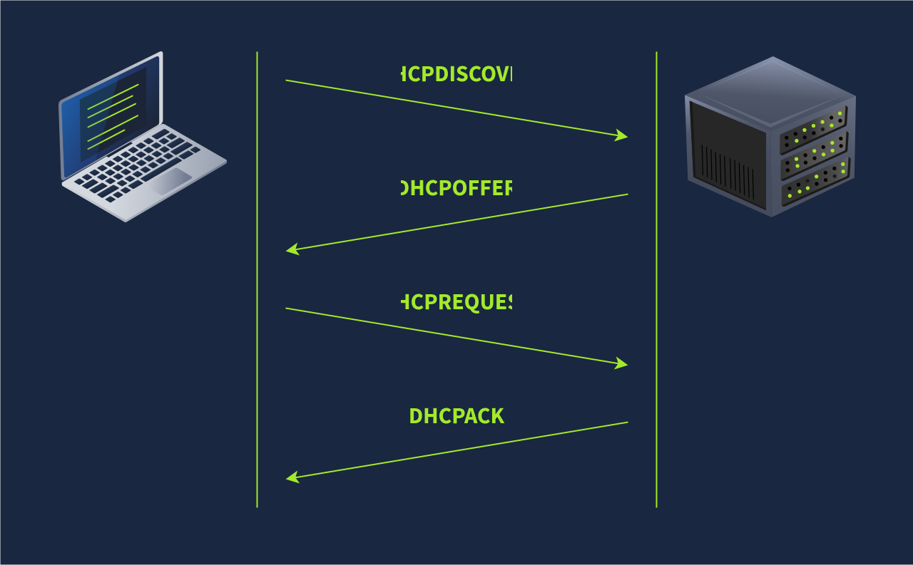
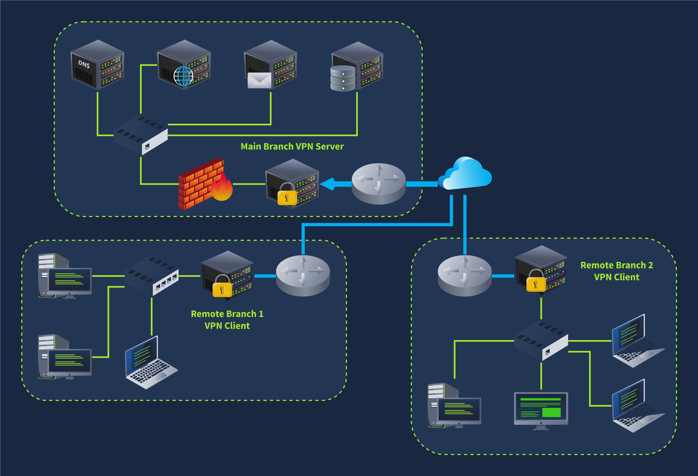
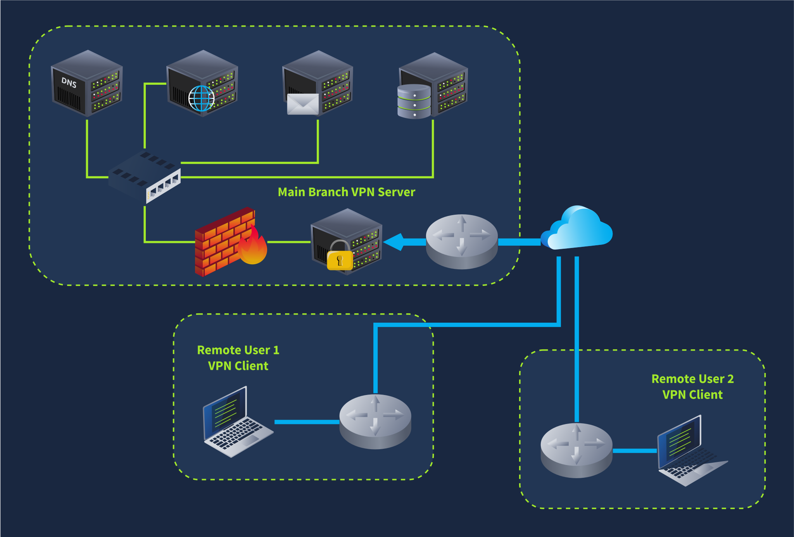

## Networking Concepts

<span style="font-size: 23px;">**Objectives**</span>

- ISO OSI network model
- IP addresses, subnets, and routing
- TCP, UDP, and port numbers
- How to connect to an open TCP port from the command line

### OSI Model


The **OSI (Open Systems Interconnection)** model is a conceptual model developed by the International Organization for Standardization (ISO) that describes how communications should occur in a computer network. In other words, the OSI model defines a framework for computer network communications. Although this model is **theoretical**, it is vital to learn and understand as it helps grasp networking concepts on a deeper level. The OSI model is composed of seven layers:


| Layer Number | Layer Name | Main Function | Example Protocols and Standards |
| :---: | :---: | :---: | :---: |
| Layer 7 | Application layer | Providing services and interfaces to applications | HTTP, FTP, DNS, POP3, SMTP, IMAP |
| Layer 6 | Presentation layer | Data encoding, encryption, and compression | Unicode, MIME, JPEG, PNG, MPEG |
| Layer 5 | Session layer | Establishing, maintaining, and synchronising sessions | NFS, RPC |
| Layer 4 | Transport layer | End - to - end communication and data segmentation | UDP, TCP |
| Layer 3 | Network layer | Logical addressing and routing between networks | IP, ICMP, IPSec |
| Layer 2 | Data link layer | Reliable data transfer between adjacent nodes | Ethernet (802.3), WiFi (802.11) |
| Layer 1 | Physical layer | Physical data transmission media | Electrical, optical, and wireless signals | 

### TCP/IP Model

TCP/IP stands for Transmission Control Protocol/Internet Protocol and was developed in the 1970s by the Department of Defense (DoD). I hear you ask why DoD would create such a model. One of the strengths of this model is that it allows a network to continue to function as parts of it are out of service, for instance, due to a military attack. This capability is possible in part due to the design of the routing protocols to adapt as the network topology changes.

In our presentation of the ISO OSI model, we went from bottom to top, from layer 1 to layer 7. In this task, let's look at things from a different perspective, from top to bottom. From top to bottom, we have:

- Application Layer: The OSI model application, presentation and session layers, i.e., layers 5, 6, and 7, are grouped into the application layer in the TCP/IP model.
- Transport Layer: This is layer 4.
- Internet Layer: This is layer 3. The OSI model's network layer is called the Internet layer in the TCP/IP model.
- Link Layer: This is layer 2.


### IP Addresses and Subnets


At the risk of oversimplifying things, the 0 and 255 are reserved for the network and broadcast addresses, respectively. In other words, 192.168.1.0 is the network address, while 192.168.1.255 is the broadcast address. Sending to the broadcast address targets all the hosts on the network. With simple math, you can conclude that we cannot have more than 4 billion unique IPv4 addresses. If you are curious about the math, it is approximately 232 because we have 32 bits. This number is approximate because we didn't consider network and broadcast addresses.


<span style="font-size: 23px;">**Private Addresses**</span>

RFC 1918 defines the following three ranges of private IP addresses:

- 10.0.0.0 - 10.255.255.255 (10/8)
- 172.16.0.0 - 172.31.255.255 (172.16/12)
- 192.168.0.0 - 192.168.255.255 (192.168/16)

### UDP and TCP

The IP protocol allows us to reach a destination host on the network; the host is identified by its IP address. We need protocols that would enable processes on networked hosts to communicate with each other. There are two transport protocols to achieve that: UDP and TCP.

<span style="font-size: 23px;">**UDP**</span>

**UDP (User Datagram Protocol)** allows us to reach a specific process on this target host. UDP is a simple connectionless protocol that operates at the transport layer, i.e., layer 4. Being connectionless means that it does not need to establish a connection. UDP does not even provide a mechanism to know that the packet has been delivered.

An IP address identifies the host; we need a mechanism to determine the sending and receiving process. This can be achieved by using port numbers. A port number uses two octets; consequently, it ranges between 1 and 65535; port 0 is reserved. (The number 65535 is calculated by the expression 216 − 1.)

<span style="font-size: 23px;">**TCP**</span>

**TCP (Transmission Control Protocol)** is a connection-oriented transport protocol. It uses various mechanisms to ensure reliable data delivery sent by the different processes on the networked hosts. Like UDP, it is a layer 4 protocol. Being connection-oriented, it requires the establishment of a TCP connection before any data can be sent.

In TCP, each data octet has a sequence number; this makes it easy for the receiver to identify lost or duplicated packets. The receiver, on the other hand, acknowledges the reception of data with an acknowledgement number specifying the last received octet.

A TCP connection is established using what's called a three-way handshake. Two flags are used: SYN (Synchronise) and ACK (Acknowledgment). The packets are sent as follows:

1. SYN Packet: The client initiates the connection by sending a SYN packet to the server. This packet contains the client's randomly chosen initial sequence number.
2. SYN-ACK Packet: The server responds to the SYN packet with a SYN-ACK packet, which adds the initial sequence number randomly chosen by the server.
3. ACK Packet: The three-way handshake is completed as the client sends an ACK packet to acknowledge the reception of the SYN-ACK packet.


### Encapsulation

In this context, encapsulation refers to the process of every layer adding a header (and sometimes a trailer) to the received unit of data and sending the “encapsulated” unit to the layer below.

**Encapsulation** is an essential concept as it allows each layer to focus on its intended function. In the image below, we have the following four steps:

- **Application data:** It all starts when the user inputs the data they want to send into the application. For example, you write an email or an instant message and hit the send button. The application formats this data and starts sending it according to the application protocol used, using the layer below it, the transport layer.
- **Transport protocol segment or datagram:** The transport layer, such as TCP or UDP, adds the proper header information and creates the **TCP segment** (or **UDP datagram**). This segment is sent to the layer below it, the network layer.
- **Network packet:** The network layer, i.e. the Internet layer, adds an IP header to the received TCP segment or UDP datagram. Then, this IP packet is sent to the layer below it, the data link layer.
- **Data link frame:** The Ethernet or WiFi receives the IP packet and adds the proper header and trailer, creating a **frame**.

We start with application data. At the transport layer, we add a TCP or UDP header to create a TCP segment or UDP datagram. Again, at the network layer, we add the proper IP header to get an IP packet that can be routed over the Internet. Finally, we add the appropriate header and trailer to get a WiFi or Ethernet frame at the link layer.


The process has to be reversed on the receiving end until the application data is extracted.

<span style="font-size: 23px;">**The Life of a Packet**</span>

Based on what we have studied so far, we can explain a simplified version of the packet's life. Let's consider the scenario where you search for a room on TryHackMe.

1. On the TryHackMe search page, you enter your search query and hit enter.
2. Your web browser, using HTTPS, prepares an HTTP request and pushes it to the layer below it, the transport layer.
3. The TCP layer needs to establish a connection via a three-way handshake between your browser and the TryHackMe web server. After establishing the TCP connection, it can send the HTTP request containing the search query. Each TCP segment created is sent to the layer below it, the Internet layer.
4. The IP layer adds the source IP address, i.e., your computer, and the destination IP address, i.e., the IP address of the TryHackMe web server. For this packet to reach the router, your laptop delivers it to the layer below it, the link layer.
5. Depending on the protocol, The link layer adds the proper link layer header and trailer, and the packet is sent to the router.
6. The router removes the link layer header and trailer, inspects the IP destination, among other fields, and routes the packet to the proper link. Each router repeats this process until it reaches the router of the target server.

The steps will then be reversed as the packet reaches the router of the destination network.

### Telnet

The **TELNET (Teletype Network) protocol** is a network protocol for remote terminal connection. In simpler words, **telnet**, a TELNET client, allows you to connect to and communicate with a remote system and issue text commands. Although initially it was used for remote administration, we can use **telnet** to connect to any server listening on a TCP port number.

[案例](#http) <a id="back2telnet"></a>

<span style="font-size: 23px;">**工作原理**</span>

基于客户端 / 服务器模式 。本地计算机运行 Telnet 客户端程序，向目标计算机（运行 Telnet 服务器程序 ）发起 TCP 连接（默认端口 23 ）。连接建立后，用户在本地输入的命令经客户端传输给服务器，服务器执行命令并将结果返回给客户端显示 ，就像在本地操作目标计算机一样。

**优缺点**

- 优点：简单易用，几乎所有计算机操作系统都支持；连接速度快，操作界面响应灵敏，适合快速命令行操作 。
- 缺点：所有登录凭证（用户名、密码等 ）和传输数据都是明文形式，在网络传输过程中容易被截取，安全性差，在不安全网络（如公共 Wi-Fi ）中易遭受中间人攻击 。

随着网络安全需求提升，更安全的 SSH（Secure Shell ）协议逐渐取代 Telnet 成为远程登录首选 ，SSH 支持用户名、密码、密钥等多重身份验证，且数据加密传输 。 但在一些对安全性要求不高的内部网络或特定测试场景中，Telnet 仍有一定应用 。

---

## Networking Essentials

Explore networking protocols from automatic configuration to routing packets to the destination.

<span style="font-size: 23px;">**Objectives**</span>

- Dynamic Host Configuration Protocol (DHCP)
- Address Resolution Protocol (ARP)
- Network Address Translation (NAT)
- Internet Control Message Protocol (ICMP)
  - Ping
  - Traceroute

### DHCP: Give Me My Network Settings

[DHCP介绍](./network.md#dhcp)

Whenever we want to access a network, at the very least, we need to configure the following:

- IP address along with subnet mask
- Router (or gateway)
- DNS server

DHCP is an application-level protocol that relies on UDP; the server listens on UDP port 67, and the client sends from UDP port 68. Your smartphone and laptop are configured to use DHCP by default.


DHCP follows four steps: Discover, Offer, Request, and Acknowledge (DORA):

1. **DHCP Discover:** The client broadcasts a DHCPDISCOVER message seeking the local DHCP server if one exists.
2. **DHCP Offer:** The server responds with a DHCPOFFER message with an IP address available for the client to accept.
3. **DHCP Request:** The client responds with a DHCPREQUEST message to indicate that it has accepted the offered IP.
4. **DHCP Acknowledge:** The server responds with a DHCPACK message to confirm that the offered IP address is now assigned to this client.



The following packet capture shows the four steps explained above. In this example, the client gets the address `192.168.66.133`.

```bash
user@TryHackMe$ tshark -r DHCP-G5000.pcap -n
    1   0.000000      0.0.0.0 → 255.255.255.255 DHCP 342 DHCP Discover - Transaction ID 0xfb92d53f
    2   0.013904 192.168.66.1 → 192.168.66.133 DHCP 376 DHCP Offer    - Transaction ID 0xfb92d53f
    3   4.115318      0.0.0.0 → 255.255.255.255 DHCP 342 DHCP Request  - Transaction ID 0xfb92d53f
    4   4.228117 192.168.66.1 → 192.168.66.133 DHCP 376 DHCP ACK      - Transaction ID 0xfb92d53f
```
In the DHCP packet exchange, we can notice the following:

- The client starts without any IP network configuration. It only has a MAC address. In the first and third packets, DHCP Discover and DHCP Request, the client searching for a DHCP server still has no IP network configuration and has not yet used the DHCP server's offered IP address. Therefore, it sends packets from the IP address `0.0.0.0` to the broadcast IP address `255.255.255.255`. 
- As for the link layer, in the first and third packets, the client sends to the broadcast MAC address, `ff:ff:ff:ff:ff:ff` (not shown in the output above). The DHCP server offers an available IP address along with the network configuration in the DHCP offer. It uses the client's destination MAC address. (It used the proposed IP address in this example system.)

At the end of the DHCP process, our device would have received all the configuration needed to access the network or even the Internet. In particular, we expect that the DHCP server has provided us with the following:

- The leased IP address to access network resources
- The gateway to route our packets outside the local network
- A DNS server to resolve domain names

### ARP: Bridging Layer 3 Addressing to Layer 2 Addressing

[ARP介绍](./network.md#arp)

We have stated in the Networking Concepts room that as two hosts communicate over a network, an IP packet is encapsulated within a data link frame as it travels over layer 2. Remember that the two common data link layers we use are Ethernet (IEEE 802.3) and WiFi (IEEE 802.11). Whenever one host needs to communicate with another host on the same Ethernet or WiFi, it must send the IP packet within a data link layer frame. Although it knows the IP address of the target host, it needs to look up the target's MAC address so the proper data link header can be created.

MAC address is a 48-bit number typically represented in hexadecimal notation; for example, `7C:DF:A1:D3:8C:5C` and `44:DF:65:D8:FE:6C` are two MAC addresses on my network.

However, the devices on the same Ethernet network do not need to know each other's MAC addresses all the time; they only need to know each other's MAC addresses while communicating. Everything revolves around IP addresses. Consider this scenario: You connect your device to a network, and if the network has a DHCP server, your device is automatically configured to use a specific gateway (router) and DNS server. Consequently, your device knows the IP address of the DNS server to resolve any domain name; moreover, it knows the IP address of the router when it needs to send packets over the Internet. In all this scenario, no MAC addresses are revealed. However, two devices on the same Ethernet cannot communicate without knowing each other's MAC addresses.

As a reminder, in the screenshot below, we see an IP packet within an Ethernet frame. The Ethernet frame header contains:

- Destination MAC address
- Source MAC address
- Type (IPv4 in this case)


Address Resolution Protocol (ARP) makes it possible to find the MAC address of another device on the Ethernet. In the example below, a host with the IP address `192.168.66.89` wants to communicate with another system with the IP address `192.168.66.1`. It sends an ARP Request asking the host with the IP address `192.168.66.1` to respond. The ARP Request is sent from the MAC address of the requester to the broadcast MAC address, `ff:ff:ff:ff:ff:ff` as shown in the first packet. The ARP Reply arrived shortly afterwards, and the host with the IP address `192.168.66.1` responded with its MAC address. From this point, the two hosts can exchange data link layer frames.

```bash
user@TryHackMe$ tshark -r arp.pcapng -Nn
    1 0.000000000 cc:5e:f8:02:21:a7 → ff:ff:ff:ff:ff:ff ARP 42 Who has 192.168.66.1? Tell 192.168.66.89
    2 0.003566632 44:df:65:d8:fe:6c → cc:5e:f8:02:21:a7 ARP 42 192.168.66.1 is at 44:df:65:d8:fe:6c
```

If we use **tcpdump**, the packets will be displayed differently. It uses the terms ARP **Request** and ARP **Reply**. For your information, the output is shown in the terminal below.

```bash
user@TryHackMe$ tcpdump -r arp.pcapng -n -v
17:23:44.506615 ARP, Ethernet (len 6), IPv4 (len 4), Request who-has 192.168.66.1 tell 192.168.66.89, length 28
17:23:44.510182 ARP, Ethernet (len 6), IPv4 (len 4), Reply 192.168.66.1 is-at 44:df:65:d8:fe:6c, length 28
```
An ARP Request or ARP Reply is not encapsulated within a UDP or even IP packet; it is encapsulated directly within an Ethernet frame. The following ARP Reply shows this.


ARP is considered layer 2 because it deals with MAC addresses. Others would argue that it is part of layer 3 because it supports IP operations. What is essential to know is that ARP allows the translation from layer 3 addressing to layer 2 addressing.

### ICMP: Troubleshooting Networks

**Internet Control Message Protocol (ICMP)** is mainly used for network diagnostics and error reporting. Two popular commands rely on ICMP, and they are instrumental in network troubleshooting and network security. The commands are:

- `ping`: This command uses ICMP to test connectivity to a target system and measures the round-trip time (RTT). In other words, it can be used to learn that the target is alive and that its reply can reach our system.
- `traceroute`: This command is called `traceroute` on Linux and UNIX-like systems and `tracert` on MS Windows systems. It uses ICMP to discover the route from your host to the target.

<span style="font-size: 23px;">**Ping**</span>

The `ping` command sends an ICMP Echo Request (ICMP Type `8`). The screenshot below shows the ICMP message within an IP packet.


The computer on the receiving end responds with an ICMP Echo Reply (ICMP Type `0`).


<span style="font-size: 23px;">**Traceroute**</span>

The Internet protocol has a field called Time-to-Live (TTL) that indicates the maximum number of routers a packet can travel through before it is dropped. The router decrements the packet's TTL by one before it sends it across. When the TTL reaches zero, the router drops the packet and sends an ICMP Time Exceeded message (ICMP Type `11`). (In this context, “time” is measured in the number of routers, not seconds.)

<span style="font-size: 23px;">**如何测试ICMP？**</span>

1. **Ping命令**  

   ```bash
   ping example.com  # 发送ICMP回显请求
   ```

2. **Traceroute命令**  

   ```bash
   traceroute example.com  # 在Linux/macOS中使用
   tracert example.com    # 在Windows中使用
   ```

`TTL` 代表 **Time To Live**（生存时间）。

**作用：**
- TTL 是 IP 数据包头中的一个字段，用于限制数据包在网络中被转发的次数，防止数据包在网络中无限循环。
- 每经过一个路由器（跳数），TTL 就减 1。当 TTL 减到 0 时，数据包会被丢弃，并返回 ICMP 超时消息。

**在 ping 结果中的含义：**
- TTL 数值越大，说明数据包经过的路由器（跳数）越少，目标主机离你越近。
- 常见初始值：Windows 默认 128，Linux/Unix 默认 64，部分设备为 255。

**示例：**
```
Reply from 8.8.8.8: bytes=32 time=20ms TTL=117
```
这里的 TTL=117，表示数据包从初始值（如 128）经过了 11 个路由器到达你。

### Routing 

路由（Routing）通常指的是在网络中确定数据包从源地址到目标地址的传输路径的过程。

更具体地说，它可以指：

**网络路由：** 在计算机网络中，路由器负责根据目标 IP 地址选择最佳路径，将数据包转发到下一个网络节点，最终到达目的地。 路由协议（如 RIP、OSPF、BGP）用于路由器之间交换路由信息，构建路由表，以便做出最佳的转发决策。

**Web 应用程序路由：** 在 Web 应用程序中，路由指的是根据用户请求的 URL，将请求映射到相应的处理程序（例如，控制器方法或视图）。 路由机制使得 Web 应用程序可以根据不同的 URL 提供不同的内容或执行不同的操作。 常见的 Web 框架（如 Django、Flask、Rails）都提供了强大的路由功能。

简单来说，路由就是**确定数据传输路径的过程**，无论是在计算机网络中还是在 Web 应用程序中。 它可以确保数据能够高效、准确地到达目的地。

<span style="font-size: 23px;">**some routing protocols**</span>

- **OSPF (Open Shortest Path First):** OSPF is a routing protocol that allows routers to share information about the network topology and calculate the most efficient paths for data transmission. It does this by having routers exchange updates about the state of their connected links and networks. This way, each router has a complete map of the network and can determine the best routes to reach any destination.

- **EIGRP (Enhanced Interior Gateway Routing Protocol):** EIGRP is a Cisco proprietary routing protocol that combines aspects of different routing algorithms. It allows routers to share information about the networks they can reach and the cost (like bandwidth or delay) associated with those routes. Routers then use this information to choose the most efficient paths for data transmission.

- **BGP (Border Gateway Protocol):** BGP is the primary routing protocol used on the Internet. It allows different networks (like those of Internet Service Providers) to exchange routing information and establish paths for data to travel between these networks. BGP helps ensure data can be routed efficiently across the Internet, even when traversing multiple networks.

- **RIP (Routing Information Protocol):** RIP is a simple routing protocol often used in small networks. Routers running RIP share information about the networks they can reach and the number of hops (routers) required to get there. As a result, each router builds a routing table based on this information, choosing the routes with the fewest hops to reach each destination.

### NAT

NAT(**Network Address Translation**，网络地址转换)是一种网络技术，用于在局域网（内网）和广域网（外网/互联网）之间转换 IP 地址。

**主要作用：**

- 允许多个内网设备通过一个（或少量）公网 IP 地址访问互联网。
- 节省公网 IP 地址资源，提升网络安全性（内网地址对外不可见）。

It was clear that the IPv4 address space would be depleted quickly. One solution to address depletion is Network Address Translation (NAT).

The idea behind NAT lies in using **one public IP** address to provide Internet access to **many private IP addresses**. In other words, if you are connecting a company with twenty computers, you can provide Internet access to all twenty computers by using a single public IP address instead of twenty public IP addresses. (Note: Technically speaking, the number of IP addresses is always expressed as a power of two. To be technically accurate, with NAT, you reserve two public IP addresses instead of thirty-two. Consequently, you would have saved thirty public IP addresses.)

Unlike routing, which is the natural way to route packets to the destination host, routers that support NAT must find a way to track ongoing connections. Consequently, NAT-supporting routers maintain a table translating network addresses between internal and external networks. Generally, the internal network would use a private IP address range, while the external network would use a public IP address.

In the diagram below, multiple devices access the Internet via a router that supports NAT. The router maintains a table that maps the internal IP address and port number with its external IP address and port number. For instance, the laptop might establish a connection with some web server. From the laptop perspective, the connection is initiated from its IP address `192.168.0.129` from TCP source port number `15401`; however, the web server will see this same connection as being established from `212.3.4.5` and TCP port number `19273`, as shown in the translation table. The router does this address translation seamlessly.


### one more thing

<span style="font-size: 23px;">**DHCP 和 NAT 有什么关系**</span>

DHCP 和 NAT 是两种不同但常常一起使用的网络技术：

- **DHCP（动态主机配置协议）**：用于自动分配 IP 地址、网关、DNS 等网络参数给局域网内的设备。它让设备自动获得内网私有 IP，无需手动配置。

- **NAT（网络地址转换）**：用于将局域网内的私有 IP 地址转换为公网 IP 地址，实现多个内网设备共享一个公网 IP 上网。

**它们的关系：**
- 在实际网络中，DHCP 负责给每台内网设备分配唯一的私有 IP 地址；NAT 则负责把这些私有 IP 转换为公网 IP，实现上网。
- 两者通常都由同一个路由器或网关设备实现，协同工作，使内网设备能自动获取地址并访问互联网。

**总结：**
DHCP 负责“分配内网地址”，NAT 负责“地址转换和共享上网”，它们一起让局域网设备能方便、安全地访问互联网。

---

## Networking Core Protocols

<span style="font-size: 23px;">**Objectives**</span>

- WHOIS
- DNS
- HTTP and FTP
- SMTP, POP3, and IMAP

### DNS: Remembering Addresses

详情见[DNS in Detail](./web.md#dns-in-detail)

### WHOIS

[lookup website](https://lookup.icann.org/zh/lookup)

linux命令
```bash
root@ip-10-10-163-23:~# whois x.com
   Domain Name: X.COM
   Registry Domain ID: 1026563_DOMAIN_COM-VRSN
   Registrar WHOIS Server: whois.godaddy.com
   Registrar URL: http://www.godaddy.com
   Updated Date: 2024-12-03T21:03:37Z
   Creation Date: 1993-04-02T05:00:00Z
   Registry Expiry Date: 2034-10-20T19:56:17Z
   Registrar: GoDaddy.com, LLC
   Registrar IANA ID: 146
   Registrar Abuse Contact Email: abuse@godaddy.com
   Registrar Abuse Contact Phone: 480-624-2505

```

### HTTP

<span style="font-size: 23px;">**HTTP(S): Accessing the Web**</span>

[HTTP in detail](./web.md#http-in-detail)

```bash
root@ip-10-10-151-56:~# telnet 10.10.106.125 80
Trying 10.10.106.125...
Connected to 10.10.106.125.
Escape character is '^]'.
GET / HTTP/1.1
Host: anything

HTTP/1.1 200 OK
Server: nginx/1.18.0 (Ubuntu)
Date: Sat, 10 May 2025 15:16:57 GMT
Content-Type: text/html
Content-Length: 2252
Last-Modified: Thu, 27 Jun 2024 06:58:01 GMT
Connection: keep-alive
ETag: "667d0d79-8cc"
Accept-Ranges: bytes

<!DOCTYPE html>
<html lang="en">
<head>

```

Use telnet to access the file flag.html on 10.10.106.125. What is the hidden flag?
```bash
root@ip-10-10-151-56:~# telnet 10.10.106.125 80
Trying 10.10.106.125...
Connected to 10.10.106.125.
Escape character is '^]'.
GET /flag.html HTTP/1.1
Host: anything

HTTP/1.1 200 OK
Server: nginx/1.18.0 (Ubuntu)
Date: Sat, 10 May 2025 15:20:46 GMT
Content-Type: text/html
Content-Length: 478
Last-Modified: Thu, 27 Jun 2024 07:28:15 GMT
Connection: keep-alive
ETag: "667d148f-1de"
Accept-Ranges: bytes

<!DOCTYPE html>
<html lang="en">
<head>
    <meta charset="UTF-8">
    <meta name="viewport" content="width=device-width, initial-scale=1.0">
    <title>Hidden Message</title>
    <style>
        body {
            background-color: white;
            color: white;
            font-family: Arial, sans-serif;
        }
        .hidden-text {
            font-size: 1px;
        }
    </style>
</head>
<body>
    <div class="hidden-text">THM{TELNET-HTTP}</div>
</body>
</html>

```
[back2telnet](#back2telnet)

### FTP

<span style="font-size: 23px;">**FTP: Transferring Files**</span>

**File Transfer Protocol (FTP)** is a protocol designed to help the efficient transfer of files between different and even non-compatible systems. It supports two modes for file transfer: binary and ASCII (text).

Unlike HTTP, which is designed to retrieve web pages, File Transfer Protocol (FTP) is designed to transfer files. As a result, FTP is very efficient for file transfer, and when all conditions are equal, it can achieve higher speeds than HTTP.

Example commands defined by the FTP protocol are:

- `USER` is used to input the username
- `PASS` is used to enter the password
- `RETR` (retrieve) is used to download a file from the FTP server to the client.
- `STOR` (store) is used to upload a file from the client to the FTP server.

FTP server listens on TCP port 21 by default; data transfer is conducted via another connection from the client to the server.

In the terminal below we executed the command ftp `10.10.106.125` to connect to the remote FTP server using the local ftp client. Then we went through the following steps:

- We used the username `anonymous` to log in
- We didn't need to provide any password
- Issuing `ls` returned a list of files available for download
- `type ascii` switched to ASCII mode as this is a text file
- `get coffee.txt` allowed us to retrieve the file we want
The command exchange via the FTP client is shown in the terminal below:

```bash
root@ip-10-10-151-56:~# ftp 10.10.106.125
Connected to 10.10.106.125.
220 (vsFTPd 3.0.5)
Name (10.10.106.125:root): anonymous
331 Please specify the password.
Password:
230 Login successful.
Remote system type is UNIX.
Using binary mode to transfer files.
ftp> ls
200 PORT command successful. Consider using PASV.
150 Here comes the directory listing.
-rw-r--r--    1 0        0            1480 Jun 27  2024 coffee.txt
-rw-r--r--    1 0        0              14 Jun 27  2024 flag.txt
-rw-r--r--    1 0        0            1595 Jun 27  2024 tea.txt
226 Directory send OK.
ftp> type ascii
200 Switching to ASCII mode.
ftp> get coffee.txt
local: coffee.txt remote: coffee.txt
200 PORT command successful. Consider using PASV.
150 Opening BINARY mode data connection for coffee.txt (1480 bytes).
WARNING! 47 bare linefeeds received in ASCII mode
File may not have transferred correctly.
226 Transfer complete.
1480 bytes received in 0.00 secs (2.5616 MB/s)
ftp> quit
221 Goodbye.
```

We used Wireshark to examine the exchanged messages more closely. The client's messages are in **red**, while the server's responses are in **blue**. Notice how various commands differ between the client and the server. For example, when you type `ls` on the client, the client sends `LIST` to the server. One last thing to note is that the directory listing and the file we downloaded are sent over a separate connection each.


### SMTP

<span style="font-size: 23px;">**SMTP: Sending Email**</span>

**Simple Mail Transfer Protocol (SMTP)** is a protocol used to send the email to an SMTP server, more specifically to a Mail Submission Agent (MSA) or a Mail Transfer Agent (MTA).

As with browsing the web and downloading files, sending email needs its own protocol. Simple Mail Transfer Protocol (SMTP) defines how a mail client talks with a mail server and how a mail server talks with another.

The analogy for the SMTP protocol is when you go to the local post office to send a package. You greet the employee, tell them where you want to send your package, and provide the sender's information before handing them the package. Depending on the country you are in, you might be asked to show your identity card. This process is not very different from an SMTP session.

Let's present some of the commands used by your mail client when it transfers an email to an SMTP server:

- `HELO` or `EHLO` initiates an SMTP session
- `MAIL FROM` specifies the sender's email address
- `RCPT TO` specifies the recipient's email address
- `DATA` indicates that the client will begin sending the content of the email message
- `.` is sent on a line by itself to indicate the end of the email message

The terminal below shows an example of an email sent via telnet. The SMTP server listens on TCP port 25 by default.

```bash
root@ip-10-10-151-56:~# telnet 10.10.106.125 25
Trying 10.10.106.125...
Connected to 10.10.106.125.
Escape character is '^]'.
220 example.thm ESMTP Exim 4.95 Ubuntu Sat, 10 May 2025 16:11:28 +0000
HELO client.thm
250 example.thm Hello client.thm [10.10.151.56]
MAIL FROM: <user@client.thm>
250 OK
RCPT TO: <strategos@server.thm>
250 Accepted
DATA
354 Enter message, ending with "." on a line by itself
From: user@client.thm
To: strategos@server.thm
Subject: Telnet email

Hello. I am using telnet to send you an email!
.
250 OK id=1uDmoT-0000LX-Eq
quit
221 example.thm closing connection
Connection closed by foreign host.

```
Obviously, sending an email using `telnet` is quite cumbersome; however, it helps you better understand the commands that your email client issues under the hood. The Wireshark capture shows the exchange in colours; the client's messages are in red, while the server's responses are in blue.


### POP3

<span style="font-size: 23px;">**POP3: Receiving Email**</span>

**Post Office Protocol Version 3 (POP3)** is an alternative protocol for receiving emails that downloads emails from the server to a local device. Using POP3, a recipient cannot access their emails again from a different device because they are stored locally and then deleted from the email server.

You've received an email and want to download it to your local mail client. The Post Office Protocol version 3 (POP3) is designed to allow the client to communicate with a mail server and retrieve email messages.

Without going into in-depth technical details, an email client sends its messages by relying on SMTP and retrieves them using POP3. SMTP is similar to handing your envelope or package to the post office, and POP3 is similar to checking your local mailbox for new letters or packages.

Some common POP3 commands are:

- `USER <username>` identifies the user
- `PASS <password>` provides the user's password
- `STAT` requests the number of messages and total size
- `LIST` lists all messages and their sizes
- `RETR <message_number>` retrieves the specified message
- `DELE <message_number>` marks a message for deletion
- `QUIT` ends the POP3 session applying changes, such as deletions

In the terminal below, we can see a POP3 session over telnet. Since the POP3 server listens on TCP port 110 by default, the command to connect to the TELNET port is `telnet 10.10.106.125 110`. The exchange below retrieves the email message sent in the previous task.

```bash
user@TryHackMe$ telnet 10.10.106.125 110
Trying 10.10.106.125...
Connected to 10.10.106.125.
Escape character is '^]'.
+OK [XCLIENT] Dovecot (Ubuntu) ready.
AUTH
+OK
PLAIN
.
USER strategos
+OK
PASS 
+OK Logged in.
STAT
+OK 3 1264
LIST
+OK 3 messages:
1 407
2 412
3 445
.
RETR 3
+OK 445 octets
Return-path: <user@client.thm>
Envelope-to: strategos@server.thm
Delivery-date: Thu, 27 Jun 2024 16:19:35 +0000
Received: from [10.11.81.126] (helo=client.thm)
        by example.thm with smtp (Exim 4.95)
        (envelope-from <user@client.thm>)
        id 1sMrpq-0001Ah-UT
        for strategos@server.thm;
        Thu, 27 Jun 2024 16:19:35 +0000
From: user@client.thm
To: strategos@server.thm
Subject: Telnet email

Hello. I am using telnet to send you an email!
.
QUIT
+OK Logging out.
Connection closed by foreign host.
```
Someone capturing the network packets would be able to intercept the exchanged traffic. As per previous Wireshark captures, the commands in red are sent by the client, and the lines in blue are the server's. It is also clear that someone capturing the traffic can read the passwords.


### IMAP

<span style="font-size: 23px;">**IMAP: Synchronizing Email**</span>

**The Internet Message Access Protocol (IMAP)** is a protocol for receiving email. Protocols standardize technical processes so computers and servers can connect with each other regardless of whether or not they use the same hardware or software.

POP3 is enough when working from one device, e.g., your favourite email client on your desktop computer. However, what if you want to check your email from your office desktop computer and from your laptop or smartphone? In this scenario, you need a protocol that allows synchronization of messages instead of deleting a message after retrieving it. One solution to maintaining a synchronized mailbox across multiple devices is Internet Message Access Protocol (IMAP).

IMAP allows synchronizing read, moved, and deleted messages. IMAP is quite convenient when you check your email via multiple clients. Unlike POP3, which tends to minimize server storage as email is downloaded and deleted from the remote server, IMAP tends to use more storage as email is kept on the server and synchronized across the email clients.

The IMAP protocol commands are more complicated than the POP3 protocol commands. We list a few examples below:

- `LOGIN <username> <password>` authenticates the user
- `SELECT <mailbox>` selects the mailbox folder to work with
- `FETCH <mail_number> <data_item_name>` Example fetch 3 body[] to fetch message number 3, header and body.
- `MOVE <sequence_set> <mailbox>` moves the specified messages to another mailbox
- `COPY <sequence_set> <data_item_name>` copies the specified messages to another mailbox
- `LOGOUT` logs out

Knowing that the IMAP server listens on TCP port 143 by default, we will use `telnet` to connect to `10.10.106.125`'s port `143` and fetch the message we sent in an earlier task.

```bash
user@TryHackMe$ telnet 10.10.41.192 143
Trying 10.10.41.192...
Connected to 10.10.41.192.
Escape character is '^]'.
* OK [CAPABILITY IMAP4rev1 SASL-IR LOGIN-REFERRALS ID ENABLE IDLE LITERAL+ STARTTLS AUTH=PLAIN] Dovecot (Ubuntu) ready.
A LOGIN strategos
A OK [CAPABILITY IMAP4rev1 SASL-IR LOGIN-REFERRALS ID ENABLE IDLE SORT SORT=DISPLAY THREAD=REFERENCES THREAD=REFS THREAD=ORDEREDSUBJECT MULTIAPPEND URL-PARTIAL CATENATE UNSELECT CHILDREN NAMESPACE UIDPLUS LIST-EXTENDED I18NLEVEL=1 CONDSTORE QRESYNC ESEARCH ESORT SEARCHRES WITHIN CONTEXT=SEARCH LIST-STATUS BINARY MOVE SNIPPET=FUZZY PREVIEW=FUZZY PREVIEW STATUS=SIZE SAVEDATE LITERAL+ NOTIFY SPECIAL-USE] Logged in
B SELECT inbox
* FLAGS (\Answered \Flagged \Deleted \Seen \Draft)
* OK [PERMANENTFLAGS (\Answered \Flagged \Deleted \Seen \Draft \*)] Flags permitted.
* 4 EXISTS
* 0 RECENT
* OK [UNSEEN 2] First unseen.
* OK [UIDVALIDITY 1719824692] UIDs valid
* OK [UIDNEXT 5] Predicted next UID
B OK [READ-WRITE] Select completed (0.001 + 0.000 secs).
C FETCH 3 body[]
* 3 FETCH (BODY[] {445}
Return-path: <user@client.thm>
Envelope-to: strategos@server.thm
Delivery-date: Thu, 27 Jun 2024 16:19:35 +0000
Received: from [10.11.81.126] (helo=client.thm)
        by example.thm with smtp (Exim 4.95)
        (envelope-from <user@client.thm>)
        id 1sMrpq-0001Ah-UT
        for strategos@server.thm;
        Thu, 27 Jun 2024 16:19:35 +0000
From: user@client.thm
To: strategos@server.thm
Subject: Telnet email

Hello. I am using telnet to send you an email!
)
C OK Fetch completed (0.001 + 0.000 secs).
D LOGOUT
* BYE Logging out
D OK Logout completed (0.001 + 0.000 secs).
Connection closed by foreign host.
```

The screenshot below shows the exchanged messages between the client and the server as seen from Wireshark. The client only needed to send four commands, shown in red, and the “long” server responses are shown in blue.


### SMB

[Server Message Block](../common.md#smb) 

```bash
root@ip-10-10-195-184:~# smbclient -L 10.10.41.129
Password for [WORKGROUP\root]:

        Sharename       Type      Comment
        ---------       ----      -------
        print$          Disk      Printer Drivers
        pics            Disk      My SMB Share Directory for Pics
        IPC$            IPC       IPC Service (anonymous server (Samba, Ubuntu))
SMB1 disabled -- no workgroup available
```

### one more thing

The table below summarizes the default port numbers of the protocols we have covered so far.

| Protocol | Transport Protocol | Default Port Number |
| :------: | :----------------: | :-----------------: |
| TELNET   | TCP                | 23                  |
| DNS      | UDP or TCP         | 53                  |
| HTTP     | TCP                | 80                  |
| HTTPS    | TCP                | 443                 |
| FTP      | TCP                | 21                  |
| SMTP     | TCP                | 25                  |
| POP3     | TCP                | 110                 |
| IMAP     | TCP                | 143                 |
| SMB      | TCP                | 139  445            |

## Networking Secure Protocols

confidentiality, integrity, and authenticity.

<span style="font-size: 23px;">**Objectives**</span>

- SSL/TLS
- How to secure existing plaintext protocols:
  - HTTP
  - SMTP
  - POP3
  - IMAP
- How SSH replaced the plaintext TELNET
- How VPN creates a secure network over an insecure one

### TLS

TLS（Transport Layer Security，传输层安全协议）是一种用于保护网络通信安全的加密协议。它是 SSL（Secure Sockets Layer，安全套接字层协议）的继任者，常用于为 HTTP、SMTP、IMAP、POP3 等协议提供加密和身份验证。

**主要作用：**

- 加密数据，防止被窃听
- 确保数据完整性，防止被篡改
- 验证通信双方身份，防止中间人攻击

**常见应用：**

- HTTPS（即 HTTP over TLS）：保护网页浏览安全
- 邮件传输加密（如 SMTPS、IMAPS、POP3S）
- VPN、即时通讯等安全通信场景

**CA**, or **Certificate Authority**, is a trusted organisation that verifies the digital identity of entities like websites, individuals, or companies by issuing digital certificates.

The first step for every server (or client) that needs to identify itself is to get a signed TLS certificate. Generally, the server administrator creates a Certificate Signing Request (CSR) and submits it to a Certificate Authority (CA); the CA verifies the CSR and issues a digital certificate. Once the (signed) certificate is received, it can be used to identify the server (or the client) to others, who can confirm the validity of the signature. For a host to confirm the validity of a signed certificate, the certificates of the signing authorities need to be installed on the host. In the non-digital world, this is similar to recognising the stamps of various authorities. The screenshot below shows the trusted authorities installed in a web browser.


Generally speaking, getting a certificate signed requires paying an annual fee. However, [Let's Encrypt](https://letsencrypt.org) allows you to get your certificate signed for free.

Finally, we should mention that some users opt to create a self-signed certificate. A self-signed certificate cannot prove the server's authenticity as no third party has confirmed it.

### HTTPS

[HTTP](./web.md#http-in-detail) relies on [TCP](./network.md#tcp) and uses port 80 by default.All HTTP traffic was sent in cleartext for anyone to intercept and monitor. 

Let's take a minute to review the most common steps before a web browser can request a page over HTTP. After resolving the domain name to an IP address, the client will carry out the following two steps:

1. Establish a TCP three-way handshake with the target server
2. Communicate using the HTTP protocol; for example, issue HTTP requests, such as `GET / HTTP/1.1`

The two steps described above are shown in the window below. The three packets for the TCP handshake (marked with 1) precede the first HTTP packet with `GET` in it. The HTTP communication is marked with 2. The last three displayed packets are for TCP connection termination and are marked with 3.


<span style="font-size: 23px;">**HTTP Over TLS**</span>

HTTPS stands for Hypertext Transfer Protocol Secure. It is basically HTTP over TLS. Consequently, requesting a page over HTTPS will require the following three steps (after resolving the domain name):

1. Establish a TCP three-way handshake with the target server
2. Establish a TLS session
3. Communicate using the HTTP protocol; for example, issue HTTP requests, such as `GET / HTTP/1.1`

The screenshot below shows that a TCP session is established in the first three packets, marked with `1`. Then, several packets are exchanged to negotiate the TLS protocol, marked with` 2`. `1` and `2` are where the `TLS negotiation and establishment` take place.

Finally, HTTP application data is exchanged, marked with `3`. Looking at the Wireshark screenshot, we see that it says “Application Data” because there is no way to know if it is indeed HTTP or some other protocol sent over port 443.


As expected, if one tries to follow the stream of packets and combine all their contents, they will only get gibberish, as shown in the screenshot below. The exchanged traffic is encrypted; the red is sent by the client, and the blue is sent by the server. There is no way to know the contents without acquiring the encryption key.


<span style="font-size: 23px;">**Getting the Encryption Key**</span>

Adding TLS to HTTP leads to all the packets being encrypted. We can no longer see the contents of the exchanged packets unless we get access to the private key. Although it is improbable that we will have access to the keys used for encryption in a TLS session, we repeated the above screenshots after providing the decryption key to Wireshark. The TCP and TLS handshakes don't change; the main difference starts with the HTTP protocol marked 3. For instance, we can see when the client issues a `GET`.


If you want to see the data exchanged, now is your chance! It is still regular HTTP traffic hidden from prying eyes.


The key takeaway is that TLS offered security for HTTP without requiring any changes in the lower or higher layer protocols. In other words, TCP and IP were not modified, while HTTP was sent over TLS the way it would be sent over TCP.

### others

Adding TLS to SMTP, POP3, and IMAP is no different than adding TLS to HTTP. Similar to how HTTP gets an appended S for Secure and becomes HTTPS, SMTP, POP3, and IMAP become SMTPS, POP3S, and IMAPS, respectively. Using these protocols over TLS is no different than using HTTP over TLS; therefore, almost all the points from the HTTPS discussion apply to these protocols.

The insecure and secure versions use the default TCP port numbers shown in the table below：

| Protocol    | insecure  Port      | secure  Port        |
| :---------: | :-----------------: | :-----------------: |
| HTTP(S)     | 80                  | 443                 |
| SMTP(S)     | 25                  | 465 and 587         |
| POP3(S)     | 110                 | 995                 |
| IMAP(S)     | 143                 | 993                 | 
| FTS(S)      | 21                  | 990                 | 

### SSH

**Secure Shell ([SSH](../linux/archlinuxApp.md#ssh))** refers to a cryptographic network protocol used in secure communication between devices. SSH encrypts data using cryptographic algorithms, such as Advanced Encryption System (AES) and is often used when logging in remotely to a computer or server.

OpenSSH offers several benefits. We will list a few key points:

- **Secure authentication**: Besides password-based authentication, SSH supports public key and two-factor authentication.
- **Confidentiality**: OpenSSH provides end-to-end encryption, protecting against eavesdropping. Furthermore, it notifies you of new server keys to protect against man-in-the-middle attacks.
- **Integrity**: In addition to protecting the confidentiality of the exchanged data, cryptography also protects the integrity of the traffic.
- **Tunneling**: SSH can create a secure “tunnel” to route other protocols through SSH. This setup leads to a VPN-like connection.
- **X11 Forwarding**: If you connect to a Unix-like system with a graphical user interface, SSH allows you to use the graphical application over the network.

While the TELNET server listens on port 23, the SSH server listens on port 22.

### SFTP and FTPS

SFTP stands for SSH File Transfer Protocol and allows secure file transfer. It is part of the SSH protocol suite and shares the same port number, 22. If enabled in the OpenSSH server configuration, you can connect using a command such as `sftp username@hostname`. Once logged in, you can issue commands such as `get filename` and `put filename` to download and upload files, respectively. Generally speaking, SFTP commands are Unix-like and can differ from FTP commands.

SFTP should not be confused with FTPS. You are right to think that FTPS stands for File Transfer Protocol Secure. How is FTPS secured? Yes, you are correct to estimate that it is secured using TLS, just like HTTPS. While FTP uses port 21, FTPS usually uses port 990. It requires certificate setup, and it can be tricky to allow over strict firewalls as it uses separate connections for control and data transfer.

### VPN

[VPN Basics](./network.md#vpn-basics)

When the Internet was designed, the TCP/IP protocol suite focused on delivering packets. For example, if a router gets out of service, the routing protocols can adapt and pick a different route to send their packets. If a packet was not acknowledged, TCP has built-in mechanisms to detect this situation and resend. However, no mechanisms are in place to ensure that **all data** leaving or entering a computer is protected from disclosure and alteration. A popular solution was the setup of a VPN connection. The focus here is on the P for Private in VPN.

Almost all companies require “private” information exchange in their virtual network. So, a VPN provides a very convenient and relatively inexpensive solution. The main requirements are Internet connectivity and a VPN server and client.

The network diagram below shows an example of a company with two remote branches connecting to the main branch. A VPN client in the remote branches is expected to connect to the VPN server in the main branch. In this case, the VPN client will encrypt the traffic and pass it to the main branch via the established VPN tunnel (shown in blue). The VPN traffic is limited to the blue lines; the green lines would carry the decrypted VPN traffic.



In the network diagram below, we see two remote users using VPN clients to connect to the VPN server in the main branch. In this case, the VPN client connects a single device.



Finally, although in many scenarios, one would establish a VPN connection to route all the traffic over the VPN tunnel, some VPN connections don't do this. The VPN server may be configured to give you access to a private network but not to route your traffic. Furthermore, some VPN servers leak your actual IP address, although they are expected to route all your traffic over the VPN. Depending on why you are using a VPN connection, you might need to run a few more tests, such as a DNS leak test.
