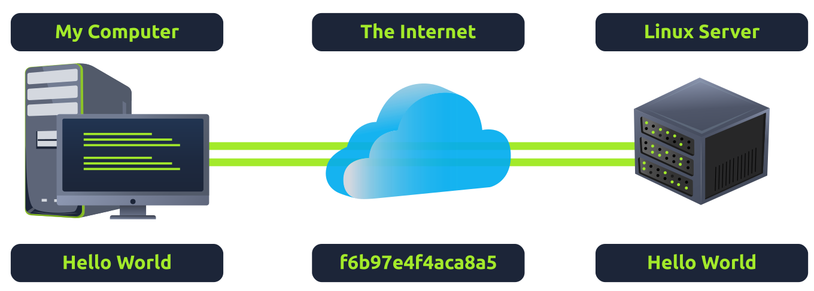

# Linux Fundamentals

## essential commands

Embark on the journey of learning the fundamentals of Linux. Learn to run some of the first essential commands on an interactive terminal.

### introduction


Linux is a command line operating system based on unix. There are multiple operating systems that are based on Linux.

<span style="font-size: 23px;">**Where is Linux Used?**</span>

It's fair to say that Linux is a lot more intimidating to approach than Operating System's (OSs) such as Windows. Both variants have their own advantages and disadvantages. For example, Linux is considerably much more lightweight and you'd be surprised to know that there's a good chance you've used Linux in some form or another every day! Linux powers things such as:

Websites that you visit
Car entertainment/control panels
Point of Sale (PoS) systems such as checkout tills and registers in shops
Critical infrastructures such as traffic light controllers or industrial sensors

<span style="font-size: 23px;">**Flavours of Linux**</span>

The name "Linux" is actually an umbrella term for multiple OS's that are based on UNIX (another operating system). Thanks to Linux being open-source, variants of Linux come in all shapes and sizes - suited best for what the system is being used for.


For example, Ubuntu & Debian are some of the more commonplace distributions of Linux because it is so extensible. I.e. you can run Ubuntu as a server (such as websites & web applications) or as a fully-fledged desktop. For this series, we're going to be using Ubuntu.

Note: Ubuntu Server can run on systems with only 512MB of RAM!

Similar to how you have different versions Windows (7, 8 and 10), there are many different versions/distributions of Linux.

### Searching for Files

<span style="font-size: 23px;">**Using Find**</span>

The find command is fantastic in the sense that it can be used both very simply or rather complex depending upon what it is you want to do exactly. However, let's stick to the fundamentals first.

```bash
# 通过文件名查找
find -name passwords.txt

# 通配符 （*）
find -name *.txt
```

<span style="font-size: 23px;">**Using Grep**</span>

Another great utility that is a great one to learn about is the use of **grep**. The grep command allows us to search the contents of files for specific values that we are looking for.

Take for example, the access log of a web server. In this case, the access.log of a web server has 244 entries.

```bash
tryhackme@linux1:~$ ls
access.log  folder1  folder2  folder3  folder4

# 使用 wc 计算 access.log 中的条目数
tryhackme@linux1:~$ wc -l access.log 
302 access.log

# 使用 “grep” 查找 “access.log” 中 IP 地址为 “114.119.130.62” 的任何条目
tryhackme@linux1:~$ grep "114.119.130.62" access.log
114.119.130.62 - - [04/May/2021:08:05:13 +0000] "GET /cryllic HTTP/1.1" 301 354
6 "-" "Mozilla/5.0 (Linux; Android 7.0;) AppleWebKit/537.36 (KHTML, like Gecko)
 Mobile Safari/537.36 (compatible; PetalBot;+https://webmaster.petalsearch.com/
site/petalbot)"
```

### An Introduction to Shell Operators

Linux operators are a fantastic way to power up your knowledge of working with Linux. There are a few important operators that are worth noting. We'll cover the basics and break them down accordingly to bite-sized chunks.

At an overview, I'm going to be showcasing the following operators:

| Symbol / Operator | Description |
|:-----------------:|:-----------:|
| & | This operator allows you to run commands in the background of your terminal. |
| && | This operator allows you to combine multiple commands together in one line of your terminal. |
| > | This operator is a redirector - meaning that we can take the output from a command (such as using cat to output a file) and direct it elsewhere. |
| >> | This operator does the same function of the > operator but appends the output rather than replacing (meaning nothing is overwritten). | 

Let's cover these in a bit more detail.

**Operator "&"**

This operator allows us to execute commands in the background. For example, let's say we want to copy a large file. This will obviously take quite a long time and will leave us unable to do anything else until the file successfully copies.

The "&" shell operator allows us to execute a command and have it run in the background (such as this file copy) allowing us to do other things!


**Operator "&&"**

This shell operator is a bit misleading in the sense of how familiar is to its partner "&". Unlike the "&" operator, we can use "&&" to make a list of commands to run for example **command1 && command2**. However, it's worth noting that **command2** will only run if **command1** was successful.


**Operator ">"**

This operator is what's known as an output redirector. What this essentially means is that we take the output from a command we run and send that output to somewhere else.

A great example of this is redirecting the output of the **echo** command that we learned before. Of course, running something such as **echo howdy** will return "howdy" back to our terminal — that isn't super useful. What we can do instead, is redirect "howdy" to something such as a new file!

Let's say we wanted to create a file named "welcome" with the message "hey". We can run **echo hey > welcome** where we want the file created with the contents "hey" like so:

```bash
tryhackme@linux1:~/folder2$ echo "hey man" > welcome

tryhackme@linux1:~/folder2$ ls
welcome

tryhackme@linux1:~/folder2$ cat welcome 
hey man
```

**Operator ">>"**

This operator is also an output redirector like in the previous operator (>) we discussed. However, what makes this operator different is that rather than overwriting any contents within a file, for example, it instead just puts the output at the end.

Following on with our previous example where we have the file "welcome" that has the contents of "hey". If were to use echo to add "hello" to the file using the > operator, the file will now only have "hello" and not "hey".


The >> operator allows to append the output to the bottom of the file — rather than replacing the contents.

## Part 2

Continue your learning Linux journey with part two. You will be learning how to log in to a Linux machine using SSH, how to advance your commands, file system interaction.

### SSH

<span style="font-size: 23px;">**What is SSH & how Does it Work?**</span>

**Secure Shell (SSH)** refers to a cryptographic network protocol used in secure communication between devices. SSH encrypts data using cryptographic algorithms, such as Advanced Encryption System (AES) and is often used when logging in remotely to a computer or server.

Secure Shell or SSH simply is a protocol between devices in an encrypted form. Using cryptography, any input we send in a human-readable format is encrypted for travelling over a network -- where it is then unencrypted once it reaches the remote machine, such as in the diagram below.



- SSH allows us to remotely execute commands on another device remotely.
- Any data sent between the devices is encrypted when it is sent over a network such as the Internet

### introduction to Flags and Switches

A majority of commands allow for arguments to be provided. These arguments are identified by a hyphen and a certain keyword known as flags or switches.

When using a command, unless otherwise specified, it will perform its default behaviour. For example, ls lists the contents of the working directory. However, hidden files are not shown. We can use flags and switches to extend the behaviour of commands.


The manual pages are a great source of information for both system commands and applications available on both a Linux machine, which is accessible on the machine itself and [online](https://linux.die.net/man/).

To access this documentation, we can use the man command and then provide the command we want to read the documentation for. Using our ls example, we would use man ls to view the manual pages for ls.

### Filesystem Interaction Continued

We covered some of the most fundamental commands when interacting with the filesystem on the Linux machine. For example, we covered how to list and find the contents of folders using ls and find and navigating the filesystem using cd. 

In this task, we're going to learn some more commands for interacting with the filesystem to allow us to:

create files and folders
move files and folders
delete files and folders
More specifically, the following commands:

| Command | Full Name | Purpose |
|:-------:|:---------:|:-------:|
| touch | touch | Create file |
| mkdir | make directory | Create a folder |
| cp | copy | Copy a file or folder |
| mv | move | Move a file or folder |
| rm | remove | Remove a file or folder |
| file | file | Determine the type of a file | 

**Creating Files and Folders (touch, mkdir)**

Creating files and folders on Linux is a simple process. First, we'll cover creating a file. The touch command takes exactly one argument -- the name we want to give the file we create. For example, we can create the file "note" by using touch note. It's worth noting that touch simply creates a blank file. You would need to use commands like echo or text editors such as nano to add content to the blank file.

This is a similar process for making a folder, which just involves using the mkdir command and again providing the name that we want to assign to the directory. For example, creating the directory "mydirectory" using mkdir mydirectory.

**Removing Files and Folders (rm)**

rm is extraordinary out of the commands that we've covered so far. You can simply remove files by using rm. However, you need to provide the -R switch alongside the name of the directory you wish to remove.

**Copying and Moving Files and Folders (cp, mv)**

Copying and moving files is an important functionality on a Linux machine. Starting with cp, this command takes two arguments:

1. the name of the existing file

2. the name we wish to assign to the new file when copying

cp copies the entire contents of the existing file into the new file. In the screenshot below, we are copying "note" to "note2".

Moving a file takes two arguments, just like the cp command. However, rather than copying and/or creating a new file, mv will merge or modify the second file that we provide as an argument. Not only can you use mv to move a file to a new folder, but you can also use mv to rename a file or folder. For example, in the screenshot below, we are renaming the file "note2" to be named "note3". "note3" will now have the contents of "note2". 

**Determining File Type**

What is often misleading and often catches people out is making presumptions from files as to what their purpose or contents may be. Files usually have what's known as an extension to make this easier. For example, text files usually have an extension of ".txt". But this is not necessary.

So far, the files we have used in our examples haven't had an extension. Without knowing the context of why the file is there -- we don't really know its purpose. Enter the file command. This command takes one argument. For example, we'll use file to confirm whether or not the "note" file in our examples is indeed a text file, like so file note.

```bash
tryhackme@linux2:~$ file unknown1 
unknown1: ASCII text
```

### Permissions 101

As you would have already found out by now, certain users cannot access certain files or folders. We've previously explored some commands that can be used to determine what access we have and where it leads us. 

In our previous tasks, we learned how to extend the use of commands through flags and switches. Take, for example, the **ls** command, which lists the contents of the current directory. When using the **-l** switch, we can see ten columns such as in the screenshot below. However, we're only interested in the first three columns:

```bash
tryhackme@linux2:~$ ls -lh
total 16K
-rw-r--r-- 1 user2     user2       14 May  5  2021 important
-rw-r--r-- 1 tryhackme tryhackme   16 May  5  2021 myfile
drwxr-xr-x 2 tryhackme tryhackme 4.0K May  2 02:08 myfolder
-rw-r--r-- 1 tryhackme tryhackme   17 May  4  2021 unknown1

```

Although intimidating, these three columns are very important in determining certain characteristics of a file or folder and whether or not we have access to it. A file or folder can have a couple of characteristics that determine both what actions are allowed and what user or group has the ability to perform the given action -- such as the following:

- Read
- Write
- Execute 

**Briefly: The Differences Between Users & Groups**

The great thing about Linux is that permissions can be so granular, that whilst a user technically owns a file, if the permissions have been set, then a group of users can also have either the same or a different set of permissions to the exact same file without affecting the file owner itself.

Let's put this into a real-world context; the system user that runs a web server must have permissions to read and write files for an effective web application. However, companies such as web hosting companies will have to want to allow their customers to upload their own files for their website without being the webserver system user -- compromising the security of every other customer. 

We'll learn the commands necessary to switch between users below.

**Switching Between Users**

Switching between users on a Linux install is easy work thanks to the su command. Unless you are the root user (or using root permissions through sudo), then you are required to know two things to facilitate this transition of user accounts:

- The user we wish to switch to
- The user's password

The **su** command takes a couple of switches that may be of relevance to you. For example, executing a command once you log in or specifying a specific shell to use. I encourage you to read the man page for **su** to find out more. However, I will cover the **-l** or **--login** switch.

Simply, by providing the -l switch to su, we start a shell that is much more similar to the actual user logging into the system - we inherit a lot more properties of the new user, i.e., environment variables and the likes. 

```bash
tryhackme@linux2:~$ su user2
Password: 
user2@linux2:/home/tryhackme$ ls
important  myfile  myfolder  unknown1
user2@linux2:/home/tryhackme$ cat important 
THM{SU_USER2}
```

### Common Directories

**/etc**

This root directory is one of the most important root directories on your system. The etc folder (short for etcetera) is a commonplace location to store system files that are used by your operating system. 

For example, the sudoers file highlighted in the screenshot below contains a list of the users & groups that have permission to run sudo or a set of commands as the root user.

Also highlighted below are the "**passwd**" and "**shadow**" files. These two files are special for Linux as they show how your system stores the passwords for each user in encrypted formatting called sha512.

```bash
tryhackme@linux2:/etc$ ls
shadow passwd sudoers sudoers.d
```

**/var**

The "/var" directory, with "var" being short for variable data,  is one of the main root folders found on a Linux install. This folder stores data that is frequently accessed or written by services or applications running on the system. For example, log files from running services and applications are written here (**/var/log**), or other data that is not necessarily associated with a specific user (i.e., databases and the like).

```bash
tryhackme@linux2:/var$ ls
backups log opt tmp
```

**/root**

Unlike the **/home** directory, the **/root** folder is actually the home for the "root" system user. There isn't anything more to this folder other than just understanding that this is the home directory for the "root" user. But, it is worth a mention as the logical presumption is that this user would have their data in a directory such as "**/home/root**" by default.  

```bash
root@linux2:~# ls
myfile myfolder passwords.xlsx
```

**/tmp**

This is a unique root directory found on a Linux install. Short for "temporary", the /tmp directory is volatile and is used to store data that is only needed to be accessed once or twice. Similar to how RAM on a computer works, once the computer is restarted, the contents of this folder are cleared out.

What's useful for us in pentesting is that any user can write to this folder by default. Meaning once we have access to a machine, it serves as a good place to store things like our enumeration scripts.

```bash
root@linux2:/tmp# ls
todelete trash.txt rubbish.bin
```

## Part 3

Power-up your Linux skills and get hands-on with some common utilities that you are likely to use day-to-day!

### Terminal Text Editors

Throughout the series so far, we have only stored text in files using a combination of the **echo** command and the pipe operators (**>** and **>>**). This isn't an efficient way to handle data when you're working with files with multiple lines and the sorts!

**Introducing terminal text editors**

There are a few options that you can use, all with a variety of friendliness and utility. This task is going to introduce you to **nano** but also show you an alternative named **VIM** (which TryHackMe has a room dedicated to!)

**nano**

It is easy to get started with Nano! To create or edit a file using nano, we simply use **nano filename** -- replacing "filename" with the name of the file you wish to edit.

Once we press enter to execute the command, nano will launch! Where we can just begin to start entering or modifying our text. You can navigate each line using the "up" and "down" arrow keys or start a new line using the "Enter" key on your keyboard.

Nano has a few features that are easy to remember & covers the most general things you would want out of a text editor, including:

- Searching for text
- Copying and Pasting
- Jumping to a line number
- Finding out what line number you are on

You can use these features of nano by pressing the "Ctrl" key (which is represented as an ^ on Linux)  and a corresponding letter. For example, to exit, we would want to press "Ctrl" and "X" to exit Nano.

**VIM**

VIM is a much more advanced text editor. Whilst you're not expected to know all advanced features, it's helpful to mention it for powering up your Linux skills.

Some of VIM's benefits, albeit taking a much longer time to become familiar with, includes:

- Customisable - you can modify the keyboard shortcuts to be of your choosing
- Syntax Highlighting - this is useful if you are writing or maintaining code, making it a popular choice for software developers
- VIM works on all terminals where nano may not be installed
- There are a lot of resources such as cheatsheets, tutorials, and the sorts available to you use.

### General/Useful Utilities

**Downloading Files (Wget)**

A pretty fundamental feature of computing is the ability to transfer files. For example, you may want to download a program, a script, or even a picture. Thankfully for us, there are multiple ways in which we can retrieve these files.

 We're going to cover the use of wget .  This command allows us to download files from the web via HTTP -- as if you were accessing the file in your browser. We simply need to provide the address of the resource that we wish to download. For example, if I wanted to download a file named "myfile.txt" onto my machine, assuming I knew the web address it -- it would look something like this:

```bash
wget https://assets.tryhackme.com/additional/linux-fundamentals/part3/myfile.txt
```

**Transferring Files From Your Host - SCP (SSH)**

Secure copy, or SCP, is just that -- a means of securely copying files. Unlike the regular cp command, this command allows you to transfer files between two computers using the SSH protocol to provide both authentication and encryption.

Working on a model of SOURCE and DESTINATION, SCP allows you to:

- Copy files & directories from your current system to a remote system
- Copy files & directories from a remote system to your current system
Provided that we know usernames and passwords for a user on your current system and a user on the remote system. For example, let's copy an example file from our machine to a remote machine, which I have neatly laid out in the table below:

| Variable | Value |
|:---:|:---:|
| The IP address of the remote system | 192.168.1.30 |
| User on the remote system | ubuntu |
| Name of the file on the local system | important.txt |
| Name that we wish to store the file as on the remote system | transferred.txt | 

With this information, let's craft our scp command (remembering that the format of **SCP** is just SOURCE and DESTINATION)

```bash
scp important.txt ubuntu@192.168.1.30:/home/ubuntu/transferred.txt
```
And now let's reverse this and layout the syntax for using scp to copy a file from a remote computer that we're not logged into 

| Variable | Value |
|:---:|:---:|
| IP address of the remote system | 192.168.1.30 |
| User on the remote system | ubuntu |
| Name of the file on the remote system | documents.txt |
| Name that we wish to store the file as on our system | notes.txt | 

The command will now look like the following: 

```bash
scp ubuntu@192.168.1.30:/home/ubuntu/documents.txt notes.txt 
```

**Serving Files From Your Host - WEB**

Ubuntu machines come pre-packaged with python3. Python helpfully provides a lightweight and easy-to-use module called "HTTPServer". This module turns your computer into a quick and easy web server that you can use to serve your own files, where they can then be downloaded by another computing using commands such as **curl** and **wget**. 

Python3's "HTTPServer" will serve the files in the directory where you run the command, but this can be changed by providing options that can be found within the manual pages. Simply, all we need to do is run **python3 -m  http.server** in the terminal to start the module! In the snippet below, we are serving from a directory called "webserver", which has a single named "file".

tryhackme@linux3
```bash
tryhackme@linux3:~$ python3 -m http.server
Serving HTTP on 0.0.0.0 port 8000 (http://0.0.0.0:8000/) ...

```

root@ip-10-10-113-221
```bash
root@ip-10-10-113-221:~# wget http://10.10.215.195:8000/.flag.txt 
--2025-05-02 04:36:13--  http://10.10.215.195:8000/.flag.txt
Connecting to 10.10.215.195:8000... connected.
HTTP request sent, awaiting response... 200 OK
Length: 20 [text/plain]
Saving to: \u2018.flag.txt\u2019

.flag.txt           100%[===================>]      20  --.-KB/s    in 0s      

2025-05-02 04:36:13 (87.0 KB/s) - \u2018.flag.txt\u2019 saved [20/20]

root@ip-10-10-113-221:~# cat .flag.txt 
THM{WGET_WEBSERVER}
```

### Processes 101

Processes are the programs that are running on your machine. They are managed by the kernel, where each process will have an ID associated with it, also known as its PID. The PID increments for the order In which the process starts. I.e. the 60th process will have a PID of 60.

**Viewing Processes**

We can use the friendly **ps** command to provide a list of the running processes as our user's session and some additional information such as its status code, the session that is running it, how much usage time of the CPU it is using, and the name of the actual program or command that is being executed:

```bash
tryhackme@linux3:~$ ps
    PID TTY          TIME CMD
   1044 pts/0    00:00:00 bash
   3565 pts/0    00:00:00 ps
tryhackme@linux3:~$ ps
    PID TTY          TIME CMD
   1044 pts/0    00:00:00 bash
   3566 pts/0    00:00:00 ps

```

Note how in the screenshot above, the second process ps has a PID of 3565, and then in the command below it, this is then incremented to 3566.

To see the processes run by other users and those that don't run from a session (i.e. system processes), we need to provide aux to the ps command like so: **ps aux**

Another very useful command is the top command; top gives you real-time statistics about the processes running on your system instead of a one-time view. These statistics will refresh every 10 seconds, but will also refresh when you use the arrow keys to browse the various rows. Another great command to gain insight into your system is via the **top** command

**Managing Processes**

You can send signals that terminate processes; there are a variety of types of signals that correlate to exactly how "cleanly" the process is dealt with by the kernel. To kill a command, we can use the appropriately named kill command and the associated **PID** that we wish to kill. i.e., to kill PID 1337, we'd use **kill 1337**.

Below are some of the signals that we can send to a process when it is killed:

- SIGTERM - Kill the process, but allow it to do some cleanup tasks beforehand
- SIGKILL - Kill the process - doesn't do any cleanup after the fact
- SIGSTOP - Stop/suspend a process


**How do Processes Start?**

Let's start off by talking about namespaces. The Operating System (OS) uses namespaces to ultimately split up the resources available on the computer to (such as CPU, RAM and priority) processes. Think of it as splitting your computer up into slices -- similar to a cake. Processes within that slice will have access to a certain amount of computing power, however, it will be a small portion of what is actually available to every process overall.

Namespaces are great for security as it is a way of isolating processes from another -- only those that are in the same namespace will be able to see each other.

We previously talked about how PID works, and this is where it comes into play. The process with an ID of 0 is a process that is started when the system boots. This process is the system's init on Ubuntu, such as **systemd**, which is used to provide a way of managing a user's processes and sits in between the operating system and the user. 

For example, once a system boots and it initialises, **systemd** is one of the first processes that are started. Any program or piece of software that we want to start will start as what's known as a child process of **systemd**. This means that it is controlled by **systemd**, but will run as its own process (although sharing the resources from **systemd**) to make it easier for us to identify and the likes.


**Getting Processes/Services to Start on Boot**

Some applications can be started on the boot of the system that we own. For example, web servers, database servers or file transfer servers. This software is often critical and is often told to start during the boot-up of the system by administrators.

In this example, we're going to be telling the apache web server to be starting apache manually and then telling the system to launch apache2 on boot.

Enter the use of **systemctl** -- this command allows us to interact with the systemd process/daemon. Continuing on with our example, systemctl is an easy to use command that takes the following formatting: **systemctl [option] [service]**

For example, to tell apache to start up, we'll use **systemctl start apache2**. Seems simple enough, right? Same with if we wanted to stop apache, we'd just replace the **[option]** with stop (instead of start like we provided)

We can do four options with **systemctl**:

- Start
- Stop
- Enable
- Disable

**An Introduction to Backgrounding and Foregrounding in Linux**

Processes can run in two states: In the background and in the foreground. For example, commands that you run in your terminal such as "echo" or things of that sort will run in the foreground of your terminal as it is the only command provided that hasn't been told to run in the background. "Echo" is a great example as the output of echo will return to you in the foreground, but wouldn't in the background - command like in the example below:

```bash
tryhackme@linux3:~$ echo "hello world"
hello world
tryhackme@linux3:~$ echo "hello world" &
[1] 1095
tryhackme@linux3:~$ hello world

```
Here we're running **echo "Hi THM"** , where we expect the output to be returned to us like it is at the start. But after adding the **&** operator to the command, we're instead just given the ID of the echo process rather than the actual output -- as it is running in the background.

This is great for commands such as copying files because it means that we can run the command in the background and continue on with whatever further commands we wish to execute (without having to wait for the file copy to finish first)

We can do the exact same when executing things like scripts -- rather than relying on the & operator, we can use **Ctrl + Z** on our keyboard to background a process. It is also an effective way of "pausing" the execution of a script or command like in the example below:


This script will keep on repeating "This will keep on looping until I stop!" until I stop or suspend the process. By using **Ctrl + Z** (as indicated by T^Z). Now our terminal is no longer filled up with messages -- until we foreground it, which we will discuss below.


**Foregrounding a process**

Now that we have a process running in the background, for example, our script "background.sh" which can be confirmed by using the ps aux command, we can back-pedal and bring this process back to the foreground to interact with.


With our process backgrounded using either **Ctrl + Z** or the **&** operator, we can use **fg** to bring this back to focus like below, where we can see the **fg** command is being used to bring the background process back into use on the terminal, where the output of the script is now returned to us.

```bash
tryhackme@linux3:~$ ps
    PID TTY          TIME CMD
   1043 pts/0    00:00:00 bash
   1105 pts/0    00:00:00 ps
tryhackme@linux3:~$ ping google.com
PING google.com (209.85.203.139) 56(84) bytes of data.
^Z
[1]+  Stopped                 ping google.com
tryhackme@linux3:~$ ps
    PID TTY          TIME CMD
   1043 pts/0    00:00:00 bash
   1106 pts/0    00:00:00 ping
   1107 pts/0    00:00:00 ps
tryhackme@linux3:~$ fg
ping google.com
^C
--- google.com ping statistics ---
26 packets transmitted, 0 received, 100% packet loss, time 31349ms

```

Locate the process that is running on the deployed instance (10.10.27.229). What flag is given?
```bash
tryhackme@linux3:~$ ps -ef | grep PROCESS
root         498     484  0 06:25 ?        00:00:00 THM{PROCESSES}
tryhack+    3650    1043  0 07:33 pts/0    00:00:00 grep --color=auto PROCESS
```

## Maintaining Your System 

### Automation

Users may want to schedule a certain action or task to take place after the system has booted. Take, for example, running commands, backing up files, or launching your favourite programs on, such as Spotify or Google Chrome.

We're going to be talking about the **cron** process, but more specifically, how we can interact with it via the use of **crontabs** . Crontab is one of the processes that is started during boot, which is responsible for facilitating and managing cron jobs.


A crontab is simply a special file with formatting that is recognised by the cron process to execute each line step-by-step. Crontabs require 6 specific values:

| Value | Description |
|:---:|:---:|
| MIN | What minute to execute at |
| HOUR | What hour to execute at |
| DOM | What day of the month to execute at |
| MON | What month of the year to execute at |
| DOW | What day of the week to execute at |
| CMD | The actual command that will be executed. | 

Let's use the example of backing up files. You may wish to backup "cmnatic"'s  "Documents" every 12 hours. We would use the following formatting: 

```bash
0 */12 * * * cp -R /home/cmnatic/Documents /var/backups/
```
An interesting feature of crontabs is that these also support the wildcard or asterisk (*). If we do not wish to provide a value for that specific field, i.e. we don't care what month, day, or year it is executed -- only that it is executed every 12 hours, we simply just place an asterisk.

This can be confusing to begin with, which is why there are some great resources such as the online "[Crontab Generator](https://crontab-generator.org)" that allows you to use a friendly application to generate your formatting for you! As well as the site "[Cron Guru](https://crontab.guru)"!

Crontabs can be edited by using **crontab -e**, where you can select an editor (such as Nano) to edit your crontab.


<span style="font-size: 23px;">**补充**</span> 

“Linux cron process”指的是Linux系统中与cron相关的进程 。cron是一个基于时间的作业调度器，其名称源于希腊语“chronos”（时间 ） 。以下是相关介绍：

**功能作用**

- **自动执行任务**：能按照特定时间表自动执行预设任务，无需人工干预。像系统管理员可利用它安排每天凌晨进行数据库备份、定期清理系统缓存文件；普通用户可设定定时发送邮件脚本、定时执行程序更新脚本等 。
- **提高效率与准确性**：避免人工执行任务可能出现的遗忘、误操作等问题，确保任务按时、准确执行，提升系统维护和管理的效率。例如在业务高峰前自动清理日志文件，保障系统性能。 
- 
**工作原理**

- **cron守护进程**：在系统后台持续运行，一般在系统启动时自动开启。它会周期性检查系统中所有用户的crontab文件（包括系统级和用户级 ），默认每分钟检查一次 。
- **crontab文件**：是cron任务的配置文件，定义了任务执行的时间和具体命令。每个用户都可拥有自己的crontab文件（存储在/var/spool/cron/crontabs目录下 ），系统级crontab文件通常位于/etc/crontab 。文件内容按特定格式书写，由时间字段（包括分钟、小时、日期、月份、星期 ）和要执行的命令或脚本组成。

**常用操作命令**

- **创建和编辑任务**：使用`crontab -e`命令可打开当前用户的crontab文件进行编辑，若首次使用会让用户选择默认文本编辑器。例如要每天凌晨2点执行一个备份脚本`/home/user/backup.sh` ，可在文件中添加`0 2 * * * /home/user/backup.sh` 。
- **查看任务列表**：执行`crontab -l`命令能列出当前用户已设置的cron任务 。
- **删除任务**：通过`crontab -r`命令可删除当前用户的所有cron任务 。 

<span style="font-size: 23px;">**应用场景**</span>

- **系统维护**：执行定期磁盘清理、日志文件轮转、系统更新等操作，确保系统稳定运行 。
- **数据备份**：定时对重要数据（如数据库、文档 ）进行备份，保障数据安全 。
- **网络监控**：按计划执行网络连接检查、流量统计等脚本，及时发现网络问题 。 

### Package Management

**Introducing Packages & Software Repos**

When developers wish to submit software to the community, they will submit it to an  "apt" repository. If approved, their programs and tools will be released into the wild. Two of the most redeeming features of Linux shine to light here: User accessibility and the merit of open source tools.

When using the **ls** command on a Ubuntu 20.04 Linux machine, these files serve as the gateway/registry. 

```bash
tryhackme@linux3:/tmp$ cd /etc/apt
tryhackme@linux3:/etc/apt$ ls
apt.conf.d  auth.conf.d  preferences.d  sources.list  sources.list.d  trusted.gpg.d
```


Whilst Operating System vendors will maintain their own repositories, you can also add community repositories to your list! This allows you to extend the capabilities of your OS. Additional repositories can be added by using the **add-apt-repository** command or by listing another provider! For example, some vendors will have a repository that is closer to their geographical location.


**Managing Your Repositories (Adding and Removing)**

Normally we use the apt command to install software onto our Ubuntu system. The **apt** command is a part of the package management software also named apt. Apt contains a whole suite of tools that allows us to manage the packages and sources of our software, and to install or remove software at the same time.

One method of adding repositories is to use the **add-apt-repository** command we illustrated above, but we're going to walk through adding and removing a repository manually. Whilst you can install software through the use of package installers such as **dpkg**, the benefits of apt means that whenever we update our system -- the repository that contains the pieces of software that we add also gets checked for updates. 

In this example, we're going to add the text editor Sublime Text to our Ubuntu machine as a repository as it is not a part of the default Ubuntu repositories. When adding software, the integrity of what we download is guaranteed by the use of what is called **GPG (Gnu Privacy Guard) keys**. These keys are essentially a safety check from the developers saying, "here's our software". If the keys do not match up to what your system trusts and what the developers used, then the software will not be downloaded.

So, to start, we need to add the GPG key for the developers of Sublime Text 3. (Note that TryHackMe instances do not have internet access and so we're not expecting you to add this to the machine that you deploy, as it would fail.)

1. Let's download the GPG key and use apt-key to trust it:  

```bash
wget -qO - https://download.sublimetext.com/sublimehq-pub.gpg | sudo apt-key add -
```
2. Now that we have added this key to our trusted list, we can now add Sublime Text 3's repository to our apt sources list. A good practice is to have a separate file for every different community/3rd party repository that we add.

2.1. Let's create a file named **sublime-text.list** in **/etc/apt/sources.list.d** and enter the repository information like so:


2.2. And now use Nano or a text editor of your choice to add & save the Sublime Text 3 repository into this newly created file:


2.3. After we have added this entry, we need to update apt to recognise this new entry -- this is done using the **apt update** command

2.4. Once successfully updated, we can now proceed to install the software that we have trusted and added to apt using **apt install sublime-text**

Removing packages is as easy as reversing. This process is done by using the **add-apt-repository --remove ppa:PPA_Name/ppa** command or by manually deleting the file that we previously added to. Once removed, we can just use **apt remove [software-name-here]** i.e. **apt remove sublime-text**

### Logs

We briefly touched upon log files and where they can be found in Linux Fundamentals Part 1. However, let's quickly recap. Located in the /var/log directory, these files and folders contain logging information for applications and services running on your system. The Operating System  (OS) has become pretty good at automatically managing these logs in a process that is known as "rotating".

I have highlighted some logs from three services running on a Ubuntu machine:

- An Apache2 web server
- Logs for the fail2ban service, which is used to monitor attempted brute forces, for example
- The UFW service which is used as a firewall


These services and logs are a great way in monitoring the health of your system and protecting it. Not only that, but the logs for services such as a web server contain information about every single request - allowing developers or administrators to diagnose performance issues or investigate an intruder's activity. For example, the two types of log files below that are of interest:

- access log
- error log


There are, of course, logs that store information about how the OS is running itself and actions that are performed by users, such as authentication attempts.


---

## named pipe

命名管道（Named Pipe），在 Unix/Linux 系统中也常被称为 **FIFO (First-In, First-Out)**，是一种特殊的进程间通信（IPC）机制。它与传统的匿名管道（通常用于父子进程之间）不同，匿名管道是临时的、没有名字的，并且只能在有共同祖先的进程之间使用。

命名管道则克服了这些限制：

1.  **有名字：** 它在文件系统中拥有一个实际的名字，就像普通文件一样（例如 `/tmp/my_pipe`）。这意味着任何知道其名字的进程都可以打开并使用它，无论这些进程之间是否有父子关系。
2.  **先进先出 (FIFO)：** 命名管道的数据传输遵循“先进先出”的原则。先写入管道的数据会先被读取出来。
3.  **文件系统可见：** 尽管它在文件系统中表现为一个文件，但它并不是一个普通的文件。写入命名管道的数据不会存储在磁盘上，而是直接从写入进程传递到读取进程。它更像是一个“通道”或者“缓冲区”。
4.  **全双工或半双工：** 命名管道可以支持单向（半双工）或双向（全双工）通信，具体取决于系统和实现。在 Unix/Linux 中，通常是半双工，但可以通过创建两个命名管道来实现全双工通信。
5.  **生命周期：** 命名管道的生命周期可以比创建它的进程更长。它会一直存在，直到被显式删除（例如使用 `rm` 命令）。

### 如何创建和使用命名管道 (Unix/Linux)

在 Unix/Linux 系统中，你可以使用 `mkfifo` 命令来创建命名管道：

```bash
mkfifo /tmp/my_named_pipe
```

创建后，你就可以像操作普通文件一样来读写它。例如：

**在一个终端写入数据：**

```bash
echo "Hello, world!" > /tmp/my_named_pipe
```

**在另一个终端读取数据：**

```bash
cat < /tmp/my_named_pipe
```

当你执行写入命令时，它会阻塞，直到有另一个进程打开管道进行读取。同样，读取命令也会阻塞，直到有数据被写入管道。

### 命名管道的常见用途

* **进程间通信：** 允许不相关的进程之间进行数据交换。
* **简化复杂命令：** 有时可以将多个命令通过命名管道连接起来，避免创建大量的临时文件。例如，一个程序将数据解压到命名管道，另一个程序可以直接从命名管道读取解压后的数据进行处理。
* **守护进程通信：** 守护进程（后台服务）可以使用命名管道来接收来自其他应用程序的命令或数据。

### 与匿名管道的区别

| 特性     | 匿名管道 (Pipe)                     | 命名管道 (Named Pipe / FIFO)             |
| :------- | :---------------------------------- | :--------------------------------------- |
| **名字** | 没有名字，通过文件描述符引用        | 有名字，在文件系统中可见                 |
| **创建** | 由 shell 或 `pipe()` 系统调用创建   | 由 `mkfifo` 命令或 `mkfifo()` 系统调用创建 |
| **可见性** | 仅限于创建它的进程及其子进程        | 任何进程都可以访问                       |
| **持久性** | 随着创建进程的结束而消失            | 需要显式删除（`rm`）才会消失             |
| **用途** | 主要用于父子进程间的单向数据流      | 用于不相关的进程间的通信，更灵活         |

总的来说，命名管道提供了一种灵活、持久的进程间通信方式，它允许系统上任意两个进程通过一个公共的、有名字的“文件”进行数据交换，而无需像普通文件那样将数据实际写入磁盘。