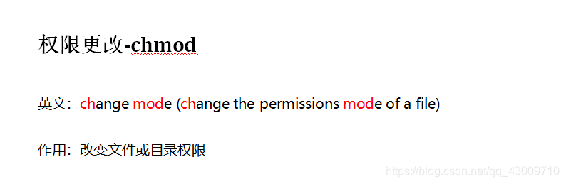
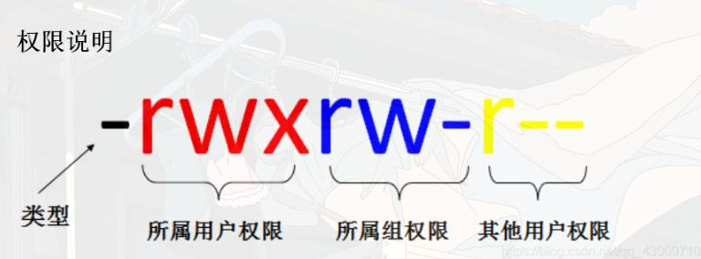
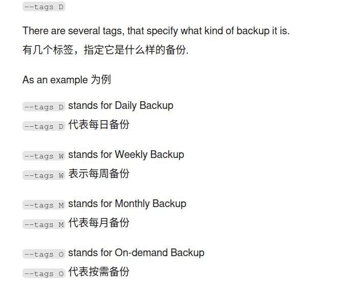

# Linux command

## 0.常用命令

```bash
# 打印当前目录  print working directory
pwd
# 新建文件夹
mkdir foldername
# 新建文件
touch filename

#4.删除文件夹
rm -r filename

# ss命令查看端口状态
ss -lntu

# Output any text that we provide
echo "hello world"

# Find out what user we're currently logged in as!
whoami

# 输出文件的内容 concatenate 
cat test.txt

```

```bash
ls /some_path # 查看某个文件夹下的文件与子文件夹。/ 代表根目录，是 Linux 最顶端的路径，以此开头则为绝对路径
pwd # 查看当前终端所在路径
cd /home/testuser # 切换目录命令。将当前终端切换到某一个路径下
cp ./a.py ./b.py # 复制命令。将当前路径下的 a.py 复制一份并命名为 b.py。./ 代表当前文件夹所在路径，以此开头则为相对路径
cp -r ./a ./b # 复制整体文件夹
rm b.py # 删除命令。删除 b.py
mv a.py b.py # 移动（重命名）命令。将 a.py 更名为 b.py
mkdir my_folder # 新建名为 my_folder 的文件夹
sudo some_command # 使普通用户以 root 权限执行某些命令
```

## 1.系统服务

```bash
systemctl start dhcpcd # 启动服务
systemctl stop dhcpcd # 停止服务
systemctl restart dhcpcd # 重启服务
systemctl reload dhcpcd # 重新加载服务以及它的配置文件
systemctl status dhcpcd # 查看服务状态
systemctl enable dhcpcd # 设置开机启动服务
systemctl enable --now dhcpcd # 设置服务为开机启动并立即启动这个单元
systemctl disable dhcpcd # 取消开机自动启动
systemctl daemon-reload dhcpcd # 重新载入 systemd 配置。扫描新增或变更的服务单元、不会重新加载变更的配置
```


## 2.文件压缩

```bash
# 一般形式
tar -cvf xxx.tar ./dir		#将 ./dir 目录打包到 xxx.tar
tar -xvf xxx.tar 		#将 xxx.tar 解打包到当前目录
tar -xvf xxx.tar -C ./dir	#将 xxx.tar 解打包到 ./dir 目录
tar -tvf xxx.tar		#将 xxx.tar 包中的内容列出


# .tar.gz的压缩格式只需要添加 -z参数
# .tar.bz2的压缩格式只需要添加-j参数

tar -zcvf xxx.tar.gz [files]
tar -zxvf xxx.tar.gz -C [path]
tar -jcvf xxx.tar.bz2 [files]
tar -jxvf xxx.tar.bz2 -C [path]


```


## 3.磁盘空间信息

```bash
df -h # 以人类可读格式显示
```


## SCP

`scp`（secure copy）命令用于在本地与远程主机之间安全地复制文件或目录。常用用法如下：

- 从本地复制到远程：
  ```bash
  scp localfile user@remote_host:/remote/path/
  ```

- 从远程复制到本地：
  ```bash
  scp user@remote_host:/remote/path/file localdir/
  scp document.txt mark@10.10.45.80:/home/mark
  ```

- 复制整个目录（加 `-r`）：
  ```bash
  scp -r localdir user@remote_host:/remote/path/
  scp -r user@remote_host:/remote/path/dir localdir/
  ```

- 指定端口（如 2222）：
  ```bash
  scp -P 2222 localfile user@remote_host:/remote/path/
  ```

- 常用参数说明：
  - `-r`：递归复制整个目录
  - `-P`：指定远程主机端口
  - `-i`：指定私钥文件
  - `-C`：启用压缩

**示例：**
```bash
scp -P 2222 -r ./myfolder user@192.168.1.10:/home/user/
```
---

## chown & chmod

### chown
>在Linux系统中，chown命令用于改变文件或目录的所有者和/或所属群组。这个命令对于系统管理员和需要管理文件权限的用户来说是非常有用的。

<div align=left></div> 

```zsh
# 1.更改文件的所有者： 
# 把file.txt的所有者更改为username。
chown username file.txt

# 2.同时更改文件的所有者和群组：
# 把file.txt的所有者更改为username，并将群组更改为groupname
chown username:groupname file.txt

# 递归更改目录及其所有子目录和文件的所有者
chown -R username /path/to/directory
# -R或--recursive选项表示递归地更改目录及其内部所有文件和子目录的所有者

# 将文件 file1.txt 的拥有者设为 runoob，群体的使用者 runoobgroup :
chown runoob:runoobgroup file1.txt

# 将目前目录下的所有文件与子目录的拥有者皆设为runoob，群体的使用者runoobgroup:
chown -R runoob:runoobgroup *

```
### chmod

>chmod命令是Unix和Linux系统中用于改变文件或目录访问权限的命令。通过chmod，用户可以控制谁可以读取、写入或执行文件或目录。该命令有两种主要用法：数字设定法和符号设定法。

<div align=left></div> 

**数字设定法**

>在数字设定法中，权限通过三个八进制数字来表示，分别对应文件所有者（user, u）、用户组（group, g）和其他用户（others, o）的权限。每个数字是读（r=4）、写（w=2）和执行（x=1）权限的总和。

- 0：表示没有任何权限。
- 1：表示可执行权限（x）。
- 2：表示可写权限（w）。
- 4：表示可读权限（r）。
>例如，权限755表示：
文件所有者（u）有读（4）、写（2）和执行（1）权限，总和为7。
用户组（g）和其他用户（o）都有读（4）和执行（1）权限，但没有写权限，总和为5。
数字设定法的一般形式为：

```bash
# 一般形式
chmod [mode] 文件名
chmod 755 file.txt
chmod -R 755 目录名
```

<div align=left></div>


**符号设定法**

>符号设定法使用字母和操作符来表达权限的更改。操作符可以是+（添加权限）、-（删除权限）或=（赋予指定权限并取消其他所有权限）。

- u：表示文件所有者（user）。
- g：表示用户组（group）。
- o：表示其他用户（others）。
- a：表示所有用户（all），它是u、g和o的简写。
- r：表示读权限（read）。
- w：表示写权限（write）。
- x：表示执行权限（execute）。

```zsh

sudo chmod a+w /etc/hosts

```
---

## timeshift

```zsh
# by timeshift
# 备份
sudo timeshift --create --btrfs --comments "add flameshot"
# 查询
sudo timeshift --list
```




## ps -ef
 `ps -ef` 是Unix/Linux系统中用于查看进程信息的常用命令：

<span style="font-size: 23px;">**命令构成及含义**</span>
- **ps**：是“process status”的缩写 ，用于显示当前系统的进程状态信息。
- **-e**：等价于`-A` ，表示列出全部的进程，即不仅显示当前用户在当前终端启动的进程，还包括其他用户及系统层面的所有进程。
- **-f**：表示以完整格式（full format）显示进程信息，会展示诸如进程的用户ID、父进程ID、CPU占用率、启动时间等详细字段。 

<span style="font-size: 23px;">**输出字段含义**</span>

执行`ps -ef`后，会显示类似表格的信息，各列含义如下：
- **UID**：进程的所有者用户ID，代表哪个用户启动了该进程，比如`root`表示由超级用户启动。 
- **PID**：进程的唯一标识符，系统通过它来区分不同进程。
- **PPID**：父进程的ID，可用于追踪进程的创建关系，若一个进程的父进程ID找不到，该进程可能是僵尸进程 。
- **C**：CPU的占用率，以百分数形式呈现，反映进程对CPU资源的使用程度。 
- **STIME**：进程的启动时间，记录进程开始运行的时刻。 
- **TTY**：终端设备，是发起该进程的设备识别符号。若显示`?` ，表明该进程并非由终端发起，而是在后台运行等情况。 
- **TIME**：进程占用CPU的总时间，体现进程自启动以来累计使用CPU的时长。 
- **CMD**：启动进程的命令名称或路径，可直观看到进程对应的程序或指令。 

<span style="font-size: 23px;">**常见用法**</span>

- **查看所有进程**：直接运行`ps -ef` ，可列出系统中所有正在运行进程的详细信息，帮助用户全面了解系统当前的进程运行状况。
- **查找特定进程**：常与`grep`命令结合使用，比如`ps -ef | grep nginx` ，用于筛选出与`nginx`相关的进程信息，方便排查特定服务或程序的进程状态。 
- **提取特定列信息**：借助`awk`等工具，如`ps -ef | awk '{print $2, $8}'` ，可以从`ps -ef`的输出结果中提取指定的列，如进程ID（PID）和启动命令（CMD）等信息 。 
- **配合其他命令管理进程**：与`kill`命令结合，先通过`ps -ef`找到目标进程的PID，再使用`kill`命令终止该进程，例如`ps -ef | grep find | awk '{print $2}' | xargs kill -9` ，可查找并强制终止与`find`相关的进程 。 

## ss

Linux 命令 `ss` 代表 **Socket Statistics**（套接字统计）。它是一个用于查看和分析系统网络连接状态的工具，功能类似于 `netstat`，但速度更快，并提供更详细的网络连接信息。

`ss` 命令可以显示 TCP、UDP、UNIX 套接字的详细信息，并支持丰富的过滤功能，适用于调试网络、监控连接等任务。例如：
- `ss -t` 仅显示 TCP 连接
- `ss -u` 仅显示 UDP 连接
- `ss -l` 仅显示监听状态的套接字
- `ss -p` 显示与套接字关联的进程信息

## find

```bash
find / -type f -name "rockyou.txt" 2>/dev/null
```
- type 文件类型 f-文件 d-目录
- 2 代表标准错误输出（stderr）
- \> 是重定向符号
- /dev/null 是一个特殊的设备文件，也被称为"黑洞"，任何写入它的数据都会被丢弃

这条命令会在整个文件系统中搜索名为 rockyou.txt 的文件,由于搜索过程中会遇到很多没有权限访问的目录，会产生大量错误信息，2>/dev/null 将这些错误信息过滤掉，让输出更清晰，最终只显示成功找到的 rockyou.txt 文件路径.

## sed

这条命令：

```bash
sudo sed -i '$d' /etc/hosts
```

**解释如下：**

- `sudo`：以超级用户权限执行（因为 `/etc/hosts` 需要管理员权限才能修改）
- `sed`：流编辑器，用于处理文本
- `-i`：直接修改原文件（即“就地编辑”）
- `'$d'`：`$` 表示最后一行，`d` 表示删除
- `/etc/hosts`：要操作的目标文件

**作用总结：**  
这条命令会**删除 `/etc/hosts` 文件的最后一行**。

## 权限

Linux 文件权限速查表，帮你快速识别和理解 `ls -l` 输出中的权限字段：

---

### 🗂 文件类型标识符

| 字符 | 类型             | 说明                          |
|------|------------------|-------------------------------|
| `-`  | 普通文件         | Regular file                  |
| `d`  | 目录             | Directory                     |
| `l`  | 符号链接         | Symbolic link                 |
| `c`  | 字符设备         | Character device (如终端)     |
| `b`  | 块设备           | Block device (如硬盘)         |
| `s`  | 套接字           | Socket                        |
| `p`  | 命名管道         | Named pipe (FIFO)             |

---

### 🔐 权限字段结构（共 10 个字符）

例如：`-rw-r--r--`

| 位置 | 含义           | 权限说明                          |
|------|----------------|-----------------------------------|
| 1    | 文件类型       | 如上表所示                        |
| 2-4  | 所有者权限     | `r`=读，`w`=写，`x`=执行           |
| 5-7  | 所属组权限     | 同上                              |
| 8-10 | 其他用户权限   | 同上                              |

---

### 👥 权限组合示例

| 权限字符串   | 含义说明                                 |
|--------------|------------------------------------------|
| `rwxr-xr-x`   | 所有者可读写执行，组和其他用户可读执行   |
| `rw-r--r--`   | 所有者可读写，组和其他用户只读           |
| `rwx------`   | 只有所有者有全部权限，其他人无权限       |
| `rwxrwxrwx`   | 所有人都有读写执行权限（不安全！）       |

---

### 🛠 常用命令速查

| 命令              | 功能说明                              |
|-------------------|---------------------------------------|
| `chmod`           | 修改权限（如：`chmod 755 file`）      |
| `chown`           | 修改文件所有者（如：`chown user file`）|
| `ls -l`           | 显示详细权限信息                      |
| `umask`           | 设置默认权限掩码                     |

---
